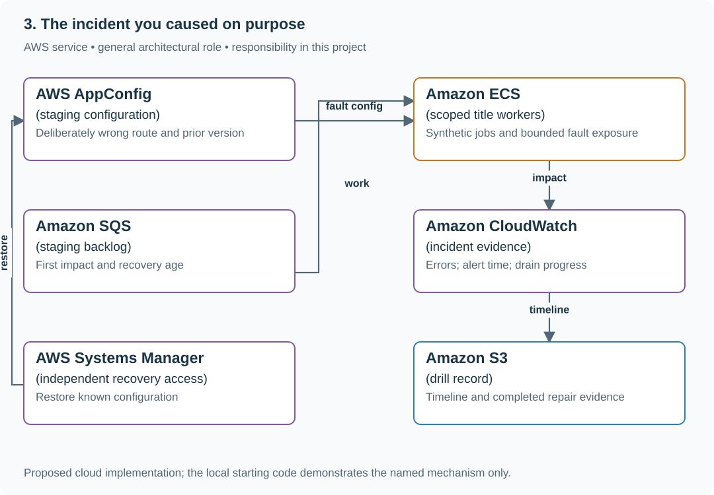

# Rehearse detection, rollback and service recovery

## Application background

A reading-list service has an API, title jobs and runtime configuration. A bad title-provider setting can break jobs even when the deployment and configuration syntax look valid.

This is a fictional engineering scenario. The workload figures later in the page are exercise assumptions, not measured production traffic.

## Your assignment

**Deliver:** One bounded staging incident record covering impact, detection, mitigation, verified recovery and the follow-up change.

Run one controlled incident exercise in a disposable staging service. A valid JSON configuration routes every title job to an unavailable host. Record when users are affected, when the responder detects it, when rollback happens and when useful work actually recovers.

**Required behavior:** The drill has a named owner, bounded scope, observable stop condition and independently available rollback path. It produces a factual timeline and one completed repair. No recurring fault injection or production action is installed.

The primary deliverable is the report or operational procedure named above, backed by a reproducible local demonstration. Build the smallest supporting code needed to make that evidence visible.

## Get the code and run the supplied example

The code is in the public [junior-to-staff repository](https://github.com/Soulful-Iris/junior-to-staff). Install Git and Python 3.12+. No AWS account or Python packages are required for this first run. If you already have a checkout, use it and skip cloning.

```bash
git clone https://github.com/Soulful-Iris/junior-to-staff.git
cd junior-to-staff
python3 examples/architecture-starts/the_incident_you_caused_on_purpose.py
```

**Supplied file:** [`examples/architecture-starts/the_incident_you_caused_on_purpose.py`](https://github.com/Soulful-Iris/junior-to-staff/blob/main/examples/architecture-starts/the_incident_you_caused_on_purpose.py). You can also [read or download the source here](../../../../examples/architecture-starts/the_incident_you_caused_on_purpose.py).

This program is a **mechanism demonstration**: it runs the small scenario in one process and prints the result. It is not an HTTP service, a complete application, or an AWS deployment. A successful run demonstrates this mechanism only; it does not establish the workload or failure guarantees of the application you will build.

**Example output from the supplied run:**

Generated IDs and timestamps may differ; compare the state transitions and outcomes.

```text
{'detection_after_impact_s': 55, 'mitigation_after_alert_s': 60, 'recovery_after_impact_s': 205}
Rollback is a milestone; backlog clear establishes recovery.
```

### Set up your implementation workspace

Create `work/the-incident-you-caused-on-purpose/` in your checkout (or use a separate repository). Copy the supplied mechanism into that directory as `mechanism.py`, then extract its state transitions into functions you can call from your implementation. The record and module names below describe what you must implement; they are not a promise that files with those names already exist. Keep a `README.md` beside your implementation with its exact run commands and observed results.

## Local components and state to implement

This table names the records, interfaces or decision inputs for your deliverable. Unless a name is explicitly linked to supplied source above, it is something you create. Implement the local state transitions first, then connect the HTTP, storage or worker boundaries required by the steps.

| Record / module | Key or interface | Responsibility |
|---|---|---|
| drill_plan | environment,owner,fault,stop_condition,rollback | Concrete bounded action and independent exit. |
| timeline_event | monotonic_elapsed,wall_time,evidence_ref | Observed milestones, not reconstructed guesses. |
| repair_record | cause,change,owner,observed_result | One implemented improvement with evidence. |

## Implement the assignment

### 1. Prepare a bounded staging drill

Name the exact configuration field, affected worker pool and synthetic workload. Save the previous configuration and verify emergency access before injecting anything. Define the stop condition in observable terms such as oldest-job age or an unexpected environment identifier.

### 2. Inject one fault and record evidence

Change only the selected staging route to an unavailable fixture host. Record the applied configuration version, first failed job, alert delivery and responder action. Do not add simultaneous failures that make cause and effect impossible to separate.

### 3. Mitigate and follow the backlog

Restore the prior valid configuration through the independent path. Confirm the version actually applied, then watch useful completions and oldest age until recovery. A successful rollback command is not proof that waiting users have recovered.

### 4. Complete one repair

Fix the discovered weakness: semantic configuration validation, independent rollback credentials, bounded retries or clearer evidence. Re-run only the relevant bounded scenario to see whether the repair changes the measured outcome. Keep the factual timeline and remaining limits.

## Demonstrate the completed local result

| Action | Expected visible result |
|---|---|
| Run the starting program | Detection is 55 s, mitigation after alert 60 s and full recovery 205 s. |
| Make the normal dashboard unavailable | The independent stop/restore path remains usable. |
| Improve only alert delivery | Report faster detection, while backlog recovery may remain unchanged. |

**Handoff:** In your implementation README, include the start command, one successful operation, the failure case above and the resulting stored state or decision. State which dependencies are simulated. Someone with a fresh checkout should be able to reproduce this without your chat history.

## Workload assumptions and capacity decisions

These are constructed exercise assumptions. The stated workload is a design target; the local demonstration does not establish that throughput. Use the [estimation constants](../../../01-code/01-problem-solving/estimation-constants.md) to check units before choosing capacity.

| Input or objective | Calculation / consequence |
|---|---|
| Inject 10:00:00; first impact 10:00:05; alert 10:01:00 | Detection after first impact is 55 seconds. |
| Rollback 10:02:00; backlog clear 10:03:30 | Mitigation after alert is 60 seconds; recovery after first impact is 205 seconds. |
| Maximum five-minute exercise window assumption | Stop earlier if the scoped impact or emergency-access condition is violated. |

## Map the local implementation to AWS

**Deployment status: local only.** Running the supplied command creates no AWS resources and configures no cloud connections. The diagram is a proposed deployment of the completed application. Each box needs either a deployed runtime, a provisioned service or an explicitly external dependency.

Read the diagram by following the arrows from the entry point: application code accepts the request or event, the state owner commits it, and any worker produces the later result. The table ties those roles to code and adapter work. Multiple boxes do not imply multiple Python files already exist.



The exercise separates injection, detection, mitigation and recovery. A control plane that shares the failure can block rollback, so the recovery path needs its own availability assumptions.

| Local responsibility | Cloud destination and role | Implementation still required |
|---|---|---|
| Local versioned configuration | AWS AppConfig: staging configuration | Publish validated configuration versions and consume them with bounded caching and rollback behavior. |
| Application or worker process | Amazon ECS: scoped title workers | Build a container and task definition; supply configuration, task roles and graceful shutdown behavior. |
| Local pending-work collection | Amazon SQS: staging backlog | Publish committed job intent, consume messages and persist deduplication/ownership state; add visibility, retry and dead-letter handling. |
| Local counters, timestamps and diagnostic output | Amazon CloudWatch: incident evidence | Emit bounded metrics and logs, build the named operational view and configure retention and access. |
| Manual operational commands | AWS Systems Manager: independent recovery access | Package scoped run procedures and record execution results; validate the recovery procedure against actual stored state. |
| Local file, object fixture or exported payload | Amazon S3: drill record | Implement upload/download and metadata adapters, scoped access, object naming, retention and incomplete-upload cleanup. |

### Provision resources, then connect the application

| Resource or boundary | Initial configuration and reason |
|---|---|
| Environment | Explicit staging resource IDs and synthetic data; finite drill duration and named stop owner. |
| Recovery | Credentials and rollback instructions available independently of the failing application/configuration path. |
| Evidence | Record applied version and actual useful recovery; retain a redacted timeline with timestamps. |

Use one disposable AWS environment for the cloud exercise. Put the named resources in `infra/template.yaml` or your existing IaC tool, pass resource IDs through configuration, and scope each runtime role to its own tables, buckets and queues. The diagram is a design to implement; it is not a claim that these resources have been deployed. Record the commands you used to deploy and remove the exercise resources.

For concrete provisioning commands, configuration wiring and cleanup, use the [AWS foundation guide](../../../../examples/architecture-starts/infra/README.md). It includes a deployable table/queue/object-storage foundation and explains which application and service adapters you still implement.

A provisioned queue or table does not make the local program use it. Configure resource IDs in the deployed runtime, replace the local adapter, and replay the same successful and failing operation against that runtime. Record the deployed commit and observable result, then remove the disposable resources using your infrastructure tool.

## Extend the design after the baseline works


The drill exposes a repair that cannot be completed immediately. Name the temporary operating limit and owner, and preserve the evidence rather than declaring the exercise successful solely because the service eventually recovered.

<details>
<summary>Additional design reasoning and requirement changes</summary>

## Follow-up 1 · The normal control plane fails

**Changed requirement:** You cannot reach the deployment dashboard. How do you stop the drill? Predict which boundary must change before opening the design.

<details>
<summary>Expected reasoning and changed diagram</summary>

Use pre-authorized independent recovery access and a time-bounded failure injection. Test its credentials and dependencies beforehand; a stop button inside the failed system is not an independent stop mechanism.

</details>

## Follow-up 2 · The fix changes only the alert

**Changed requirement:** The page arrives sooner, but users still wait the same time for backlog drain. What improved? State what evidence would make you reject your first design.

<details>
<summary>Expected reasoning and changed diagram</summary>

Detection improved, recovery did not. Report both. Choose a separate repair such as bounded retries or gradual admission, then measure net drain rather than claiming an earlier page solved capacity.

</details>

## Supplied mechanism practice

- [Raw incident evidence exercise](../labs/reliability/incident.md) — includes its own run command, fixtures and validation limits.

These exercises verify specific boundaries; completing their reference tests does not implement or assess the full project.

</details>
