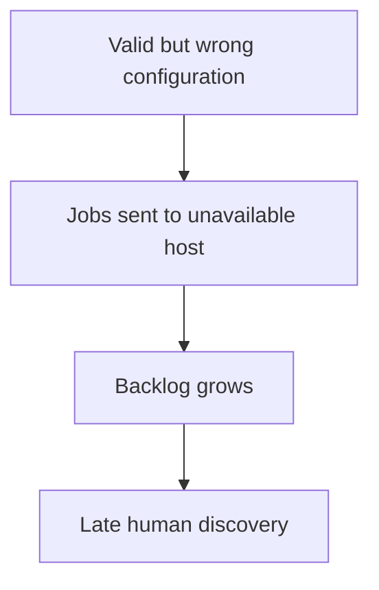
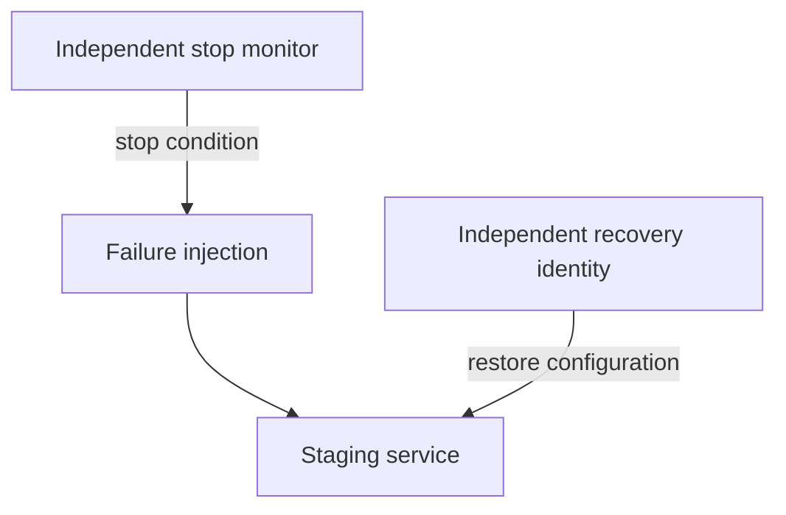
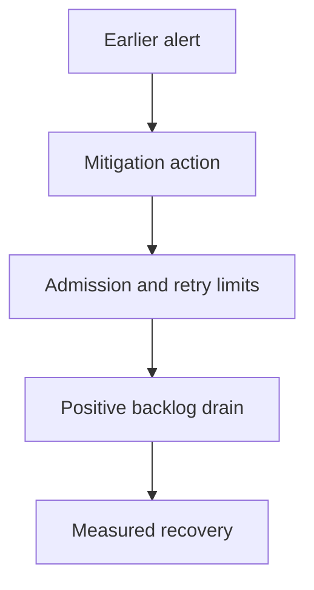

# 3. The incident you caused on purpose

[Curriculum](../../../README.md) · [Reliability and incident response](../README.md) · [Project index](../../../../indexes/projects.md)

## The reviewer's brief

> A staging configuration is valid JSON but routes every title job to an unavailable host. Run a controlled incident exercise, preserve the timeline, and complete one repair. What observable stop condition protects the drill?

This is a **constructed practice brief**, not an attributed company question.
Prerequisites: [project index](../../../../indexes/projects.md) and [prerequisite lesson](../../../04-scale-and-evolution/05-technical-decisions/scope-and-leverage.md). This page is a build brief; it does not ship a runnable application. The original build and prompt sequence below defines the implementation checkpoints.

| Case | Exact input or workload | Expected outcome |
|---|---|---|
| Small example | Inject at 10:00:00; first bad job 10:00:05; alert 10:01:00; rollback 10:02:00; backlog clears 10:03:30. | Detection after first impact is 55 s; mitigation after alert is 60 s; recovery after first impact is 205 s. |
| Boundary / failure | Rollback credentials depend on the same failing configuration service. | The recovery plan is blocked; add independently available emergency access and rehearse it. |
| Scope | Isolated environment, bounded workload and explicit rollback; do not label the scripted cause an unfamiliar assessment. | Explain any additional assumption before implementing it. |

Before looking at the guidance, state the invariant in one sentence and trace the example. In interview practice, implement or sketch independently, then reveal the reasoning. During AI-assisted practice, use the prompts below and verify each checkpoint before the next request.

## Baseline and the failure to explain



Schema validity does not imply operational safety. Build a factual timeline before selecting a cause, and distinguish restored admission from fully recovered backlog.

<details>
<summary>Reveal the approach and decisions</summary>

Choose blast radius and stop conditions, preserve raw metrics/logs, mitigate using reversible controls, then compare causal hypotheses. The invariant is bounded impact and an independently observable recovery path. Finish one action with a seeded regression before calling the exercise complete.

</details>

## Follow-up 1 · The normal control plane fails

**Changed requirement:** You cannot reach the deployment dashboard. How do you stop the drill? Predict which boundary must change before opening the design.

<details>
<summary>Expected reasoning and changed diagram</summary>

Use pre-authorized independent recovery access and a time-bounded failure injection. Test its credentials and dependencies beforehand; a stop button inside the failed system is not an independent stop mechanism.



</details>

## Follow-up 2 · The fix changes only the alert

**Changed requirement:** The page arrives sooner, but users still wait the same time for backlog drain. What improved? State what evidence would make you reject your first design.

<details>
<summary>Expected reasoning and changed diagram</summary>

Detection improved, recovery did not. Report both. Choose a separate repair such as bounded retries or gradual admission, then measure net drain rather than claiming an earlier page solved capacity.



</details>

## Evidence to bring to review

Build in three stops: reproduce the small case and baseline failure; implement the protected boundary; then replay both changed requirements with captured outputs. Record commands, fixtures, and observed results in your implementation README. A diagram is a prediction until those checks run.

**Senior expectation:** Build the timeline from evidence and close one verified action. **Additional lead scope:** Own incident command, recovery access and cross-team action completion. Completion demonstrates practice evidence; it does not establish interview readiness or multi-team delivery experience.

## Supplied mechanism practice

- [Raw incident evidence exercise](../labs/reliability/incident.md) — includes its own run command, fixtures and validation limits.

These exercises verify specific boundaries; completing their reference tests does not implement or assess the full project.

## Build and prompt sequence

*You end up with a measured detection time and one change that actually happened.*

**Build**

Pick a failure you have never tried. Break your own system with it, deliberately,
in daylight. Run it as an incident: note the timeline, mitigate before you
diagnose, then write the postmortem and complete one action item.

**The thought process**

The first decision is **which failure**, and the useful criterion is the one you
are least sure about. Not the database going away — you have probably thought
about that. The certificate expiring, the disk filling, a dependency returning
slow-but-successful responses, a clock skewing, a config change that is valid
and wrong.

Then the discipline that is genuinely hard and is the whole practice:
**mitigate before you diagnose.** Your instinct will be to find out why. Roll
back, fail over, shed load first, and satisfy the curiosity afterwards with the
system up. Doing this once, in a drill, is how you will manage it at 3am.

Third: **the timeline before the theory.** Write what happened and when, with
"it broke" and "I knew" as separate entries, before you write a single sentence
about cause. A cause offered early becomes the frame everything else is read
through.

**How to organise the prompts**

```
Here is my system. List failure modes I have probably NOT considered —
not the obvious ones. For each, tell me how I could induce it safely in
my own environment.
```

```
Here are the logs and metrics from the window. Build a timeline: what
happened and when. Mark separately the moment the system broke and the
moment I first knew.

Do not propose a cause yet.
```

```
Given the timeline: list the contributing factors, plural. For each, say
what would have had to be different.

Do not name a single root cause, and do not list anything a PERSON
should have done differently.
```

Banning both single causes and human error is what turns a story into a system
description.

```
For this failure, what check would have caught it before I did? Be
specific: what it measures, what threshold, what it would have said.
Then tell me what that check costs — in noise as well as money.
```

**On AWS**

Two things worth knowing exist for this. **AWS Fault Injection Service** is the
managed way to induce real failures — stop instances, add latency, throttle an
API — with a stop condition tied to a **CloudWatch** alarm so the experiment
ends itself if it goes further than you meant. That stop condition is the feature
that makes it safe enough to run against something you care about.

The homemade versions are fine and teach more: a security-group rule that blocks
your dependency, a `stress` process on the instance, a deliberately expired
certificate in a staging environment, an IAM permission revoked for ten minutes.

And use this project to check the thing everyone's monitoring gets wrong: set a
CloudWatch alarm to **treat missing data as alarming** for at least one critical
metric. Then stop the component entirely. If nothing fires, silence means
nothing in your system, which is the most common quiet failure there is.

**What productionising it means**

The drill is on a schedule rather than a one-off, because the value is in the
trend. The detection time is written down and compared to last time. And the
action item is *done* — with a commit or a config change to point at — because
the honest measure of an incident practice is the percentage of action items
completed, not the quality of the writing.

**The learning**

You cannot shorten the gap between "it broke" and "we knew" during an incident.
You can only shorten it beforehand, and a drill is the only way to find out what
it currently is without waiting for a real one.

**How you would know it is wrong**

- Time the gap. If you cannot produce both timestamps, it is unmeasured, which usually means large.
- Read your postmortem for the word "should". Every one marks where the investigation stopped early.
- Check the action item is done. Not planned.
- Stop a component and see whether anything notices the silence.
- Do a second drill a month later and compare the detection time.

**Stage it**

1. The failure list, and the one you picked, with how to induce it safely.
2. The drill, with a timeline written as it happens.
3. The postmortem: contributing factors, no people, one action item with a date.
4. The action item done, and the next drill scheduled.

---

[Back to the ordered project index](../../../../indexes/projects.md)
