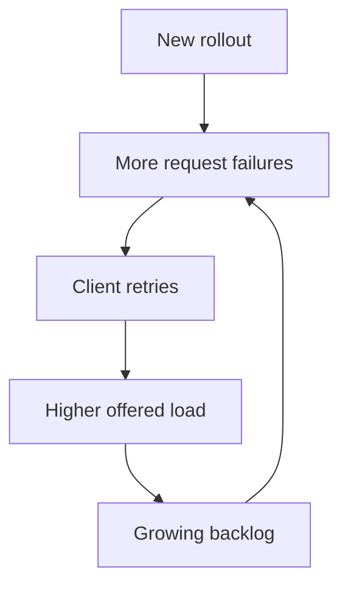
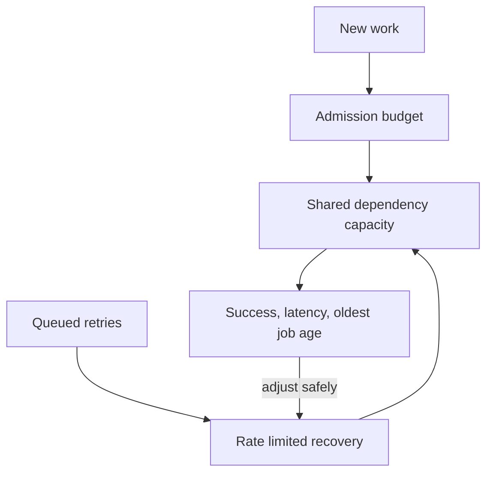
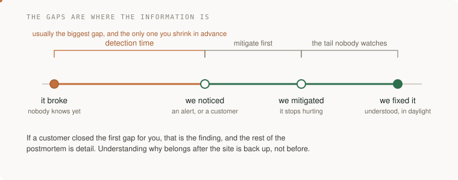
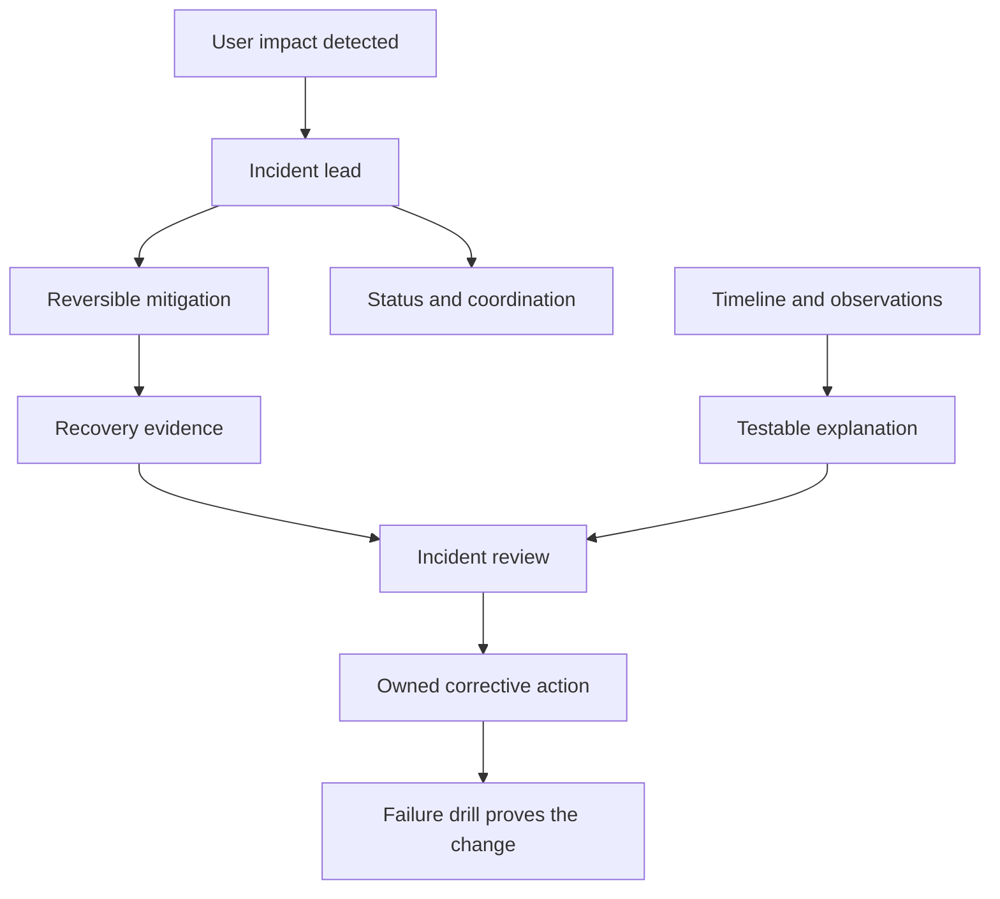

# Risk and incidents

[Curriculum](../../README.md) · [Reliability and incident response](README.md)

> Project connection · feeds **P5 (it changes safely)**

## At the whiteboard

> “After a rollout, error rate rises from 0.2% to 8% and the queue grows by
> 400 jobs each minute. You have incomplete logs. What do you do in the first
> ten minutes, and how do you avoid making recovery harder?”

An incident response is a sequence of decisions under uncertainty. Mitigating
harm and explaining the initiating defect can proceed on different timelines.

| Constructed observation | Expected response |
|---|---|
| New cohort fails more than old cohort | Check comparability; consider pausing exposure |
| Arrival `1,000/min`, completion `600/min` | Backlog grows `400/min`; bound new admission |
| Ten minutes at that difference | About `4,000` additional jobs, absent drops/retries |
| No trusted evidence for data corruption | Do not perform speculative destructive repair |



## Separate mitigation from diagnosis

1. Establish impact, an incident coordinator, and a timeline. Record hypotheses
   as hypotheses, with the observation that would reject each.
2. Pause the likely amplifier: release exposure, retry pressure, or admission.
   Choose a reversible action with an owner and a clear expected observation.
3. Preserve diagnostic evidence and data correctness while restoring service.
   Check whether replay after recovery will overload the repaired dependency.
4. Verify recovery through user operations and backlog age, not only a green
   process health check. Assign durable corrective actions and rehearse them.

**Follow-up:** “The dependency recovers, and every retry fires at once.” Add a
recovery budget and show how useful traffic competes with catch-up work.



Lead depth includes communication, competing risks, ownership, and evidence that
the follow-up changed behavior. Avoid a single-person hero narrative in your
project defense; explain your decisions and the team's contributions accurately.

## The one-liner

Incidents are not a failure of engineering. They are the normal operating
condition of any system with people and change in it. What separates teams is
not how rarely things break — it is what happens in the first hour, and whether
anything is different a month later.

## The failure it prevents

The same outage, twice.

A service falls over. Everyone piles in, somebody finds it, it gets fixed at
one in the morning, and there is relief and a certain amount of quiet pride. A
document is written. It says the cause was human error, and the action item is
to be more careful.

Four months later the same thing happens, with different people, and nobody
connects them — because the first document blamed a person rather than
describing a system that made the mistake easy and the consequence invisible.

The second failure is subtler and more common at the staff level: **the incident
that is handled well and learned from privately.** One engineer understands
exactly what happened and why. Nothing changes in the code, the alerting or the
runbook, because it is all in their head and they were not asked for more.

## The mental model

An incident has four moments, and the gaps between them are where all the
information is.



**It broke → we noticed** is detection time, it is usually the biggest gap, and
it is the only one you can shrink by doing work in advance. If a customer told
you, that number is the whole finding and the rest of the postmortem is detail.

**We noticed → we mitigated** is where the discipline goes. The rule that people
find hardest: **mitigate before you diagnose.** Roll back, fail over, shed load,
turn the feature off. Understanding why can happen afterwards, in daylight, with
the site up. The instinct to find the root cause first is engineering curiosity
arriving at exactly the wrong moment.

**We mitigated → we fixed it** is the unglamorous tail, and it is where things
get forgotten, because the pressure is off.

### Roles, when it is bigger than one person

Three jobs, and one person cannot do two of them at once:

- somebody **runs** the incident and decides what happens next
- somebody **communicates** outward, so the person investigating is not also answering "is it fixed yet?"
- somebody **investigates**

The most common failure in a small team is the best engineer doing all three,
badly, while being interrupted.

### What makes a postmortem real

Blameless is not politeness. It is a *method*: if people are protecting
themselves, you get a story rather than a timeline, and the story will be wrong
in the places that matter most.

The test of a postmortem is not its quality as a document. It is whether an
action item got done, by a named person, by a date — and whether anyone ever
went back to check. Most organisations have a stack of excellent postmortems and
an unexamined backlog of their action items.

### Error budgets as a political instrument

An error budget turns "should we ship faster or be more careful?" from an
argument between people into a number both sides already agreed to. When the
budget is spent, the answer is not a debate, it is a policy that was written
when everyone was calm.

That is what makes it a staff-level tool rather than an SRE one: it converts a
recurring conflict into a decision made once.


## What good looks like

- Detection is automatic, and you know your detection time because you have measured it.
- Mitigation comes first, and rolling back is a normal action rather than an admission.
- One person runs it, and it is not the person with their hands in the system.
- The postmortem describes the system that made the failure easy, not the person who was on the keyboard.
- Action items have owners and dates, and somebody tracks whether they happen.
- There is a written error-budget policy and it has actually been invoked at least once.

Done badly:

- Found by a customer, every time.
- Diagnosis first, mitigation somewhere around hour two.
- "Human error" as a root cause. It is never the root cause; it is where the investigation stopped.
- Postmortems as documents rather than as change: beautifully written, none of the actions done.
- The reliability conversation re-run from scratch every quarter with no agreed number in it.
- Nobody ever practises. The first time the failover is used is the day it is needed.

## Ask Claude for this

**Request 1 — the timeline, before any theory**

```
Here are the logs, alerts and deploys from the incident window.

Build a timeline: what happened and when. Mark separately the moment the
system broke and the moment a human first knew.

Do not propose a cause yet.
```

*Why it is asked that way:* the last line is the instruction. A cause offered
early becomes the frame everything else is read through, and the two timestamps
you actually need get lost inside the narrative. Separating "broke" from "knew"
puts the biggest number on the page before anyone has an opinion.

**Request 2 — contributing factors, plural, on purpose**

```
Given this timeline, list the contributing factors. Plural. For each one,
say what would have had to be different for the incident not to happen,
or to have been caught sooner.

Do not name a single root cause, and do not list anything a person should
have done differently.
```

*Why:* real incidents have several causes that only combine to matter. Banning
single-cause answers gets you the system, and banning "somebody should have"
gets you the mechanism instead of the blame.

**Request 3 — what would have caught this earlier**

```
For this failure, what check would have caught it before a user did?
Be specific: what would it measure, what threshold, and what would it have
said.

Then tell me what that check would cost — in noise as well as money.
```

*Why:* the action item everybody writes is "add alerting". The useful version
names the signal and the threshold. The cost question is what stops you adding
ten alerts nobody will ever trust.

**What to keep for yourself:** the decision about what gets fixed and what is
accepted. A risk consciously accepted and written down is a legitimate
engineering position. The same risk unexamined is negligence, and the only
difference between them is that somebody decided.

## How you would know it is wrong

1. **Measure detection time.** Broke at, knew at. If you cannot produce both timestamps, that gap is unmeasured, which usually means it is large.
2. **Go back to the last three postmortems and check the action items.** How many were done? That percentage is your real learning rate, not the quality of the writing.
3. **Read one for the word "should".** Every "somebody should have noticed" is a place where the investigation stopped early.
4. **Run a game day.** Break something on purpose, in daylight, with people watching. The things that surprise you are the things that would have surprised you at 3am, with less light.
5. **Check whether your error-budget policy has ever been invoked.** A policy that has never bound anything is a document, not a policy.
6. **Ask who would run it if it happened right now**, and whether they know that.

## Your slice of the project

Something will go wrong during **P5**. It always does, and that is why the
project is a migration rather than a feature.

- Write the postmortem. Timeline first, with the broke/knew gap explicit.
- Contributing factors, plural, none of them a person.
- One action item, with a date, that you actually do.
- Your kill criteria from the design doc: were they observable? Would you have noticed if they had been met?

**Acceptance criteria:**

- The postmortem contains two timestamps and the gap between them, in minutes.
- It contains no sentence in which a person should have done something differently.
- The action item is done, and there is a commit or a config change to point at.
- You can say honestly whether your kill criteria were observable, including if the answer is no.

## Words you now own

- **detection time** — from broke to somebody knowing. Usually the largest gap, and the one you can shrink in advance.
- **mitigation** — making it stop hurting. Comes before diagnosis, always.
- **incident commander** — the person who decides what happens next, and not the person with their hands in the system.
- **blameless** — a method for getting a true timeline, not a courtesy.
- **contributing factor** — one of several things that had to be true. The honest replacement for "root cause".
- **action item** — a change with an owner and a date. Unowned, it is a wish.
- **error budget** — an agreed amount of unreliability, which turns a recurring argument into a decision made once.
- **game day** — breaking something on purpose while everyone is awake.
- **runbook** — what to do when this specific thing happens, written before it does.

---

**Not covered here:** the mechanics of SLOs, burn-rate alerting and load
shedding are covered in [Reliability](failure-budgets.md).
This section is about what a staff engineer does with them: the hour it is
happening, and the week afterwards when everyone has stopped caring.

[Learning sequence](../../README.md) · [Independent practice](../../../practice/interview-guide.md)

## Draw it from memory · Separate mitigation from the explanation



**Redraw challenge:** Which action reduces current harm, and which experiment establishes why it happened?


[Static view](../../../assets/learning/circuit-breaker-still.svg)
