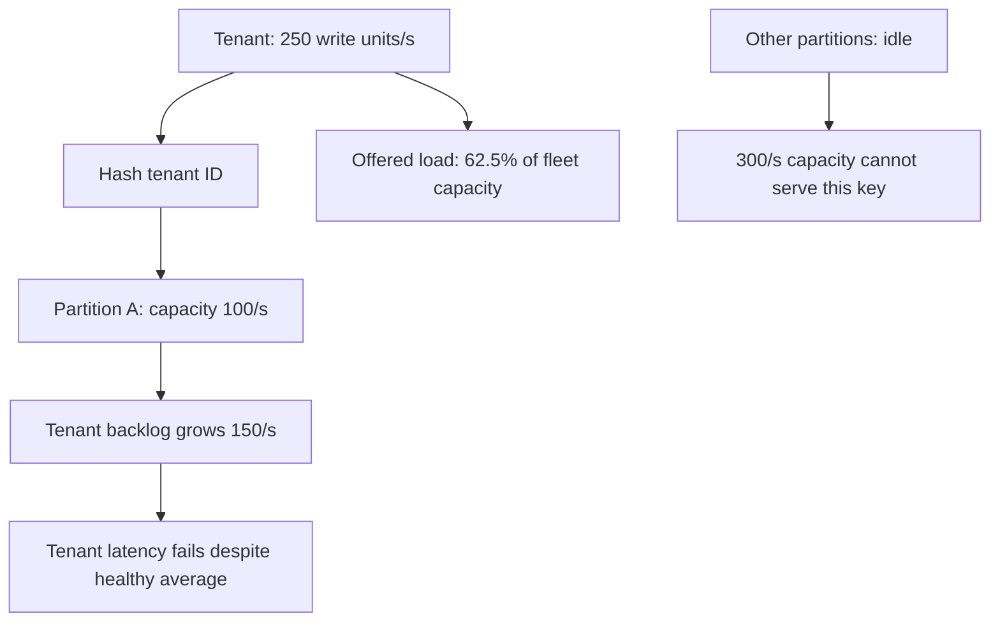
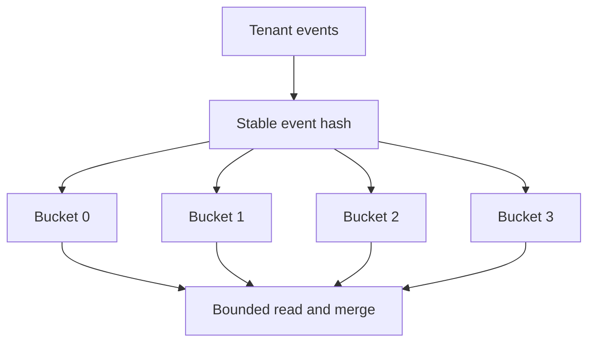
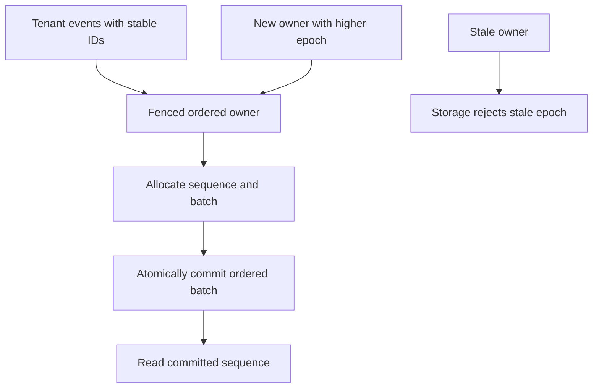

# Distribute a hot tenant while preserving event identity and ordering

[Curriculum](../../../README.md) · [Process, search and store data at scale](../README.md)

## Application and assignment

A telemetry service stores events by tenant. One tenant sends 250 write units per second to a partition able to serve 100. Other partitions are idle, but their spare capacity cannot help unless the access pattern and routing allow that tenant’s work to spread.

Begin with independent events and design stable routing plus bounded reads. Then change the requirement to a strictly ordered tenant stream. The four partitions and 100-unit capacities below are a mathematical model, not DynamoDB physical-partition guarantees.

## Starting contract

> “One tenant sends 250 writes/s to a four-partition service with a nominal 400/s total capacity. Their queue grows while fleet utilization looks healthy. Spread independent events without losing retries during a routing change; then preserve strict tenant ordering.”

Constructed interview brief. Prerequisites: hash keys, stable event identity, merge ordering, and capacity arithmetic.

| Contract | Workload / expected outcome |
|---|---|
| Baseline | Four independent toy partitions, 100 write units/s each |
| Skew | One tenant's 250 units/s routes to A → 150 units/s unserved even though offered load is only 62.5% of total nominal capacity |
| Independent-event target | Four ideal buckets receive 62.5 units/s each |
| Retry identity | `(event_id, routing_version)` persists across layout changes |
| Ordered follow-up | A serialized tenant stream needs its own throughput proof |
| Excluded | Four logical DynamoDB keys do not guarantee four physical partitions or benchmark capacity |

## Baseline to challenge

State whether writes are independent facts or ordered updates. Draw the hottest key rather than an average shard. Compute the deficit, choose a stable identity and routing version, then calculate read fan-out and migration recovery costs. Attempt a replay across four-to-eight buckets before opening the worked design.

**Real event:** GitHub Actions, July 9, 2026. A high-volume shard in its runner-provisioning backend became overloaded and could not synchronize reliably across regions. GitHub restored replication health and drained queued work; it reported further workload distribution and recovery protection work. [Primary report, published August 12](https://github.blog/news-insights/company-news/github-availability-report-july-2026/).

**Takeaway:** Fleet averages hide skew. Design for the hottest key and its ordering requirements.

[Static diagram](../../../../assets/learning/partition-skew-still.svg)

These diagrams use illustrative workloads. AWS mappings are our learning designs.

Work the example · AWS implementation · failure drill

## Work a partitioned design

Our toy store has four partitions, each with capacity 100 write units/s. One tenant emits 250 units/s and maps to partition A. Total capacity is 400, yet A accumulates 150 units/s of unserved work while B–D are idle. Aggregate utilization hides the failure.

For independent events, write with `(tenant_id, bucket_id)` as the partition key and `event_id` as the item identity. Choose the bucket deterministically from the stable event ID. Four evenly loaded buckets would receive 62.5 units/s each in this toy model. Real hashing is not perfectly even, and DynamoDB's physical partition placement is managed by AWS; four logical keys do not promise four physical partitions.

## AWS implementation and its price

DynamoDB partition-key design should distribute activity. On-demand capacity and adaptive capacity do not justify ignoring a persistently hot access pattern. Check item sizes, hot items, and read/write distribution. [AWS partition-key guidance](https://docs.aws.amazon.com/amazondynamodb/latest/developerguide/bp-partition-key-design.html).

Sharding a write key moves complexity to reads. A latest-events query now reads several buckets and merges sorted results. With `k` bucket streams and `n` returned events, a heap merge costs `O(n log k)` after fetching; cursors need enough state to continue each bucket without duplicates or omissions. Bound fetch concurrency with the [TypeScript fan-out example](../../../../indexes/practical-exercises.md). Per-bucket overfetch and empty reads add cost.

Bucket-count changes require a versioned routing rule. If yesterday's retries use four buckets and today's fresh events use eight, the same event must not acquire two identities. Keep the routing version with the event and make reads cover both layouts during migration. Do not silently change a hash modulo in place.

## Ordering and fairness

A tenant-wide account balance is not a bag of independent events. Spreading concurrent balance updates across keys can break its invariant. Keep a serialized owner, use transactions within their supported boundary, or redesign the operation into mergeable facts and a reconciled aggregate.

A tenant admission limit protects neighbors before hot work reaches the shared backend. Distinguish accepted durable work from rejected work: HTTP 202 should identify an accepted job, not conceal a drop. During replay, reserve capacity for fresh work and stop raising replay concurrency when downstream latency worsens.

| Level | Demonstrate | Above the baseline |
|---|---|---|
| Junior | Explain a skewed distribution with numbers | Find why a fleet average hides the slow tenant |
| Senior | Choose keys from access patterns and implement bounded reads | Handle retries across a routing-version change |
| Staff | Define tenant isolation and migration ownership | Make ordering, fairness, cost, and recovery tradeoffs explicit |

**Changed requirement:** one customer requires strict ordering of all events. Explain why simply adding buckets is no longer a complete answer, and measure whether batching behind one ordered owner meets the throughput goal.

## Follow-ups that change the design

**Senior: change four buckets to eight while retries remain.** Persist each accepted event's routing version and stable identity. Readers temporarily cover both layouts; retries use their original route or an authoritative deduplication record. For ten latest events, naïvely fetching ten from each of eight buckets reads up to eighty candidates before returning ten. A bounded merge limits concurrent reads and preserves continuation state; eight buckets are not eight free queries.

**Lead: strict tenant order.** At one unbatched write per 10 ms, a single ordered owner sustains only 100 events/s; 250/s leaves 150/s behind. If an atomic ordered batch of five genuinely takes the same 10 ms, the ideal ceiling is 500 events/s. That assumption needs measurement, and sequence allocation plus batch commit must preserve order through failover. A tenant-wide ordering requirement cannot be satisfied by distributing unrelated writers and later sorting timestamps.

This is a build brief. Deliver a deterministic bucket router, retry fixtures across routing versions, bounded latest-events merge and a competing-owner write test. Acceptance: each logical event appears once; old/new layouts remain readable; stale owners cannot append; measured batch latency supports the claimed throughput. During backlog replay reserve fresh-work capacity: at 400/s safe total and 250/s fresh load, only 150/s remains for replay, so 9,000 pending units need at least 60 seconds under ideal distribution. Hot physical placement may make the actual drain slower.

[Production casebook](../../../../indexes/production-cases.md) · [AWS implementation](../../../03-production/03-infrastructure/aws/README.md)
