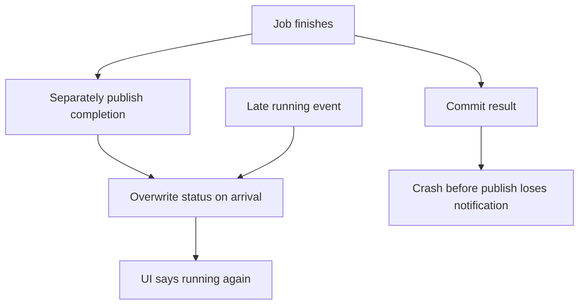
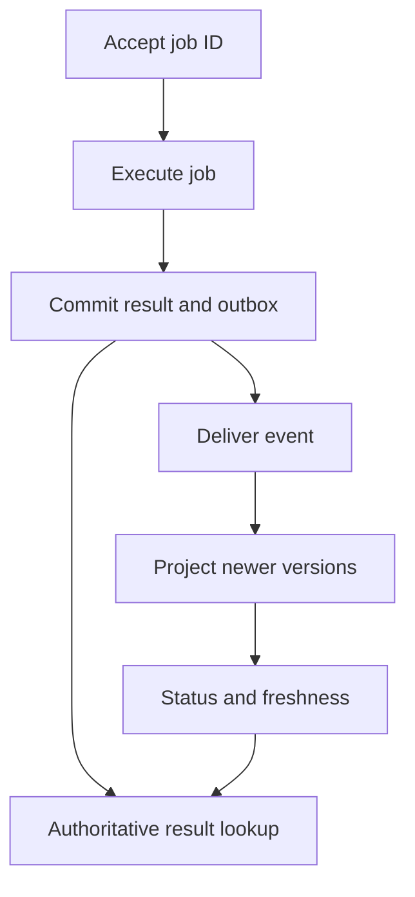
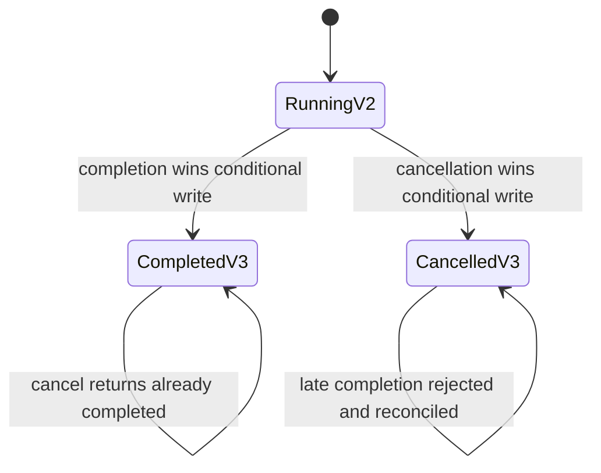

# Keep job status current without repeating completed work

[Curriculum](../../../README.md) · [Data systems at scale](../README.md)

## Application and assignment

A document export runs in the background. The worker writes the finished file, then an event updates a separate status view read by the browser. That view is a projection: a copy organized for display, not the authority that performed the export. A delayed event can leave “Running” on screen after the file is ready.

Design durable result publication and versioned status updates. Follow the concrete event sequence, calculate lag and catch-up, then resolve a cancellation racing completion. This page is a build brief. You create the projector and freshness field using the linked mechanisms, rather than running a supplied export application.

## Starting contract

> “A user sees ‘running’ although their job finished. Retrying creates duplicate work, and replay occasionally changes ‘completed’ back to ‘running’. Preserve job identity and monotonic status while showing honest freshness; then handle cancellation racing completion.”

Constructed interview brief. Prerequisites: stable IDs, transactional boundaries, and [queue drain arithmetic](../../../03-production/05-reliability/labs/reliability/README.md).

| Contract | Workload / expected outcome |
|---|---|
| Event | `(job=J, version=3, completed)` after running/v2 → completed/v3 |
| Reordering | running/v2 arrives again → stored completed/v3 remains |
| Conflict | failed/v3 after completed/v3 → explicit conflict, no silent overwrite |
| Backlog | 400 updates/s, twenty slots, 200 ms/write → grows 300/s |
| Recovery | 20 ms/write, same arrivals → 600/s spare; 18,000 items drain in 30 seconds |
| Excluded | A numeric version alone does not settle business races or make a publish atomic |

## Baseline to challenge

Trace a crash between result and event publication, then a duplicate and a stale update. Decide which store owns the result and version; define an atomic state transition there. Calculate projection lag separately from execution time. Attempt the event sequence before opening the worked design.

**Real event:** GitHub Copilot cloud agent, August 20, 2026. Tasks continued completing while a regional managed-database problem delayed status updates. Fixed processing partitions and slow database failover contributed to backlog. GitHub shifted processing and added streaming capacity. [Primary report, published September 9](https://github.blog/news-insights/company-news/github-availability-report-august-2026/).

**Takeaway:** Job execution and status visibility are different guarantees. Preserve identity and event order.

[Static diagram](../../../../assets/learning/version-projection-still.svg)

These diagrams use illustrative workloads. AWS mappings are our learning designs.

Work the example · AWS implementation · failure drill

## Separate acceptance, execution, and visibility

Use a stable `job_id`, a durable result, and a monotonic version for each job's state. A completion event carries `(job_id, version, status, occurred_at)`. The status projector writes only if the stored version is lower. Duplicate and reordered events then cannot turn `completed/v3` back into `running/v2`.

The version must come from an authoritative ordering mechanism. Two independent writers both inventing `v3` can disagree; reject conflicting same-version payloads or establish a single job owner. Timestamps alone do not provide that guarantee.

## Work the backlog math

Our toy projector has 20 in-flight slots. At 20 ms per write, its ideal ceiling is `20 / 0.020 = 1000 updates/s`. If writes slow to 200 ms, that ceiling becomes 100/s. With 400 updates/s arriving, backlog grows by 300/s. After 60 seconds, 18,000 updates wait. Once throughput recovers to 1,000/s, spare throughput is 600/s and ideal drain time is 30 seconds.

More partitions can increase useful concurrency only if the downstream store has headroom and the partition key permits work to spread. Otherwise scaling consumers can intensify the outage. Track processing age as well as queue count.

## AWS implementation exercise

Use DynamoDB transactions for a result plus outbox item when they belong in the same transaction scope, and relay asynchronously; or design an equivalent transaction with an Aurora outbox. Never claim an ordinary database write followed by a separate event publish is atomic. Give the relay its own checkpoint and retry strategy. Expiring an outbox before all consumers can recover loses the replay source. [DynamoDB transactions](https://docs.aws.amazon.com/amazondynamodb/latest/developerguide/transaction-apis.html).

For ordered event processing, explain the partition key and ordering scope when selecting Kinesis. A consumer must still manage duplicate processing and checkpoints; sequence numbers do not eliminate retries. [Kinesis concepts](https://docs.aws.amazon.com/streams/latest/dev/key-concepts.html).

Create a local projector. Deliver `running/v2`, `completed/v3`, `running/v2`, `completed/v3`, then conflicting `failed/v3`. Expect completed state after the stale update, a no-op duplicate, and an explicit conflict. The UI should say “status last updated…” during lag and reuse the same job identity when retrying acceptance. A silent permanent spinner gives the user no basis to decide what to do.

| Level | Demonstrate | Above the baseline |
|---|---|---|
| Junior | Show pending, failed, completed, and stale UI states | Preserve a job identity across refreshes |
| Senior | Handle duplicates, reordering, and projection replay | Prove result/event atomicity boundary and calculate drain time |
| Staff | Define recovery ownership and freshness objectives | Coordinate regional recovery, retention, and reconciliation |

**Changed requirement:** users may cancel while work completes. Define whether cancellation is a request or a guaranteed terminal state, which side effects can be undone, and who wins the race. A newer integer version cannot choose the business semantics for you.

## Follow-ups that change the design

**Senior: finite replay retention.** At observation there are 18,000 pending updates and the oldest is sixty seconds old. If failover adds ninety seconds with zero completions, another `400×90 = 36,000` updates arrive. The resulting 54,000 need `54000/(1000-400) = 90 seconds` to drain after restoration. A conservative retention envelope from the oldest event is therefore `60+90+90 = 240 seconds`, plus margin, under the toy assumptions. Ignoring fresh arrivals during failover would understate the requirement. Hot partitions and slow consumers can extend it; retain until an acknowledged checkpoint where the store supports it.

**Lead: cancellation races completion.** Choose explicit semantics. In this exercise cancel is a request until the authoritative transaction wins. From running/v2, both cancellation and completion attempt a compare-and-set against version 2. Exactly one commits v3; the loser rereads. Completion winning means later cancellation returns “already completed”; cancellation winning denies new execution effects but cannot undo an already external effect. Predict both schedules.

This is a build brief. Submit a local authoritative transaction/outbox, projector and a UI freshness field. Required checks: the five-event sequence above, crash between commit and delivery, replay after checkpoint, both cancellation schedules, and same-version disagreement. A canceled state cannot undo a provider side effect; include reconciliation or clearly exclude external effects. The [reliability incident](../../../03-production/05-reliability/labs/reliability/incident.md) separately assesses raw queue/freshness telemetry without giving the diagnosis first.

[Production casebook](../../../../indexes/production-cases.md) · [AWS implementation](../../../03-production/03-infrastructure/aws/README.md)
