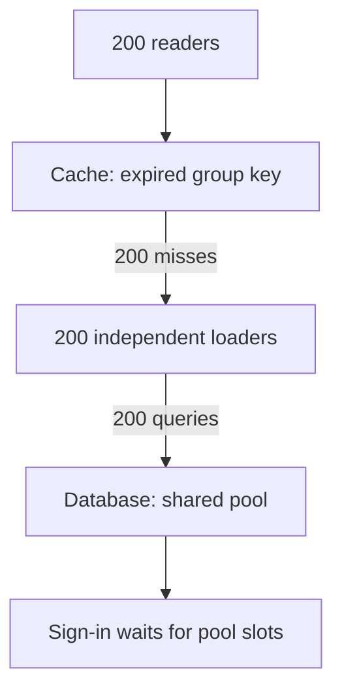
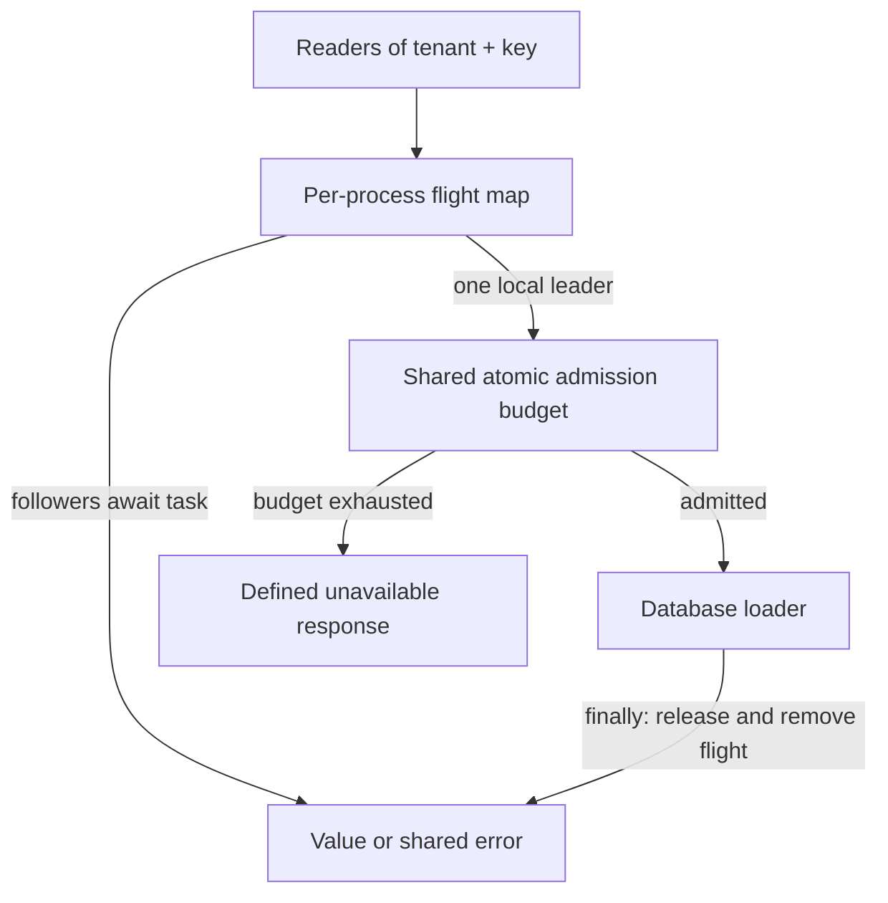
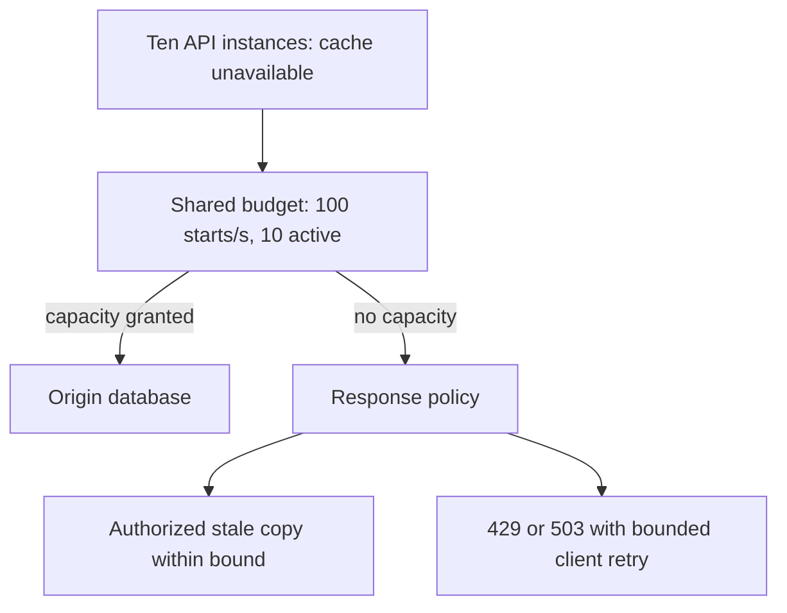
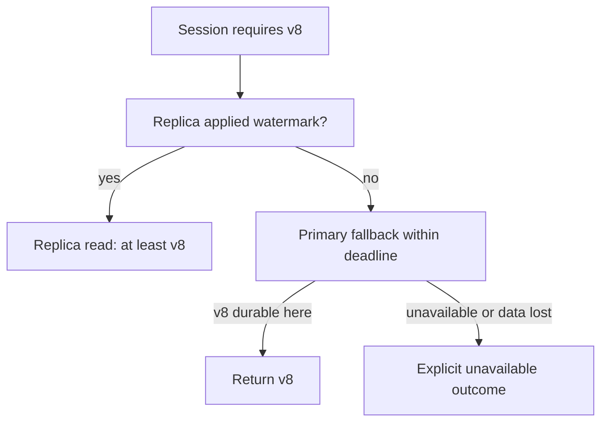

# An expired key, ten instances, and a finite database

[Curriculum](../../../../README.md) · [Process, search and store data at scale](../../README.md)

**Constructed candidate brief:** “Ana opens a group page just as its cache entry
expires. Two hundred requests arrive together on ten API instances. Preserve the
page's tenant boundary and keep refresh work inside a database budget. What
changes if the cache is unavailable or Ana has just saved a newer version?”

Prerequisites: [cache and replica concepts](../../../../03-production/01-system-design/mechanism-reference.md), Python 3.11+,
and understanding that an `asyncio` task may be cancelled while another task waits
on its result. Attempt the design and write the expected counters before opening
[the reference](reference.py) or [assessor notes](assessor.md).

| Teaching input | Expected value | Excluded guarantee |
|---|---|---|
| 200 same-key overlapping misses, naive baseline | 200 origin calls | Jitter supplies no exclusion |
| Same misses, one local flight map | 1 successful load | Persistent/fleet coordination |
| Ten independent flight maps, one shared cache miss | Up to 10 loads; fixture observes 10 | One loader across processes |
| Ten waves of 100 unique misses at one fake second | 100 admitted, 900 unavailable, peak 10 | Production rate-limiter distribution |
| Primary v8, replica v7, pin ends 5s, read at 6s | Timer-only read returns v7 | Unbounded lag cannot fit a finite timer |

These are synthetic values, not AWS limits. The supplied local model does no
network access. Its shared `OriginBudget` represents an atomic fleet admission
boundary; copying that object into each process would multiply the budget.

## Start with the failure

Walk a single key through the miss path. “Cache absent” is an observation, not a
claim on the right to refresh. All 200 requests can observe the same absence.



**Predict:** if each reader adds a different TTL after loading, how many loads
have already happened? All 200. Jitter helps different keys expire at different
times. Early refresh is probabilistic; neither is mutual exclusion.

## Change the boundary in order

1. Name the invariant: one overlapping load per key within one process; at most
   100 origin admissions in a rolling second and ten in flight in this fixture.
2. Put a task in the flight map before waiting on it. Followers await that task.
   Keep keys tenant-scoped. Distinct keys cannot share values.
3. Shield shared work from one waiter's cancellation. Remove the flight and free
   its budget on success, exception, and loader cancellation. If every waiter
   leaves, the sample deliberately lets the bounded load finish; production
   loaders also need deadlines and lifecycle shutdown.
4. Apply admission before calling the origin. When exhausted, return the declared
   unavailable result. An HTTP adapter can map capacity overload to 429 or 503;
   safe stale data is an option only with a separate freshness and auth policy.
5. Add instances and count again. If you require fleet exclusion, put arbitration
   in a shared service and reason about owner pause, expiry, and fencing. A shared
   rate gate bounds load even when exclusion is deliberately weaker.



## Run the local boundary tests

From the repository root:

```bash
python -m unittest discover -s curriculum/04-scale-and-evolution/01-data-at-scale/labs/cache-consistency -p 'test_*.py' -v
```

Tests observe actual loader calls, all waiter results, cleanup, ten independent
instances, distinct keys, outage caps, and the lag counterexample. They use event
barriers and a fake clock; `asyncio.sleep(0)` yields scheduling without wall-clock
delays. Green tests verify this model, not a live Redis lock or global rate gate.

## Follow-up: the cache disappears during a traffic burst

Before revealing this diagram, choose a user-visible result for 900 excess
requests. “Same page, slower” is feasible only inside the origin's capacity.



**Senior:** distinguish a rate cap from a concurrency cap; neither implies the
other when latency changes. **Lead:** allocate tenant shares and spare database
capacity across services; describe what happens when the shared limiter itself
fails. This model fails closed on exhausted admission and does not implement a
distributed limiter. Validate real limiter availability/consistency separately.

## Follow-up: the user's write is newer than the replica

Define a session watermark as the minimum version this session has acknowledged.
For one row this model uses an integer. A real multi-row system needs a database
replication position and a defined failover epoch; do not compare unrelated row
versions as though they were a global log position.



**Senior:** show why a five-second sticky route returns v7 at t=6 when lag lasts
ten seconds. **Lead:** explain the write acknowledged only in a failed region and
choose between synchronous replication availability costs and an explicit RPO.

Continue to [cached-link revocation](revocation.md) and the
[lease/recovery lab](../../../04-migrations/labs/recovery-migration/README.md).
