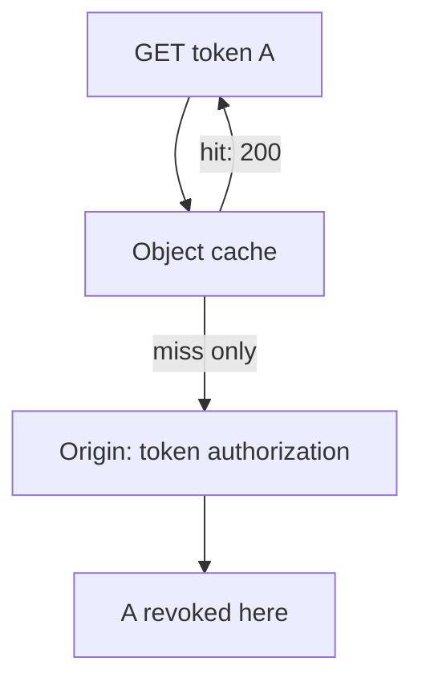
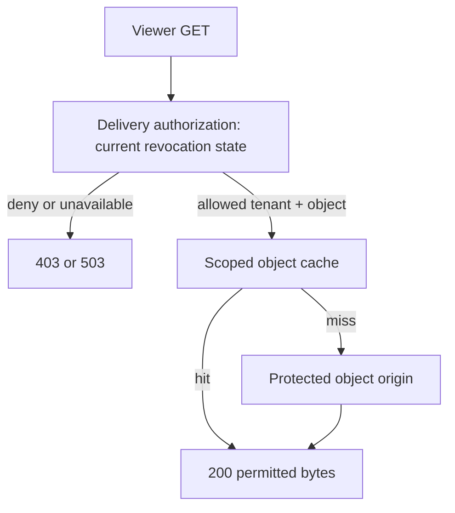
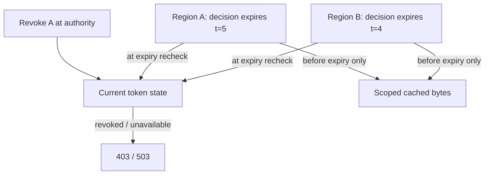

# Revoke a link that is already warm

[Curriculum](../../../../README.md) · [Data at scale](../../README.md)

**Constructed candidate brief:** “Ana shares a private schedule with token A.
Its first GET warms a CDN. Ana revokes the token one second later. Define what
the next identical GET should do, including when the origin is unavailable.”

Prerequisite: [cache hits versus shared loads](README.md). Choose the contract
before opening `LinkDelivery` in [reference.py](reference.py).

| Input | Immediate policy | Five-second decision policy |
|---|---|---|
| GET A at t=0 | 200, `Ana 09:00` | Same |
| Revoke A after warming, repeat before t=5 | 403 | May return 200 until t=5 |
| GET A at t=5 exactly | 403 | 403; reads do not extend decision expiry |
| Authorization service unavailable | 503, including warm bytes | Existing decision only until original expiry; then 503 |
| Token B with same pathname | `Ben 10:00` | Same; tenant identity scopes object bytes |

The bounds describe new delivery decisions. Revocation cannot erase bytes a
recipient already downloaded. This exercise deliberately excludes preventing
screenshots or revoking an in-progress response after it has been authorized.

## Baseline: the origin never sees the second request

Trace the warmed request before choosing infrastructure. Putting token A in the
cache key avoids mixing A with B, but the same revoked A still hits. An origin
check cannot authorize a request that never reaches it.

## Move authorization onto the delivery path

1. Choose immediate or bounded revocation and define the reference clock.
2. Authorize **before every object cache lookup**, returning the permitted tenant
   and resource; don't trust caller-supplied ownership.
3. Scope cached bytes to that tenant/resource. Protect the origin from direct
   unauthorized access and avoid separate ungoverned browser/proxy caches for
   sensitive responses (for example, use `Cache-Control: no-store` to clients).
4. For strict decisions, fail closed when current authorization is unavailable.
   For bounded decisions, preserve the original expiry; outage and repeated hits
   must never extend it. Account for clock error and propagation within the SLA.

CloudFront serves cache hits without fetching the origin. A viewer-request
authorization integration can therefore be one enforcement point, provided its
revocation data actually meets the chosen consistency bound. Alternatively,
disable shared caching and check authorization at every origin request.
Signed URL expiry by itself promises expiration, not immediate per-token
revocation. Invalidation requires a propagated, observable completion bound; do
not label it instantaneous. See [delivery behavior](https://docs.aws.amazon.com/AmazonCloudFront/latest/DeveloperGuide/HowCloudFrontWorks.html)
and [private content](https://docs.aws.amazon.com/AmazonCloudFront/latest/DeveloperGuide/PrivateContent.html).
These undated technical docs were accessed 2026-09-22, not publication-dated
interview evidence.

## Follow-up: authorization decisions are cached globally

Predict what two regions may serve after revocation, then draw the expiry.

Run the same local test command as [the cache lab](README.md). Tests warm A,
revoke, repeat the identical GET before object expiry, clear the object cache
and repeat, compare tokens A/B at the same pathname, and inject origin and auth
outages. The fake-clock boundary at t=5 is asserted exactly.

**Senior follow-ups:** justify cache headers and origin access restrictions;
explain why origin availability and authorization availability are different.
**Lead follow-up:** allocate a five-second SLA across propagation, decision TTL,
clock skew, and already-in-flight work; define audit evidence in both regions.
Acceptance requires the exact expected status/bytes on both warm and cold paths,
and an honest statement of the chosen revocation bound.
