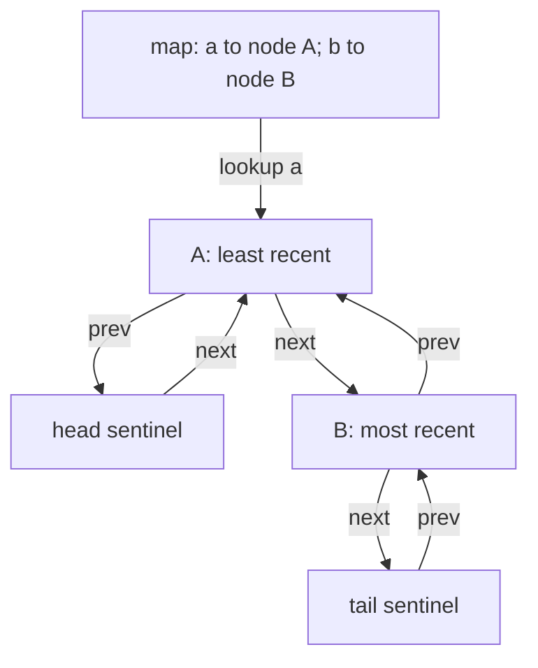
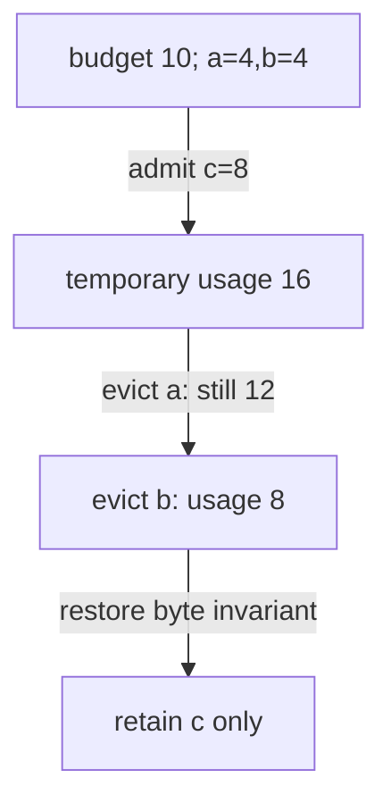

# Implement LRU without an ordered-map helper

[Curriculum](../../../../README.md) · [Data at scale](../../README.md) · [All coding problems](../../../../../indexes/coding.md)

> “A preview service caches a fixed number of decoded objects. A successful read
> or overwrite makes that key most recently used. When a new key overflows capacity,
> evict the least recently used one. Implement both lookup and recency yourself;
> an ordered-dictionary library would hide the pointer work we want to inspect.”

Constructed practice question. Prerequisites: [maps](../../../../01-code/02-data-structures-algorithms/lessons/01-maps.md) and
[LRU behavior](../../cache-order.md). A doubly linked node holds previous and next
pointers, allowing removal from the middle when the node is already known.

| Contract | Required behavior |
|---|---|
| Input | Nonnegative entry capacity; hashable keys and arbitrary values |
| Output | `get` returns value; `put` returns evicted `(key,value)` or `None` |
| Boundaries | Miss raises `KeyError`; stored `None` is valid; overwrite refreshes recency |
| Zero capacity | Every put returns its input as immediately evicted; retains nothing |
| Failure/scope | Invalid capacity raises `ValueError`; single-threaded, entry count only |

<!-- interview-rehearsal:start -->

## What the interviewer expects

The opening scenario is the product context; the table above is the callable
contract. Your job is to connect them. Before coding, say what the output means,
walk one normal case and one case that could disprove a tempting shortcut, then
name the invariant your implementation will preserve. Start with a correct
baseline, improve it deliberately, and derive time and space from actual work.

**Done means:** `get` returns value; `put` returns evicted `(key,value)` or `None`.

Passing the happy path alone is not done; your answer
must make a deliberate decision for every scenario below without mutating input
unless the contract explicitly permits it.

### Test-case scenarios to settle before coding

| Case | Exact input or state | Expected result | What it is testing |
|---|---|---|---|
| Eviction | capacity 2; put a,b; get a; put c | evict b | A successful read refreshes recency. |
| Overwrite | put existing a with new value | no size growth; a becomes most recent | Update and insert differ. |
| Stored None | put key with value `None` | `get` returns `None` | None cannot stand in for a miss. |
| Miss | get absent key | `KeyError` | Miss behavior is explicit. |
| Zero capacity | put a into capacity 0 | returns a as immediately evicted | The structure retains nothing. |
| Invalid construction | negative/noninteger capacity | `ValueError` | Capacity is validated once. |

Do not merely list these cases in an interview. For each one, point to the branch,
state transition, or invariant that makes the expected result inevitable. If your
design cannot explain a row, the design is not finished yet.

<!-- interview-rehearsal:end -->

At capacity 2: `put(a,1)`, `put(b,2)`, `get(a)`, `put(c,3)` evicts `(b,2)`.
Reading b then raises `KeyError`. Ask whether reads that miss affect recency (no)
and whether an overwrite should count as a third entry (no).



Implement unlink and append before integrating eviction. Draw all four pointer
writes needed to remove an interior node and append it at the tail.

<details>
<summary>Solution, coupled invariants, and follow-ups</summary>

A dictionary plus list of keys gives fast lookup but O(C) removal or recency search
at capacity C. A linked list alone gives O(1) movement once a node is known, but
O(C) lookup. Combine the two: a map points to the *same* nodes linked between head
and tail sentinels. Sentinels eliminate special cases for first/last real nodes.

On a hit, unlink the node and append just before tail. On overwrite, update its
value and perform the same movement. On a new key, allocate one node, register it,
and append it; if oversized, unlink `head.next` and remove its map entry. Clearing
removed pointers makes accidental reuse easier to diagnose.

**Invariant:** every map entry corresponds to exactly one real list node, every
real node appears in the map, adjacent next/previous pointers agree, and the list
orders keys from least to most recent. Both structures must change within one
operation. Forgetting the map deletion leaves a ghost hit on an evicted node.

| Operation | List from least to most recent | Map keys |
|---|---|---|
| put a; put b | a, b | a, b |
| get a | b, a | a, b |
| put c | a, c | a, c |

Expected map lookup plus constant pointer work gives O(1) time per get/put, subject
to ordinary hash-table assumptions. State is O(C) nodes/map entries plus two
sentinels. Each operation uses O(1) auxiliary space. The inspection helper
`items_lru()` costs O(C) time/output space and is not part of the constant-time API.

**Follow-up 1 — capacity is bytes.** Predict what happens when c alone occupies
eight bytes in a ten-byte cache containing a=4 and b=4. Evicting one is insufficient;
remove least-recent entries until used bytes fit. Define oversized-object rejection
and whether an unsuccessful overwrite preserves the old value before coding.



**Follow-up 2 — concurrent readers.** A get is a mutation because it changes
recency. One mutex can cover map lookup and list movement as a single critical
section. Do not run user loaders while holding it. Per-key load coordination is a
separate requirement; a locked cache alone does not prevent duplicate computation.

Senior depth includes pointer-integrity checks after mixed operations and a simple
list-based oracle. Lead depth distinguishes cache policy, load ownership, and
memory accounting. The supplied cache intentionally makes no thread-safety claim.

Reference: [solution.py](solution.py). Tests cover middle removal, capacity 0/1,
overwrite/None/miss behavior, eviction, and every link after seeded operations.

```bash
python -m unittest discover -s curriculum/04-scale-and-evolution/01-data-at-scale/problems/28-manual-lru-cache -p 'test_*.py'
```

</details>
