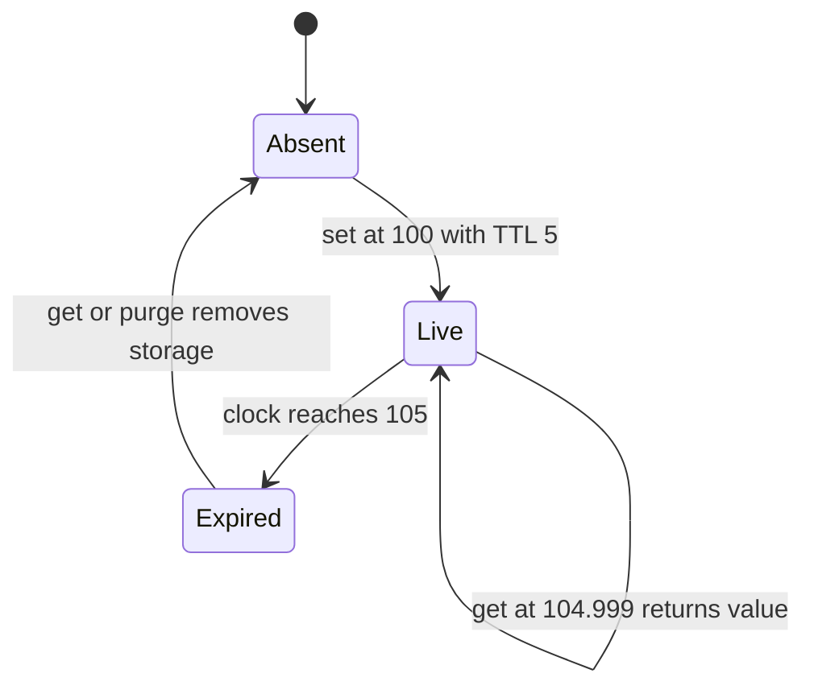
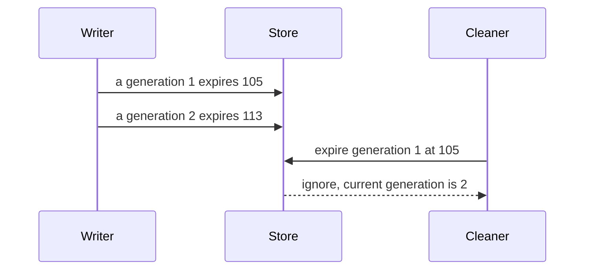

# Expiring key-value store

[Curriculum](../../../../README.md) · [Process, search and store data at scale](../../README.md) · [All coding problems](../../../../../indexes/coding.md)

> “A single-process service caches temporary verification results. Each write has
> a time to live. Reads must never return an expired result, including at the exact
> expiry instant. Tests must run instantly and deterministically. How would you
> make time an explicit dependency?”

Constructed practice question. Prerequisites: [maps](../../../../01-code/02-data-structures-algorithms/lessons/01-maps.md) and
[LRU contracts](../../cache-order.md). TTL is a duration; a deadline is the clock
reading at write plus TTL. A monotonic clock advances without wall-clock corrections.

| Contract | Required behavior |
|---|---|
| Input | Hashable key, arbitrary value, finite nonnegative TTL; injected monotonic clock |
| Output | `get` returns live value or raises `KeyError`; delete reports live removal |
| Expiration | Live exactly while `now < deadline`; TTL=0 immediately removes key |
| Cleanup | `purge()` removes all entries expired at one sampled instant and returns count |
| Failure/scope | Invalid TTL raises `ValueError` without overwriting; no persistence/concurrency |

## The tool before the challenge

A TTL entry needs both a value and an **expiry instant** from a chosen clock. Compare the clock on read; background cleanup alone cannot promise expired data stays hidden:
```python
value, expires_at = "hello", 105.0
now = 105.0
print(now >= expires_at)  # True: expired at the boundary
```
If an old expiry event runs after a new value replaces the key, it must not delete the replacement. Track a generation or compare the stored expiry before deleting.

### A design choice worth saying aloud

Store `expires_at` from a specified clock and compare it on **every read**; cleanup runs can lag. An expiry task should carry a generation/version so an old task cannot delete a new value under the same key. State whether the clock is monotonic process time or persisted wall time before promising survival across restarts.

<!-- interview-rehearsal:start -->

## What the interviewer expects

The interviewer gives you the scenario and the contract above. Explain what a
successful call returns, walk through one example below, and name what your
state means *before* choosing a data structure.

**Done means:** `get` returns live value or raises `KeyError`; delete reports live removal.

Now predict each output before looking at the reference; invalid input should
leave any existing state unchanged unless the contract says otherwise.

### Test-case scenarios to settle before coding

| Case | Exact input or state | Expected result | What it is testing |
|---|---|---|---|
| Before boundary | deadline 105; get at 104.999 | stored value | Liveness is strict `now < deadline`. |
| Exact boundary | get at 105 | `KeyError` | Expiration does not wait for cleanup. |
| Stored None | live key maps to `None` | `get` returns `None` | A miss needs an exception, not a sentinel. |
| Zero TTL | put with TTL 0 | key is immediately absent | No transient live interval exists. |
| Overwrite invalid | live key then put invalid TTL | `ValueError`; old value/deadline remain | Validation is atomic. |
| Purge sample | a expires at 104, b at 105, c at 106; injected now=105 | `purge()` returns `2`; c remains | The boundary is expired, and one clock sample decides all entries. |

For each case, show which branch or state change produces that result.

<!-- interview-rehearsal:end -->

At clock 100, `set(a,'ok',5)` yields `'ok'` at 104.999 and `KeyError` at 105.
Overwrite a at 103 with TTL 10 and it remains live at 105 until deadline 113.
Storing `None` remains distinguishable from absence. Clarify whether reads extend
expiry (they do not) and whether deletion of an expired key returns true (false).



Implement without sleeping. Write the exact-boundary test before deciding whether
to use `<` or `<=` in the liveness check.

<details>
<summary>Solution, logical expiry, and follow-ups</summary>

One timer per key is an attractive baseline but creates scheduling/resource costs,
and a timer callback may run after the deadline. A read that trusts “the timer has
not fired yet” can return stale data. Periodically deleting expired keys also cannot
replace checking expiry on the read path.

Store `(value,deadline)` in a dictionary. A get samples the injected clock and
checks `now >= deadline`; if true, remove that entry and raise `KeyError`.
An overwrite replaces both value and deadline. `purge` samples once, collects
expired keys, and deletes them after iteration to avoid modifying the dictionary
during traversal. TTL validation happens before changing existing state.

**Invariant:** a successful get returns only a value whose stored deadline is
strictly greater than that operation's clock sample. Logical absence at expiry
does not require physical deletion at that instant. This separation permits lazy
cleanup while preserving read correctness. It does *not* bound retained memory:
expired keys never accessed again remain until purge.

| Clock | Action | Stored deadline | Visible result |
|---:|---|---:|---|
| 100 | set a, TTL 5 | 105 | live |
| 103 | overwrite a, TTL 10 | 113 | new value |
| 105 | get a | 113 | new value survives old deadline |
| 113 | get a | removed | missing |

Get/set/delete cost expected O(1) time and O(1) auxiliary space. N stored entries
use O(N) state, counting expired entries awaiting cleanup. Purge costs O(N) time
and O(X) temporary keys for X expired entries. These are process-local operations;
clock advancement and caller scheduling are outside the data-structure cost.

**Follow-up 1 — background heap cleanup.** Predict the danger of an old expiry
record after overwrite. A heap item must carry a generation or match the current
deadline; otherwise the old timer deletes a newer value. Stale heap entries also
need a compaction policy to keep memory proportional to current keys.



**Follow-up 2 — persist across restarts.** A process monotonic deadline cannot be
serialized as a portable wall-clock expiry. Choose a persisted timestamp and
clock-skew policy, or expire everything on restart. Multiple replicas additionally
need a defined authority for writes and expiry decisions.

Senior depth tests equality, overwrite-before-expiry, invalid-write atomicity, and
cleanup with a fake clock. Lead depth explains retention and time authority rather
than promising that local TTL implies a distributed revocation guarantee.

Reference: [solution.py](solution.py); [test_solution.py](test_solution.py) supplies
the fake clock and never uses timing sleeps.

```bash
python -m unittest discover -s curriculum/04-scale-and-evolution/01-data-at-scale/problems/29-expiring-key-value-store -p 'test_*.py'
```

</details>
