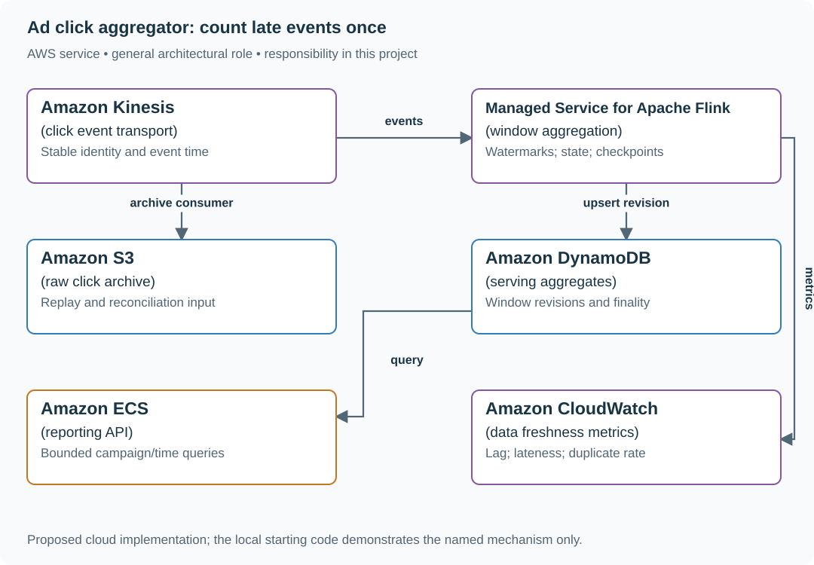
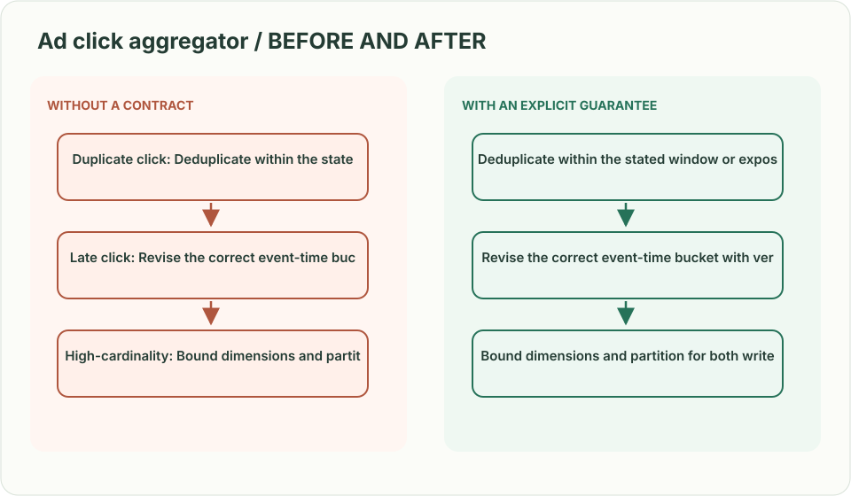
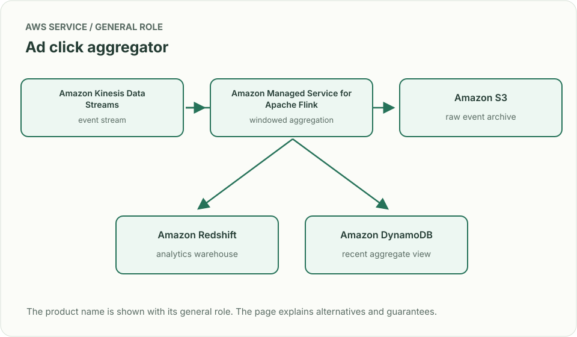
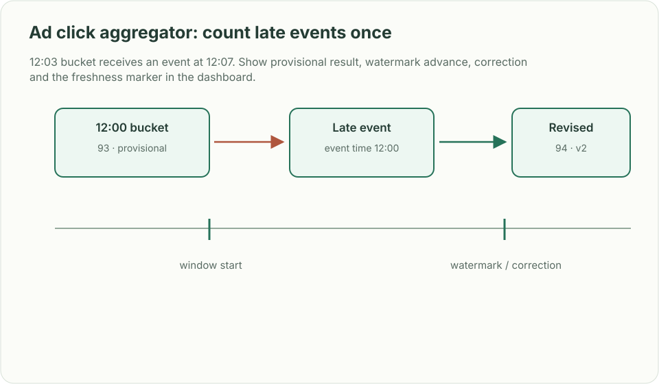

# Ad click aggregator: count late events once

## What you are building

> Build campaign click reporting for an advertising platform. Events arrive late or twice, a popular campaign dominates one partition, and finance needs a separate reconciled basis for billing. Advertisers want a dashboard within thirty seconds.

**Working contract:** Aggregate by campaign and event-time window with a documented duplicate window and late-arrival policy. Dashboard values are provisional until finalized. Reporting counts are not automatically a charge ledger.

## Workload and the decisions it changes

These are constructed exercise assumptions. The large workload is a design target; the local demonstration does not establish that throughput. Use the [estimation constants](../../../01-code/01-problem-solving/estimation-constants.md) to check units before choosing capacity.

| Input or objective | Calculation / consequence |
|---|---|
| Five billion clicks/day | About 57,870 events/s average; burst and largest-campaign rate need separate estimates. |
| Thirty-second dashboard freshness | Budget transport, aggregation and serving delay; late input can still revise an older window. |
| Two-year reporting history | Store compact window aggregates; raw-event retention and billing evidence have separate policies. |

## Start with one working boundary

Run from the repository root with Python 3.12+:

```bash
python3 examples/architecture-starts/ad_click_aggregator.py
```

[Open the starting code](../../../../examples/architecture-starts/ad_click_aggregator.py). This is a runnable demonstration of the critical state boundary. The API, UI, cloud adapters and operating behavior below are the application you build around it.

| Record / module | Key or interface | Responsibility |
|---|---|---|
| clicks | event_id,campaign,event_time,received_time | Original identity and both clocks. |
| window_state | campaign,window_start,shard | Deduplication and partial event-time counts. |
| reports | campaign,window,revision,finalized | Versioned aggregates served to advertisers. |

## AWS implementation



The stream processor owns provisional event-time state, the serving table owns a particular published revision, and the archive supports rebuilding. Those are distinct guarantees from a billing ledger.

## Build it in this order

### 1. Ingest a stable click envelope

Preserve event ID from the event producer, campaign and event timestamp, and add received time at ingestion. Validate timestamp bounds so a future-dated event cannot advance watermarks arbitrarily. Keep attribution policy version with derived results.

### 2. Aggregate event-time windows

Define window boundaries, watermark source and allowed lateness. Deduplicate within the declared replay horizon, checkpoint state with progress, and emit revisions when a late accepted event changes a prior window. Show provisional/final status in the API.

### 3. Shard hot campaigns

Split one campaign into deterministic partial counters and merge them for serving. Estimate both write distribution and merge work. A random shard suffix does not solve duplicate identity unless every replay chooses the same shard.

### 4. Reconcile billing separately

Preserve the evidence needed for invalid-traffic filtering, attribution corrections and financial reconciliation. A fast dashboard may undercount during lag; do not convert an approximate or revisable count directly into irreversible charges.

## Infrastructure configuration

| Resource or boundary | Initial configuration and reason |
|---|---|
| Flink job | Configure checkpoint storage and a documented watermark/late-data policy; size keyed state from dedup horizon. |
| Serving table | Use campaign/time access patterns and conditional aggregate revisions to reject old writes. |
| Archive | Partition by received date and preserve original event time; control access to user/device identifiers. |

Use one disposable AWS environment for the cloud exercise. Put the named resources in `infra/template.yaml` or your existing IaC tool, pass resource IDs through configuration, and scope each runtime role to its own tables, buckets and queues. The diagram is a design to implement; it is not a claim that these resources have been deployed. Record the commands you used to deploy and remove the exercise resources.

## Observe the result

| Action | Expected visible result |
|---|---|
| Run the starting program | Duplicate e1 is ignored, e2 updates an older window, and e3 goes to late reconciliation. |
| Pause a partition | The freshness indicator reveals lag rather than presenting the count as complete. |
| Replay a corrected attribution rule | Publish a new report version and explain the change. |

## The next design decision

An advertiser disputes yesterday’s invoice after fraud filtering changes. Define immutable invoice evidence, correction entries and the relationship between a revisable dashboard and a finalized financial document.

<details>
<summary>Additional design cases, alternatives and original source notes</summary>

> **Interviewer:** “Advertisers want minute-level click and impression counts. Events arrive more than once and sometimes minutes late; dashboards need recent counts while analysts query years of history.”

This is a **commonly listed system-design interview prompt** with a concrete practice contract. Assume 5 billion events/day, 30-second dashboard freshness and two years of historical queries. Clarify service guarantees and a first version before filling the board with services.

| Situation | Input / condition | Expected result |
|---|---|---|
| Duplicate click | SDK retries event id `x91` | Deduplicate within the stated window or expose count semantics. |
| Late click | Event timestamp 12:03 arrives at 12:07 | Revise the correct event-time bucket with versioned result. |
| High-cardinality | Millions of campaigns × regions × devices | Bound dimensions and partition for both writes and analytics scans. |
| Dashboard read | Query campaign for last 60 minutes | Return freshness/watermark with aggregated buckets. |



## Think from the contract to the boxes

Ingest immutable event IDs, event-time and dimensions, then aggregate in event-time windows. Watermarks decide when a window is provisionally complete; late arrivals update a correction path. Keep an append-only raw archive for replay. Pre-aggregation serves dashboards cheaply, while an OLAP store handles historical multi-dimensional slices. Do not force one database to serve both paths.

**First diagram:** Draw click → stream → event-time windows → hot aggregate and raw archive; show a late event correcting one bucket.



| AWS service / general role | Why it fits this design | Alternative and when it fits better |
|---|---|---|
| **Amazon Kinesis Data Streams** / event stream | Buffer and replay high-volume click records. | MSK where Kafka ecosystem and partition control fit better. |
| **Amazon Managed Service for Apache Flink** / windowed aggregation | Manage keyed state, event time and late records. | Lambda for simpler non-windowed consumers. |
| **Amazon S3** / raw event archive | Retain immutable events for recompute and audit. | Glacier tiers for older, rarely queried raw data. |
| **Amazon Redshift** / analytics warehouse | Query dimensional history for advertiser reporting. | Athena on partitioned Parquet for lower-frequency scans. |
| **Amazon DynamoDB** / recent aggregate view | Serve hot recent buckets by campaign/time key. | Timestream for primarily time-series reads with lower dimensions. |

Service choice follows the contract: the box label gives the generic job, while the table explains the AWS product and a reasonable substitute. Name which component owns durable truth, where retries happen, and the guarantee each managed service does **not** provide by itself.



## Pressure-test the design

**Follow-up: 12:03 bucket receives an event at 12:07. Show provisional result, watermark advance, correction and the freshness marker in the dashboard.**

**Senior expectation:** A single advertiser becomes a hot partition and report requests scan too much history. Salt writes, merge on read, and cap query ranges with an async export path.

**Staff expectation:** Products disagree about attribution windows and fraud filtering. Version event schemas and metric definitions, measure reconciliation gaps, and provide backfills without rewriting history invisibly.

**Practice artifact:** Draw click → stream → event-time windows → hot aggregate and raw archive; show a late event correcting one bucket. Then trace every row in the table, draw one failure, and state what the customer observes. Suggested rehearsal: 35 minutes design, 10 minutes to challenge the guarantees.

**Evidence and origin:** The current community interview-question catalog lists ad-click aggregation at Meta, Rippling, Google, Amazon and others; no date is attached to each report. The entry does not show the interview date and is not a verified company rubric. The prompt contract, workload, outcomes, diagrams and solution here are original practice material. Treat company tags as reported sightings, not a prediction of your interview loop.

**Interview report listing:** [Open the community question entry](https://www.hellointerview.com/community/questions/ad-click-aggregator/cm4t0kxb6004488il22wqa2nn).

</details>
