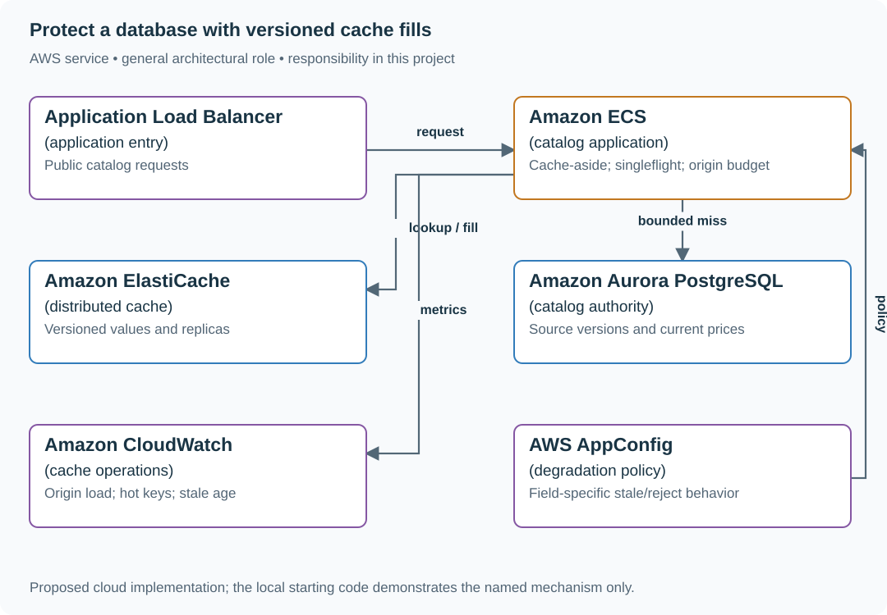

# Protect a database with versioned cache fills

## Application background

A storefront reads product details repeatedly. A cache stores disposable copies to reduce database work, but prices and availability still originate in the database.

This is a fictional engineering scenario. The workload figures later in the page are exercise assumptions, not measured production traffic.

## Your assignment

**Deliver:** A bounded cache-fill path with single-flight coordination, version-aware replacement and an origin-protection response when cache nodes fail.

Build the cache tier for a product catalog. A popular item expires during peak traffic, a cache node disappears, and a price update races an old database read. Keep origin traffic bounded and prevent an older fill from replacing a newer value.

**Required behavior:** GET cache entries returns a versioned value or a miss. The database remains authoritative. Define maximum acceptable staleness per field; price-sensitive checkout still reads its own authority.

The required first milestone is a working local implementation of the behavior above. The numbered implementation steps define the scope; the cloud architecture is a later extension, not something the starter has already provisioned.

## Get the code and run the supplied example

The code is in the public [junior-to-staff repository](https://github.com/Soulful-Iris/junior-to-staff). Install Git and Python 3.12+. No AWS account or Python packages are required for this first run. If you already have a checkout, use it and skip cloning.

```bash
git clone https://github.com/Soulful-Iris/junior-to-staff.git
cd junior-to-staff
python3 examples/architecture-starts/distributed_cache.py
```

**Supplied file:** [`examples/architecture-starts/distributed_cache.py`](https://github.com/Soulful-Iris/junior-to-staff/blob/main/examples/architecture-starts/distributed_cache.py). You can also [read or download the source here](../../../../examples/architecture-starts/distributed_cache.py).

This program is a **mechanism demonstration**: it runs the small scenario in one process and prints the result. It is not an HTTP service, a complete application, or an AWS deployment. A successful run demonstrates this mechanism only; it does not establish the workload or failure guarantees of the application you will build.

**Example output from the supplied run:**

Generated IDs and timestamps may differ; compare the state transitions and outcomes.

```text
stale fill rejected
{'item7': {'version': 5, 'value': 'new price'}}
One hot miss: 1000 requests can still cause 10 origin reads across processes
```

### Set up your implementation workspace

Create `work/distributed-cache/` in your checkout (or use a separate repository). Copy the supplied mechanism into that directory as `mechanism.py`, then extract its state transitions into functions you can call from your implementation. The record and module names below describe what you must implement; they are not a promise that files with those names already exist. Keep a `README.md` beside your implementation with its exact run commands and observed results.

## Local components and state to implement

This table names the records, interfaces or decision inputs for your deliverable. Unless a name is explicitly linked to supplied source above, it is something you create. Implement the local state transitions first, then connect the HTTP, storage or worker boundaries required by the steps.

| Record / module | Key or interface | Responsibility |
|---|---|---|
| cache_entry | key,value,source_version,expires_at | Cached source state with explicit expiry. |
| inflight_fill | key,owner,deadline | Coalesces concurrent misses within a defined scope. |
| origin_budget | region or service,allowed_concurrency | Prevents cache failure from becoming database collapse. |

## Implement the assignment

### 1. Implement versioned cache-aside

Read cache, fetch source on miss, and fill with source version and expiry. Protect fills against a newer cached version or invalidation generation. Explain the race where an old source read finishes after a fresh update; deleting a key alone may not prevent stale refill.

### 2. Coalesce and bound misses

Add per-key singleflight inside each process, a bounded origin semaphore and short wait deadline. Process-local coalescing does not coordinate 200 nodes. For expensive hot keys, use a distributed refresh owner only with an expiry/fencing rule and a safe fallback.

### 3. Handle node membership changes

Use a stable partition map or consistent hashing with replicas and controlled rebalance. Move data gradually while limiting origin refill traffic. Replication improves availability but consumes memory and does not create authority for business writes.

### 4. Operate explicit degradation

Choose bounded stale serving for eligible fields, rejection for unsafe fields and randomized expiry to spread refreshes. Track hit rate by request volume, origin concurrency, refresh age and hot-key concentration.

## Demonstrate the completed local result

| Action | Expected visible result |
|---|---|
| Run the starting program | Version 4 cannot replace cached version 5; process-local coalescing still allows multiple fleet-wide fills. |
| Expire one hot key | Origin concurrency stays within its configured budget. |
| Lose a cache node | Refill and degraded responses remain bounded instead of overwhelming the database. |

**Handoff:** In your implementation README, include the start command, one successful operation, the failure case above and the resulting stored state or decision. State which dependencies are simulated. Someone with a fresh checkout should be able to reproduce this without your chat history.

## Workload assumptions and capacity decisions

These are constructed exercise assumptions. The stated workload is a design target; the local demonstration does not establish that throughput. Use the [estimation constants](../../../01-code/01-problem-solving/estimation-constants.md) to check units before choosing capacity.

| Input or objective | Calculation / consequence |
|---|---|
| 20 million keys × 2 KiB | About 38.1 GiB of raw values before keys, allocator overhead, replicas and spare capacity. |
| Two million reads/s across 200 nodes | 10,000 reads/s/node on average; skew and node loss dominate the hot-key case. |
| Origin budget: 10,000 reads/s assumption | A broad cache outage cannot be allowed to forward two million reads/s to the database. |

## Map the local implementation to AWS

**Deployment status: local only.** Running the supplied command creates no AWS resources and configures no cloud connections. The diagram is a proposed deployment of the completed application. Each box needs either a deployed runtime, a provisioned service or an explicitly external dependency.

Read the diagram by following the arrows from the entry point: application code accepts the request or event, the state owner commits it, and any worker produces the later result. The table ties those roles to code and adapter work. Multiple boxes do not imply multiple Python files already exist.



ElastiCache supplies a cache service; the application supplies source-version handling, miss coalescing and origin protection. A custom cache project can implement those interfaces locally before attempting a new distributed storage engine.

| Local responsibility | Cloud destination and role | Implementation still required |
|---|---|---|
| Local HTTP listener | Application Load Balancer: application entry | Deploy a service behind a target group, configure health checks and bounded connection/request behavior. |
| Application or worker process | Amazon ECS: catalog application | Build a container and task definition; supply configuration, task roles and graceful shutdown behavior. |
| Local cache, counter or coordination state | Amazon ElastiCache: distributed cache | Implement a Redis/Valkey adapter and atomic operations, expiry and unavailable-cache behavior; keep the durable authority separate. |
| Local records and transaction boundary | Amazon Aurora PostgreSQL: catalog authority | Write PostgreSQL schema/migrations and a database adapter; configure credentials, connection limits and recovery. |
| Local counters, timestamps and diagnostic output | Amazon CloudWatch: cache operations | Emit bounded metrics and logs, build the named operational view and configure retention and access. |
| Local versioned configuration | AWS AppConfig: degradation policy | Publish validated configuration versions and consume them with bounded caching and rollback behavior. |

### Provision resources, then connect the application

| Resource or boundary | Initial configuration and reason |
|---|---|
| Memory sizing | Include replicas, metadata and headroom; eviction policy must match object lifetimes and workload. |
| Origin protection | Independent concurrency/rate limit survives cache outage; database pool size is a hard upper bound. |
| Cache topology | Choose multi-AZ replication/failover settings and measure stale/read behavior during failover. |

Use one disposable AWS environment for the cloud exercise. Put the named resources in `infra/template.yaml` or your existing IaC tool, pass resource IDs through configuration, and scope each runtime role to its own tables, buckets and queues. The diagram is a design to implement; it is not a claim that these resources have been deployed. Record the commands you used to deploy and remove the exercise resources.

For concrete provisioning commands, configuration wiring and cleanup, use the [AWS foundation guide](../../../../examples/architecture-starts/infra/README.md). It includes a deployable table/queue/object-storage foundation and explains which application and service adapters you still implement.

A provisioned queue or table does not make the local program use it. Configure resource IDs in the deployed runtime, replace the local adapter, and replay the same successful and failing operation against that runtime. Record the deployed commit and observable result, then remove the disposable resources using your infrastructure tool.

## Extend the design after the baseline works


Add negative caching for missing products. Define how a newly created product invalidates an older not-found result and how the version/generation rule applies to absence.

<details>
<summary>Additional design cases, alternatives and original source notes</summary>


This is a **commonly listed system-design interview prompt** with a concrete practice contract. Assume 20 million keys, 2 million reads/s, 200 cache nodes and an average value of 2 KB. Clarify service guarantees and a first version before filling the board with services.

| Situation | Input / condition | Expected result |
|---|---|---|
| Node addition | Add 10% capacity | Move a bounded fraction of keys, not nearly every key. |
| Hot key | One object gets 15k reads/s | Replicate or coalesce reads without violating allowed staleness. |
| Cache miss storm | A shard restarts | Bound origin concurrency and jitter refill; do not stampede the database. |
| Stale value | Source record changes | State invalidation/version/TTL behavior and maximum stale interval. |

## Think from the contract to the boxes

State whether the cache is disposable or authoritative; this problem assumes disposable. Consistent hashing limits remapping, but replication and hot-key behavior still need a policy. Use request coalescing and per-key/origin budgets for misses. Invalidation carries a source version so delayed older fills cannot replace newer values. A cache outage must degrade to a bounded origin path, not unbounded reads.

**First diagram:** Draw key placement, replica choice, source-of-truth version, miss coalescing, and what a node-removal event remaps.

| AWS service / general role | Why it fits this design | Alternative and when it fits better |
|---|---|---|
| **Amazon ElastiCache for Redis** / managed memory cache | Use when Redis data structures and managed operations fit. | Amazon MemoryDB when durable in-memory primary data is required. |
| **Amazon Route 53** / service discovery | Resolve stable client endpoints. | Cloud Map for service-aware registration and discovery. |
| **Amazon DynamoDB** / durable backing data | Supply source values and versions for cache fills. | Aurora for relational source-of-truth reads. |
| **Amazon CloudWatch** / cache telemetry | Observe hit ratio, evictions, node health and origin QPS. | OpenTelemetry stack with per-shard metrics. |
| **Amazon ECS** / cache client service | Own coalescing, version checks and bounded fallback. | Lambda for intermittent, low-throughput clients. |

Service choice follows the contract: the box label gives the generic job, while the table explains the AWS product and a reasonable substitute. Name which component owns durable truth, where retries happen, and the guarantee each managed service does **not** provide by itself.

## Pressure-test the design

**Follow-up: With consistent hashing, adding a node moves only neighboring ring ranges. Draw old/new ownership and a hot key copied to bounded replicas.**

**Senior expectation:** The cache is unavailable and origin capacity is 10% of normal read traffic. Shed or serve stale by endpoint class, cap concurrency, and show how capacity recovers.

**Staff expectation:** Choose shared vs tenant-dedicated cache pools. Set eviction fairness, data classification, migration, and cost/latency SLOs.

**Practice artifact:** Draw key placement, replica choice, source-of-truth version, miss coalescing, and what a node-removal event remaps. Then trace every row in the table, draw one failure, and state what the customer observes. Suggested rehearsal: 35 minutes design, 10 minutes to challenge the guarantees.

**Evidence and origin:** The current community interview-question catalog lists distributed-cache design reports at Google, Microsoft, Meta and Amazon; interview dates are not displayed. The entry does not show the interview date and is not a verified company rubric. The prompt contract, workload, outcomes, diagrams and solution here are original practice material. Treat company tags as reported sightings, not a prediction of your interview loop.

**Interview report listing:** [Open the community question entry](https://www.hellointerview.com/community/questions/distributed-cache-system/cm6d9gnep03c46hpqrwc062ir).

</details>
