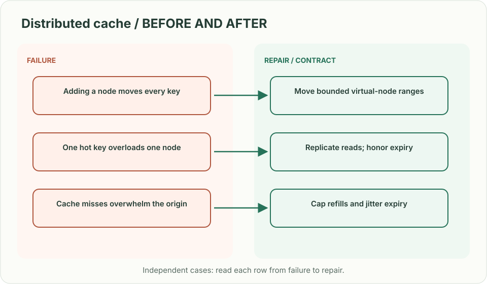
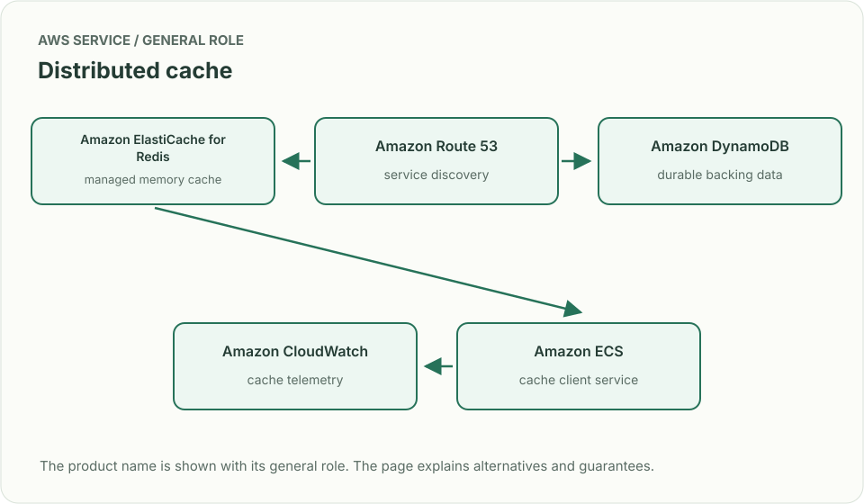
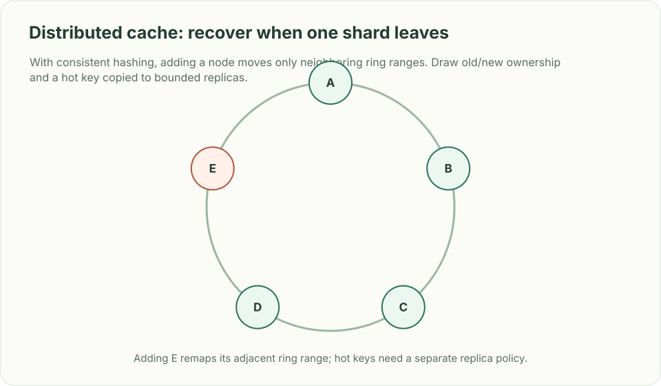

# Distributed cache: recover when one shard leaves

> **Interviewer:** “Build a low-latency distributed cache across many nodes. Clients read and write keys while nodes are added, removed, or become slow. Tell me what happens to hot keys and stale values.”

This is a **commonly listed system-design interview prompt** with a concrete practice contract. Assume 20 million keys, 2 million reads/s, 200 cache nodes and an average value of 2 KB. Clarify service guarantees and a first version before filling the board with services.

| Situation | Input / condition | Expected result |
|---|---|---|
| Node addition | Add 10% capacity | Move a bounded fraction of keys, not nearly every key. |
| Hot key | One object gets 15k reads/s | Replicate or coalesce reads without violating allowed staleness. |
| Cache miss storm | A shard restarts | Bound origin concurrency and jitter refill; do not stampede the database. |
| Stale value | Source record changes | State invalidation/version/TTL behavior and maximum stale interval. |

## Think from the contract to the boxes

State whether the cache is disposable or authoritative; this problem assumes disposable. Consistent hashing limits remapping, but replication and hot-key behavior still need a policy. Use request coalescing and per-key/origin budgets for misses. Invalidation carries a source version so delayed older fills cannot replace newer values. A cache outage must degrade to a bounded origin path, not unbounded reads.

**First diagram:** Draw key placement, replica choice, source-of-truth version, miss coalescing, and what a node-removal event remaps.

| AWS service / general role | Why it fits this design | Alternative and when it fits better |
|---|---|---|
| **Amazon ElastiCache for Redis** / managed memory cache | Use when Redis data structures and managed operations fit. | Amazon MemoryDB when durable in-memory primary data is required. |
| **Amazon Route 53** / service discovery | Resolve stable client endpoints. | Cloud Map for service-aware registration and discovery. |
| **Amazon DynamoDB** / durable backing data | Supply source values and versions for cache fills. | Aurora for relational source-of-truth reads. |
| **Amazon CloudWatch** / cache telemetry | Observe hit ratio, evictions, node health and origin QPS. | OpenTelemetry stack with per-shard metrics. |
| **Amazon ECS** / cache client service | Own coalescing, version checks and bounded fallback. | Lambda for intermittent, low-throughput clients. |

Service choice follows the contract: the box label gives the generic job, while the table explains the AWS product and a reasonable substitute. Name which component owns durable truth, where retries happen, and the guarantee each managed service does **not** provide by itself.

## Pressure-test the design

**Follow-up: With consistent hashing, adding a node moves only neighboring ring ranges. Draw old/new ownership and a hot key copied to bounded replicas.**

**Senior expectation:** The cache is unavailable and origin capacity is 10% of normal read traffic. Shed or serve stale by endpoint class, cap concurrency, and show how capacity recovers.

**Staff expectation:** Choose shared vs tenant-dedicated cache pools. Set eviction fairness, data classification, migration, and cost/latency SLOs.

**Practice artifact:** Draw key placement, replica choice, source-of-truth version, miss coalescing, and what a node-removal event remaps. Then trace every row in the table, draw one failure, and state what the customer observes. Suggested rehearsal: 35 minutes design, 10 minutes to challenge the guarantees.

**Evidence and origin:** The current community interview-question catalog lists distributed-cache design reports at Google, Microsoft, Meta and Amazon; interview dates are not displayed. The entry does not show the interview date and is not a verified company rubric. The prompt contract, workload, outcomes, diagrams and solution here are original practice material. Treat company tags as reported sightings, not a prediction of your interview loop.

**Interview report listing:** [Open the community question entry](https://www.hellointerview.com/community/questions/distributed-cache-system/cm6d9gnep03c46hpqrwc062ir).
