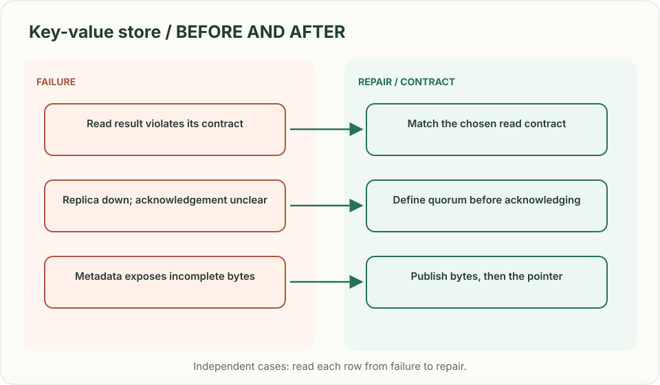
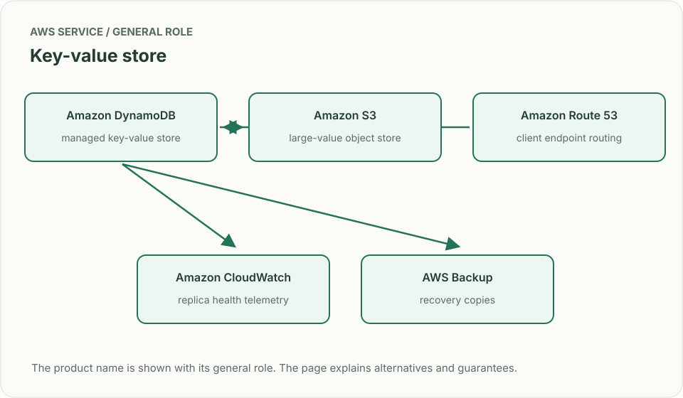
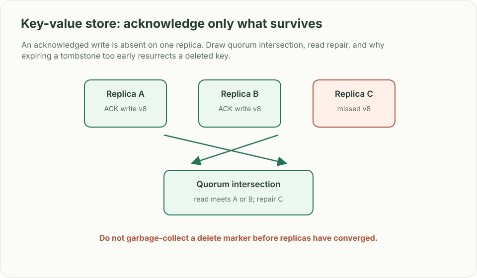

# Key-value store: acknowledge only what survives

> **Interviewer:** “Design a durable distributed `put/get/delete` store. Reads should see a caller’s successful write. Nodes fail, values range from small settings to multi-gigabyte objects, and the system must scale horizontally.”

This is a **commonly listed system-design interview prompt** with a concrete practice contract. Assume 2 million operations/s, 99.99% monthly availability and keys partitioned across 300 storage nodes. Clarify service guarantees and a first version before filling the board with services.

| Situation | Input / condition | Expected result |
|---|---|---|
| Read after write | Client puts v8 then reads from another node | Return v8 under the stated consistency contract. |
| One replica down | Two of three replicas are healthy | Define quorum and whether a write may be acknowledged. |
| Large object | Value is 2 GB | Store bytes separately; keep metadata and chunk manifest in KV path. |
| Tombstone expires | Old replica returns deleted value | Retention/repair protocol prevents resurrection. |

## Think from the contract to the boxes

Choose partitioning and replication before naming a database. A write has a version, replica quorum and durability promise. Read-your-writes can use session tokens or quorum reads. Deletes need tombstones long enough to reach every replica; compaction cannot erase the only evidence too early. Large values move through object storage with checksummed manifests. Distinguish acknowledgment latency from repair convergence.

**First diagram:** Draw hash partition → replica set → quorum response, then show hinted handoff/repair and tombstone propagation.

| AWS service / general role | Why it fits this design | Alternative and when it fits better |
|---|---|---|
| **Amazon DynamoDB** / managed key-value store | Choose for managed key access patterns and conditional writes. | Amazon Keyspaces for Cassandra-compatible wide-column workload. |
| **Amazon S3** / large-value object store | Keep multi-GB payload bytes outside the hot metadata path. | EBS only for attached block storage, not shared object access. |
| **Amazon Route 53** / client endpoint routing | Resolve regional/service endpoints. | AWS Global Accelerator for static anycast ingress. |
| **Amazon CloudWatch** / replica health telemetry | Track write latency, throttles, replication lag and repair backlog. | OpenTelemetry metrics where custom replica internals matter. |
| **AWS Backup** / recovery copies | Create point-in-time recovery protection for supported resources. | Application export snapshots for cross-engine recovery needs. |

Service choice follows the contract: the box label gives the generic job, while the table explains the AWS product and a reasonable substitute. Name which component owns durable truth, where retries happen, and the guarantee each managed service does **not** provide by itself.

## Pressure-test the design

**Follow-up: An acknowledged write is absent on one replica. Draw quorum intersection, read repair, and why expiring a tombstone too early resurrects a deleted key.**

**Senior expectation:** A rack loss causes repair traffic to compete with foreground reads. Set repair bandwidth, admission priority, and degraded-mode consistency behavior.

**Staff expectation:** Offer this store to teams with different data models. Define API/version contracts, isolation, migrations and when to use a managed database instead of operating a new distributed store.

**Practice artifact:** Draw hash partition → replica set → quorum response, then show hinted handoff/repair and tombstone propagation. Then trace every row in the table, draw one failure, and state what the customer observes. Suggested rehearsal: 35 minutes design, 10 minutes to challenge the guarantees.

**Evidence and origin:** The current community interview-question catalog lists a distributed key-value store prompt at LinkedIn, Databricks, Geico and Microsoft; individual report dates are not listed. The entry does not show the interview date and is not a verified company rubric. The prompt contract, workload, outcomes, diagrams and solution here are original practice material. Treat company tags as reported sightings, not a prediction of your interview loop.

**Interview report listing:** [Open the community question entry](https://www.hellointerview.com/community/questions/key-value-store/cm8gcrkz800b7epmpcj06fkwk).
