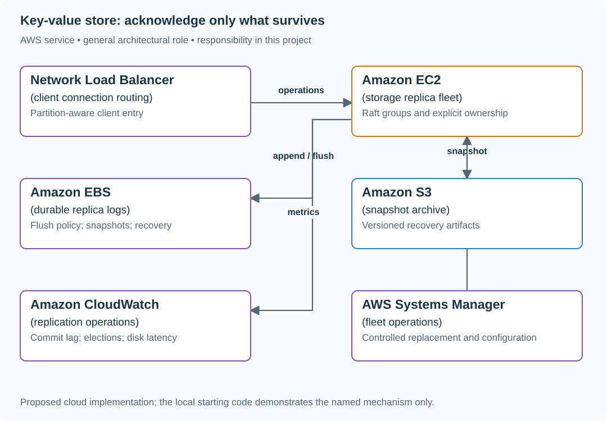

# Implement replicated writes and fenced leadership

## Application background

A key-value store offers put/get operations to applications. Replicas retain copies of a write; the service must define exactly when it can acknowledge that write and which leader can accept the next one.

This is a fictional engineering scenario. The workload figures later in the page are exercise assumptions, not measured production traffic.

## Your assignment

**Deliver:** A small replicated-log simulation extended into separate processes, with durable positions, leader terms and a crash/promotion walkthrough.

Build a small replicated key-value store to understand the durability boundary behind a managed database. A leader acknowledges a write, crashes, and later returns with stale state. The replacement leader must not lose acknowledged data or accept writes from the old term.

**Required behavior:** PUT /keys/{key} accepts a request identity and optional expected version. GET exposes a chosen consistency mode. The first milestone is one durable local log; the replicated milestone uses a specified consensus protocol with durable terms and a committed-log rule.

The required first milestone is a working local implementation of the behavior above. The numbered implementation steps define the scope; the cloud architecture is a later extension, not something the starter has already provisioned.

## Get the code and run the supplied example

The code is in the public [junior-to-staff repository](https://github.com/Soulful-Iris/junior-to-staff). Install Git and Python 3.12+. No AWS account or Python packages are required for this first run. If you already have a checkout, use it and skip cloning.

```bash
git clone https://github.com/Soulful-Iris/junior-to-staff.git
cd junior-to-staff
python3 examples/architecture-starts/distributed_key_value_store.py
```

**Supplied file:** [`examples/architecture-starts/distributed_key_value_store.py`](https://github.com/Soulful-Iris/junior-to-staff/blob/main/examples/architecture-starts/distributed_key_value_store.py). You can also [read or download the source here](../../../../examples/architecture-starts/distributed_key_value_store.py).

This program is a **mechanism demonstration**: it runs the small scenario in one process and prints the result. It is not an HTTP service, a complete application, or an AWS deployment. A successful run demonstrates this mechanism only; it does not establish the workload or failure guarantees of the application you will build.

**Example output from the supplied run:**

Generated IDs and timestamps may differ; compare the state transitions and outcomes.

```text
Recovered after closing the writer: {'a': 'saved'}
Local WAL only: this is not a replicated consensus implementation.
```

### Set up your implementation workspace

Create `work/distributed-key-value-store/` in your checkout (or use a separate repository). Copy the supplied mechanism into that directory as `mechanism.py`, then extract its state transitions into functions you can call from your implementation. The record and module names below describe what you must implement; they are not a promise that files with those names already exist. Keep a `README.md` beside your implementation with its exact run commands and observed results.

## Local components and state to implement

This table names the records, interfaces or decision inputs for your deliverable. Unless a name is explicitly linked to supplied source above, it is something you create. Implement the local state transitions first, then connect the HTTP, storage or worker boundaries required by the steps.

| Record / module | Key or interface | Responsibility |
|---|---|---|
| log_entries | partition,index,term,request_id,command | Durable ordered commands before state application. |
| replica_state | current_term,voted_for,commit_index | Persisted protocol state with explicit recovery rules. |
| key_state | key,value,version | Materialized committed log; snapshots include last applied index. |

## Implement the assignment

### 1. Make one node recoverable

Append length/checksummed records, flush according to the acknowledgement policy and replay committed records on restart. Handle a truncated final record explicitly. Add snapshots with a last included index, and retain log segments until snapshot durability is established.

### 2. Specify replication before adding nodes

Use a documented Raft implementation or implement its full term, election, log-matching and commitment rules as the learning objective. A leader sends ordered entries, followers durably record them, and success waits for the required committed majority. Never treat two arbitrary copies as proof of the protocol.

### 3. Define read and retry semantics

Deduplicate client operations at the replicated state-machine boundary. Linearizable reads require proof of current leadership and applied commit position; follower reads may be stale and must be labeled as such. Conditional writes compare the committed key version.

### 4. Partition and rebalance deliberately

Route keys to versioned partition ownership. Move snapshots plus log tails, then transfer authority under a fenced configuration change. Measure the hottest partition and replication cost before deriving node count from average operations.

## Demonstrate the completed local result

| Action | Expected visible result |
|---|---|
| Run the starting program | The value is recovered from the flushed local log. |
| Kill the replicated leader after acknowledgement | The new leader retains every acknowledged command under the chosen protocol. |
| Resume the old leader | Its stale term cannot commit writes. |

**Handoff:** In your implementation README, include the start command, one successful operation, the failure case above and the resulting stored state or decision. State which dependencies are simulated. Someone with a fresh checkout should be able to reproduce this without your chat history.

## Workload assumptions and capacity decisions

These are constructed exercise assumptions. The stated workload is a design target; the local demonstration does not establish that throughput. Use the [estimation constants](../../../01-code/01-problem-solving/estimation-constants.md) to check units before choosing capacity.

| Input or objective | Calculation / consequence |
|---|---|
| Two million operations/s target; 300 nodes | About 6,667 operations/s/node average before replication and skew; the local starter makes no throughput claim. |
| Three replicas per partition | A majority is two, but quorum arithmetic alone does not define leader election, log recovery or linearizable reads. |
| 99.99% availability objective | Roughly 4.32 minutes unavailable in a 30-day month; define which failed/slow requests count. |

## Map the local implementation to AWS

**Deployment status: local only.** Running the supplied command creates no AWS resources and configures no cloud connections. The diagram is a proposed deployment of the completed application. Each box needs either a deployed runtime, a provisioned service or an explicitly external dependency.

Read the diagram by following the arrows from the entry point: application code accepts the request or event, the state owner commits it, and any worker produces the later result. The table ties those roles to code and adapter work. Multiple boxes do not imply multiple Python files already exist.



This project intentionally uses EC2/EBS because building the storage mechanism is the assignment. DynamoDB is the practical alternative when the goal is to use a durable key-value service rather than implement one.

| Local responsibility | Cloud destination and role | Implementation still required |
|---|---|---|
| Local process connection boundary | Network Load Balancer: client connection routing | Register deployed replicas and configure listener, reachability and health behavior. |
| Local process or worker model | Amazon EC2: storage replica fleet | Provision isolated hosts, package the runtime and implement lifecycle/resource limits; a local simulation is not a hostile-code sandbox. |
| Local on-disk log | Amazon EBS: durable replica logs | Attach persistent volumes and implement durable writes/recovery; volume persistence does not establish replicated consensus. |
| Local file, object fixture or exported payload | Amazon S3: snapshot archive | Implement upload/download and metadata adapters, scoped access, object naming, retention and incomplete-upload cleanup. |
| Local counters, timestamps and diagnostic output | Amazon CloudWatch: replication operations | Emit bounded metrics and logs, build the named operational view and configure retention and access. |
| Manual operational commands | AWS Systems Manager: fleet operations | Package scoped run procedures and record execution results; validate the recovery procedure against actual stored state. |

### Provision resources, then connect the application

| Resource or boundary | Initial configuration and reason |
|---|---|
| Replica placement | Put a partition’s replicas in distinct AZs and state which correlated failures the design tolerates. |
| Storage | Benchmark durable flush latency and recovery time; local process success is not proof of replicated durability. |
| Membership | Use the consensus implementation’s safe reconfiguration mechanism; do not replace a majority simultaneously. |

Use one disposable AWS environment for the cloud exercise. Put the named resources in `infra/template.yaml` or your existing IaC tool, pass resource IDs through configuration, and scope each runtime role to its own tables, buckets and queues. The diagram is a design to implement; it is not a claim that these resources have been deployed. Record the commands you used to deploy and remove the exercise resources.

For concrete provisioning commands, configuration wiring and cleanup, use the [AWS foundation guide](../../../../examples/architecture-starts/infra/README.md). It includes a deployable table/queue/object-storage foundation and explains which application and service adapters you still implement.

A provisioned queue or table does not make the local program use it. Configure resource IDs in the deployed runtime, replace the local adapter, and replay the same successful and failing operation against that runtime. Record the deployed commit and observable result, then remove the disposable resources using your infrastructure tool.

## Extend the design after the baseline works


Add multi-region replicas. Quantify the write-latency cost of cross-region quorum and state the availability behavior under partition. Do not promise both independent regional writes and single-copy semantics without a protocol that actually provides them.

<details>
<summary>Additional design cases, alternatives and original source notes</summary>


This is a **commonly listed system-design interview prompt** with a concrete practice contract. Assume 2 million operations/s, 99.99% monthly availability and keys partitioned across 300 storage nodes. Clarify service guarantees and a first version before filling the board with services.

| Situation | Input / condition | Expected result |
|---|---|---|
| Read after write | Client puts v8 then reads from another node | Return v8 under the stated consistency contract. |
| One replica down | Two of three replicas are healthy | Define quorum and whether a write may be acknowledged. |
| Large object | Value is 2 GB | Store bytes separately; keep metadata and chunk manifest in KV path. |
| Tombstone expires | Old replica returns deleted value | Retention/repair protocol prevents resurrection. |

## Think from the contract to the boxes

Choose partitioning and replication before naming a database. A write has a version, replica quorum and durability promise. Read-your-writes can use session tokens or quorum reads. Deletes need tombstones long enough to reach every replica; compaction cannot erase the only evidence too early. Large values move through object storage with checksummed manifests. Distinguish acknowledgment latency from repair convergence.

**First diagram:** Draw hash partition → replica set → quorum response, then show hinted handoff/repair and tombstone propagation.

| AWS service / general role | Why it fits this design | Alternative and when it fits better |
|---|---|---|
| **Amazon DynamoDB** / managed key-value store | Choose for managed key access patterns and conditional writes. | Amazon Keyspaces for Cassandra-compatible wide-column workload. |
| **Amazon S3** / large-value object store | Keep multi-GB payload bytes outside the hot metadata path. | EBS only for attached block storage, not shared object access. |
| **Amazon Route 53** / client endpoint routing | Resolve regional/service endpoints. | AWS Global Accelerator for static anycast ingress. |
| **Amazon CloudWatch** / replica health telemetry | Track write latency, throttles, replication lag and repair backlog. | OpenTelemetry metrics where custom replica internals matter. |
| **AWS Backup** / recovery copies | Create point-in-time recovery protection for supported resources. | Application export snapshots for cross-engine recovery needs. |

Service choice follows the contract: the box label gives the generic job, while the table explains the AWS product and a reasonable substitute. Name which component owns durable truth, where retries happen, and the guarantee each managed service does **not** provide by itself.

## Pressure-test the design

**Follow-up: An acknowledged write is absent on one replica. Draw quorum intersection, read repair, and why expiring a tombstone too early resurrects a deleted key.**

**Senior expectation:** A rack loss causes repair traffic to compete with foreground reads. Set repair bandwidth, admission priority, and degraded-mode consistency behavior.

**Staff expectation:** Offer this store to teams with different data models. Define API/version contracts, isolation, migrations and when to use a managed database instead of operating a new distributed store.

**Practice artifact:** Draw hash partition → replica set → quorum response, then show hinted handoff/repair and tombstone propagation. Then trace every row in the table, draw one failure, and state what the customer observes. Suggested rehearsal: 35 minutes design, 10 minutes to challenge the guarantees.

**Evidence and origin:** The current community interview-question catalog lists a distributed key-value store prompt at LinkedIn, Databricks, Geico and Microsoft; individual report dates are not listed. The entry does not show the interview date and is not a verified company rubric. The prompt contract, workload, outcomes, diagrams and solution here are original practice material. Treat company tags as reported sightings, not a prediction of your interview loop.

**Interview report listing:** [Open the community question entry](https://www.hellointerview.com/community/questions/key-value-store/cm8gcrkz800b7epmpcj06fkwk).

</details>
