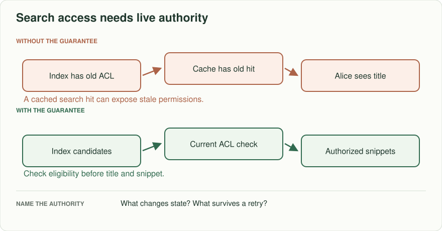
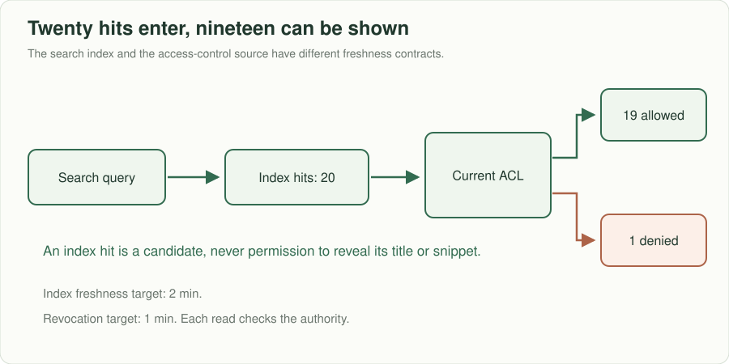
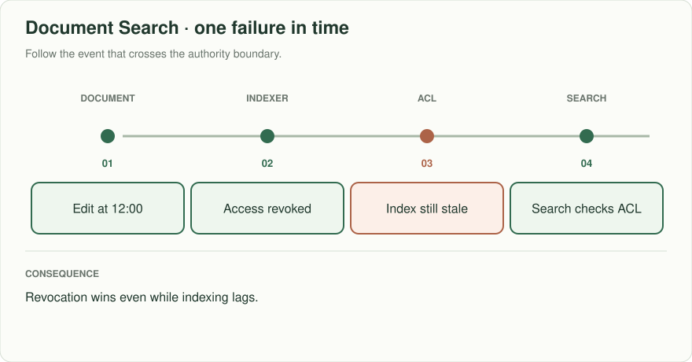
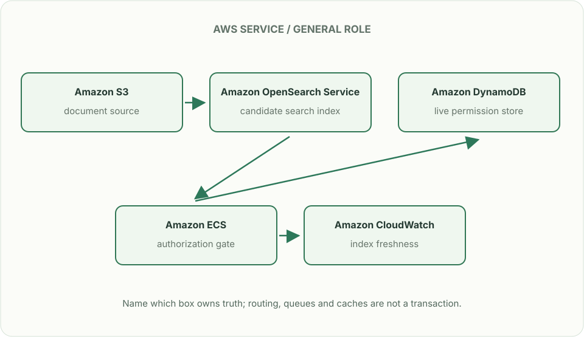

# Document search: results must follow permissions

> **Interviewer:** “Employees search internal documents. A newly edited policy must become searchable within two minutes. Alice loses access to a document at noon; she must not see it at 12:01 even if the index or cache is stale. Design ingestion, search, and permission revocation.”

Assume 30 million documents, 15,000 updates/minute, and 3,000 search requests/s. Return title, snippet, and source link for the top 20. Choose whether the two-minute freshness target includes failures and define how you observe it.

| Situation | Visible result |
|---|---|
| New authorized document written at 12:00 | Searchable by 12:02 or explicit ingestion SLA breach |
| Alice's permission removed at 12:00 | No Alice-visible hit or snippet at 12:01, including cached pages |
| Indexer sees same update twice | One current document version in results |
| ACL store unavailable | Do not silently return private snippets with stale permission |

## Give each copy a job

The source store owns document content and version; an index owns searchable tokens and perhaps embeddings; an authorization source owns current read rights. Updates flow through a durable change stream and idempotent versioned indexing. A keyword index retrieves exact terms; semantic/vector retrieval helps with paraphrases but changes ranking and cost. Merge candidates and rank them after checking authorization for **each result before exposing title or snippet**. Index-time ACL filtering alone can leave a revocation gap. Cache keys may include document/ACL versions, but those versions must come from
trusted current permission state. A stale index or caller-supplied version cannot
select a formerly authorized cache entry. Revalidate membership and object read
permission before returning any cached title, snippet or content.

The search index can be two minutes behind and still meet its freshness target. The authorization check has the stricter one-minute revocation rule. This baseline uses a current authoritative permission check on every response;
if it cannot complete, return unavailable and no private titles/snippets. An
alternative permission cache must keep its entire staleness budget below one
minute, including propagation and clock uncertainty—not just set a 60-second TTL.
Route direct downloads and exports through the same check, or explicitly bound
existing bearer URLs by their enforced expiry. Pause indexing, warm every route,
revoke at 12:00 with index updates **and invalidation delivery paused**, and verify
the 12:01 promise independently of search freshness. This prevents new disclosure;
it cannot recall a snippet or download already delivered to a client.

## Put the AWS names on the boxes

**Why these boxes, and what changes the choice:** OpenSearch finds candidates, not permission; DynamoDB or Aurora holds current ACL under the chosen data model. ECS checks it before titles or snippets. Bedrock Knowledge Bases can manage retrieval, but the independent live permission check remains.

Read the smaller label under each service first: it names the architectural job. Then ask whether that service supplies the guarantee in the problem, or simply moves work to the next box.

**Senior follow-up:** A backfill is 90% complete and new changes continue arriving. Define snapshot watermark, catch-up stream, version comparisons, cutover gates, and rollback. Measure ingestion age separately from query latency.

**Staff follow-up:** A legal deletion request covers two Regions, search index, vector index, result cache, and backups. Enumerate ownership and retention exceptions; do not claim delete is instant while replicas or signed artifacts remain. Demonstrate a revocation drill with an indexer paused.

**Practice artifact:** Source/index/ACL box diagram, edit-and-revoke timeline, freshness watermark definition, and three negative authorization tests. Explain which property is eventually consistent and which is enforced on every read.

**AWS translation:** S3/RDS/DynamoDB for source data per access pattern, event stream for changes, OpenSearch for text/vector candidates, and a separate authoritative permission decision. Technology choice does not replace read-time access checks.

**Evidence:** [Meta engineering, April 2026](https://engineering.fb.com/2026/04/21/ml-applications/modernizing-the-facebook-groups-search-to-unlock-the-power-of-community-knowledge/) describes hybrid retrieval and evaluation. This exercise's permission contract and numbers are invented; it does not claim to reproduce Meta's implementation.
