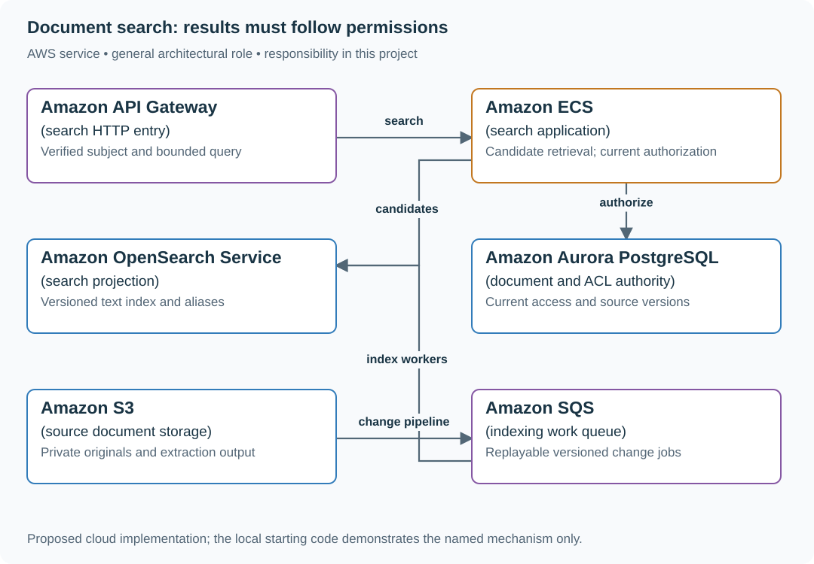

# Search documents without leaking revoked content

## Application background

Employees search a company document portal. A search index holds derived text and snippets; the document's current access policy remains authoritative.

This is a fictional engineering scenario. The workload figures later in the page are exercise assumptions, not measured production traffic.

## Your assignment

**Deliver:** An indexing/update pipeline and a search response path that rechecks access before returning titles, snippets or cached content.

Build search for a company document portal. Editors update content continuously, employees search across teams, and access to a sensitive document is revoked while its search hit remains indexed. Search snippets must obey current permissions.

**Required behavior:** GET /search returns at most 20 authorized hits with document IDs and source versions. Index freshness target is two minutes. The index is a projection; current authorization is checked before content or snippets are returned.

The required first milestone is a working local implementation of the behavior above. The numbered implementation steps define the scope; the cloud architecture is a later extension, not something the starter has already provisioned.

## Get the code and run the supplied example

The code is in the public [junior-to-staff repository](https://github.com/Soulful-Iris/junior-to-staff). Install Git and Python 3.12+. No AWS account or Python packages are required for this first run. If you already have a checkout, use it and skip cloning.

```bash
git clone https://github.com/Soulful-Iris/junior-to-staff.git
cd junior-to-staff
python3 examples/architecture-starts/document_search.py
```

**Supplied file:** [`examples/architecture-starts/document_search.py`](https://github.com/Soulful-Iris/junior-to-staff/blob/main/examples/architecture-starts/document_search.py). You can also [read or download the source here](../../../../examples/architecture-starts/document_search.py).

This program is a **mechanism demonstration**: it runs the small scenario in one process and prints the result. It is not an HTTP service, a complete application, or an AWS deployment. A successful run demonstrates this mechanism only; it does not establish the workload or failure guarantees of the application you will build.

**Example output from the supplied run:**

Generated IDs and timestamps may differ; compare the state transitions and outcomes.

```text
[{'id': 'public', 'snippet': 'Engineering handbook'}]
```

### Set up your implementation workspace

Create `work/document-search/` in your checkout (or use a separate repository). Copy the supplied mechanism into that directory as `mechanism.py`, then extract its state transitions into functions you can call from your implementation. The record and module names below describe what you must implement; they are not a promise that files with those names already exist. Keep a `README.md` beside your implementation with its exact run commands and observed results.

## Local components and state to implement

This table names the records, interfaces or decision inputs for your deliverable. Unless a name is explicitly linked to supplied source above, it is something you create. Implement the local state transitions first, then connect the HTTP, storage or worker boundaries required by the steps.

| Record / module | Key or interface | Responsibility |
|---|---|---|
| documents | tenant,id,version,content_pointer | Source content and deletion state. |
| index_documents | tenant,id,source_version,tokens | Searchable projection with versioned updates. |
| authorization | subject,resource,policy_revision | Current decision before snippets/content leave the API. |

## Implement the assignment

### 1. Index one versioned document

Extract bounded text, normalize fields and send an upsert carrying the source version. Apply deletes as versioned tombstones. An old indexing task must not overwrite newer content or recreate a deleted document.

### 2. Build a constrained query API

Limit query length, filters, page size and execution timeout. Return a stable pagination token tied to the chosen search snapshot where supported. Keep expensive wildcard and unbounded aggregation features out of the initial public contract.

### 3. Authorize candidates before snippets

Apply tenant filters in the query as defense in depth, then verify current object access before fetching or returning snippets. Do not return a restricted title or highlight and only check permission when the user clicks. Bound overfetch and allow short pages when many candidates are denied.

### 4. Reindex without mixing generations

Build a new index from a consistent source boundary and capture subsequent changes. Compare source-version coverage, swap the read alias, and retain a rollback window. Measure indexing lag separately from query latency and relevance quality.

## Demonstrate the completed local result

| Action | Expected visible result |
|---|---|
| Run the starting program | The highest-scoring private document produces no title or snippet. |
| Deliver a stale indexing update | The newer source version remains indexed. |
| Reindex while edits continue | The new generation catches up before the alias moves. |

**Handoff:** In your implementation README, include the start command, one successful operation, the failure case above and the resulting stored state or decision. State which dependencies are simulated. Someone with a fresh checkout should be able to reproduce this without your chat history.

## Workload assumptions and capacity decisions

These are constructed exercise assumptions. The stated workload is a design target; the local demonstration does not establish that throughput. Use the [estimation constants](../../../01-code/01-problem-solving/estimation-constants.md) to check units before choosing capacity.

| Input or objective | Calculation / consequence |
|---|---|
| 30 million documents; 15,000 updates/minute | 250 source changes/s average, plus reindexing and deletes. |
| 3,000 queries/s × 20 returned hits | At least 60,000 hit-level authorization decisions/s before overfetch; batch and cache policy carefully. |
| Two-minute freshness | Track source-to-index lag and expose stale results; revocation cannot wait for that freshness window. |

## Map the local implementation to AWS

**Deployment status: local only.** Running the supplied command creates no AWS resources and configures no cloud connections. The diagram is a proposed deployment of the completed application. Each box needs either a deployed runtime, a provisioned service or an explicitly external dependency.

Read the diagram by following the arrows from the entry point: application code accepts the request or event, the state owner commits it, and any worker produces the later result. The table ties those roles to code and adapter work. Multiple boxes do not imply multiple Python files already exist.



OpenSearch ranks searchable candidates. The document/ACL authority decides whether the caller can see their content. An index filter alone cannot satisfy immediate revocation when indexing is asynchronous.

| Local responsibility | Cloud destination and role | Implementation still required |
|---|---|---|
| Local HTTP boundary or the endpoint you will add | Amazon API Gateway: search HTTP entry | Create routes and an integration; translate requests and responses and configure identity validation. |
| Application or worker process | Amazon ECS: search application | Build a container and task definition; supply configuration, task roles and graceful shutdown behavior. |
| Local derived search records | Amazon OpenSearch Service: search projection | Implement indexing, updates/deletions and queries; recheck current authorization before returning sensitive results. |
| Local records and transaction boundary | Amazon Aurora PostgreSQL: document and ACL authority | Write PostgreSQL schema/migrations and a database adapter; configure credentials, connection limits and recovery. |
| Local file, object fixture or exported payload | Amazon S3: source document storage | Implement upload/download and metadata adapters, scoped access, object naming, retention and incomplete-upload cleanup. |
| Local pending-work collection | Amazon SQS: indexing work queue | Publish committed job intent, consume messages and persist deduplication/ownership state; add visibility, retry and dead-letter handling. |

### Provision resources, then connect the application

| Resource or boundary | Initial configuration and reason |
|---|---|
| OpenSearch | Choose shard/replica layout from indexed bytes and query measurements; use a separate generation for reindexing. |
| Index workers | Bound document size and extraction time; quarantine malformed files without blocking the queue. |
| Authorization | Cache policy only within an explicit revocation bound; keep private responses out of shared caches. |

Use one disposable AWS environment for the cloud exercise. Put the named resources in `infra/template.yaml` or your existing IaC tool, pass resource IDs through configuration, and scope each runtime role to its own tables, buckets and queues. The diagram is a design to implement; it is not a claim that these resources have been deployed. Record the commands you used to deploy and remove the exercise resources.

For concrete provisioning commands, configuration wiring and cleanup, use the [AWS foundation guide](../../../../examples/architecture-starts/infra/README.md). It includes a deployable table/queue/object-storage foundation and explains which application and service adapters you still implement.

A provisioned queue or table does not make the local program use it. Configure resource IDs in the deployed runtime, replace the local adapter, and replay the same successful and failing operation against that runtime. Record the deployed commit and observable result, then remove the disposable resources using your infrastructure tool.

## Extend the design after the baseline works


Add semantic retrieval. Keep the same authorization boundary for vector candidates and source chunks; embeddings are not a substitute for tenant isolation or revocation.

<details>
<summary>Additional design cases, alternatives and original source notes</summary>


Assume 30 million documents, 15,000 updates/minute, and 3,000 search requests/s. Return title, snippet, and source link for the top 20. Choose whether the two-minute freshness target includes failures and define how you observe it.

| Situation | Visible result |
|---|---|
| New authorized document written at 12:00 | Searchable by 12:02 or explicit ingestion SLA breach |
| Alice's permission removed at 12:00 | No Alice-visible hit or snippet at 12:01, including cached pages |
| Indexer sees same update twice | One current document version in results |
| ACL store unavailable | Do not silently return private snippets with stale permission |

## Give each copy a job

The source store owns document content and version; an index owns searchable tokens and perhaps embeddings; an authorization source owns current read rights. Updates flow through a durable change stream and idempotent versioned indexing. A keyword index retrieves exact terms; semantic/vector retrieval helps with paraphrases but changes ranking and cost. Merge candidates and rank them after checking authorization for **each result before exposing title or snippet**. Index-time ACL filtering alone can leave a revocation gap. Cache keys may include document/ACL versions, but those versions must come from
trusted current permission state. A stale index or caller-supplied version cannot
select a formerly authorized cache entry. Revalidate membership and object read
permission before returning any cached title, snippet or content.

The search index can be two minutes behind and still meet its freshness target. The authorization check has the stricter one-minute revocation rule. This baseline uses a current authoritative permission check on every response;
if it cannot complete, return unavailable and no private titles/snippets. An
alternative permission cache must keep its entire staleness budget below one
minute, including propagation and clock uncertainty—not just set a 60-second TTL.
Route direct downloads and exports through the same check, or explicitly bound
existing bearer URLs by their enforced expiry. Pause indexing, warm every route,
revoke at 12:00 with index updates **and invalidation delivery paused**, and verify
the 12:01 promise independently of search freshness. This prevents new disclosure;
it cannot recall a snippet or download already delivered to a client.

## Put the AWS names on the boxes

**Why these boxes, and what changes the choice:** OpenSearch finds candidates, not permission; DynamoDB or Aurora holds current ACL under the chosen data model. ECS checks it before titles or snippets. Bedrock Knowledge Bases can manage retrieval, but the independent live permission check remains.


**Senior follow-up:** A backfill is 90% complete and new changes continue arriving. Define snapshot watermark, catch-up stream, version comparisons, cutover gates, and rollback. Measure ingestion age separately from query latency.

**Staff follow-up:** A legal deletion request covers two Regions, search index, vector index, result cache, and backups. Enumerate ownership and retention exceptions; do not claim delete is instant while replicas or signed artifacts remain. Demonstrate a revocation drill with an indexer paused.

**Practice artifact:** Source/index/ACL box diagram, edit-and-revoke timeline, freshness watermark definition, and three negative authorization tests. Explain which property is eventually consistent and which is enforced on every read.

**AWS translation:** S3/RDS/DynamoDB for source data per access pattern, event stream for changes, OpenSearch for text/vector candidates, and a separate authoritative permission decision. Technology choice does not replace read-time access checks.

**Evidence:** [Meta engineering, April 2026](https://engineering.fb.com/2026/04/21/ml-applications/modernizing-the-facebook-groups-search-to-unlock-the-power-of-community-knowledge/) describes hybrid retrieval and evaluation. This exercise's permission contract and numbers are invented; it does not claim to reproduce Meta's implementation.

</details>
