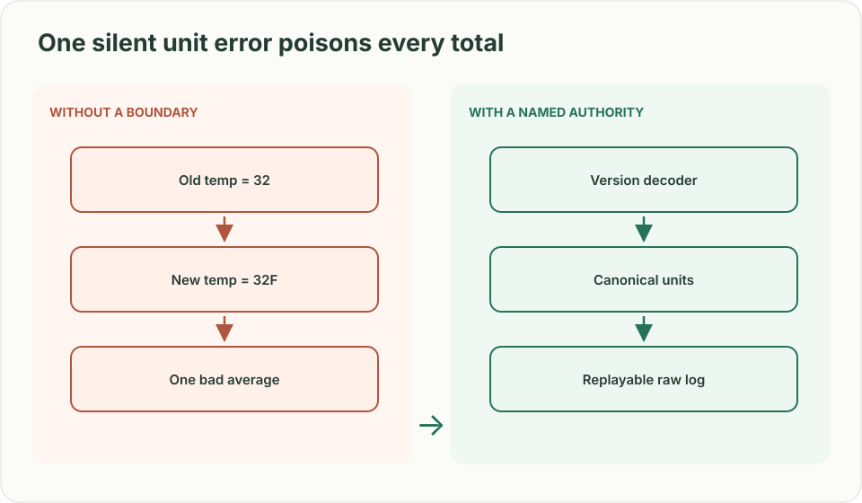
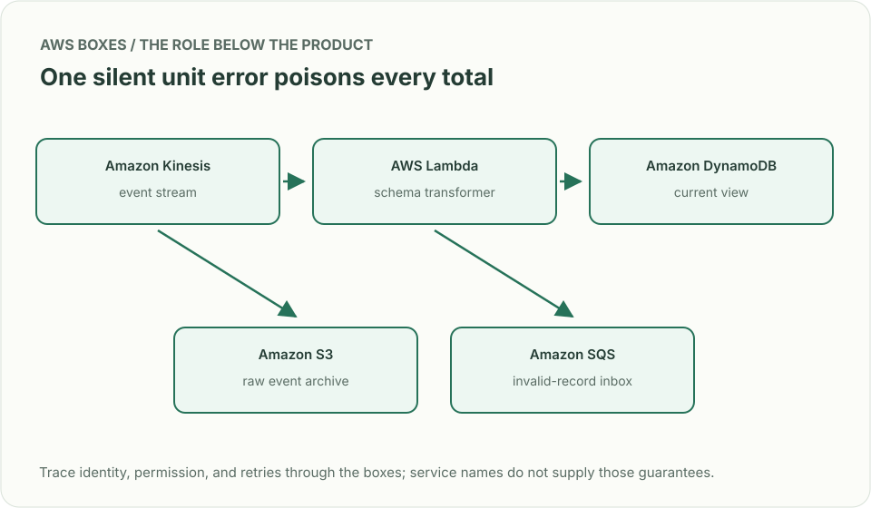
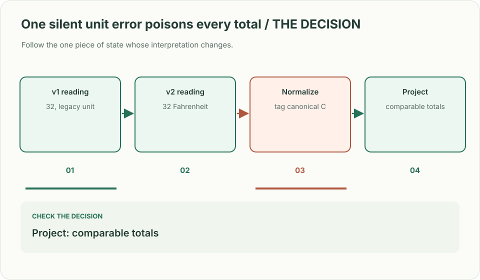

# Event ingestion: change a schema without losing yesterday

> **Interviewer:** “Ten thousand devices send readings. New firmware adds a temperature unit, while old devices keep sending the old shape for months. A dashboard needs recent totals, but analysts need a replayable source. Design the ingestion path.”

**Your contract.** Assume 100,000 events/s during bursts, seven-day stream retention for the exercise, and an immutable long-term raw store. Say whether clients have clocks you trust; the answer changes event-time semantics. This is an original practice prompt.

| Input | Expected behavior |
|---|---|
| Old reading `temp=32` without unit | Decode as old schema version using explicitly documented unit |
| New reading `temp=32, unit=F` | Normalize using versioned schema; don't silently mix F and C |
| Device retries event `e4` | Dedupe by device/event ID within declared window; replay remains safe |
| Event arrives 9 minutes late | Raw event retained; dashboard revision follows chosen watermark and correction policy |

## Preserve the record before its projections

Assign producer ID, event ID, schema version, and both event and receipt times. Validate envelopes at ingress; quarantine undecodable records instead of losing them. Store immutable raw events for replay, then run separately versioned normalization and aggregation consumers. Partition by a key that distributes load without losing the ordering you actually need (typically per device). A stream preserves order within a shard, not a global order. Changing a schema means a decoder strategy and backward/forward compatibility tests, not just adding a column.

| AWS box | Job here | Alternative and deciding factor |
|---|---|---|
| Amazon Kinesis Data Streams (event stream) | Buffer and replay ordered per-shard events during retention | Amazon MSK (managed Kafka) when the ecosystem or partition control requires Kafka |
| Amazon S3 (raw archive) | Retain immutable event bytes beyond stream retention | Long-retention Kafka tier if replay and operational trade-offs warrant it |
| AWS Lambda (transform worker) | Validate versions, normalize, and quarantine bad records | Amazon ECS for heavy sustained compute or custom batching |
| Amazon DynamoDB (materialized view) | Serve latest per-device or window state through key lookups | Amazon Timestream for time-series queries with its own data model |
| Amazon SQS (quarantine queue) | Hold parse failures for investigation and repair | S3 error prefix for bulk triage when individual queue actions aren't useful |

On-demand Kinesis scaling does not automatically isolate a single hot partition key; choose device partitions and estimate the hottest device and aggregate separately. Reprocessing the archive must use idempotent output versioning to avoid doubles.

**Senior follow-up:** An old firmware bug sends wrong units for a week. Recompute one week's dashboard without hiding production freshness; distinguish corrected totals and previously displayed totals.

**Staff follow-up:** Different regions use different retention rules and models. Define schema ownership, quality gates, replay budgets, and evidence that migrations preserved counts.

**Practice artifact:** Draw raw vs derived stores; walk the four inputs; define an envelope and one compatibility test. State the exact partition key and its hot-key risk.

**Source boundary:** Original scenario inspired by [Meta's May 2026 ingestion migration account](https://engineering.fb.com/2026/05/12/data-infrastructure/migrating-data-ingestion-systems-at-meta-scale/), not a reported interview prompt. [Kinesis sizing documentation](https://docs.aws.amazon.com/streams/latest/dev/how-do-i-size-a-stream.html) supplies a current service constraint.
