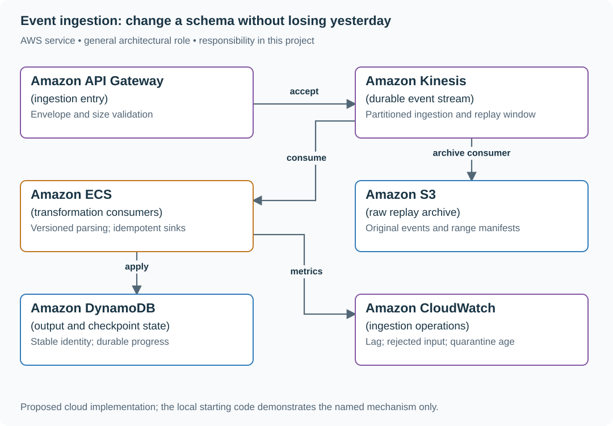

# Ingest events with durable acceptance and replay

## Application background

Devices send measurements such as temperature and battery level. Your service accepts each message, stores the original input and later transforms it into data analysts can query. The transformation may be corrected after events have already arrived.

A device that does not receive confirmation may resend the same event. Another device may send malformed data. Neither case should cause accepted, usable events to disappear or make the whole processing stream stop.

### Example walkthrough

| Action | Expected behavior |
|---|---|
| Device D7 sends event `e-41` twice | Recognize the repeated identity under the declared duplicate policy. |
| Event `e-42` contains an invalid measurement | Retain enough evidence to inspect it and separate it from valid processing. |
| The transformation is fixed | Process the retained original input again. |

Replay means processing stored input again. A checkpoint records how far a processor has reached so a restart or replay has a known starting position.

### Sizing that affects this decision

A burst of 100,000 events/s at 1 KiB each carries about 97.7 MiB/s of raw input. If that rate were sustained all day, it would be about 8.85 TB/day in decimal units. Seven days of replay input would be about 62 TB before compression or replication. State the burst duration rather than automatically budgeting a whole day at peak.

These are exercise assumptions. The [estimation reference](../../../01-code/01-problem-solving/estimation-constants.md) explains the units and approximations. They do not establish the local demo's measured capacity.

## Your assignment

**Deliver:** Build event acceptance, retained original input, repeated-event handling and a replay command. Keep invalid events available for investigation without stopping unrelated work.

**Required behavior:** POST /events accepts a versioned envelope and stable producer/event identity. A success means durable acceptance under the stated storage policy. Invalid schemas are rejected or quarantined with a reason. They must not block unrelated partitions forever.

The required first milestone is a working local implementation of the behavior above. The numbered implementation steps define the scope. The cloud architecture is a later extension, not something the starter has already provisioned.

## Get the code and run the supplied example

The code is in the public [junior-to-staff repository](https://github.com/Soulful-Iris/junior-to-staff). Install Git and Python 3.12+. No AWS account or Python packages are required for this first run. If you already have a checkout, use it and skip cloning.

```bash
git clone https://github.com/Soulful-Iris/junior-to-staff.git
cd junior-to-staff
python3 examples/architecture-starts/event_ingestion.py
```

**Supplied file:** [`examples/architecture-starts/event_ingestion.py`](https://github.com/Soulful-Iris/junior-to-staff/blob/main/examples/architecture-starts/event_ingestion.py). You can also [read or download the source here](../../../../examples/architecture-starts/event_ingestion.py).

This program is a **mechanism demonstration**: it runs the small scenario in one process and prints the result. It is not an HTTP service, a complete application, or an AWS deployment. A successful run demonstrates this mechanism only. It does not establish the workload or failure guarantees of the application you will build.

**Example output from the supplied run:**

Generated IDs and timestamps may differ. Compare the state transitions and outcomes.

```text
Applied: [7] quarantine: [({'id': 'e2', 'version': 99, 'value': 8}, 'unsupported schema')]
```

### Set up your implementation workspace

Create `work/event-ingestion/` in your checkout (or use a separate repository). Copy the supplied mechanism into that directory as `mechanism.py`, then extract its state transitions into functions you can call from your implementation. The record and module names below describe what you must implement. They are not a promise that files with those names already exist. Keep a `README.md` beside your implementation with its exact run commands and observed results.

## Local components and state to implement

This table names the records, interfaces or decision inputs for your deliverable. Unless a name is explicitly linked to supplied source above, it is something you create. Implement the local state transitions first, then connect the HTTP, storage or worker boundaries required by the steps.

| Record / module | Key or interface | Responsibility |
|---|---|---|
| envelope | producer_id,event_id,schema_version,event_time | Stable identity and interpretation contract. |
| raw_objects | partition,time_range,checksum | Durable original bytes and replay manifest. |
| consumer_checkpoint | consumer,partition,offset | Progress coupled to durable output or replay-safe application. |

## Implement the assignment

### 1. Define durable acceptance

Validate envelope size and required identity before writing. Document whether success means the stream accepted the event or the archive contains it. If the producer retries, preserve its event ID. An HTTP request ID generated anew on every attempt cannot deduplicate the logical event.

### 2. Archive replayable input

Write original records into immutable objects with schema/version metadata and a manifest of partition ranges. Keep invalid-but-accepted records in a restricted quarantine with a reason. Preserve enough evidence to distinguish absent input from failed processing.

### 3. Couple output and progress

Process a bounded batch, commit output idempotently, then advance the checkpoint. A crash after output but before checkpoint causes replay, so the sink must reject duplicate event identities or apply deterministic versioned updates. Do not skip a poison record silently.

### 4. Replay into a new generation

Run corrected transformations into separate output tables/prefixes, compare counts and representative records, then move a versioned read pointer. Keep the original consumer checkpoint unchanged so replay cannot accidentally rewind live processing.

## Demonstrate the completed local result

| Action | Expected visible result |
|---|---|
| Run the starting program | e1 is applied once. Unsupported e2 is quarantined. |
| Crash after writing a batch | Replay leaves one logical output per identity. |
| Replay seven-day input | New output generation can be inspected before switching readers. |

**Handoff:** In your implementation README, include the start command, one successful operation, the failure case above and the resulting stored state or decision. State which dependencies are simulated. Someone with a fresh checkout should be able to reproduce this without your chat history.

## Workload assumptions and capacity decisions

These are constructed exercise assumptions. The stated workload is a design target. The local demonstration does not establish that throughput. Use the [estimation constants](../../../01-code/01-problem-solving/estimation-constants.md) to check units before choosing capacity.

| Input or objective | Calculation / consequence |
|---|---|
| 100,000 events/s burst. 1 KiB/event assumption | About 100 MiB/s and 8.85 TB/day decimal if sustained. Peak duration changes the bill. |
| Seven-day replay retention | Roughly 62 TB raw at that sustained rate, before compression/replication. |
| Processing target: 30 seconds behind | Track oldest event age and partition lag, not just consumer process health. |

## Map the local implementation to AWS

**Deployment status: local only.** Running the supplied command creates no AWS resources and configures no cloud connections. The diagram is a proposed deployment of the completed application. Each box needs either a deployed runtime, a provisioned service or an explicitly external dependency.

Read the diagram by following the arrows from the entry point: application code accepts the request or event, the state owner commits it, and any worker produces the later result. The table ties those roles to code and adapter work. Multiple boxes do not imply multiple Python files already exist.



Kinesis provides a transport and retention window. Replay-safe outputs and checkpoints are still application responsibilities. S3 retains the input needed to rebuild a new processing generation.

| Local responsibility | Cloud destination and role | Implementation still required |
|---|---|---|
| Local HTTP boundary or the endpoint you will add | Amazon API Gateway: ingestion entry | Create routes and an integration. Translate requests and responses and configure identity validation. |
| Local event sequence or input stream | Amazon Kinesis: durable event stream | Implement producer/consumer adapters, partition keys, durable acceptance and checkpoint/replay behavior. |
| Application or worker process | Amazon ECS: transformation consumers | Build a container and task definition. Supply configuration, task roles and graceful shutdown behavior. |
| Local file, object fixture or exported payload | Amazon S3: raw replay archive | Implement upload/download and metadata adapters, scoped access, object naming, retention and incomplete-upload cleanup. |
| Local dictionary, SQLite records or state model | Amazon DynamoDB: output and checkpoint state | Design partition/sort keys and write a storage adapter with conditional updates or transactions. Python state and SQL are not uploaded as a database. |
| Local counters, timestamps and diagnostic output | Amazon CloudWatch: ingestion operations | Emit bounded metrics and logs, build the named operational view and configure retention and access. |

### Provision resources, then connect the application

| Resource or boundary | Initial configuration and reason |
|---|---|
| Stream capacity | Calculate from both records/s and bytes/s, review current account limits and hot partition keys. |
| Archive retention | Seven-day exercise retention with lifecycle rules. Restrict raw data and quarantine readers. |
| Consumer limits | Bound batch bytes and execution time. Alarms identify stalled partitions rather than averaging them away. |

Use one disposable AWS environment for the cloud exercise. Put the named resources in `infra/template.yaml` or your existing IaC tool, pass resource IDs through configuration, and scope each runtime role to its own tables, buckets and queues. The diagram is a design to implement. It is not a claim that these resources have been deployed. Record the commands you used to deploy and remove the exercise resources.

For concrete provisioning commands, configuration wiring and cleanup, use the [AWS foundation guide](../../../../examples/architecture-starts/infra/README.md). It includes a deployable table/queue/object-storage foundation and explains which application and service adapters you still implement.

A provisioned queue or table does not make the local program use it. Configure resource IDs in the deployed runtime, replace the local adapter, and replay the same successful and failing operation against that runtime. Record the deployed commit and observable result, then remove the disposable resources using your infrastructure tool.

## Extend the design after the baseline works


Change an event field from cents to decimal currency. Introduce an explicit schema version and conversion rule. Identical field names do not make historical data semantically compatible.

<details>
<summary>Additional design cases, alternatives and original source notes</summary>


**Your contract.** Assume 100,000 events/s during bursts, seven-day stream retention for the exercise, and an immutable long-term raw store. Say whether clients have clocks you trust. The answer changes event-time semantics. This is an original practice prompt.

| Input | Expected behavior |
|---|---|
| Old reading `temp=32` without unit | Decode as old schema version using explicitly documented unit |
| New reading `temp=32, unit=F` | Normalize using versioned schema. Don't silently mix F and C |
| Device retries event `e4` | Dedupe by device/event ID within declared window. Replay remains safe |
| Event arrives 9 minutes late | Raw event retained. Dashboard revision follows chosen watermark and correction policy |

## Preserve the record before its projections

Assign producer ID, event ID, schema version, and both event and receipt times. Validate envelopes at ingress. Quarantine undecodable records instead of losing them. Store immutable raw events for replay, then run separately versioned normalization and aggregation consumers. Partition by a key that distributes load without losing the ordering you actually need (typically per device). A stream preserves order within a shard, not a global order. Changing a schema means a decoder strategy and backward/forward compatibility tests, not just adding a column.

| AWS box | Job here | Alternative and deciding factor |
|---|---|---|
| Amazon Kinesis Data Streams (event stream) | Buffer and replay ordered per-shard events during retention | Amazon MSK (managed Kafka) when the ecosystem or partition control requires Kafka |
| Amazon S3 (raw archive) | Retain immutable event bytes beyond stream retention | Long-retention Kafka tier if replay and operational trade-offs warrant it |
| AWS Lambda (transform worker) | Validate versions, normalize, and quarantine bad records | Amazon ECS for heavy sustained compute or custom batching |
| Amazon DynamoDB (materialized view) | Serve latest per-device or window state through key lookups | Amazon Timestream for time-series queries with its own data model |
| Amazon SQS (quarantine queue) | Hold parse failures for investigation and repair | S3 error prefix for bulk triage when individual queue actions aren't useful |

On-demand Kinesis scaling does not automatically isolate a single hot partition key. Choose device partitions and estimate the hottest device and aggregate separately. Reprocessing the archive must use idempotent output versioning to avoid doubles.

**Senior follow-up:** An old firmware bug sends wrong units for a week. Recompute one week's dashboard without hiding production freshness. Distinguish corrected totals and previously displayed totals.

**Staff follow-up:** Different regions use different retention rules and models. Define schema ownership, quality gates, replay budgets, and evidence that migrations preserved counts.

**Practice artifact:** Draw raw vs derived stores. Walk the four inputs. Define an envelope and one compatibility test. State the exact partition key and its hot-key risk.

**Source boundary:** Original scenario inspired by [Meta's May 2026 ingestion migration account](https://engineering.fb.com/2026/05/12/data-infrastructure/migrating-data-ingestion-systems-at-meta-scale/), not a reported interview prompt. [Kinesis sizing documentation](https://docs.aws.amazon.com/streams/latest/dev/how-do-i-size-a-stream.html) supplies a current service constraint.

</details>
