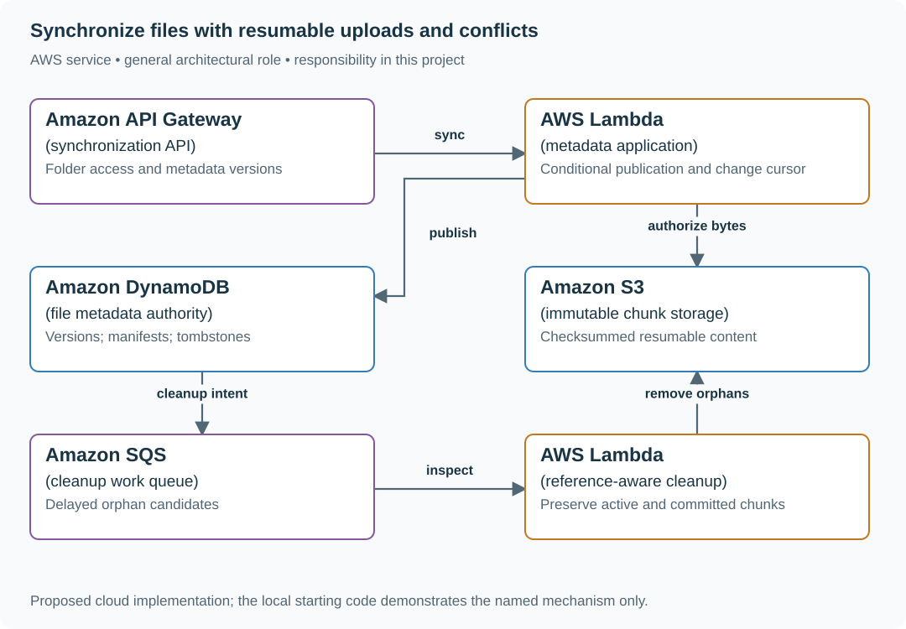
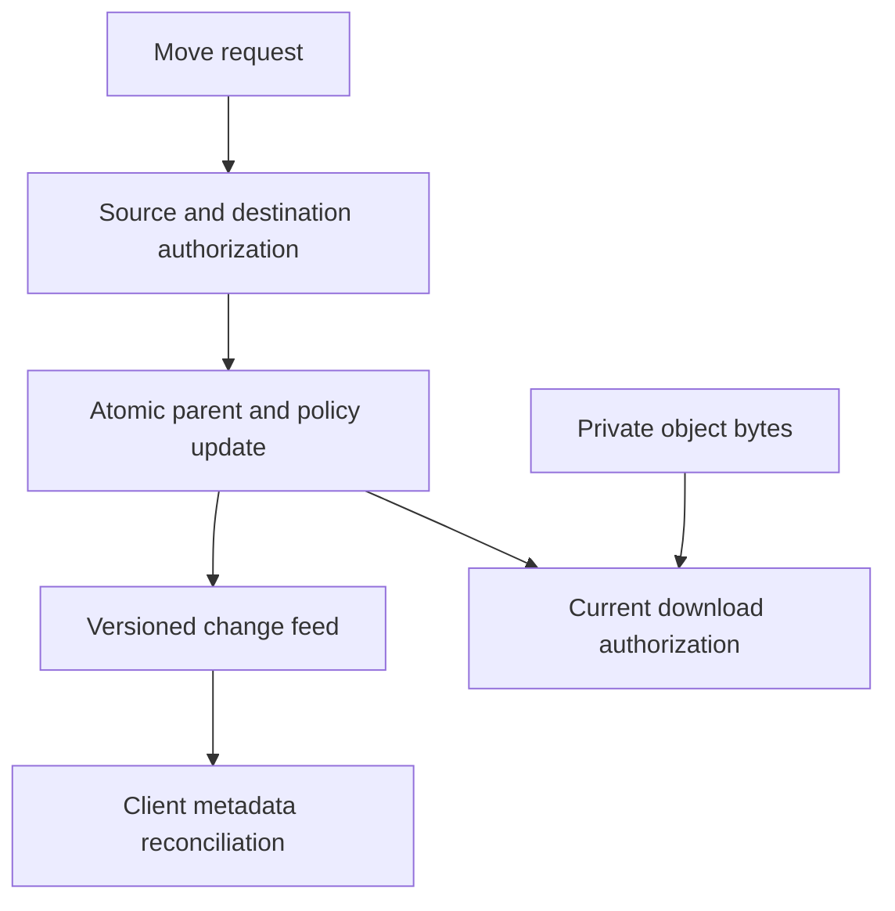

# Synchronize files with resumable uploads and conflicts

## Application background

Ana and Ben share a design folder across their laptops. Each laptop keeps local files and sends changes to a central service. If Ana edits while offline, her changes must be compared with any changes Ben made before she reconnects.

Files may be too large to upload in one uninterrupted request. Deletions also need a record so an old laptop does not mistake a missing file for something it should upload again.

### Example walkthrough

| Action | Expected behavior |
|---|---|
| Ana and Ben edit the same saved version offline | Preserve both versions or show an explicit conflict. |
| Ana's upload stops halfway | Resume the remaining content under the same upload identity. |
| An old laptop reconnects with a deleted file | Use the deletion record to prevent silent resurrection. |

A tombstone is a retained record that a file was deleted. A change cursor is a position from which a client can ask for later folder changes.

## Your assignment

**Deliver:** Build file uploads, versioned metadata and a way for clients to retrieve later changes. Preserve conflicting edits and stop old clients from recreating deleted files.

**Required behavior:** Upload immutable content, then conditionally publish a metadata version against the client’s base version. Conflicts preserve both users’ bytes for resolution. Deletions are versioned tombstones until supported offline clients can no longer replay older state.

The required first milestone is a working local implementation of the behavior above. The numbered implementation steps define the scope. The cloud architecture is a later extension, not something the starter has already provisioned.

## Get the code and run the supplied example

The code is in the public [junior-to-staff repository](https://github.com/Soulful-Iris/junior-to-staff). Install Git and Python 3.12+. No AWS account or Python packages are required for this first run. If you already have a checkout, use it and skip cloning.

```bash
git clone https://github.com/Soulful-Iris/junior-to-staff.git
cd junior-to-staff
python3 examples/architecture-starts/file_synchronization.py
```

**Supplied file:** [`examples/architecture-starts/file_synchronization.py`](https://github.com/Soulful-Iris/junior-to-staff/blob/main/examples/architecture-starts/file_synchronization.py). You can also [read or download the source here](../../../../examples/architecture-starts/file_synchronization.py).

This program is a **mechanism demonstration**: it runs the small scenario in one process and prints the result. It is not an HTTP service, a complete application, or an AWS deployment. A successful run demonstrates this mechanism only. It does not establish the workload or failure guarantees of the application you will build.

**Example output from the supplied run:**

Generated IDs and timestamps may differ. Compare the state transitions and outcomes.

```text
{'version': 4, 'manifest': 'hash-ana', 'deleted': False}
{'status': 409, 'keep_local': 'hash-ben', 'server': {'version': 4, 'manifest': 'hash-ana', 'deleted': False}}
{'status': 409, 'keep_local': 'hash-old-laptop', 'server': {'version': 5, 'manifest': None, 'deleted': True}}
```

### Set up your implementation workspace

Create `work/file-synchronization/` in your checkout (or use a separate repository). Copy the supplied mechanism into that directory as `mechanism.py`, then extract its state transitions into functions you can call from your implementation. The record and module names below describe what you must implement. They are not a promise that files with those names already exist. Keep a `README.md` beside your implementation with its exact run commands and observed results.

## Local components and state to implement

This table names the records, interfaces or decision inputs for your deliverable. Unless a name is explicitly linked to supplied source above, it is something you create. Implement the local state transitions first, then connect the HTTP, storage or worker boundaries required by the steps.

| Record / module | Key or interface | Responsibility |
|---|---|---|
| chunks | content_hash,size,object_key | Immutable bytes with verified checksum. |
| file_versions | folder,file_id,version,manifest,deleted | Authoritative metadata and conflict boundary. |
| change_cursor | folder,sequence | Ordered metadata changes for reconnect replay. |

## Implement the assignment

### 1. Upload content independently

Split files into bounded chunks, hash them and resume only missing chunks. Verify size/checksum before accepting a chunk. Uploading content does not make it visible. Orphan chunks can exist safely until metadata references them.

### 2. Publish metadata conditionally

Commit a file manifest only if the expected base version still matches. On conflict, preserve the losing local file and return current metadata. For binary documents, an explicit conflict copy is safer than pretending to merge arbitrary bytes.

### 3. Replay changes and deletions

Return bounded change pages after a folder cursor. Include rename and deletion tombstones with stable file identity. Path strings alone are ambiguous under concurrent renames. Reject stale metadata publication after a deletion generation.

### 4. Collect storage safely

Trace committed manifests and active uploads before deleting unreferenced chunks. Wait beyond the upload/retry window and respect shared references. Authorize current folder membership before metadata reads or chunk downloads.

## Demonstrate the completed local result

| Action | Expected visible result |
|---|---|
| Run the starting program | Ana publishes. Ben keeps a conflict. The old laptop cannot overwrite a later deletion. |
| Stop after half the chunks | Resume only missing chunks. The old visible file stays intact. |
| Remove a folder member | New metadata reads and download authorizations are denied. |

**Handoff:** In your implementation README, include the start command, one successful operation, the failure case above and the resulting stored state or decision. State which dependencies are simulated. Someone with a fresh checkout should be able to reproduce this without your chat history.

## Workload assumptions and capacity decisions

These are constructed exercise assumptions. The stated workload is a design target. The local demonstration does not establish that throughput. Use the [estimation constants](../../../01-code/01-problem-solving/estimation-constants.md) to check units before choosing capacity.

| Input or objective | Calculation / consequence |
|---|---|
| 100,000 daily users × 10 MB uploaded/day | About 1 TB/day of new upload traffic before deduplication and replicas. |
| 4 MiB chunk size assumption | A 100 MiB file has 25 chunks. Resume transfers by missing chunk hash. |
| Thirty-day offline support assumption | Tombstone/change-log retention must cover that horizon or require a full resynchronization. |

## Map the local implementation to AWS

**Deployment status: local only.** Running the supplied command creates no AWS resources and configures no cloud connections. The diagram is a proposed deployment of the completed application. Each box needs either a deployed runtime, a provisioned service or an explicitly external dependency.

Read the diagram by following the arrows from the entry point: application code accepts the request or event, the state owner commits it, and any worker produces the later result. The table ties those roles to code and adapter work. Multiple boxes do not imply multiple Python files already exist.



S3 holds immutable bytes. DynamoDB decides which manifest is current. That split allows interrupted uploads and conflicting edits without exposing partial files or overwriting the winner’s bytes.

| Local responsibility | Cloud destination and role | Implementation still required |
|---|---|---|
| Local HTTP boundary or the endpoint you will add | Amazon API Gateway: synchronization API | Create routes and an integration. Translate requests and responses and configure identity validation. |
| Python operation or worker function | AWS Lambda: metadata application | Write a Lambda event adapter, package its dependencies and give its role only the required resource actions. |
| Local dictionary, SQLite records or state model | Amazon DynamoDB: file metadata authority | Design partition/sort keys and write a storage adapter with conditional updates or transactions. Python state and SQL are not uploaded as a database. |
| Local file, object fixture or exported payload | Amazon S3: immutable chunk storage | Implement upload/download and metadata adapters, scoped access, object naming, retention and incomplete-upload cleanup. |
| Local pending-work collection | Amazon SQS: cleanup work queue | Publish committed job intent, consume messages and persist deduplication/ownership state. Add visibility, retry and dead-letter handling. |
| Python operation or worker function | AWS Lambda: reference-aware cleanup | Write a Lambda event adapter, package its dependencies and give its role only the required resource actions. |

### Provision resources, then connect the application

| Resource or boundary | Initial configuration and reason |
|---|---|
| S3 | Private objects, scoped upload/download authorization and checksum validation. No user-controlled unrestricted key access. |
| Metadata | Conditional version writes and durable cursor ordering. Retention tied to offline support. |
| Cleanup | Separate role with narrowly scoped deletion rights. Require reference checks and a safe age threshold. |

Use one disposable AWS environment for the cloud exercise. Put the named resources in `infra/template.yaml` or your existing IaC tool, pass resource IDs through configuration, and scope each runtime role to its own tables, buckets and queues. The diagram is a design to implement. It is not a claim that these resources have been deployed. Record the commands you used to deploy and remove the exercise resources.

For concrete provisioning commands, configuration wiring and cleanup, use the [AWS foundation guide](../../../../examples/architecture-starts/infra/README.md). It includes a deployable table/queue/object-storage foundation and explains which application and service adapters you still implement.

A provisioned queue or table does not make the local program use it. Configure resource IDs in the deployed runtime, replace the local adapter, and replay the same successful and failing operation against that runtime. Record the deployed commit and observable result, then remove the disposable resources using your infrastructure tool.

## Extend the design after the baseline works
### Worked follow-up: Move a file between folders with different permissions

Copying bytes and deleting the old entry can leave two visible names or preserve a link that was authorized under the old folder. Object identity, metadata version and download authority need separate treatment.

| Starting design | Changed requirement |
|---|---|
| A file version has one parent folder and access policy. | A move changes its parent and the policy that authorizes future downloads. |

**Revised architecture.** Follow the changed responsibility and failure path below. This is a design to implement. The supplied local example does not provision these components.



**What to implement.** For folders in one metadata store, atomically change parent, metadata version and policy reference after checking permission on both source and destination. Emit one versioned change-feed event for clients. Bytes can stay under the same private object identity. Recheck current metadata for each authorized download, or state the residual lifetime of already issued signed URLs. An offline client with expired feed history must resnapshot without losing its unsynced drafts.

**Walk through the result.** Move file F from a public team folder into a private folder. A stale client submits an edit using the old metadata version and receives a conflict. A new download through the old path is denied. Keep the old signed-link lifetime visible if you chose that weaker contract. Supply the move transaction and client reconciliation example.


Add cross-folder moves with different permissions. Define the atomic metadata boundary and ensure old download authorization does not silently grant access under the destination’s policy.

<details>
<summary>Additional design cases, alternatives and original source notes</summary>

[Curriculum](../../../README.md) · [Data systems at scale](../README.md)

All prompts here are constructed practice, without company attribution.

> **Candidate opening:** “Ana uploads a file from two devices, both based on
metadata version 3. Large uploads tie up API capacity, and one device misses a
week of changes. Preserve version authority and show how it recovers.”

| Input | Expected behavior | Scope |
|---|---|---|
| Two finalize requests expecting v3 | One becomes v4, one conflicts | Bytes uploaded does not imply metadata accepted |
| Abandoned upload | Never becomes a ready file. Eventually cleaned | Cleanup has an owner and retention bound |
| Device cursor predates retained feed | Resnapshot plus new checkpoint | Cannot resume from a missing history gap |

Prerequisites: [object upload lab](../../../03-production/03-infrastructure/aws/lab-2-upload.md), transactions and
versions. This is a build brief: deliver server-owned upload sessions, verified
conditional finalization, then change-feed recovery. The upload script demonstrates
only bytes. It does not claim to implement this entire sync application.

First separate byte transport from metadata authority. Next put ownership and
expected version in the upload session, validate the object at finalization,
then make the change record durable with the metadata transition.

<details>
<summary>Worked approach and AWS mapping — open after your attempt</summary>

**Prompt:** upload files, list folders, download, and propagate edits across devices. Assume 100,000 daily uploaders × 10 MB/day = about 1 TB/day of new payload. Metadata operations and bytes are separate capacity dimensions. Start with versioned files. Exclude collaborative character-level editing.

API issues an upload session containing object key, expected version, and short-lived upload capability. Browser uploads bytes directly to object storage. Finalization checks the object and conditionally updates metadata. Store file id, owner, parent id, object version/key, checksum, size, and metadata version. Upload completion and application visibility are separate transitions.

**AWS mapping:** S3 for bytes, API Gateway/Lambda for metadata, DynamoDB or RDS for ownership and versions, SQS for asynchronous processing, CloudFront for authorized downloads where justified. S3 events can be duplicated or arrive out of order. Treat them as triggers to validate state, not unquestionable proof of the newest version.

**Before/after:** proxying large uploads through the API holds application capacity and adds a bandwidth hop. Direct upload reduces that pressure but introduces abandoned sessions, multipart cleanup, and capability security. Version conflicts need an explicit user-visible resolution policy.

**Implement:** AWS lab 2. Two clients upload from the same metadata version. **Expected:** one finalize wins. The other gets a conflict, not silent overwrite. **Senior:** resume interrupted multipart uploads and recover missed change-feed updates. **Staff:** region/data residency, account deletion, retention, and compatibility for old clients.

</details>

## Follow-up: the device's history is gone

Use the [expired-history replay fixture](../../04-migrations/labs/recovery-migration/migration.md)
to prove the server refuses incomplete catch-up. **Senior:** preserve unsynced
local drafts during a resnapshot and prove one winner for concurrent finalization.
**Lead follow-up:** a region cannot store this tenant's bytes. Route authority
according to residency and define deletion/retention across replicas and backups.
Assessor evidence distinguishes object versions, metadata versions, feed positions,
and local draft identity. A new cursor without a corresponding snapshot is not
recovery.


[Design route](../../../../indexes/system-designs.md) · [Practice rubric](../../../../practice/README.md)

</details>
