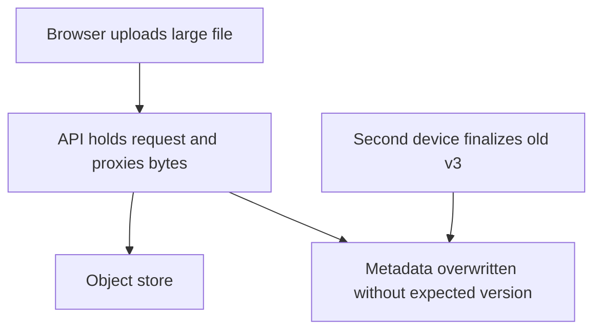
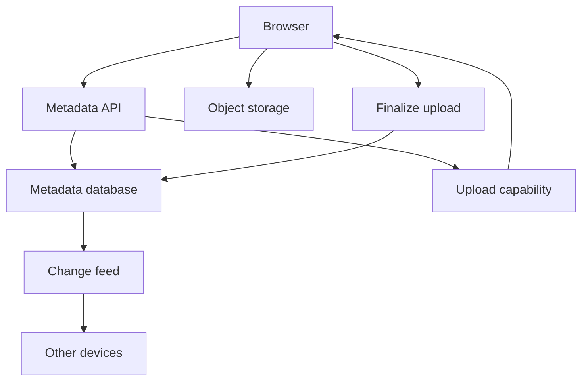
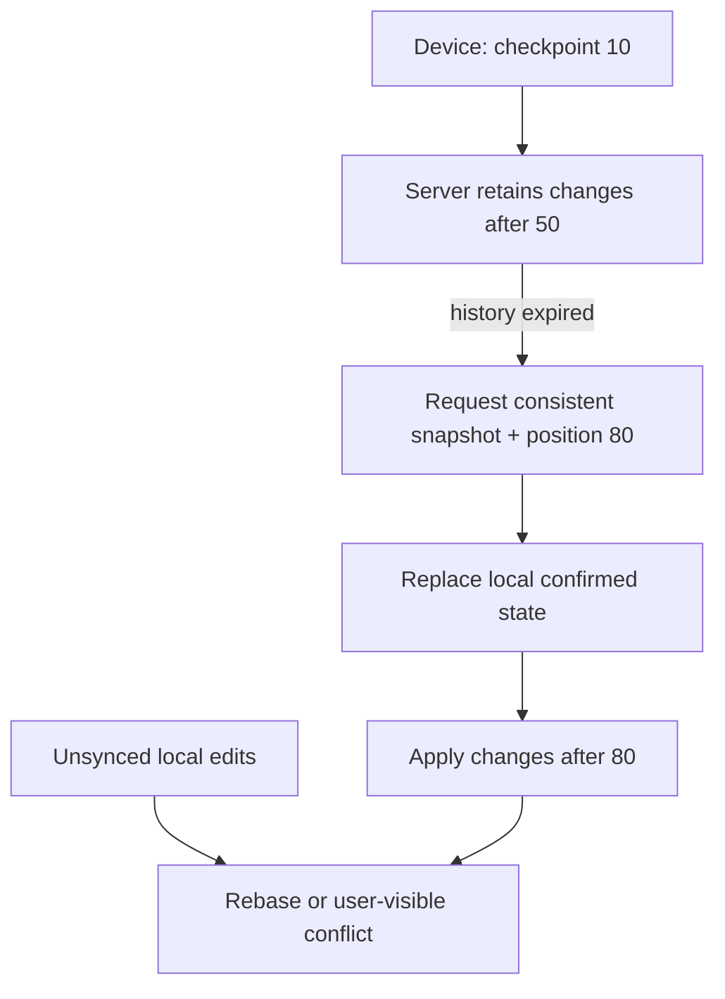

# File synchronization

[Curriculum](../../../README.md) · [Data at scale](../README.md)

All prompts here are constructed practice, without company attribution.

> **Candidate opening:** “Ana uploads a file from two devices, both based on
metadata version 3. Large uploads tie up API capacity, and one device misses a
week of changes. Preserve version authority and show how it recovers.”

| Input | Expected behavior | Scope |
|---|---|---|
| Two finalize requests expecting v3 | One becomes v4, one conflicts | Bytes uploaded does not imply metadata accepted |
| Abandoned upload | Never becomes a ready file; eventually cleaned | Cleanup has an owner and retention bound |
| Device cursor predates retained feed | Resnapshot plus new checkpoint | Cannot resume from a missing history gap |

Prerequisites: [object upload lab](../../../03-production/03-infrastructure/aws/lab-2-upload.md), transactions and
versions. This is a build brief: deliver server-owned upload sessions, verified
conditional finalization, then change-feed recovery. The upload script demonstrates
only bytes; it does not claim to implement this entire sync application.

First separate byte transport from metadata authority. Next put ownership and
expected version in the upload session, validate the object at finalization,
then make the change record durable with the metadata transition.

Worked approach and AWS mapping — open after your attempt

**Prompt:** upload files, list folders, download, and propagate edits across devices. Assume 100,000 daily uploaders × 10 MB/day = about 1 TB/day of new payload. Metadata operations and bytes are separate capacity dimensions. Start with versioned files; exclude collaborative character-level editing.

API issues an upload session containing object key, expected version, and short-lived upload capability. Browser uploads bytes directly to object storage. Finalization checks the object and conditionally updates metadata. Store file id, owner, parent id, object version/key, checksum, size, and metadata version. Upload completion and application visibility are separate transitions.

**AWS mapping:** S3 for bytes, API Gateway/Lambda for metadata, DynamoDB or RDS for ownership and versions, SQS for asynchronous processing, CloudFront for authorized downloads where justified. S3 events can be duplicated or arrive out of order; treat them as triggers to validate state, not unquestionable proof of the newest version.

**Before/after:** proxying large uploads through the API holds application capacity and adds a bandwidth hop. Direct upload reduces that pressure but introduces abandoned sessions, multipart cleanup, and capability security. Version conflicts need an explicit user-visible resolution policy.

**Implement:** AWS lab 2; two clients upload from the same metadata version. **Expected:** one finalize wins; the other gets a conflict, not silent overwrite. **Senior:** resume interrupted multipart uploads and recover missed change-feed updates. **Staff:** region/data residency, account deletion, retention, and compatibility for old clients.

## Follow-up: the device's history is gone

Use the [expired-history replay fixture](../../04-migrations/labs/recovery-migration/migration.md)
to prove the server refuses incomplete catch-up. **Senior:** preserve unsynced
local drafts during a resnapshot and prove one winner for concurrent finalization.
**Lead follow-up:** a region cannot store this tenant's bytes; route authority
according to residency and define deletion/retention across replicas and backups.
Assessor evidence distinguishes object versions, metadata versions, feed positions,
and local draft identity. A new cursor without a corresponding snapshot is not
recovery.

[Design route](../../../../indexes/system-designs.md) · [Practice rubric](../../../../practice/README.md)
