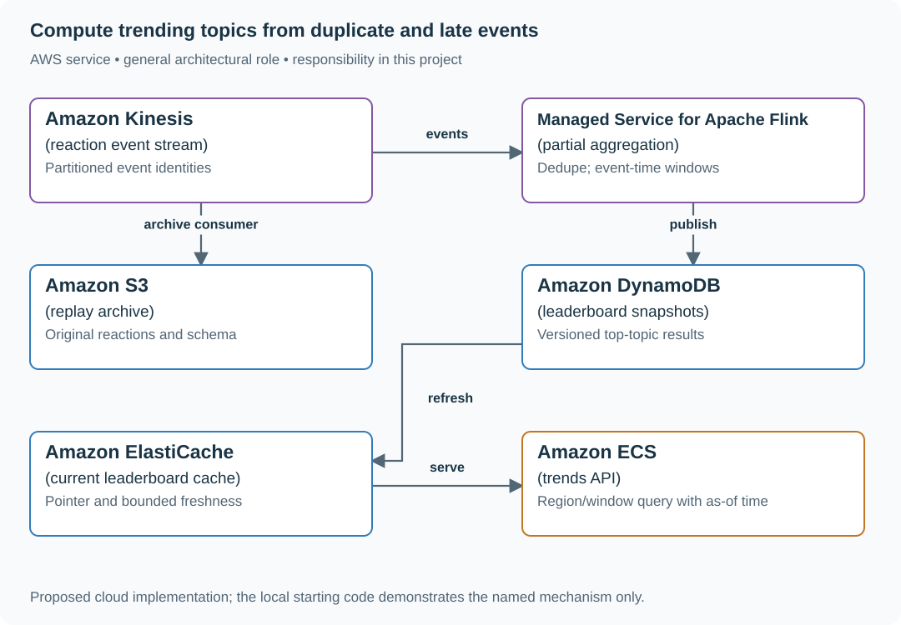
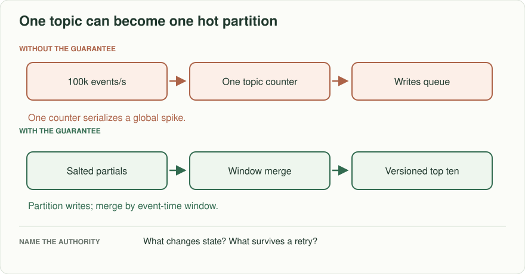
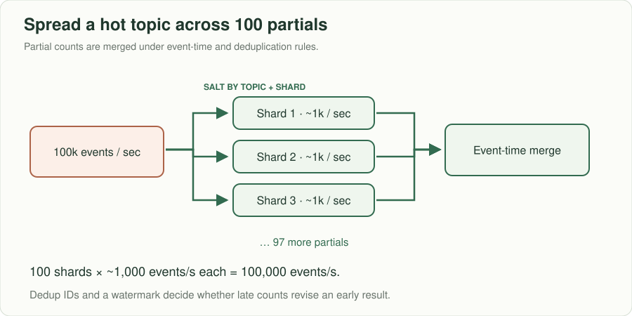
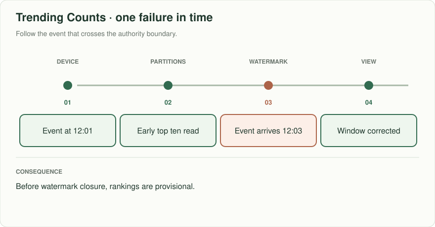
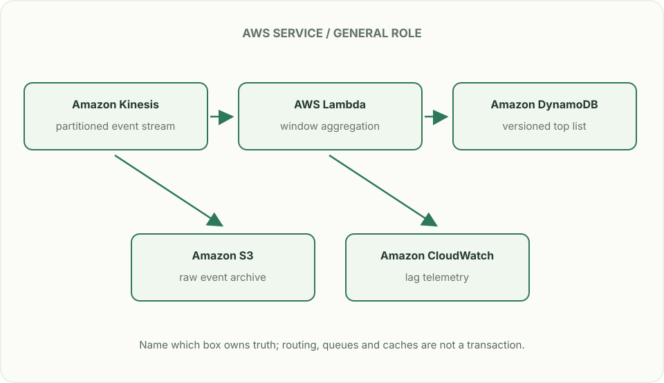

# Trending counts: the spike that breaks one partition

## What you are building

> Build the top trending topics for a live sports application. One goal causes a huge burst for a single topic. Duplicate reactions and events arriving two minutes late must not silently inflate a leaderboard presented as current.

**Working contract:** Return the top 20 topics for a named event-time window and region, with as-of time and revision. The exercise permits two minutes of lateness and targets updates within thirty seconds for timely events.

## Workload and the decisions it changes

These are constructed exercise assumptions. The large workload is a design target; the local demonstration does not establish that throughput. Use the [estimation constants](../../../01-code/01-problem-solving/estimation-constants.md) to check units before choosing capacity.

| Input or objective | Calculation / consequence |
|---|---|
| 500,000 events/s peak | At 200 bytes/event, about 100 MB/s before transport overhead. |
| Thirty-second freshness; two-minute lateness | Freshness of the current display and completeness of an older window are different properties. |
| Hot topic receives 40% of traffic | 200,000 updates/s to one logical counter requires partial aggregation rather than one database row per event. |

## Start with one working boundary

Run from the repository root with Python 3.12+:

```bash
python3 examples/architecture-starts/trending_counts.py
```

[Open the starting code](../../../../examples/architecture-starts/trending_counts.py). This is a runnable demonstration of the critical state boundary. The API, UI, cloud adapters and operating behavior below are the application you build around it.

| Record / module | Key or interface | Responsibility |
|---|---|---|
| reactions | event_id,topic,region,event_time | Stable event identity and window attribution. |
| partials | window,topic,shard,count | Distributed counts with deterministic shard placement. |
| leaderboards | region,window,revision,as_of | Published ranked snapshot; provisional/final flag. |

## AWS implementation



Partial aggregation absorbs hot-topic writes. A versioned snapshot avoids serving half of a new ranking mixed with half of an old one.

## Build it in this order

### 1. Specify what one count means

Choose event types, bot/duplicate treatment, topic normalization and region source. Define window boundaries and a deterministic tie-breaker. Store event and received times so delayed transport is not mistaken for a new reaction.

### 2. Aggregate in two stages

Assign each event to a deterministic shard, deduplicate within the supported replay horizon and compute partial counts. Merge complete partials for the exact baseline. If you later send only local top-K candidates, prove the approximation behavior rather than claiming exact global top-K.

### 3. Publish immutable leaderboard revisions

Build a complete snapshot with as-of and finality metadata, then move one serving pointer. Late accepted events create a new revision. Reject stale writers so a delayed merge cannot overwrite a newer leaderboard.

### 4. Bound overload and history

Prioritize current windows, retain enough state for the two-minute lateness rule and send older corrections to a defined path. If sampling is introduced under overload, show that mode and its error implications to the consumer.

## Infrastructure configuration

| Resource or boundary | Initial configuration and reason |
|---|---|
| Partitioning | Use event/topic shards to spread a hot topic; monitor the largest partition rather than mean utilization. |
| State retention | Retain dedupe/window state for lateness plus the replay contract; document later-event handling. |
| Serving | Cache by window and revision; keep a short current-pointer lifetime and visible as-of metadata. |

Use one disposable AWS environment for the cloud exercise. Put the named resources in `infra/template.yaml` or your existing IaC tool, pass resource IDs through configuration, and scope each runtime role to its own tables, buckets and queues. The diagram is a design to implement; it is not a claim that these resources have been deployed. Record the commands you used to deploy and remove the exercise resources.

## Observe the result

| Action | Expected visible result |
|---|---|
| Run the starting program | Duplicate e1 contributes once; goal ranks above save. |
| Deliver a valid late reaction | The affected window gets a new revision. |
| Delay an old merge result | It cannot replace the current pointer. |

## The next design decision

Limit memory with approximate heavy-hitter sketches. Specify false-positive/false-negative and count-error behavior, then decide whether the product can display an approximate ranking without misleading users.

<details>
<summary>Additional design cases, alternatives and original source notes</summary>

> **Interviewer:** “Show the ten most popular topics in the last five minutes. Most topics get a few events; a celebrity mention receives 100,000 events/s. Mobile events can arrive two minutes late and can be delivered twice. What exactly does ‘trending now’ mean?”

Assume 500,000 events/s peak globally, a 30-second refresh target, and a two-minute allowed lateness window. Specify event-time versus processing-time semantics before choosing a stream processor.

| Stream event | Expected effect |
|---|---|
| Event ID 17 delivered twice | Count once within the dedup retention policy |
| Event occurred 12:01, arrives 12:03 | Update the 12:01 event-time window if within allowed lateness |
| Event older than allowed lateness | Record late-drop or correction policy; never silently count in the current minute |
| One topic receives 100,000 events/s | Do not direct every increment to one serial counter |



## The aggregation contract

Each input has event ID, topic ID, event timestamp, and receipt timestamp. Partition hot topics into deterministic or randomly salted partial counters, then merge into windows; make the top-ten projection derived and repairable. If event IDs are deduplicated, state retention and the cost of keeping them. A watermark says when you consider an event-time window complete; early results are provisional until lateness closes. Ties need a stable topic-ID rule. A continuously changing ranking cannot promise the same top ten across two simultaneous reads without a snapshot version.



Only three of the hundred partials are drawn. The 1,000 events/s per shard is an average, not an automatic maximum; the hash/salt distribution and slowest partition still need measurement.



## Put the AWS names on the boxes



**Why these boxes, and what changes the choice:** Kinesis partitions input; a hot topic must be salted or otherwise distributed, because a hot partition key stays hot. Lambda aggregates windows or Managed Service for Apache Flink handles complex event-time work; DynamoDB serves a versioned result and S3 enables replay.

Read the smaller label under each service first: it names the architectural job. Then ask whether that service supplies the guarantee in the problem, or simply moves work to the next box.

**Senior follow-up:** One input partition goes idle while the rest advance. Explain the global watermark bottleneck and an idle-partition policy. Show what correction a user sees when #10 becomes #11 after a late event.

**Staff follow-up:** A bot floods a topic. Decide which boundary verifies identity and abuse policy; quantify the effect of revoking events already included in materialized windows. Separate a fast approximate public display from an auditable billing count if the product needs both.

**Practice artifact:** Partition/merge boxes, annotated watermark timeline, rough per-shard write rate under 100-way salting, and a test for duplicate plus late arrival.

**AWS translation:** Kinesis partitions by the chosen routing key; a single hot key can still bottleneck a shard. Use stream processing and a versioned materialized view; DynamoDB conditional aggregation on a single hot key may not absorb this rate. See the chapter's event-time windows and hot-partition cases for the mechanics.

**Evidence:** [Spotify's March 2026 Wrapped engineering post](https://engineering.atspotify.com/2026/3/inside-the-archive-2025-wrapped) discusses capacity, replay, recovery, and a high-stakes launch. These trend numbers and rules are constructed practice, not Spotify workload claims.

</details>
