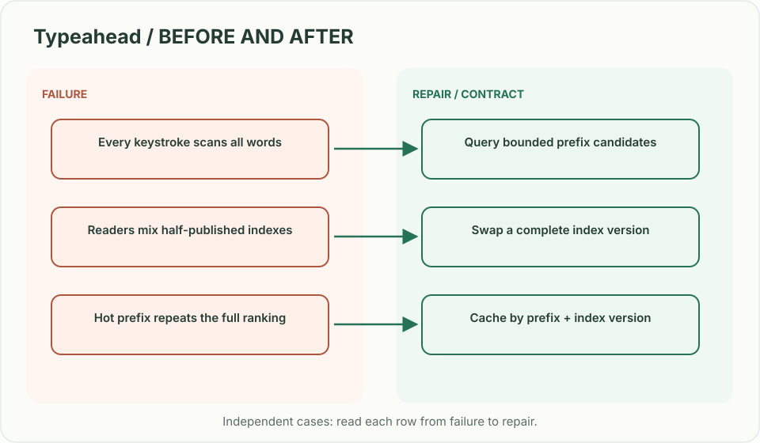
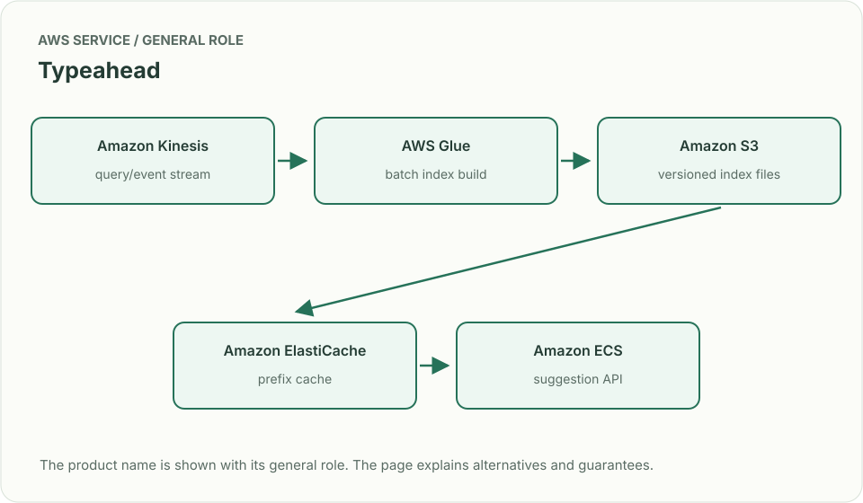
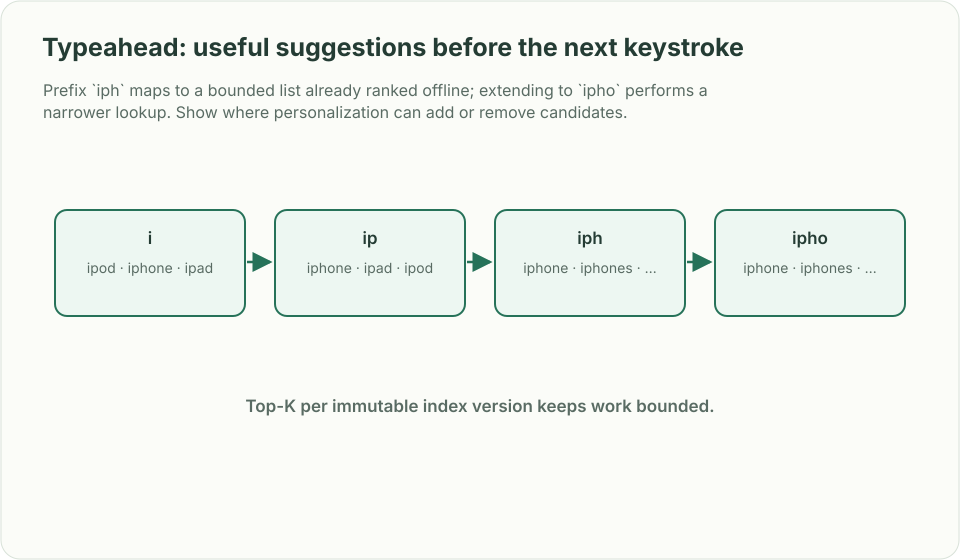

# Typeahead: useful suggestions before the next keystroke

## What you are building

> Build product-name suggestions for a storefront. The browser sends requests as a user types “iphone,” responses return out of order, and the prefix “iph” becomes extremely hot during a launch. Keep results fast and prevent an older response from replacing a newer query.

**Working contract:** GET /suggest requires at least three normalized characters and returns five suggestions from a named index version. Target p99 is 150 ms. The browser displays only the response matching its latest query generation.

## Workload and the decisions it changes

These are constructed exercise assumptions. The large workload is a design target; the local demonstration does not establish that throughput. Use the [estimation constants](../../../01-code/01-problem-solving/estimation-constants.md) to check units before choosing capacity.

| Input or objective | Calculation / consequence |
|---|---|
| 80,000 queries/s peak | Cache hot normalized prefixes and measure the largest prefix, not just average QPS. |
| Minimum three characters | Use iph as a hot-prefix example; requests for a are outside this API contract. |
| Five results/query | Precomputed bounded suggestion lists avoid scanning the entire catalog on each keystroke. |

## Start with one working boundary

Run from the repository root with Python 3.12+:

```bash
python3 examples/architecture-starts/typeahead_search.py
```

[Open the starting code](../../../../examples/architecture-starts/typeahead_search.py). This is a runnable demonstration of the critical state boundary. The API, UI, cloud adapters and operating behavior below are the application you build around it.

| Record / module | Key or interface | Responsibility |
|---|---|---|
| suggestion_index | index_version,normalized_prefix | Bounded ranked candidate list. |
| catalog_source | item_id,name,eligibility,version | Source for index generation and exclusions. |
| client_query | generation,normalized_text | Suppresses stale asynchronous responses. |

## AWS implementation


An immutable precomputed index makes the query path small and predictable. OpenSearch completion suggesters are an alternative when the catalog/query requirements fit; compare operational cost and rebuild behavior.

## Build it in this order

### 1. Define normalization and eligibility

Specify Unicode handling, case folding, whitespace and locale. Enforce the three-character minimum at both client and server. Exclude unavailable or restricted terms during index construction and define an emergency removal path.

### 2. Build an immutable index

Generate prefix-to-top-five lists or a compact trie/FST from catalog and ranking data. Write a complete version, validate its metadata and switch a pointer atomically. Keep the previous version available while instances load the new one.

### 3. Make the browser race-safe

Debounce input, cancel requests where possible and attach an increasing generation. Cancellation is an optimization; the response handler still verifies generation and query before rendering. Preserve keyboard navigation and accessible option announcements.

### 4. Serve hot prefixes predictably

Cache by normalized prefix, locale and index version. Bound query time and return an empty or recent eligible result under the documented fallback. Record server latency separately from browser debounce and network delay.

## Infrastructure configuration

| Resource or boundary | Initial configuration and reason |
|---|---|
| Cache keys | Include locale and index version; never share personalized suggestions under a global prefix key. |
| Index rollout | Publish complete artifacts before changing the active pointer; keep loading failures on the prior version. |
| API limits | Minimum/maximum query length, short deadline and bounded response size; observe p99 by cache hit/miss. |

Use one disposable AWS environment for the cloud exercise. Put the named resources in `infra/template.yaml` or your existing IaC tool, pass resource IDs through configuration, and scope each runtime role to its own tables, buckets and queues. The diagram is a design to implement; it is not a claim that these resources have been deployed. Record the commands you used to deploy and remove the exercise resources.

## Observe the result

| Action | Expected visible result |
|---|---|
| Run the starting program | The iph response displays; the older ipa response is ignored. |
| Request a two-character prefix | The API returns the documented empty/validation result. |
| Fail a new index download | The prior complete generation continues serving. |

## The next design decision

Personalize ranking while preserving a hot-prefix cache. Separate a globally eligible candidate set from a small per-user rerank, and define how private history is isolated.

<details>
<summary>Additional design cases, alternatives and original source notes</summary>

> **Interviewer:** “As a user types a query, show the top five likely completions. Popular prefixes are extremely hot; ranking data changes every few minutes.”

This is a **commonly listed system-design interview prompt** with a concrete practice contract. Assume 80,000 queries/s, 150 ms end-to-end p99, and a 3-character minimum prefix. Clarify service guarantees and a first version before filling the board with services.

| Situation | Input / condition | Expected result |
|---|---|---|
| Prefix `iph` | Millions of possible terms | Return top five from a bounded precomputed candidate set. |
| New trending term | Ranking changes in 2 minutes | Publish a new index version without partial mixed results. |
| One hot prefix | `a` receives 12% of queries | Cache safely and avoid recomputing full descendant scans. |
| Unicode query | User types accented text | Normalize consistently while preserving display form. |



## Think from the contract to the boxes

Separate offline/stream ranking from online prefix lookup. Build a versioned prefix index containing top candidates by score; online reads should be bounded by prefix and small K, not scan every completion. Keep raw popularity signals distinct from personalization. Atomically swap index versions and measure suggestion latency, zero-result rate, and freshness.

**First diagram:** Draw term events → rank build → immutable prefix index → cache → bounded query; mark index version on response.



| AWS service / general role | Why it fits this design | Alternative and when it fits better |
|---|---|---|
| **Amazon Kinesis** / query/event stream | Collect searches and clicks for ranking updates. | SQS for simple asynchronous feedback without event-time windows. |
| **AWS Glue** / batch index build | Normalize and aggregate historical terms. | EMR when custom large-scale compute is needed. |
| **Amazon S3** / versioned index files | Hold immutable prefix snapshots for atomic publish. | DynamoDB when the complete lookup fits key-value access. |
| **Amazon ElastiCache** / prefix cache | Protect hot prefix reads with short TTL. | CloudFront for public query results where personalization is absent. |
| **Amazon ECS** / suggestion API | Serve bounded prefix lookups and ranking blend. | Lambda for sparse traffic with cold-start allowance. |

Service choice follows the contract: the box label gives the generic job, while the table explains the AWS product and a reasonable substitute. Name which component owns durable truth, where retries happen, and the guarantee each managed service does **not** provide by itself.



## Pressure-test the design

**Follow-up: Prefix `iph` maps to a bounded list already ranked offline; extending to `ipho` performs a narrower lookup. Show where personalization can add or remove candidates.**

**Senior expectation:** A new vocabulary release improves quality but makes p99 worse. Split read latency by cache/index/network and roll back only the index version.

**Staff expectation:** Multiple products want one shared suggestion platform. Govern normalization, source attribution, privacy, and quality evaluation without coupling every team to one ranking model.

**Practice artifact:** Draw term events → rank build → immutable prefix index → cache → bounded query; mark index version on response. Then trace every row in the table, draw one failure, and state what the customer observes. Suggested rehearsal: 35 minutes design, 10 minutes to challenge the guarantees.

**Evidence and origin:** The current community interview-question catalog lists typeahead reports at Databricks, Meta, Expedia and Salesforce; it does not show interview dates. The entry does not show the interview date and is not a verified company rubric. The prompt contract, workload, outcomes, diagrams and solution here are original practice material. Treat company tags as reported sightings, not a prediction of your interview loop.

**Interview report listing:** [Open the community question entry](https://www.hellointerview.com/community/questions/typeahead-search-system/cm7l2wazy00t7105qdvnemtwy).

</details>
