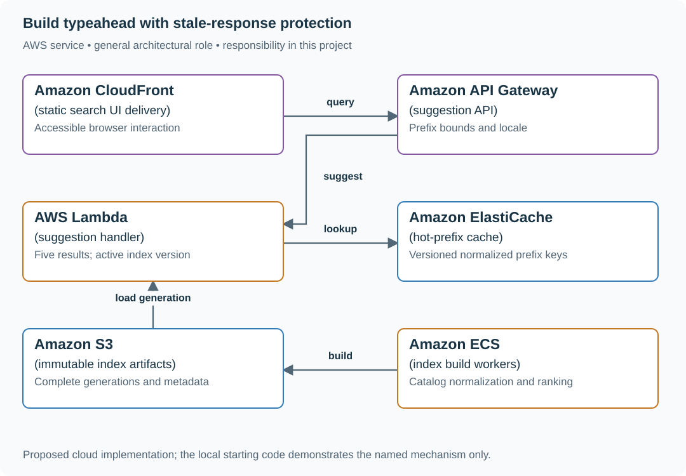

# Build typeahead with stale-response protection

## Application background

A shopper types a product name into a search box. After each change, the browser asks for suggestions matching the text so far. This is typeahead. A query for `iph` might return iPhone accessories before the shopper finishes typing.

Network responses can arrive in a different order from the requests. The response for `ip` may arrive after the response for `iph`. Displaying whichever arrives last could move the interface backward to an older query.

### Example walkthrough

| Action | Expected behavior |
|---|---|
| The shopper types `ip`, then `iph` | Send requests associated with those query versions. |
| The `iph` response arrives first | Show its suggestions. |
| The older `ip` response arrives later | Ignore it for the current input. |

A popular prefix can also create a large volume of identical lookups. Reusing those results helps server capacity, while browser sequencing protects what the shopper sees.

## Your assignment

**Deliver:** Build prefix suggestions and a browser that displays only results for its current input. Add bounded reuse of common query results to handle busy prefixes.

**Required behavior:** GET /suggest requires at least three normalized characters and returns five suggestions from a named index version. Target p99 is 150 ms. The browser displays only the response matching its latest query generation.

The required first milestone is a working local implementation of the behavior above. The numbered implementation steps define the scope. The cloud architecture is a later extension, not something the starter has already provisioned.

## Get the code and run the supplied example

The code is in the public [junior-to-staff repository](https://github.com/Soulful-Iris/junior-to-staff). Install Git and Python 3.12+. No AWS account or Python packages are required for this first run. If you already have a checkout, use it and skip cloning.

```bash
git clone https://github.com/Soulful-Iris/junior-to-staff.git
cd junior-to-staff
python3 examples/architecture-starts/typeahead_search.py
```

**Supplied file:** [`examples/architecture-starts/typeahead_search.py`](https://github.com/Soulful-Iris/junior-to-staff/blob/main/examples/architecture-starts/typeahead_search.py). You can also [read or download the source here](../../../../examples/architecture-starts/typeahead_search.py).

This program is a **mechanism demonstration**: it runs the small scenario in one process and prints the result. It is not an HTTP service, a complete application, or an AWS deployment. A successful run demonstrates this mechanism only. It does not establish the workload or failure guarantees of the application you will build.

**Example output from the supplied run:**

Generated IDs and timestamps may differ. Compare the state transitions and outcomes.

```text
display ['iphone']
ignore stale ['ipad']
Suggestions: ['iphone', 'iphone case', 'iphone charger']
```

### Set up your implementation workspace

Create `work/typeahead-search/` in your checkout (or use a separate repository). Copy the supplied mechanism into that directory as `mechanism.py`, then extract its state transitions into functions you can call from your implementation. The record and module names below describe what you must implement. They are not a promise that files with those names already exist. Keep a `README.md` beside your implementation with its exact run commands and observed results.

## Local components and state to implement

This table names the records, interfaces or decision inputs for your deliverable. Unless a name is explicitly linked to supplied source above, it is something you create. Implement the local state transitions first, then connect the HTTP, storage or worker boundaries required by the steps.

| Record / module | Key or interface | Responsibility |
|---|---|---|
| suggestion_index | index_version,normalized_prefix | Bounded ranked candidate list. |
| catalog_source | item_id,name,eligibility,version | Source for index generation and exclusions. |
| client_query | generation,normalized_text | Suppresses stale asynchronous responses. |

## Implement the assignment

### 1. Define normalization and eligibility

Specify Unicode handling, case folding, whitespace and locale. Enforce the three-character minimum at both client and server. Exclude unavailable or restricted terms during index construction and define an emergency removal path.

### 2. Build an immutable index

Generate prefix-to-top-five lists or a compact trie/FST from catalog and ranking data. Write a complete version, validate its metadata and switch a pointer atomically. Keep the previous version available while instances load the new one.

### 3. Make the browser race-safe

Debounce input, cancel requests where possible and attach an increasing generation. Cancellation is an optimization. The response handler still verifies generation and query before rendering. Preserve keyboard navigation and accessible option announcements.

### 4. Serve hot prefixes predictably

Cache by normalized prefix, locale and index version. Bound query time and return an empty or recent eligible result under the documented fallback. Record server latency separately from browser debounce and network delay.

## Demonstrate the completed local result

| Action | Expected visible result |
|---|---|
| Run the starting program | The iph response displays. The older ipa response is ignored. |
| Request a two-character prefix | The API returns the documented empty/validation result. |
| Fail a new index download | The prior complete generation continues serving. |

**Handoff:** In your implementation README, include the start command, one successful operation, the failure case above and the resulting stored state or decision. State which dependencies are simulated. Someone with a fresh checkout should be able to reproduce this without your chat history.

## Workload assumptions and capacity decisions

These are constructed exercise assumptions. The stated workload is a design target. The local demonstration does not establish that throughput. Use the [estimation constants](../../../01-code/01-problem-solving/estimation-constants.md) to check units before choosing capacity.

| Input or objective | Calculation / consequence |
|---|---|
| 80,000 queries/s peak | Cache hot normalized prefixes and measure the largest prefix, not just average QPS. |
| Minimum three characters | Use iph as a hot-prefix example. Requests for a are outside this API contract. |
| Five results/query | Precomputed bounded suggestion lists avoid scanning the entire catalog on each keystroke. |

## Map the local implementation to AWS

**Deployment status: local only.** Running the supplied command creates no AWS resources and configures no cloud connections. The diagram is a proposed deployment of the completed application. Each box needs either a deployed runtime, a provisioned service or an explicitly external dependency.

Read the diagram by following the arrows from the entry point: application code accepts the request or event, the state owner commits it, and any worker produces the later result. The table ties those roles to code and adapter work. Multiple boxes do not imply multiple Python files already exist.



An immutable precomputed index makes the query path small and predictable. OpenSearch completion suggesters are an alternative when the catalog/query requirements fit. Compare operational cost and rebuild behavior.

| Local responsibility | Cloud destination and role | Implementation still required |
|---|---|---|
| Local static/media delivery path | Amazon CloudFront: static search UI delivery | Configure an origin, cache policy and private-content access. Distinguish cached bytes from current authorization. |
| Local HTTP boundary or the endpoint you will add | Amazon API Gateway: suggestion API | Create routes and an integration. Translate requests and responses and configure identity validation. |
| Python operation or worker function | AWS Lambda: suggestion handler | Write a Lambda event adapter, package its dependencies and give its role only the required resource actions. |
| Local cache, counter or coordination state | Amazon ElastiCache: hot-prefix cache | Implement a Redis/Valkey adapter and atomic operations, expiry and unavailable-cache behavior. Keep the durable authority separate. |
| Local file, object fixture or exported payload | Amazon S3: immutable index artifacts | Implement upload/download and metadata adapters, scoped access, object naming, retention and incomplete-upload cleanup. |
| Application or worker process | Amazon ECS: index build workers | Build a container and task definition. Supply configuration, task roles and graceful shutdown behavior. |

### Provision resources, then connect the application

| Resource or boundary | Initial configuration and reason |
|---|---|
| Cache keys | Include locale and index version. Never share personalized suggestions under a global prefix key. |
| Index rollout | Publish complete artifacts before changing the active pointer. Keep loading failures on the prior version. |
| API limits | Minimum/maximum query length, short deadline and bounded response size. Observe p99 by cache hit/miss. |

Use one disposable AWS environment for the cloud exercise. Put the named resources in `infra/template.yaml` or your existing IaC tool, pass resource IDs through configuration, and scope each runtime role to its own tables, buckets and queues. The diagram is a design to implement. It is not a claim that these resources have been deployed. Record the commands you used to deploy and remove the exercise resources.

For concrete provisioning commands, configuration wiring and cleanup, use the [AWS foundation guide](../../../../examples/architecture-starts/infra/README.md). It includes a deployable table/queue/object-storage foundation and explains which application and service adapters you still implement.

A provisioned queue or table does not make the local program use it. Configure resource IDs in the deployed runtime, replace the local adapter, and replay the same successful and failing operation against that runtime. Record the deployed commit and observable result, then remove the disposable resources using your infrastructure tool.

## Extend the design after the baseline works


Personalize ranking while preserving a hot-prefix cache. Separate a globally eligible candidate set from a small per-user rerank, and define how private history is isolated.

<details>
<summary>Additional design cases, alternatives and original source notes</summary>


This is a **commonly listed system-design interview prompt** with a concrete practice contract. Assume 80,000 queries/s, 150 ms end-to-end p99, and a 3-character minimum prefix. Clarify service guarantees and a first version before filling the board with services.

| Situation | Input / condition | Expected result |
|---|---|---|
| Prefix `iph` | Millions of possible terms | Return top five from a bounded precomputed candidate set. |
| New trending term | Ranking changes in 2 minutes | Publish a new index version without partial mixed results. |
| One hot prefix | `iph` receives 12% of queries | Cache safely and avoid recomputing full descendant scans. |
| Unicode query | User types accented text | Normalize consistently while preserving display form. |

## Think from the contract to the boxes

Separate offline/stream ranking from online prefix lookup. Build a versioned prefix index containing top candidates by score. Online reads should be bounded by prefix and small K, not scan every completion. Keep raw popularity signals distinct from personalization. Atomically swap index versions and measure suggestion latency, zero-result rate, and freshness.

**First diagram:** Draw term events → rank build → immutable prefix index → cache → bounded query. Mark index version on response.

| AWS service / general role | Why it fits this design | Alternative and when it fits better |
|---|---|---|
| **Amazon Kinesis** / query/event stream | Collect searches and clicks for ranking updates. | SQS for simple asynchronous feedback without event-time windows. |
| **AWS Glue** / batch index build | Normalize and aggregate historical terms. | EMR when custom large-scale compute is needed. |
| **Amazon S3** / versioned index files | Hold immutable prefix snapshots for atomic publish. | DynamoDB when the complete lookup fits key-value access. |
| **Amazon ElastiCache** / prefix cache | Protect hot prefix reads with short TTL. | CloudFront for public query results where personalization is absent. |
| **Amazon ECS** / suggestion API | Serve bounded prefix lookups and ranking blend. | Lambda for sparse traffic with cold-start allowance. |

Service choice follows the contract: the box label gives the generic job, while the table explains the AWS product and a reasonable substitute. Name which component owns durable truth, where retries happen, and the guarantee each managed service does **not** provide by itself.

## Pressure-test the design

**Follow-up: Prefix `iph` maps to a bounded list already ranked offline. Extending to `ipho` performs a narrower lookup. Show where personalization can add or remove candidates.**

**Senior expectation:** A new vocabulary release improves quality but makes p99 worse. Split read latency by cache/index/network and roll back only the index version.

**Staff expectation:** Multiple products want one shared suggestion platform. Govern normalization, source attribution, privacy, and quality evaluation without coupling every team to one ranking model.

**Practice artifact:** Draw term events → rank build → immutable prefix index → cache → bounded query. Mark index version on response. Then trace every row in the table, draw one failure, and state what the customer observes. Suggested rehearsal: 35 minutes design, 10 minutes to challenge the guarantees.

**Evidence and origin:** The current community interview-question catalog lists typeahead reports at Databricks, Meta, Expedia and Salesforce. It does not show interview dates. The entry does not show the interview date and is not a verified company rubric. The prompt contract, workload, outcomes, diagrams and solution here are original practice material. Treat company tags as reported sightings, not a prediction of your interview loop.

**Interview report listing:** [Open the community question entry](https://www.hellointerview.com/community/questions/typeahead-search-system/cm7l2wazy00t7105qdvnemtwy).

</details>
