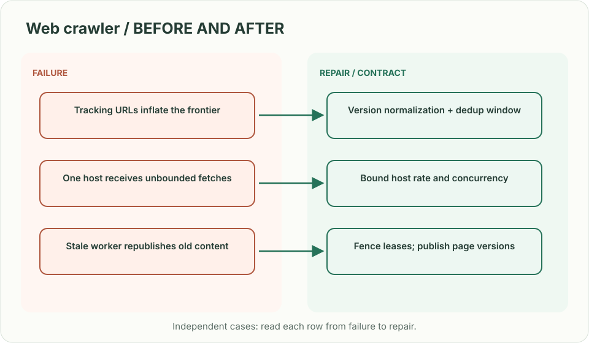
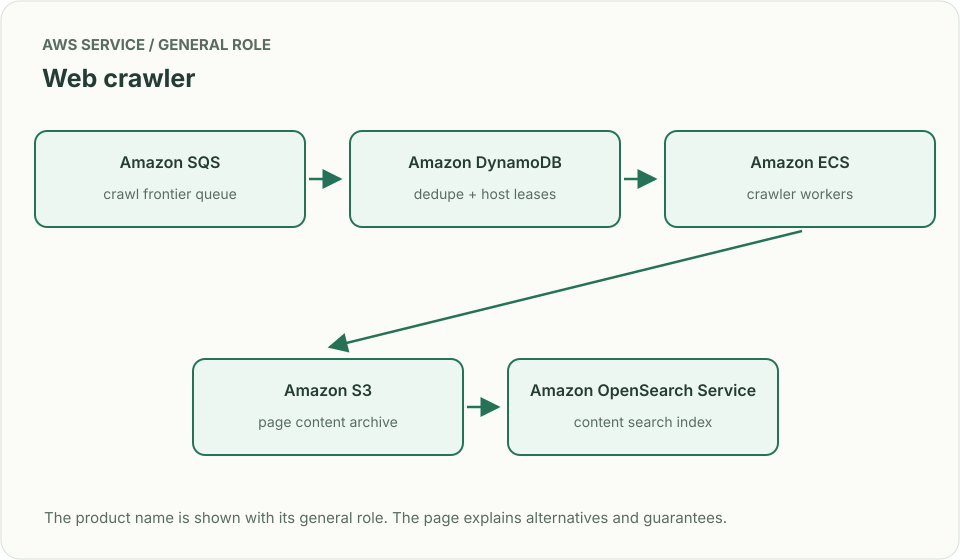
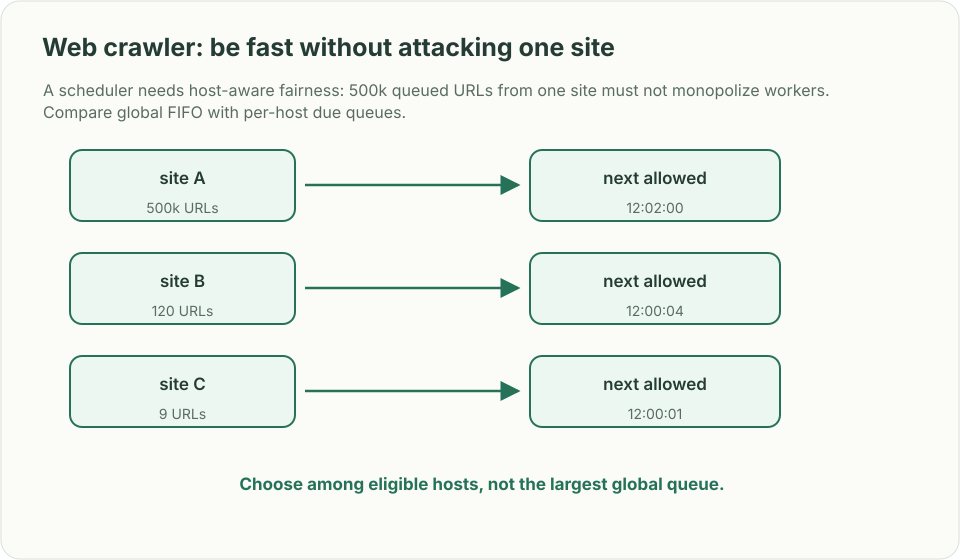

# Web crawler: be fast without attacking one site

> **Interviewer:** “Starting from seed URLs, discover pages and index their content. Avoid fetching the same URL repeatedly, respect publisher crawl rules, and keep making progress when a worker dies.”

This is a **commonly listed system-design interview prompt** with a concrete practice contract. Assume 1 billion discovered URLs, 50,000 fetches/s and at least once crawl execution. Clarify service guarantees and a first version before filling the board with services.

| Situation | Input / condition | Expected result |
|---|---|---|
| Duplicate URL | `/a?utm=x` and `/a` canonicalize equal | Normalize under a versioned rule and fetch once per policy window. |
| Same host overload | One domain has a million queued pages | Enforce per-host concurrency and politeness delay. |
| Worker crash | Page fetched but frontier ACK lost | Idempotent page version and crawl lease tolerate retry. |
| Robots change | Host disallows a path | Stop future fetches and expire queued work under the new policy. |

## Think from the contract to the boxes

The frontier is a durable work scheduler keyed by normalized URL and host. Deduplication controls repeated work, but politeness is per origin and needs independent rate state. Workers fetch with bounded time/body size, extract links, and write content/version before advancing the frontier. A global queue that dispatches arbitrarily can violate a host’s crawl-delay even if its total rate is low.

**First diagram:** Trace one URL from discovery to normalized frontier, host gate, fetch, content store, and extracted links.

| AWS service / general role | Why it fits this design | Alternative and when it fits better |
|---|---|---|
| **Amazon SQS** / crawl frontier queue | Durably buffer distributed page work. | Kinesis when partitions and ordered per-key ingestion dominate. |
| **Amazon DynamoDB** / dedupe + host leases | Conditionally claim normalized URL and host budget. | ElastiCache for transient coordination plus durable backing store. |
| **Amazon ECS** / crawler workers | Run bounded browser/HTTP fetch and extraction workers. | Lambda for short static-page fetches only. |
| **Amazon S3** / page content archive | Store compressed page versions and replay inputs cheaply. | OpenSearch as searchable index, not raw archive. |
| **Amazon OpenSearch Service** / content search index | Serve indexed page queries. | S3/Athena for batch research queries. |

Service choice follows the contract: the box label gives the generic job, while the table explains the AWS product and a reasonable substitute. Name which component owns durable truth, where retries happen, and the guarantee each managed service does **not** provide by itself.

## Pressure-test the design

**Follow-up: A scheduler needs host-aware fairness: 500k queued URLs from one site must not monopolize workers. Compare global FIFO with per-host due queues.**

**Senior expectation:** A malicious page expands into endless URLs. Set depth, URL, MIME, size and domain budgets; quarantine patterns without losing unrelated frontier work.

**Staff expectation:** Change normalization after years of indexing. Build dual keys/reconciliation, quantify duplicate and omission risk, and provide a reversible index migration.

**Practice artifact:** Trace one URL from discovery to normalized frontier, host gate, fetch, content store, and extracted links. Then trace every row in the table, draw one failure, and state what the customer observes. Suggested rehearsal: 35 minutes design, 10 minutes to challenge the guarantees.

**Evidence and origin:** The current community interview-question catalog lists web-crawler reports at ZoomInfo, Atlassian, Microsoft, Expedia and others; the reports’ interview dates are not published. The entry does not show the interview date and is not a verified company rubric. The prompt contract, workload, outcomes, diagrams and solution here are original practice material. Treat company tags as reported sightings, not a prediction of your interview loop.

**Interview report listing:** [Open the community question entry](https://www.hellointerview.com/community/questions/web-crawler-design/cm80gligm049vtvyjklc6gxdw).
