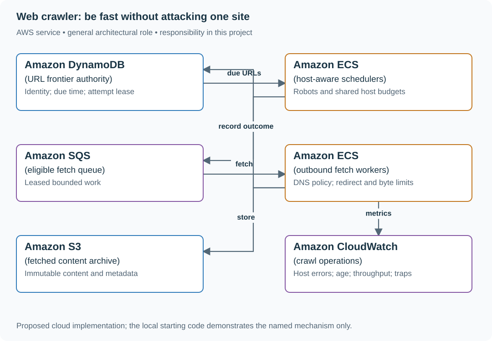

# Build a durable crawler with per-host limits

## Application background

A research team wants a searchable collection of public pages. A crawler starts with some URLs, downloads a page, extracts more links and schedules those links for later visits. Its frontier is the saved list of URLs waiting to be visited.

The crawler must share work across machines without overwhelming any one website. Some pages generate endless links, and a redirect can point somewhere the crawler should not access. A restart must not lose all pending work.

### Example walkthrough

| Action | Expected behavior |
|---|---|
| The crawler discovers a new allowed URL | Add it to the saved frontier. |
| Several URLs belong to the same host | Space their fetches according to that host's limits. |
| A worker stops after downloading a page | Use the recorded job state to decide whether to retry. |

A worker is a process that takes pending URLs and fetches them. Track both its job ownership and the remote host's limits rather than using only a global worker count.

### Sizing that affects this decision

One billion waiting URL entries at 200 bytes each is about 200 GB before indexes and history. Fetching 50,000 pages/s at 100 KiB each is about 4.77 GiB/s of incoming page data. A one-fetch-at-a-time rule for each host still applies, so the total rate requires enough different eligible hosts.

These are exercise assumptions. The [estimation reference](../../../01-code/01-problem-solving/estimation-constants.md) explains the units and approximations. They do not establish the local demo's measured capacity.

## Your assignment

**Deliver:** Build a saved URL frontier, host-aware work assignment and a bounded public-page fetcher. Keep pending work and completed observations understandable after worker restarts.

**Required behavior:** Fetch only allowed public HTTP(S) destinations, respect the configured robots and host policy, and record a durable frontier state. Fetches may repeat. Canonical URL identity and content/version handling prevent uncontrolled duplicate work.

The required first milestone is a working local implementation of the behavior above. The numbered implementation steps define the scope. The cloud architecture is a later extension, not something the starter has already provisioned.

## Get the code and run the supplied example

The code is in the public [junior-to-staff repository](https://github.com/Soulful-Iris/junior-to-staff). Install Git and Python 3.12+. No AWS account or Python packages are required for this first run. If you already have a checkout, use it and skip cloning.

```bash
git clone https://github.com/Soulful-Iris/junior-to-staff.git
cd junior-to-staff
python3 examples/architecture-starts/web_crawler.py
```

**Supplied file:** [`examples/architecture-starts/web_crawler.py`](https://github.com/Soulful-Iris/junior-to-staff/blob/main/examples/architecture-starts/web_crawler.py). You can also [read or download the source here](../../../../examples/architecture-starts/web_crawler.py).

This program is a **mechanism demonstration**: it runs the small scenario in one process and prints the result. It is not an HTTP service, a complete application, or an AWS deployment. A successful run demonstrates this mechanism only. It does not establish the workload or failure guarantees of the application you will build.

**Example output from the supplied run:**

Generated IDs and timestamps may differ. Compare the state transitions and outcomes.

```text
https://example.invalid/a new
https://example.invalid/a duplicate
https://example.invalid/a?sort=1 new
Normalization only; network destination validation is a separate required boundary.
```

### Set up your implementation workspace

Create `work/web-crawler/` in your checkout (or use a separate repository). Copy the supplied mechanism into that directory as `mechanism.py`, then extract its state transitions into functions you can call from your implementation. The record and module names below describe what you must implement. They are not a promise that files with those names already exist. Keep a `README.md` beside your implementation with its exact run commands and observed results.

## Local components and state to implement

This table names the records, interfaces or decision inputs for your deliverable. Unless a name is explicitly linked to supplied source above, it is something you create. Implement the local state transitions first, then connect the HTTP, storage or worker boundaries required by the steps.

| Record / module | Key or interface | Responsibility |
|---|---|---|
| frontier | normalized_url,normalization_version,state,next_due | Durable URL identity and scheduling. |
| host_policy | host,robots_version,next_allowed,inflight | Shared host budget across workers. |
| fetch_results | url,attempt,status,content_hash,final_url | Evidence, deduplication and retry classification. |

## Implement the assignment

### 1. Build a bounded frontier

Normalize scheme/host and remove fragments while preserving query semantics unless a source-specific rule proves equivalence. Version normalization rules. Persist discovered URLs idempotently and cap URL length, crawl depth and per-host discovery budget to contain calendar traps.

### 2. Coordinate host scheduling

Fetch and cache robots policy under a documented failure rule. A shared host scheduler issues leases respecting concurrency and next_allowed. Workers cannot independently apply one-request-per-host and accidentally multiply the limit across the fleet.

### 3. Make outbound fetches safe

Resolve and validate all destination addresses, pin the validated connection target, and repeat validation for every redirect. Block private, loopback, link-local and metadata ranges. Bound redirects, body bytes, decompression ratio and total time. Do not execute page scripts in the first milestone.

### 4. Record outcomes and recover

Store status, final URL, content hash and retry time before completing the lease. Crash recovery can refetch, so content storage is immutable and frontier completion is conditional on the current attempt. Extract links under a bounded parser and preserve provenance.

## Demonstrate the completed local result

| Action | Expected visible result |
|---|---|
| Run the starting program | Fragment variants deduplicate. A distinct query remains distinct. |
| Redirect a public URL to a private IP | The fetch is rejected before the private connection. |
| Restart after content upload | A repeated fetch cannot publish under a stale attempt lease. |

**Handoff:** In your implementation README, include the start command, one successful operation, the failure case above and the resulting stored state or decision. State which dependencies are simulated. Someone with a fresh checkout should be able to reproduce this without your chat history.

## Workload assumptions and capacity decisions

These are constructed exercise assumptions. The stated workload is a design target. The local demonstration does not establish that throughput. Use the [estimation constants](../../../01-code/01-problem-solving/estimation-constants.md) to check units before choosing capacity.

| Input or objective | Calculation / consequence |
|---|---|
| One billion discovered URLs | At 200 bytes/frontier entry, about 200 GB raw before indexes and history. |
| 50,000 fetches/s target | At 100 KiB/response, about 4.8 GiB/s inbound. Network and storage dominate alongside politeness. |
| One concurrent fetch/host initial policy | Large aggregate throughput requires many eligible hosts. It cannot override an individual host limit. |

## Map the local implementation to AWS

**Deployment status: local only.** Running the supplied command creates no AWS resources and configures no cloud connections. The diagram is a proposed deployment of the completed application. Each box needs either a deployed runtime, a provisioned service or an explicitly external dependency.

Read the diagram by following the arrows from the entry point: application code accepts the request or event, the state owner commits it, and any worker produces the later result. The table ties those roles to code and adapter work. Multiple boxes do not imply multiple Python files already exist.



The frontier owns work identity. The host scheduler owns permission to fetch now. A distributed queue alone supplies neither robots policy nor fleet-wide per-host fairness.

| Local responsibility | Cloud destination and role | Implementation still required |
|---|---|---|
| Local dictionary, SQLite records or state model | Amazon DynamoDB: URL frontier authority | Design partition/sort keys and write a storage adapter with conditional updates or transactions. Python state and SQL are not uploaded as a database. |
| Application or worker process | Amazon ECS: host-aware schedulers | Build a container and task definition. Supply configuration, task roles and graceful shutdown behavior. |
| Local pending-work collection | Amazon SQS: eligible fetch queue | Publish committed job intent, consume messages and persist deduplication/ownership state. Add visibility, retry and dead-letter handling. |
| Application or worker process | Amazon ECS: outbound fetch workers | Build a container and task definition. Supply configuration, task roles and graceful shutdown behavior. |
| Local file, object fixture or exported payload | Amazon S3: fetched content archive | Implement upload/download and metadata adapters, scoped access, object naming, retention and incomplete-upload cleanup. |
| Local counters, timestamps and diagnostic output | Amazon CloudWatch: crawl operations | Emit bounded metrics and logs, build the named operational view and configure retention and access. |

### Provision resources, then connect the application

| Resource or boundary | Initial configuration and reason |
|---|---|
| Networking | Controlled egress with application-level destination pinning. Deny internal address space and credential endpoints. |
| Frontier partitions | Spread URL records while coordinating host policy separately. A popular host must not bypass its limit. |
| Storage | Compressed immutable content with explicit retention. Quarantine oversized/malformed responses without retry loops. |

Use one disposable AWS environment for the cloud exercise. Put the named resources in `infra/template.yaml` or your existing IaC tool, pass resource IDs through configuration, and scope each runtime role to its own tables, buckets and queues. The diagram is a design to implement. It is not a claim that these resources have been deployed. Record the commands you used to deploy and remove the exercise resources.

For concrete provisioning commands, configuration wiring and cleanup, use the [AWS foundation guide](../../../../examples/architecture-starts/infra/README.md). It includes a deployable table/queue/object-storage foundation and explains which application and service adapters you still implement.

A provisioned queue or table does not make the local program use it. Configure resource IDs in the deployed runtime, replace the local adapter, and replay the same successful and failing operation against that runtime. Record the deployed commit and observable result, then remove the disposable resources using your infrastructure tool.

## Extend the design after the baseline works


Change normalization rules after 500 million URLs are stored. Plan identity migration and aliasing so new rules do not duplicate the whole crawl or collapse URLs whose query parameters carry meaning.

<details>
<summary>Additional design cases, alternatives and original source notes</summary>


This is a **commonly listed system-design interview prompt** with a concrete practice contract. Assume 1 billion discovered URLs, 50,000 fetches/s and at least once crawl execution. Clarify service guarantees and a first version before filling the board with services.

| Situation | Input / condition | Expected result |
|---|---|---|
| Duplicate URL | `/a?utm=x` and `/a` canonicalize equal | Normalize under a versioned rule and fetch once per policy window. |
| Same host overload | One domain has a million queued pages | Enforce per-host concurrency and politeness delay. |
| Worker crash | Page fetched but frontier ACK lost | Idempotent page version and crawl lease tolerate retry. |
| Robots change | Host disallows a path | Stop future fetches and expire queued work under the new policy. |

## Think from the contract to the boxes

The frontier is a durable work scheduler keyed by normalized URL and host. Deduplication controls repeated work, but politeness is per origin and needs independent rate state. Workers fetch with bounded time/body size, extract links, and write content/version before advancing the frontier. A global queue that dispatches arbitrarily can violate a host’s crawl-delay even if its total rate is low.

**First diagram:** Trace one URL from discovery to normalized frontier, host gate, fetch, content store, and extracted links.

| AWS service / general role | Why it fits this design | Alternative and when it fits better |
|---|---|---|
| **Amazon SQS** / crawl frontier queue | Durably buffer distributed page work. | Kinesis when partitions and ordered per-key ingestion dominate. |
| **Amazon DynamoDB** / dedupe + host leases | Conditionally claim normalized URL and host budget. | ElastiCache for transient coordination plus durable backing store. |
| **Amazon ECS** / crawler workers | Run bounded browser/HTTP fetch and extraction workers. | Lambda for short static-page fetches only. |
| **Amazon S3** / page content archive | Store compressed page versions and replay inputs cheaply. | OpenSearch as searchable index, not raw archive. |
| **Amazon OpenSearch Service** / content search index | Serve indexed page queries. | S3/Athena for batch research queries. |

Service choice follows the contract: the box label gives the generic job, while the table explains the AWS product and a reasonable substitute. Name which component owns durable truth, where retries happen, and the guarantee each managed service does **not** provide by itself.

## Pressure-test the design

**Follow-up: A scheduler needs host-aware fairness: 500k queued URLs from one site must not monopolize workers. Compare global FIFO with per-host due queues.**

**Senior expectation:** A malicious page expands into endless URLs. Set depth, URL, MIME, size and domain budgets. Quarantine patterns without losing unrelated frontier work.

**Staff expectation:** Change normalization after years of indexing. Build dual keys/reconciliation, quantify duplicate and omission risk, and provide a reversible index migration.

**Practice artifact:** Trace one URL from discovery to normalized frontier, host gate, fetch, content store, and extracted links. Then trace every row in the table, draw one failure, and state what the customer observes. Suggested rehearsal: 35 minutes design, 10 minutes to challenge the guarantees.

**Evidence and origin:** The current community interview-question catalog lists web-crawler reports at ZoomInfo, Atlassian, Microsoft, Expedia and others. The reports’ interview dates are not published. The entry does not show the interview date and is not a verified company rubric. The prompt contract, workload, outcomes, diagrams and solution here are original practice material. Treat company tags as reported sightings, not a prediction of your interview loop.

**Interview report listing:** [Open the community question entry](https://www.hellointerview.com/community/questions/web-crawler-design/cm80gligm049vtvyjklc6gxdw).

</details>
