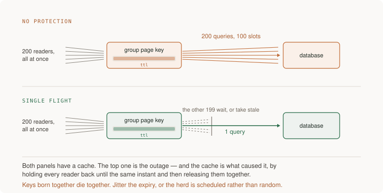

# 13 · Data at scale — five projects

> Senior tier · each one an afternoon · read [the section](README.md) first

Five projects, and every one of them ends in a number that came from breaking
something on purpose: the resource that saturated first, the query count during
a stampede, the row count after a duplicate delivery, the replication lag under
load, the writes that were acknowledged and then lost.

The section's standing rule governs all five — *before believing a green
result, say what broken would have looked like* — because almost every check in
this area passes trivially if you set it up wrong. A stampede test that never
actually expires the key under concurrency passes forever and proves nothing.



---

### 1. What saturates first

*You end up naming the resource that runs out before anything else, from measurement, and with a written answer for what happens when the pool is full.*

**Build**

Put your system under enough concurrent load to hurt it, and find out what
actually saturates — connections, one query's plan, locks, CPU, cache misses.
Then put a pooler in front of the database with a size you chose, and write
down the pool-full policy: wait how long, then fail how.

**The thought process**

Start with the observation that reframes everything: **raw volume is almost
never what breaks you.** Eighty thousand rows is nothing. What breaks is one of
four things — connections, the shape of one query under concurrency, read
pressure, or a failover — and telling them apart is the whole skill.

Second, the diagnostic that costs nothing and is usually decisive: **if
unrelated things fail together, the bottleneck is shared.** The group page
being slow is a page problem. The group page being slow *and sign-in failing*
is a connection-pool problem, because sign-in has nothing to do with the group
page except that both need a connection. Noticing that one fact tells you where
to look before you measure anything.

Third: **the connection ceiling is a number nobody chose.** PostgreSQL's
default `max_connections` is typically 100, and instance-class memory is what
actually decides what you can afford. Every feature in the product competes for
the same pool, and the failure is abrupt rather than gradual — everything is
fine, and then nothing can connect.

Fourth, and this is what makes it a design decision rather than a config value:
**what happens when the pool is full?** The choices are wait (and for how
long), fail fast, or shed by class. Not choosing means the default, which is
usually "wait forever", which converts a database problem into a total outage
because every request thread is parked.

Fifth: **the measurement goes before the fix, always.** A model's reflex — and
an engineer's — is to add a cache or a bigger instance before knowing what is
full. Every rung of the ladder above is dearer and harder to reverse, so the
measurement is what buys you the right to climb.

**How to organise the prompts**

```
Under load, the group page slows down and sign-in starts failing too.

Do not propose a fix yet. List what I would measure to find which
resource saturates first — connections, one query's plan, locks, CPU,
cache misses — and for each, the exact command and what a bad number
looks like.
```

"Do not propose a fix yet" is the whole prompt. Without it you get Redis.

```
Here is what I measured: <pool stats, EXPLAIN ANALYZE, error rates>.

Name the bottleneck. Then name the CHEAPEST rung that addresses it —
index, cache, replica, shard — and say why each rung below it is not
enough for this specific number.
```

Making it argue down the ladder is what enforces the escalation order.

```
Add a connection pooler. Tell me how you chose the size, what happens
when it is full, and how long a request waits before it gives up.

Then tell me what the pool size should be if I run N application
instances — because the per-instance pool is not the number that
matters.
```

That last clause catches a classic error: ten instances with a pool of twenty
is two hundred connections against a ceiling of one hundred.

```
Now show me the failure. What does a user see when the pool is
exhausted, and how do I tell that apart from the database being slow?
They look identical in a latency graph.
```

**On AWS**

The pooler question has an AWS-specific answer worth knowing: **RDS Proxy**
sits between your application and RDS or Aurora, holds the pooled connections,
and — the part that matters most — survives a failover by holding client
connections open while the backend switches. Its other job is the serverless
case: a hundred concurrent **Lambda** executions become a hundred connections
without it, which is the fastest way to exhaust a database ever invented.
Against it: **PgBouncer** on **ECS/Fargate** gives you transaction-mode
pooling and more control at the cost of running it yourself, and transaction
mode is meaningfully more efficient than RDS Proxy's behaviour for short
queries — so the honest comparison is managed-and-failover-aware against
cheaper-and-more-tunable.

For the measurement half: **CloudWatch** `DatabaseConnections` against the
`max_connections` your instance class actually permits — which is a formula on
memory, not a constant, so look it up for your class rather than assuming 100.
**RDS Performance Insights** is the tool that answers "which query and which
wait event", and its database-load-by-wait-event view is the single fastest way
to distinguish "we are CPU bound" from "we are waiting on locks" from "we are
waiting for a connection". It has a free tier of seven days' retention, which
is enough for this project.

For the load itself: a container running k6 or Locust on **Fargate**, or the
**Distributed Load Testing on AWS** solution if you want the generators managed.

And the sizing decision has a serverless escape hatch worth naming:
**Aurora Serverless v2** scales capacity with load, which changes the
connection ceiling dynamically and is the right answer when your load is spiky
and you do not want to size an instance for the peak. It does not remove the
pooling problem; it removes the "we sized for the wrong peak" problem.

**What productionising it means**

The pool has a size somebody chose, computed across all instances rather than
per instance. There is a written answer for pool exhaustion and it is not "wait
forever". There is an alarm at a fraction of the connection ceiling, because a
ceiling you discover by hitting it is not managed. And the escalation record
exists: each rung climbed, with the measurement that justified it written next
to the change.

**The learning**

Capacity problems announce themselves at a shared resource, which is why
unrelated features fail together and why the symptom rarely points at the
cause. The discipline is to find the saturating resource before reaching for a
fix, because every fix above the cheapest rung bills a new failure class you
will then own forever.

**How you would know it is wrong**

- Multiply your per-instance pool size by your instance count. Compare to the ceiling. This is wrong more often than not.
- Fill the pool deliberately and watch what a user sees. If requests hang rather than fail, you chose "wait forever" by default.
- Check whether unrelated features fail together under load. If they do and you have not found the shared resource, keep looking.
- Look up `max_connections` for your actual instance class rather than assuming the default.
- If your first fix was a cache, ask what you measured. The measurement is what buys the right to climb.

---

### 2. The stampede you cause on purpose

*You end up with two numbers: how many database queries one expiring key produced before you protected it, and after.*

**Build**

Cache an expensive read. Hold two hundred concurrent requests against it,
delete the key mid-run, and count queries at the database. Then add stampede
protection, name which mechanism you chose, and count again. Check the test in.

**The thought process**

The first thing to understand is that **the cache is what caused the outage.**
This is counterintuitive and it is the section's central story: a cache holds
every reader back until the same instant and then releases them together. One
slow query becomes two hundred, against a pool with a hundred slots, and now
sign-in fails too. Without the cache there would have been a steady grind; with
it, a cliff.

Second, the mechanisms are a short list and **naming which one you chose is the
point.** A single-flight lock means one request recomputes and the rest wait.
Stale-while-revalidate means everyone gets the old value immediately while one
refreshes behind — in HTTP itself since RFC 5861, so it is not exotic. TTL
jitter means keys born together do not die together, which attacks the
synchronisation rather than the recompute. Probabilistic early refresh means
each reader has a rising chance of refreshing as expiry approaches, so the
recompute happens before the cliff. They compose, and picking without being
able to say why is how you end up with get-set-with-a-TTL sold as caching.

Third, and it is the requirement people skip: **what does a user see when the
cache backend is down?** The only acceptable answer is "the same page, slower".
If the answer is an error, you have taken a performance optimisation and made
it a single point of failure — which is strictly worse than not having it.

Fourth, the invalidation half: **enumerate every write path that must refresh
this key.** If you cannot enumerate them, say so and fall back to a TTL with a
stated staleness cost. An invalidation story you cannot write down is one you
will get wrong, and the failure is silent.

Fifth, and this is what makes the test real: **the assertion is a query count,
not a latency.** Latency is noisy and will pass by luck. A counter at the
database that reads 1 instead of 200 is a check that can go red.

**How to organise the prompts**

```
Add caching for <the expensive read>. Requirements:

1. The invalidation story: every write path that must touch this key,
   enumerated. If you cannot enumerate them, say so and fall back to a
   TTL with a stated staleness cost.
2. Stampede protection: when the hot key expires under 200 concurrent
   readers, at most one recomputes. Name which mechanism you chose —
   single-flight lock, stale-while-revalidate, TTL jitter,
   probabilistic early refresh — and why.
3. Tell me what a user sees when the cache backend is down. The only
   acceptable answer is "the same page, slower."
```

```
Now write the test: hold 200 concurrent requests, expire the key
mid-run, and assert on the NUMBER OF DATABASE QUERIES, not on latency.

Show me where the counter comes from.
```

```
Disable the protection and run it again. Tell me the number you
expect before I run it.

If the number does not move, the test is not expiring the key under
concurrency and it will pass forever.
```

That is the instrument check, and for this project it is essential — this
specific test is unusually easy to write in a way that cannot fail.

```
Now TTL jitter specifically: my keys are created by a deploy that
warms them all at once. What does that do to expiry, and what jitter
range fixes it without making staleness unpredictable?
```

**On AWS**

The cache itself is **ElastiCache**, and the choice inside it has changed:
**Valkey** is the actively developed open-source fork that AWS now leads on,
and ElastiCache offers it alongside Redis OSS at lower cost — so "Redis or
Memcached" is no longer the interesting question and "Valkey or Redis OSS" is.
**ElastiCache Serverless** removes the node-sizing decision, which matters here
because a cache sized for the steady state is a cache that evicts during
exactly the traffic spike you added it for.

If your data is in **DynamoDB**, **DAX** is the purpose-built answer and the
reason to prefer it over ElastiCache is that it is write-through and
API-compatible — your application keeps calling DynamoDB and the cache is
transparent, so there is no invalidation story to get wrong. That is a genuine
architectural advantage and it is the clearest case in this section of "pick
the service that deletes the hard problem rather than the one that is
faster".

At the other end, the highest-leverage cache for read-heavy public content is
**CloudFront**, because it absorbs the load before it reaches your account at
all. Its stampede equivalent is **origin shield** — a single regional layer
that collapses concurrent misses from many edge locations into one origin
request. That is single-flight, implemented for you, at the CDN layer, and
almost nobody turns it on.

For seeing it: **CloudWatch** on ElastiCache gives you `CacheMisses`,
`Evictions` and `CurrConnections`. Evictions climbing is the signal that your
cache is too small and is quietly throwing away the thing you cached; it looks
like nothing in a latency graph until it looks like everything.

**What productionising it means**

Every cache key has a written invalidation story or an admitted TTL with a
stated staleness cost. A stampede protection is named, not assumed. The
expire-under-load test is checked in and asserts on database hits. The cache
being down degrades to slow rather than to broken, and somebody has tested that
by turning it off. TTLs are jittered. And evictions are on a graph, because a
cache that is silently evicting is a cache that is not there.

**The learning**

A cache is not a performance improvement, it is a second copy of the truth with
its own failure modes — invalidation and the stampede — and you have signed up
to own both. The specific thing that stays with you is that the stampede is
*created* by the cache: synchronising readers is the mechanism, and jitter is
the fix that attacks the synchronisation rather than the symptom.

**How you would know it is wrong**

- Disable the protection and confirm the test goes red with a hit count near your concurrency. If it stays green, the test never expired the key under load.
- Turn the cache backend off entirely. If the page breaks rather than slowing, the cache is load-bearing.
- Look at your TTLs. Round numbers mean keys born together die together.
- Check eviction count. A cache evicting under load is not caching the thing you think it is.
- Ask who refreshes the key after a write. If the answer is "the TTL", say the staleness cost out loud and check somebody is happy with it.

---

### 3. At-least-once, at both ends

*You end up with a consumer that no-ops on a second delivery because the database refused it, and a producer that cannot save a row without also announcing it.*

**Build**

Move one piece of work onto a bounded queue. Make the consumer idempotent with
a database constraint rather than memory. Then add the outbox on the producer
side so a business write and its outgoing message commit together. Prove both:
deliver one message twice, and crash the consumer between the write and the
acknowledgement.

**The thought process**

The first thing to accept as a premise rather than an edge case: **at-least-once
means duplicates will happen.** A consumer that crashes between doing the work
and acknowledging the message gets it again. That is not a bug in the queue,
that is the contract. Building from that premise produces a different design
from building for the happy path and patching.

Second, **exactly-once does not survive a system boundary.** Kafka can make
read-process-write exactly-once while both ends are Kafka. The moment your
consumer writes to PostgreSQL or sends an email, the crash-retry gap reopens,
and no client-library setting closes it. Recognising "exactly-once delivery" in
a design document as a boundary error is one of the more useful things this
section gives you.

Third, the mechanism: **the dedup must live where the effect lands.** A key on
every message, and a unique constraint in the database that turns the second
delivery into a no-op. In-memory dedup does not count, because the process that
remembers is the process that crashes — that is the same process, by
construction.

Fourth, the producer side, which is the half people omit: **"saved but never
announced" is a real and common bug.** You write the row, then publish the
message, and the publish fails — now your system's state and the world's
disagree permanently. The outbox pattern makes the business row and the
outgoing message one transaction, with a relay publishing afterwards. It
converts "might not be announced" into "will be announced eventually", which is
a much better failure.

Fifth: **bound the queue and choose the full policy.** An unbounded queue is a
memory leak with a scheduler. Block, shed, or degrade — and "it will not fill"
is not an answer, it is a prediction you have not tested.

**How to organise the prompts**

```
Move <this work> onto a queue. Write the consumer assuming every
message can arrive twice and out of order, because at-least-once means
it eventually will.

Design the idempotency: what is the message key, where is it stored,
and which database constraint turns a second delivery into a no-op?
In-memory dedup does not count — the process that remembers is the
process that crashes.
```

The premise framing changes the output. Models build differently from "this
will happen" than from "handle the case where".

```
State what bounds this queue and what the producer does when it is
full: block, shed, or degrade. "It will not fill" is not an answer.

Then tell me what the user experiences under each of the three.
```

```
Tests, both of them:
1. Deliver the same message twice and assert the effect happened once.
2. Kill the consumer after its write but before its acknowledgement,
   let redelivery happen, and assert again.

Then: drop the unique constraint and tell me which test goes red.
```

That last instruction is the instrument check. If dropping the constraint does
not turn anything red, your dedup is somewhere else — probably in memory.

```
Now the producer. Implement the outbox: the business row and the
outgoing message committed in one transaction, with a relay that
publishes afterwards.

Tell me what happens if the relay runs twice, and what happens if it
dies mid-batch.
```

**On AWS**

The queue choice is the first teaching. **SQS standard** is at-least-once and
unordered, and it is the boring right answer for a work queue; **SQS FIFO**
gives you exactly-once *processing within the queue* and per-message-group
ordering, at a throughput cost — and the important caveat is that FIFO's
deduplication window is five minutes, which makes it a protection against
retries rather than a substitute for an idempotent consumer. Anyone reaching
for FIFO to avoid writing the constraint has misread what it guarantees.

**EventBridge** is the router rather than the work queue: many consumers,
content filtering, and the producer does not know who is listening.
**Kinesis** or **MSK** is what you want when order matters across many records
and several consumers need the same stream at their own pace. Being able to say
why not each neighbour is most of a senior conversation about messaging.

The specific SQS mechanics that matter for this project: **visibility timeout**
must exceed your processing time or the queue redelivers while you are still
working — which is the most common cause of mysterious duplicates and looks
like a bug in your code. A **dead-letter queue** with a `maxReceiveCount` is
where poison messages go so one bad payload does not block a partition of your
work forever, and the **DLQ redrive** action is how you replay them after the
fix. And the metric to graph is `ApproximateAgeOfOldestMessage`, not depth: a
three-item queue looks healthy while its oldest item has been stuck for forty
minutes.

For idempotency storage: a **DynamoDB** conditional write on the message key is
the cheapest "only once" primitive there is — a `PutItem` with
`attribute_not_exists(pk)` is the entire implementation, and it is independent
of your relational database so it keeps working when that is the thing under
pressure. If you are on Lambda, **Powertools for AWS Lambda** ships an
idempotency utility backed by exactly that, which is worth knowing exists
before you write your own.

For the outbox relay: **DynamoDB Streams** or Postgres logical replication into
**DMS**, fed to **EventBridge Pipes**, is the managed shape — change data
capture as the relay, so there is no polling loop of yours to keep alive. The
simpler version is a table and a scheduled task, and for most systems that is
correct.

**What productionising it means**

Consumers are idempotent and it is the database refusing the duplicate, not
your code remembering. Every queue has a bound and a stated full-policy. The
DLQ exists and somebody has looked in it this month. Backlog **age** is on a
dashboard that existed before the incident. Visibility timeout exceeds
processing time with margin. And the outbox relay is monitored, because a relay
that has silently stopped looks exactly like a quiet day.

**The learning**

Delivery guarantees are properties of a channel, not of your system, and they
stop at the first boundary the channel does not own. The durable design is
at-least-once plus an idempotent effect — which moves the guarantee from the
transport, where it cannot survive, into your database, where a unique
constraint enforces it for free.

**How you would know it is wrong**

- Deliver the same message twice and count rows. Then drop the unique constraint and confirm the test goes red.
- Kill the consumer between its write and its acknowledgement. The redelivery must be harmless, and you should watch it happen.
- Compare your visibility timeout to your p99 processing time. If it is smaller, you are generating your own duplicates.
- Fill the queue past its bound and see what the producer does. If you cannot fill it, you have not bounded it.
- Look at backlog age, not depth. Then check that graph existed before you needed it.

---

### 4. Reading from a replica without lying to the user

*You end up having watched a user's own write disappear from their screen, and then having fixed it deliberately rather than by luck.*

**Build**

Add a read replica and route reads to it. Then reproduce the failure on
purpose: write, immediately read, and observe the write missing. Measure
replication lag under load. Then implement read-your-writes and prove it holds
while lag is high.

**The thought process**

The first thing to be clear about is what a replica actually buys and bills:
**it buys read scale and a standby; it bills staleness.** Replication is
asynchronous by default, so the replica is always a little behind, and under
load "a little" has no bound. A replica that is fifty milliseconds behind at
rest can be thirty seconds behind during a backfill.

Second, the failure this produces is not a system failure, it is a **user**
failure and that is why it is so damaging. The user pressed save. The write
went to the primary. The redirect read from a replica that has not seen it. The
edit is gone from the screen — so they save again, and now there are two, or
they stop trusting the product. Nothing errored. Nothing alerted.

Third: **read-your-writes is the floor, not a nicety.** The two standard
implementations are routing a user's reads to the primary for a window after
they write, or pinning their session to the primary. Both are simple; the
decision is the window length, and the honest way to pick it is from measured
lag at p99 rather than from a round number.

Fourth, and this is the design question worth thinking about properly: **which
reads genuinely tolerate staleness?** A dashboard, a search index, an analytics
page — yes. Anything the user just caused — no. Anything used to make a
decision that then writes — absolutely not, because that is where stale reads
become corrupt data rather than confusing screens. Sorting your reads into
those three buckets is the actual work.

Fifth: **lag must be a graph with an alarm.** Reading from replicas without
watching lag is the version of this that looks fine for months.

**How to organise the prompts**

```
I want to route reads to a replica. First: sort every read in this
codebase into three buckets — must see the user's own write, tolerates
seconds of staleness, tolerates minutes.

For each in bucket one, say what the user experiences if it reads
stale.
```

Sorting before implementing is what stops this becoming a global switch that
breaks four things subtly.

```
Now reproduce the failure. Write me the smallest test that writes,
immediately reads from the replica, and shows the write missing.

Tell me how to make it reliable — I want it to fail every time, not
occasionally.
```

Making it deterministic is the difference between a demonstration and a flaky
test you will delete.

```
Implement read-your-writes. Tell me which of the two approaches you
chose — primary routing for a window, or session pinning — and how you
picked the window from my measured lag.
```

```
Now the honest limits: what does this NOT protect? Give me a scenario
where a user still sees stale data despite read-your-writes.
```

There always is one — a second device, a shared object another user changed, a
background job reading on the user's behalf.

**On AWS**

The engine choice changes the numbers enough to matter. **RDS read replicas**
use the engine's own asynchronous replication, and lag is reported as the
`ReplicaLag` CloudWatch metric in seconds. **Aurora replicas** share the same
storage volume as the writer rather than replaying a log, so lag is typically
in the low milliseconds and is reported as `AuroraReplicaLag` in
milliseconds — a genuinely different order of magnitude, and the strongest
practical argument for Aurora when read-your-writes is a concern.

The routing has a managed answer: Aurora gives you a **reader endpoint** that
load-balances across replicas and a **writer endpoint** that always points at
the primary, so "route this read to the primary" is a connection choice rather
than application logic. **RDS Proxy** can also expose read-only endpoints and
handles the failover case, which is the other reason it appears in project 1.

For the standby half: **Multi-AZ** gives you a synchronous standby that is not
readable — it is availability insurance, not read capacity, and conflating the
two is a common mistake. The **Multi-AZ DB cluster** deployment gives you two
*readable* standbys with semi-synchronous replication and a faster failover
than classic Multi-AZ, which is the middle option people do not know exists.

Set a **CloudWatch alarm** on replica lag before you route any traffic, and
know the two things that reliably spike it: a large backfill (see
[12 · Delivery](../../03-production/02-delivery/README.md)) and a long-running query on the replica
itself blocking replay.

And the sharding rung, for completeness: PostgreSQL has no native sharding, and
on AWS the managed answers are **Aurora Limitless Database** for horizontal
write scale within Aurora, or **DynamoDB**, which is sharded by design and
charges you the access-pattern discipline up front instead of later. Shard last:
it is the one rung with no ladder down.

**What productionising it means**

Reads are sorted into staleness buckets and the sorting is visible in the code,
not remembered. Read-your-writes has a window derived from measured lag. Lag is
graphed and alarmed. Somebody has watched the stale-read failure happen and can
describe what the user saw. And there is a written note of what read-your-writes
does not cover, because the second-device case will otherwise be reported as a
bug and investigated from scratch.

**The learning**

"Eventually consistent" is a claim about the system converging, and the user
who pressed save lives in the meantime. The senior habit is to stop evaluating
consistency as a property of the database and start evaluating it as a property
of a specific read — because most reads genuinely do not care, and the two that
do will ruin the product.

**How you would know it is wrong**

- Write and immediately read. If you cannot make the write disappear on demand, your test is not exercising the replica.
- Graph replica lag during a backfill. Whatever number you assumed, measure it.
- Check what happens to read-your-writes when the user opens a second tab. That is the limit you need to have written down.
- Confirm your standby is actually readable. Multi-AZ is not read capacity, whatever the architecture diagram implies.
- Ask which reads go to the replica. If the answer is "all of them", nobody has sorted them.

---

### 5. The failover, rehearsed — and what it cost

*You end up with a failover time you measured, and an honest count of acknowledged writes that did not survive it.*

**Build**

Pull the primary in staging, on purpose. Time the failover from the
application's point of view. Then do the part almost nobody does: compare the
writes your application acknowledged before the failure against the rows
present afterwards, and count the difference.

**The thought process**

The first framing: **at scale, the database is the dependency that dies.** Not
maybe. The seconds where nobody is primary are going to happen, and they are
either designed or discovered. This project is about moving them into the first
category.

Second, and this is the uncomfortable part people skip: **async replication
promises that a failover can lose writes.** If the primary acknowledged a write
and had not yet shipped it when it died, that write is gone. Not corrupted —
gone, silently, with the user having seen a success message. The count is
usually small and it is almost never zero, and it is not a test bug. It is the
guarantee you bought.

Third: **the application's failover time is not the database's.** The database
may promote in thirty seconds; your application may take three minutes because
its connection pool is holding dead connections, or because something cached
the DNS name past its TTL. Timing this from inside your application rather than
from the console is what makes the number real.

Fourth, and it is the highest-value finding: **the recovery is where the
surprises are.** Connections that do not reconnect. A pool that reconnects all
at once and stampedes the new primary. Background jobs that failed silently and
did not retry. In-flight transactions in an unknown state. Each of those is
found in one drill and never by reading.

Fifth: **decide what the acceptable loss is, and say it out loud.** For most
products, losing a few seconds of writes during a rare failover is acceptable
and the alternative — synchronous replication — costs write latency on every
single request forever. That is a real trade and it should be a decision with a
name against it, not an accident.

**How to organise the prompts**

```
Design a failover drill for my staging database: how to trigger it,
what to measure, and what I need running BEFORE I trigger it so I can
compare acknowledged writes against surviving rows.

The comparison is the point — tell me how to record acknowledgements
outside the database being failed over.
```

That last sentence is essential. If your record of what was acknowledged lives
in the database that failed, you cannot do the comparison.

```
I ran it. Failover took <N> seconds from the database's point of view
and <M> seconds from my application's. Explain the gap.

Then tell me which of these is the cause: connection pool holding dead
connections, DNS caching, retry backoff, or something else.
```

```
<K> acknowledged writes did not survive. Is that consistent with
async replication and my write volume, or is it too many? Show me the
arithmetic.
```

Asking whether the number is *plausible* is better than asking whether it is
acceptable, because an implausibly large number means something else is wrong.

```
Now the recovery path. What reconnects, what does not, and what
happens if every application instance reconnects at the same instant?
```

```
What would it take to lose zero writes, and what would that cost me on
every write, forever? I want the price, not the recommendation.
```

**On AWS**

The mechanics first. **RDS Multi-AZ** failover is typically measured in the
one-to-two-minute range; the **Multi-AZ DB cluster** deployment is
substantially faster because it uses semi-synchronous replication to two
readable standbys. **Aurora** promotes a replica in the same region in roughly
thirty seconds or less, and the failover priority (tiers 0 to 15) decides which
replica is chosen — worth setting deliberately, because the default may promote
a replica you sized smaller.

You can trigger all of them on demand: RDS has a `reboot-db-instance
--force-failover`, Aurora has `failover-db-cluster`, and **AWS Fault Injection
Service** has scenarios for it with a **CloudWatch alarm** stop condition.
Doing this once, in daylight, is one of the highest-value hours in the senior
tier.

The application-side gap has three usual causes and all three have AWS answers.
**RDS Proxy** holds client connections open across a failover, which is the
single biggest reduction in application-observed downtime and the reason it
keeps appearing in this section. DNS caching is the second: the endpoint's
record has a short TTL and JVM and some runtimes cache it longer, so check your
runtime's DNS cache setting explicitly. And the reconnect stampede is the
third — jitter your reconnection backoff, which is the same lesson as
[09 · Reliability](../../03-production/05-reliability/README.md)'s retry storm arriving from a different
direction.

For the lost-writes comparison, record acknowledgements somewhere that is not
the database under test: an **SQS** queue, a **DynamoDB** table, or a log to
**CloudWatch Logs** from the client side. Then count both sides afterwards.

For the zero-loss question, the honest options are Aurora with a
**Global Database** (sub-second RPO cross-region, but still not zero within a
region failover), synchronous commit settings that cost write latency on every
request, or **DynamoDB**, which replicates synchronously across three
Availability Zones by design and makes this particular worry go away — at the
price of the access-pattern discipline it demands up front.

**What productionising it means**

Failover has been rehearsed with a date and a duration written down. The
application-observed number is the one you quote, not the database's. Writes in
flight have a known fate, and the acceptable loss is a stated decision. Pools
reconnect with jitter. And the drill is on a calendar, because every one of the
findings above comes back as the system changes.

**The learning**

Availability and durability are separate purchases and a failover is where you
find out which one you actually bought. The number that stays with you is not
the seconds of downtime — it is the count of writes that were acknowledged and
then were not there, because that number is the difference between what your
users were told and what was true.

**How you would know it is wrong**

- If zero writes were lost, check that your load generator was actually writing during the failover. Zero is suspicious, not reassuring.
- Time it from inside the application, not from the console. The gap between the two numbers is the finding.
- Watch what your connection pool does at reconnect. All at once is a stampede against a database that just came up cold.
- Check whether your record of acknowledgements survived. If it lived in the failed-over database, you measured nothing.
- Ask what the acceptable loss is and who agreed to it. "We assumed zero" is not an answer async replication supports.
