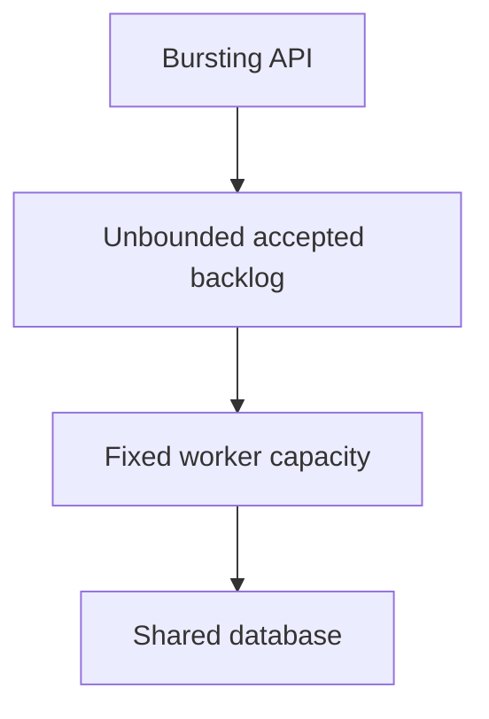
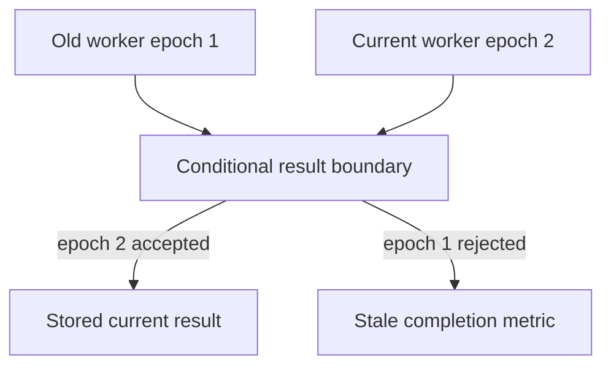
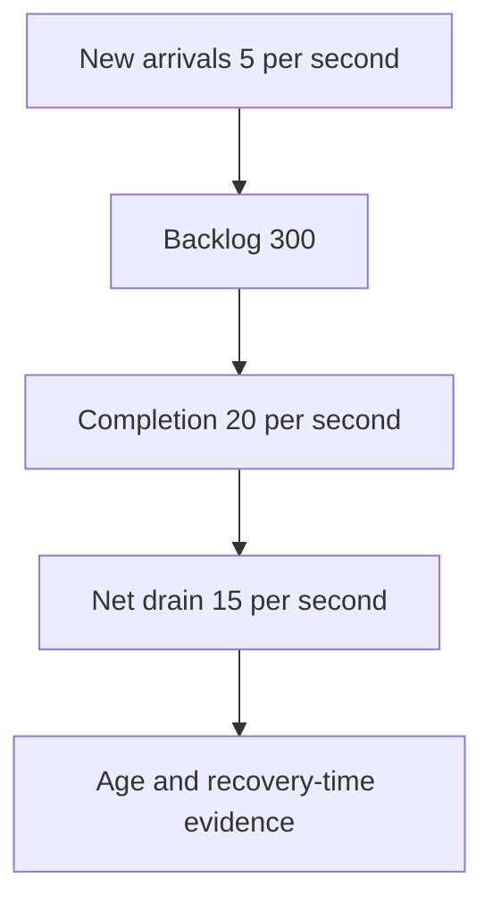

# 4. The flood

[Curriculum](../../../README.md) · [Data at scale](../README.md) · [Project index](../../../../indexes/projects.md)

## The reviewer's brief

> An import burst is ten times larger than normal. Your API accepts everything and the worker quietly falls a day behind. Bound admission and make every accepted operation’s outcome recoverable. What is the unit of deduplication?

This is a **constructed practice brief**, not an attributed company question.
Prerequisites: [project index](../../../../indexes/projects.md) and [prerequisite lesson](../../../03-production/01-system-design/design-method.md). This page is a build brief; it does not ship a runnable application. The original build and prompt sequence below defines the implementation checkpoints.

| Case | Exact input or workload | Expected outcome |
|---|---|---|
| Small example | Capacity 20 jobs/s, arrivals 100/s for 10 s, queue budget 300 jobs. | At most 200 complete during the interval and 300 remain admitted; reject at least 500 of 1,000 arrivals under this idealized model. |
| Boundary / failure | The same operation ID arrives twice concurrently with different content. | Reject/quarantine the conflict; do not return the first result as if the payload matched. |
| Scope | Queue budget is enforced at admission; SQS visibility is not an exclusive execution lock. | Explain any additional assumption before implementing it. |

<!-- project-expectation:start -->

## What you are expected to hand over

**The finished artifact:** Move the slow work off the request onto a bounded queue, make the work idempotent, rate-limit the entrances, then flood it on purpose and record what broke first.

Treat that sentence as a review contract, not an inspiration. A reviewable
submission contains all of the following:

- the narrow working slice or decision artifact described above, reproducible
  from a clean checkout with assumptions stated;
- captured proof of the normal flow **and** the boundary/failure row above;
- tests, probes, or metrics that can go red when the important guarantee breaks;
- a short decision record naming ownership, excluded scope, and the first
  operational limit; and
- a changed contract, diagram, and new evidence for each follow-up—not only a
  paragraph claiming the original design still works.

### How the review conversation gets harder

| Review gate | The interviewer changes | Expected response |
|---|---|---|
| Baseline | Run the small example from the table above. | Demonstrate the observable outcome end to end and identify which boundary owns it. |
| Failure | Reproduce the boundary/failure row above. | Show the failure before the fix, then prove the protected behavior without hiding the error. |
| Senior · A worker pauses past visibility | A second worker completes before the first resumes. What stops the stale completion? Predict which boundary must change before opening the design. | Condition writes on the current fencing generation and job state. The old process may still execute; only the destination boundary can reject its stale mutation. |
| Lead · The backlog must drain | After the burst, arrivals return to 5/s with completion 20/s. How long to drain 300 jobs? State what evidence would make you reject your first design. | Ideal net drain is 15/s, giving 20 seconds plus actual overhead. Measure age and per-job costs; stop scale-out at the database budget instead of scaling blindly on depth. |
| Evidence | A reviewer asks, “How do you know?” | Build in three stops: reproduce the small case and baseline failure; implement the protected boundary; then replay both changed requirements with captured outputs. |
| Handoff | The author is unavailable and the environment is new. | Another engineer can run, observe, break, and recover the artifact from the repository evidence. |

Before implementation, say the baseline invariant, the owner of each piece of
state, and what the user sees when the named dependency or assumption fails. That
five-minute explanation is part of the project: if it is vague, the build is not
ready to begin.

<!-- project-expectation:end -->

Before looking at the guidance, state the invariant in one sentence and trace the example. In interview practice, implement or sketch independently, then reveal the reasoning. During AI-assisted practice, use the prompts below and verify each checkpoint before the next request.

## Baseline and the failure to explain



A durable queue preserves work but does not create capacity or make unbounded waiting useful. A long visibility timeout cannot prevent every duplicate delivery.

<details>
<summary>Reveal the approach and decisions</summary>

Choose operation identity, atomic stored effect/result, queue/age limits and finite worker concurrency. The invariant is a durable terminal or visible pending state for admitted work, with bounded downstream demand. Guard completion with versions if jobs may be reclaimed.

</details>

## Follow-up 1 · A worker pauses past visibility

**Changed requirement:** A second worker completes before the first resumes. What stops the stale completion? Predict which boundary must change before opening the design.

<details>
<summary>Expected reasoning and changed diagram</summary>

Condition writes on the current fencing generation and job state. The old process may still execute; only the destination boundary can reject its stale mutation.



</details>

## Follow-up 2 · The backlog must drain

**Changed requirement:** After the burst, arrivals return to 5/s with completion 20/s. How long to drain 300 jobs? State what evidence would make you reject your first design.

<details>
<summary>Expected reasoning and changed diagram</summary>

Ideal net drain is 15/s, giving 20 seconds plus actual overhead. Measure age and per-job costs; stop scale-out at the database budget instead of scaling blindly on depth.



</details>

## Evidence to bring to review

Build in three stops: reproduce the small case and baseline failure; implement the protected boundary; then replay both changed requirements with captured outputs. Record commands, fixtures, and observed results in your implementation README. A diagram is a prediction until those checks run.

**Senior expectation:** Prove queue bounds, conflict handling and stale-result rejection. **Additional lead scope:** Own business obligations, replay windows and cross-tenant fairness. Completion demonstrates practice evidence; it does not establish interview readiness or multi-team delivery experience.

## Supplied mechanism practice

- [Lease and provider recovery lab](../../04-migrations/labs/recovery-migration/README.md) — includes its own run command, fixtures and validation limits.

These exercises verify specific boundaries; completing their reference tests does not implement or assess the full project.

## Build and prompt sequence

*A burst of work ten times bigger than normal arrives, and the system bends.*

**Build**

Move the slow work off the request onto a bounded queue, make the work idempotent,
rate-limit the entrances, then flood it on purpose and record what broke first.

**The thought process**

The first decision: **what is the unit of work, and is it safe to do twice?**
Because it will be done twice. At-least-once delivery is what you get in
practice, so the handler has to be idempotent, and idempotency is a property of
the *data model* (a unique key, a state machine) far more than of the code.

Second: **every queue needs a bound.** An unbounded queue is not resilience, it
is a memory leak with a scheduler, and the failure it produces is the worst kind
— nothing appears wrong for hours, then everything is wrong at once and the
backlog takes a day to drain.

Third, the one people find counterintuitive: **rejecting work is a feature.**
A system that accepts everything and then collapses serves nobody. A system that
sheds the excess quickly, with an honest response, keeps working for the people
it did accept.

**How to organise the prompts**

```
I am moving this work onto a queue. List what can now go wrong that
could not go wrong before — including the silent ones: work lost, work
done twice, and a backlog growing with nobody noticing.

Do not write code yet.
```

```
Make the handler idempotent, and prove it: a test that delivers the same
message twice CONCURRENTLY and asserts one atomic stored result for a
matching operation identity. For external effects, require the destination
idempotency protocol or an explicit unknown-outcome reconciliation path. Show me that test failing against the current handler first.
```

```
Bound the queue. Tell me what happens at the bound — reject, shed, or
block — and implement the one I choose. Then show me the bound being
hit.
```

```
Write a load generator that ramps until something fails, reports what
failed first and at what rate, and tells me from the DATA which
resource ran out rather than guessing from the architecture.
```

**On AWS**

**SQS** is the default and the right default: it is durable, it has retries and
a dead-letter queue, and it costs almost nothing at small volume. Why not
**EventBridge** — it routes events to targets and does not hold a backlog you
drain at your own pace, which is the property you actually want here. Why not
**Kinesis** — it serves ordered retained streams with independent readers;
choose capacity mode and price it for the actual workload rather than assuming
all modes use the same idle-shard billing shape.

Set two things deliberately: the **visibility timeout** longer than your
worst-case processing time (too short and the same message is handed to a second
worker while the first is still working, which is where duplicate side effects
come from), and a **dead-letter queue** with a redrive policy, so a message that
can never succeed stops being retried for ever.

Workers on **Fargate** with a service autoscaling on queue depth, or **Lambda**
with an SQS trigger and a **reserved concurrency** limit — that limit is the one
knob that stops a flood of messages becoming a flood of database connections.
That single sentence is why concurrency limits exist.

**What productionising it means**

The queue depth is a metric with an alarm, because an invisible backlog is the
whole failure mode. The dead-letter queue has something watching it. The handler
is idempotent and there is a concurrency test proving it. And you know the
breaking point, because you found it on purpose rather than in production.

**The learning**

A queue does not make work reliable, it makes work *deferred* — and it converts a
loud synchronous failure into a quiet asynchronous one. Everything you build
around it is there to make the quiet failure loud again.

**How you would know it is wrong**

- Deliver matching duplicates concurrently: one atomic stored result. Conflicting payloads must be rejected, stale owners fenced, and external effect uncertainty handled explicitly.
- Stop the worker and keep submitting. Does anything tell you the backlog is growing?
- Fill the queue past its bound. Confirm the behaviour is the one you chose.
- Count actual outbound requests during a retry storm, from the outside.
- Check the dead-letter queue has a consumer or an alarm. An unwatched DLQ is a folder of lost work.

**Stage it**

1. Work moved off the request, nothing bounded yet.
2. Idempotency, with the concurrent-duplicate test.
3. Bounds, rate limits and the chosen rejection behaviour.
4. A deliberate flood, with the breaking point and the first thing that broke written down.

---

[Back to the ordered project index](../../../../indexes/projects.md)
