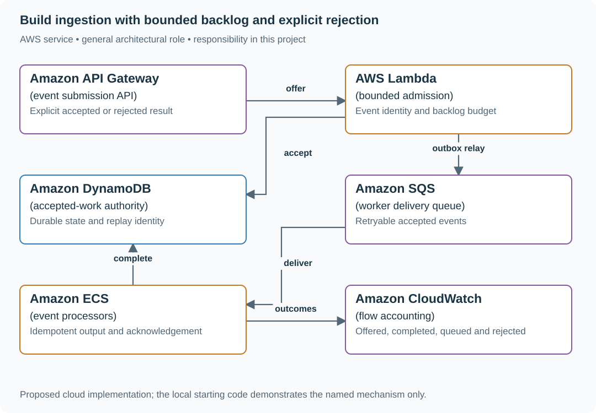
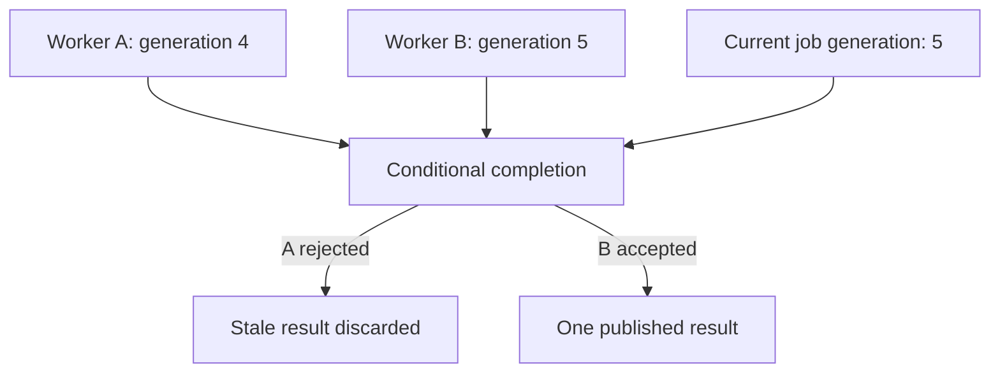

# Build ingestion with bounded backlog and explicit rejection

## Application background

An application accepts events from producers and processes them with background workers. Each accepted event waits until a worker can handle it. During a short burst, producers may submit much faster than the workers can finish.

The waiting area is limited to 300 events in this exercise. If 100 arrive each second and only 20 finish, it cannot absorb the excess forever. The service needs to tell producers clearly whether their event was accepted or rejected.

### Example walkthrough

| Action | Expected behavior |
|---|---|
| An event arrives while waiting space remains | Accept it under the declared storage guarantee. |
| The waiting budget is full | Reject new work or make the producer slow down explicitly. |
| The burst ends | Drain accepted work and show progress. |

Backpressure means asking upstream producers to slow down when the receiver cannot keep up. A rejection must not look like acceptance, or the producer may discard work the service never retained.

### Sizing that affects this decision

During the ten-second burst, producers offer 1,000 events while workers finish at most 200. With space for 300 still waiting, 500 events must be rejected in the supplied discrete-time model. Without rejection, the queue would need to hold the remaining 800 events at that point.

These are exercise assumptions. The [estimation reference](../../../01-code/01-problem-solving/estimation-constants.md) explains the units and approximations. They do not establish the local demo's measured capacity.

## Your assignment

**Deliver:** Build event acceptance and worker processing with a finite waiting budget. Show which events are accepted, rejected, still waiting and completed through the burst and recovery.

**Required behavior:** Accepted means durably owned work under a finite backlog policy. Keep event identity across retries, expose queue age, and reject excess before pretending it was accepted. A restart cannot lose previously acknowledged work.

The required first milestone is a working local implementation of the behavior above. The numbered implementation steps define the scope. The cloud architecture is a later extension, not something the starter has already provisioned.

## Get the code and run the supplied example

The code is in the public [junior-to-staff repository](https://github.com/Soulful-Iris/junior-to-staff). Install Git and Python 3.12+. No AWS account or Python packages are required for this first run. If you already have a checkout, use it and skip cloning.

```bash
git clone https://github.com/Soulful-Iris/junior-to-staff.git
cd junior-to-staff
python3 examples/architecture-starts/the_flood.py
```

**Supplied file:** [`examples/architecture-starts/the_flood.py`](https://github.com/Soulful-Iris/junior-to-staff/blob/main/examples/architecture-starts/the_flood.py). You can also [read or download the source here](../../../../examples/architecture-starts/the_flood.py).

This program is a **mechanism demonstration**: it runs the small scenario in one process and prints the result. It is not an HTTP service, a complete application, or an AWS deployment. A successful run demonstrates this mechanism only. It does not establish the workload or failure guarantees of the application you will build.

**Example output from the supplied run:**

Generated IDs and timestamps may differ. Compare the state transitions and outcomes.

```text
{'offered': 1000, 'completed': 200, 'queued': 300, 'rejected': 500}
```

### Set up your implementation workspace

Create `work/the-flood/` in your checkout (or use a separate repository). Copy the supplied mechanism into that directory as `mechanism.py`, then extract its state transitions into functions you can call from your implementation. The record and module names below describe what you must implement. They are not a promise that files with those names already exist. Keep a `README.md` beside your implementation with its exact run commands and observed results.

## Local components and state to implement

This table names the records, interfaces or decision inputs for your deliverable. Unless a name is explicitly linked to supplied source above, it is something you create. Implement the local state transitions first, then connect the HTTP, storage or worker boundaries required by the steps.

| Record / module | Key or interface | Responsibility |
|---|---|---|
| ingestion_record | producer,event_id,payload_hash,state | Durable acceptance and retry identity. |
| work_queue | event_id,enqueued_at,attempt | Delivery and measurable waiting. |
| checkpoint | partition,last_applied | Replay-safe output progress. |

## Implement the assignment

### 1. Make acceptance explicit

Validate an event envelope and stable producer/event ID. Commit accepted work before returning success. If capacity is exhausted, return a clear rejection with bounded retry guidance. An in-memory append is not durable acceptance.

### 2. Bound the actual queue

Track admitted unfinished work and enforce its limit atomically or through a defined admission authority. Keep oldest age and deadline/retention policy alongside depth. A larger queue buys waiting time, not processing capacity.

### 3. Consume with replay-safe effects

Store output identity/version before advancing progress or acknowledging delivery. Duplicate events cannot apply the effect twice. Poison events go to a visible quarantine/repair state rather than blocking unrelated work indefinitely.

### 4. Recover and reconcile counts

Stop arrivals, measure drain and reconcile offered = completed + queued + rejected under the exercise’s accounting model. Then restart a worker mid-batch and show that accepted identities remain traceable. Preserve late/failed outcomes rather than deleting them to improve throughput figures.

## Demonstrate the completed local result

| Action | Expected visible result |
|---|---|
| Run the starting program | The four totals are 1,000 offered, 200 completed, 300 queued and 500 rejected. |
| Restart a worker after output commit | Replay recognizes the existing effect. |
| Stop arrivals | The remaining 300 jobs drain at the measured useful rate. |

**Handoff:** In your implementation README, include the start command, one successful operation, the failure case above and the resulting stored state or decision. State which dependencies are simulated. Someone with a fresh checkout should be able to reproduce this without your chat history.

## Workload assumptions and capacity decisions

These are constructed exercise assumptions. The stated workload is a design target. The local demonstration does not establish that throughput. Use the [estimation constants](../../../01-code/01-problem-solving/estimation-constants.md) to check units before choosing capacity.

| Input or objective | Calculation / consequence |
|---|---|
| 100 arrivals/s × ten seconds | 1,000 offered events. |
| 20 completions/s × ten seconds | At most 200 completed during the burst. |
| 300 waiting slots | With that bounded queue, the exercise ends with 200 completed, 300 queued and 500 rejected. |

## Map the local implementation to AWS

**Deployment status: local only.** Running the supplied command creates no AWS resources and configures no cloud connections. The diagram is a proposed deployment of the completed application. Each box needs either a deployed runtime, a provisioned service or an explicitly external dependency.

Read the diagram by following the arrows from the entry point: application code accepts the request or event, the state owner commits it, and any worker produces the later result. The table ties those roles to code and adapter work. Multiple boxes do not imply multiple Python files already exist.



SQS can retain work, but the application must decide how much waiting it promises. The acceptance ledger makes overload and restart behavior observable to producers.

| Local responsibility | Cloud destination and role | Implementation still required |
|---|---|---|
| Local HTTP boundary or the endpoint you will add | Amazon API Gateway: event submission API | Create routes and an integration. Translate requests and responses and configure identity validation. |
| Python operation or worker function | AWS Lambda: bounded admission | Write a Lambda event adapter, package its dependencies and give its role only the required resource actions. |
| Local dictionary, SQLite records or state model | Amazon DynamoDB: accepted-work authority | Design partition/sort keys and write a storage adapter with conditional updates or transactions. Python state and SQL are not uploaded as a database. |
| Local pending-work collection | Amazon SQS: worker delivery queue | Publish committed job intent, consume messages and persist deduplication/ownership state. Add visibility, retry and dead-letter handling. |
| Application or worker process | Amazon ECS: event processors | Build a container and task definition. Supply configuration, task roles and graceful shutdown behavior. |
| Local counters, timestamps and diagnostic output | Amazon CloudWatch: flow accounting | Emit bounded metrics and logs, build the named operational view and configure retention and access. |

### Provision resources, then connect the application

| Resource or boundary | Initial configuration and reason |
|---|---|
| Admission | Enforce unfinished-work budget independently of SQS storage capacity. |
| Workers | Fixed initial concurrency tied to the measured 20/s dependency capacity. Bounded retries. |
| Retention | Durable accepted-work horizon and a named repair path for expired or quarantined events. |

Use one disposable AWS environment for the cloud exercise. Put the named resources in `infra/template.yaml` or your existing IaC tool, pass resource IDs through configuration, and scope each runtime role to its own tables, buckets and queues. The diagram is a design to implement. It is not a claim that these resources have been deployed. Record the commands you used to deploy and remove the exercise resources.

For concrete provisioning commands, configuration wiring and cleanup, use the [AWS foundation guide](../../../../examples/architecture-starts/infra/README.md). It includes a deployable table/queue/object-storage foundation and explains which application and service adapters you still implement.

A provisioned queue or table does not make the local program use it. Configure resource IDs in the deployed runtime, replace the local adapter, and replay the same successful and failing operation against that runtime. Record the deployed commit and observable result, then remove the disposable resources using your infrastructure tool.

## Extend the design after the baseline works


An event costs ten times the average. Move from count-only admission toward estimated work units while retaining a hard memory/byte bound for the queue.

<details>
<summary>Follow-up scenarios and worked designs</summary>

## Follow-up 1 · A worker pauses past visibility

**Changed requirement:** A second worker completes before the first resumes. What stops the stale completion?

<details>
<summary>Worked design and implementation</summary>

Condition writes on the current fencing generation and job state. The old process may still execute. Only the destination boundary can reject its stale mutation.

**Put authority in the completion write.** Queue visibility reduces ordinary duplicate overlap, but it cannot prove that an old process stopped. Persist a monotonically increasing job generation and require completion to match the current generation and state. Publication and result recording belong in that guarded transaction.

A holds generation 4, pauses, and B claims 5 and completes. Resume A and show its update rejected. If A performed an external effect first, separately demonstrate the provider idempotency or reconciliation path. Local fencing cannot undo external work.

**Revised flow.** These are proposed components to implement, not extra services started by the supplied demo.



</details>

## Follow-up 2 · The backlog must drain

**Changed requirement:** After the burst, arrivals return to 5/s with completion 20/s. How long to drain 300 jobs?

<details>
<summary>Worked design and implementation</summary>

Ideal net drain is 15/s, giving 20 seconds plus actual overhead. Measure age and per-job costs. Stop scale-out at the database budget instead of scaling blindly on depth.

**Compute net drain, not worker throughput.** Use `backlog / (completion rate - new accepted rate)` only while completion exceeds new accepted work. A backlog of 30,000 events with 500/s completion and 400/s accepted arrivals needs at least 300 seconds under constant rates. If arrivals remain 600/s, it grows.

Deliver a recovery table with offered, accepted, completed, rejected and queued counts. Cap replay separately from fresh traffic and retain the hard byte limit when event sizes vary. A dead-letter queue stores failures but contributes no processing capacity by itself.

</details>

## Supplied mechanism practice

- [Lease and provider recovery lab](../../04-migrations/labs/recovery-migration/README.md) — includes its own run command, fixtures and validation limits.

These exercises verify specific boundaries. Completing their reference tests does not implement or assess the full project.

</details>
