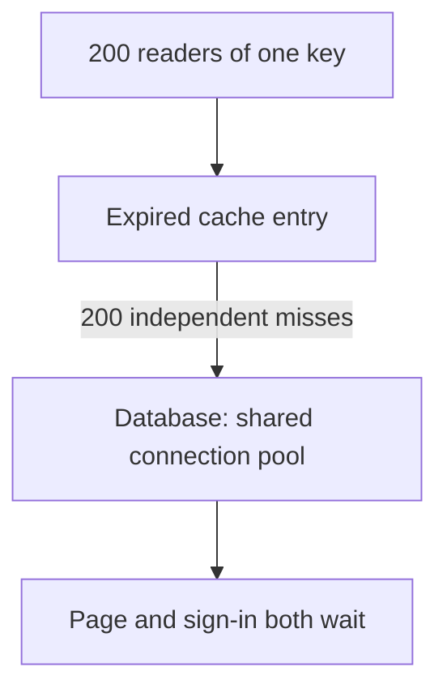
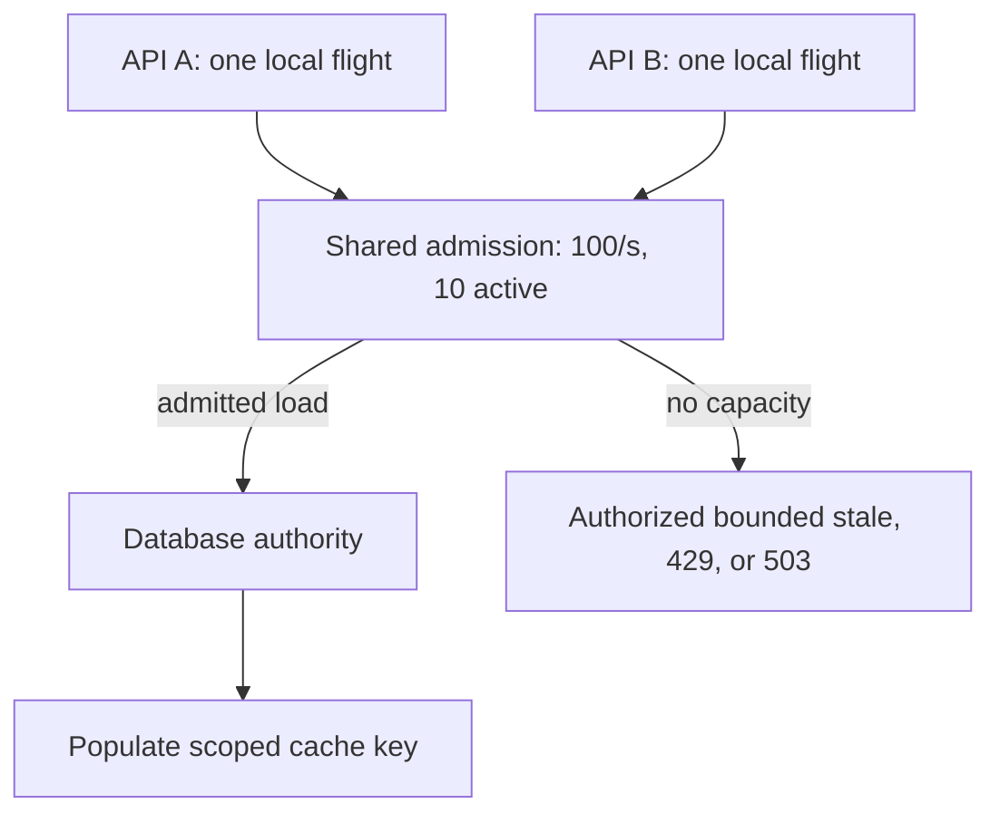
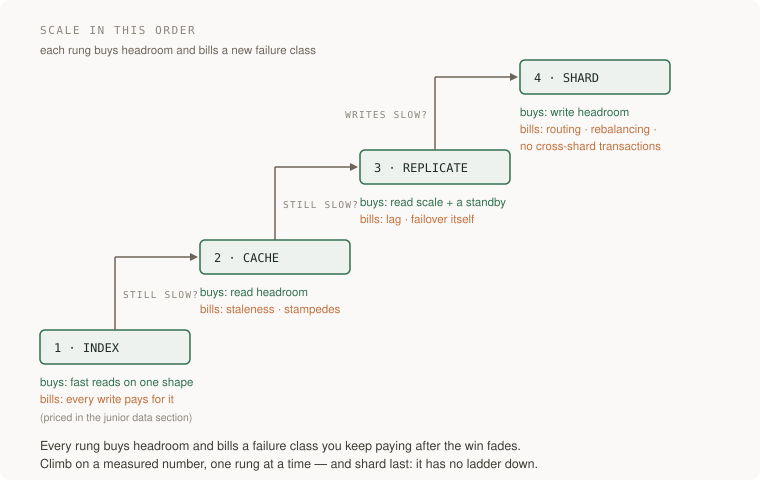
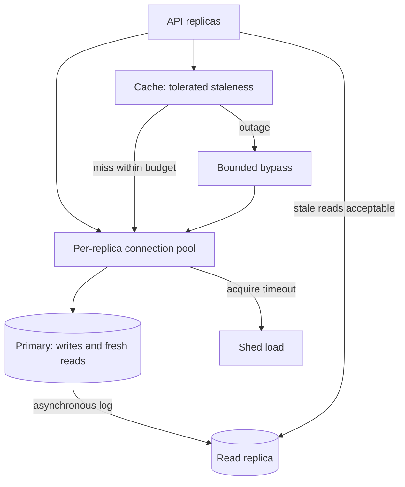

# Protect shared storage with bounded cache loads and consistent reads

[Curriculum](../../README.md) · [Process, search and store data at scale](README.md)

> Project connection · feeds [Reading-list stage 3: measure the application under load](../../../projects/reading-list/stages/03-under-load/README.md)

## Why one popular page can delay unrelated users

The reading-list app shows a group’s newest saved links. Its API normally reads that list from the database. A cache stores a copy for 60 seconds so repeated page opens can reuse it. That copy is disposable. The database remains authoritative for saved bookmarks and permissions.

At 12:00 the cached group list expires just as 200 readers open it. If each request independently reloads the same list, one expiration produces 200 database queries. Sign-in can then wait for database connections even though sign-in does not use this cache.

### Follow the two different correctness questions

| Situation | Question your design must answer |
|---|---|
| Many readers miss the same key | How many reloads can run within one process and across the fleet? |
| The cache is entirely unavailable | How much fallback database work can the system admit? |
| Ana saves version 8 while a replica has version 7 | Which reads must show her own new write? |
| A member loses access | Can an old cached result still be returned to them? |

Your task is to solve these boundaries separately. The [cache and consistency lab](labs/cache-consistency/README.md) supplies local counterexamples and fixes. It does not deploy Redis or create database replicas. The production diagrams explain the additional coordination and storage adapters a cloud implementation needs.

The workload below is hypothetical. A limit of 100 origin reads/s means requests reaching authoritative storage, not total browser requests. A cache hit can avoid such a read, but must still obey the access policy.


> **Constructed candidate brief:** “Two hundred readers hit one expired group
> page on ten API instances. The database has a 100 reads/s spare budget. Keep
> accepted work within that budget and state what each user sees. Then Ana saves
> v8 while a replica still holds v7: which reads must see v8?”

| Workload | Expected behavior | Boundary |
|---|---|---|
| 200 overlapping same-key misses in one process | One shared load | Successful loader; waiters share one flight |
| Same workload on ten uncoordinated processes | Up to ten loads | Process-local memory does not coordinate the fleet |
| 1,000 misses/s, 100 spare origin reads/s | At most 100 admitted origin reads/s | Stale, 429, or 503 for excess, according to policy |
| Save v8; pin expires at 5s; lag lasts 10s | v8 or an explicit unavailable response for strict reads | A finite pin alone can return v7 at 6s |

Work from one key and one invariant, reproduce the bad interleaving, identify
where coordination lives, then enforce both a concurrency and a rate budget.
Run the [cache and consistency lab](labs/cache-consistency/README.md)
before choosing a cache service.



Predict the corrected query count before adding the shared-task boundary. Then
change the workload to ten instances and place the fleet budget explicitly.



**Senior follow-up:** cancel the first waiter while followers remain and show
that shared work and cleanup are correct. **Lead follow-up:** the shared limiter
is unavailable; choose a fail-closed or preallocated local-budget policy and
prove the maximum possible fleet load. Copying the full fleet budget into every
instance is not a safe fallback.

## The principle behind the design

Load can exhaust connections, disk, CPU, I/O, locks, or downstream capacity. This lesson follows a read-heavy workload whose database becomes saturated by cache misses. Every fix buys headroom and bills a new failure class, so the
skill is knowing the price list and climbing in the cheap, reversible order.

## Follow the failure through the system

The reading list is humming: eighty thousand items, a few hundred users, the
group page cached with a sixty-second TTL because someone measured the query at
400ms and did the sensible thing.

Then a newsletter links to it. Traffic rises 40x and for fifty-nine seconds
nothing happens: the page is one cache hit. Then the key expires. Two hundred
requests miss at once, and each independently runs the 400ms query to
repopulate it. The database gets two hundred copies of its most expensive
query. Its configured hundred connection slots fill, and later requests wait. Now sign-in fails too, because sign-in needs a
connection too. The on-call restarts the app servers — dropping
every warm key onto a cold database.

None of this was volume; eighty thousand rows is nothing. The cache — added as
a performance fix — converted one slow query into a full outage, because a
cache without stampede protection is exactly that machine.

## Mechanisms and their limits

**What load hits first depends on the workload.** Measure arrival/service rates,
bytes, CPU, I/O, lock wait, saturation and skew. Four useful questions for this
read-heavy example are:
*Connections*: a database connection is scarce and stateful — the example database is configured for 100 connections — and every feature
competes for the same pool. The first purchase is rarely hardware: a pooler
(PgBouncer, say) and a pool-full decision. *Query shape*:
[the application foundations](../../02-applications/02-databases/data-models-and-queries.md) taught that a scan
grows with the table; concurrency is worse: two hundred copies of one slow
query fight for the same pages, locks and pool slots. *Read pressure*: this
example reads more than it writes; that is a workload assumption, not a law. *Failover*: at
scale the database is the dependency that dies; the seconds where nobody is
primary are designed, not caught.

**A read-heavy scaling example, and what each option costs.**



Choose from a measured constraint, not a mandatory order. An append-heavy
ingestion service can saturate disk bandwidth while reads and connections are
quiet: smaller records, batching or more write capacity may help, while a read
cache will not. A queue buffers a temporary mismatch; it does not increase
steady-state service capacity.

1. **Index** — buys fast reads on one query shape; the bill — every write pays —
   was priced in the junior data section. Try it when the query plan identifies
   avoidable read work; another index can make a write-bound workload worse.
2. **Cache** — buys read headroom from a copy, and bills two failure classes.
   *Invalidation*: the copy can disagree with the truth, and enumerating every
   write that must refresh it is now your job. *The stampede*: when a hot key
   expires, every concurrent reader misses at once and recomputes. The
   mechanisms solve different problems. **Single-flight** shares one in-flight
   load per key within its coordination boundary. **Stale-while-revalidate**
   defines a stale response policy; refreshes still need coordination if one
   loader is required. **TTL jitter** spreads expirations across different keys;
   **probabilistic early refresh** reduces synchronized refresh risk. Neither
   jitter nor probability gives deterministic exclusion on one expired key.
3. **Replicas** — buy read scale and a standby. The bill is **staleness**:
   asynchronous replication permits a replica to lag; it may also be caught up.
   Without an enforced bound, lag can exceed any chosen timer. Failover is an event
   that can fail: promote an async replica, and writes the old primary
   acknowledged but never shipped are gone.
4. **Shard** — splits data across databases by a key; the only rung that buys
   partitioned write headroom when the workload permits it. Index tuning,
   batching, and vertical capacity can also improve writes. The bill: queries
   must know where to look (routing),
   growth means moving live data (rebalancing), and cross-shard transactions
   and joins need explicit support. Some distributed databases coordinate
   cross-shard transactions; their latency and availability costs remain. Plain
   PostgreSQL does not transparently distribute a table across independent
   servers. Rebalancing and consolidation need a migration protocol.

**Queues.** A queue buys two things: it absorbs bursts, and it decouples
failure — the fetcher being down stops fetching, not adding. It bills three:
ordering (only per-key order survives, and only arranged); the chosen delivery contract may permit duplicates, as **at-least-once** delivery does, because a consumer that crashes between the work and
the acknowledgement gets the message again; and the backlog is invisible until
you instrument it — the product looks healthy while work quietly ages.

**Delivery semantics.** Exactly-once claims have a scope and a failure model.
Kafka transactions can coordinate consumed offsets with produced Kafka records.
An external database write or email does not automatically join that transaction.
After an external effect succeeds but before acknowledgement, a crash can cause
redelivery. Coordinate the effect and deduplication record atomically where
possible; otherwise use a destination-supported idempotency key or reconcile
uncertain outcomes. An outbox commits a business row and outgoing event together,
then relays the event. The relay may still publish duplicates, so consumers
still need deduplication. See [Kafka's design documentation](https://kafka.apache.org/41/design/design/)
for the transaction-boundary discussion.

**Backpressure.** A queue with no bound is a memory leak with a scheduler: when
arrivals outrun service long enough, it eats memory or disk and fails at
the worst moment. Every buffer needs a bound and a policy for full — block,
shed, or degrade. Not choosing is choosing "crash later".

**What "eventually" costs.** "Eventually consistent" is a claim about the
system converging. The user who pressed save lives in the meantime: the write
went to the primary, the next read hit a replica that has not seen it, and the
edit is gone from the screen. So they save again — now there are two — or stop
trusting the product. With replica reads, **read-your-writes** is the floor:
route strict reads to the authoritative primary, or carry a session watermark
and use only a replica proven to have applied it. Waiting must have a deadline
and fallback. A finite primary pin is a latency heuristic, not a read-your-writes
guarantee when lag can outlast it. If the primary fails before async replication,
the acknowledged write can be lost; session routing cannot restore missing data.


## What good looks like

- A pooler with a chosen size and a written pool-full answer: wait how long,
  then fail how.
- Every cache key has a written invalidation story and a named stampede
  protection, tested by expiring a hot key under concurrency.
- Reads that must see a user's own write have a stated route to it.
- Every queue and buffer has a bound and a full-policy; dashboards show backlog
  **age**, not length.
- Consumers are idempotent, proven by a test that delivers the same message
  twice.
- Each rung climbed on a measurement, recorded next to the change.
- Failover has been rehearsed, and writes in flight have a known fate.

Done badly, you see:

- Round-number TTLs expiring together; a deploy that clears every cache while
  the database finds out.
- A replica "for performance" while every read still hits the primary — or
  reads on replicas and nobody has heard of lag.
- An exactly-once claim without naming its transaction boundary, failure model, and external effects.
- A backlog discovered over ssh, during the incident.
- Sharding proposed in the first design review, before anyone read a plan.

## Use an assistant to investigate specific questions

**Request 1 — find the saturating resource before touching anything**

```
Under load, the group page slows down and sign-in starts failing too.

Do not propose a fix yet. List what you would measure to find which
resource saturates first — connections, one query's plan, locks, CPU,
cache misses — and for each, the command and what a bad number looks
like.

Then, given [pool stats, EXPLAIN ANALYZE, error rates]: name the
bottleneck and the simplest change that addresses it. Compare query/index,
batching, admission, capacity, cache, replication or partitioning as relevant.
Explain why plausible alternatives do not address this measured constraint.
```

*Why it is asked that way:* "do not propose a fix yet" does the work — a
model's reflex is a cache or a bigger instance before knowing what is full.
Comparing the measured constraint with each mechanism prevents a technology checklist.

*What you should get back:* that sign-in failing beside one slow page points at
a shared resource: connections, CPU, locks or I/O are hypotheses to test.
An unconditional "add Redis" without resource evidence skips that diagnosis.

*Push back on:* any technology proposed without showing that it addresses the
measured constraint, including a connection pooler or index.

**Request 2 — a cache that fails the way you chose**

```
Add caching for the group page. Requirements:

1. The invalidation story: every write path that must touch this key,
   enumerated. If you cannot enumerate them, say so and fall back to a
   TTL with a stated staleness cost.
2. Name the coordination scope. For 200 overlapping readers in one
   process, share one in-flight load; test ten independent instances
   separately. Jitter spreads different-key expiry; it does not lock
   one key. State loader failure, cancellation, and lease behavior.
3. Budget cache-outage bypass: at 1,000 misses/s with only 100 spare
   origin reads/s, admit at most 100/s and bound concurrent work.
   Choose authorized bounded-stale responses, 429, or 503 for the
   remainder. Test actual origin calls and peak in-flight work.
```

*Why:* the requirements separate response freshness, same-key coordination,
and downstream survival. A cache outage should not trigger a database outage.

*What you should get back:* code plus a test asserting a count of database
hits, not a latency. The count is the check that can go red.

*Push back on:* unlimited bypass or an at-most-one claim with no stated process
boundary, failure model, or enforcement point.

**Request 3 — a consumer that survives what queues actually do**

```
Move the link-fetch onto the queue. Messages may be redelivered; this
chosen queue may also reorder them. Delivery-count guarantees do not by
themselves define ordering. Name and test both contracts.

Design the idempotency: what is the message key, where is it stored,
and which database constraint turns a second delivery into a no-op?
In-memory dedup does not count; the process that remembers is the
process that crashes.

State what bounds the queue and what the producer does when it is
full: block, shed, or degrade. "It will not fill" is not an answer.

Tests: deliver one message twice and assert the effect happened once.
Kill the consumer after the write but before the acknowledgement and
assert the message is redelivered.
```

*Why:* permitted duplicates are a required failure case, not a prediction that
every message duplicates. Commit the deduplication record and local effect
atomically. A transactional outbox prevents lost publication but its relay can
still duplicate; external effects need provider idempotency or reconciliation.

*What you should get back:* a consumer whose second delivery dies on a unique
constraint, an explicit bound, and both tests. "Exactly-once" as a
client-library setting is the boundary error this section removes.

## How you would know it is wrong

Each of these can go red, cheaply:

1. **Expire the hot key under load.** Hold 200 concurrent requests on the page,
   delete the key mid-run, and count queries at the database
   (`pg_stat_statements`, or a counter in the recompute path). One successful
   shared load per process is the local-flight assertion. Test fleet scope,
   exceptions, cancellation, and outage admission separately.
2. **Kill the consumer for ten minutes** under write load. Adding items must
   keep working, the backlog must be visible on a graph that existed before the
   test, and you can time the drain after restart. If you learned
   the backlog size over ssh, "invisible" was the finding.
3. **Deliver the same message twice** and count the rows: the effect happened
   once, or it did not. Then harder: crash the consumer after its write but
   before its acknowledgement, let redelivery happen, count again.
4. **Pull the primary in staging** and time the failover, then compare
   acknowledged writes before against rows present after. A difference is not a
   test bug; it is what async replication promised.

> The standing rule: before believing a green result, say what broken would
> have looked like. A stampede test that never actually expires the key under
> concurrency passes forever and proves nothing.

## Apply this lesson to the reading-list application

On **P3**, the reading list meets load on purpose:

- A load harness — anything that can hold N concurrent requests — and a written
  baseline: p50 and p99 for the group page at rest and at N.
- A pooler with a chosen size, and a sentence on what happens at exhaustion.
- The group page cached, stampede protection named, and the expire-under-load
  test checked in, asserting on database hits.
- The link-fetch on a bounded queue: full-policy stated, consumer idempotent,
  backlog age on a graph.
- An escalation record: each rung climbed and the measurement behind it.

**Acceptance criteria you can check yourself:**

- Disable local sharing and count 200 loads; enable it and count one overlapping
  load in one process. Ten isolated processes may load ten times. Record the
  actual scope and test outage rate/concurrency caps and lag beyond stickiness.
- Ten minutes of dead consumer: adding items still works, and the drain time
  comes from a graph, not a guess.
- Drop the consumer's unique constraint on a copy and the deliver-twice test
  goes red.
- Partitioning is justified by a measured constraint if chosen. Otherwise state the observation that would make you reconsider it.

## Terms used in this lesson

- **connection pool** — the fixed set of connections the whole product shares;
  its size and acquisition waits are one possible bottleneck.
- **cache stampede** — every reader missing at once when a hot key expires,
  recomputing in parallel; also thundering herd.
- **single-flight** — one request recomputes an expired value; the rest wait or
  take stale.
- **stale-while-revalidate** — serve the expired value now, refresh it in the
  background.
- **replication lag** — how far a replica runs behind the primary; unbounded
  under load unless watched.
- **read-your-writes** — a user's reads see their own writes; the floor for
  reading from replicas.
- **shard** — one slice of the data, split by key so writes spread. Buys
  writes, bills routing and rebalancing.
- **at-least-once** — deliveries can repeat, so the consumer must make repeats
  harmless.
- **idempotent consumer** — processing with the same effect once or twice,
  usually via a unique key the database enforces.
- **outbox pattern** — business write and outgoing message committed together,
  published afterwards by a relay.
- **backpressure** — pushing "slow down" upstream when a stage is full: block,
  shed or degrade, chosen rather than defaulted.

---

**Not covered here:** isolation levels and locking (two transactions on the
same rows); choosing a non-relational engine when the data stops being
row-shaped; search and analytics; and distributed transactions beyond the
outbox — sagas sit with the migration work. Timeouts, retries, load
shedding and backups you have actually restored live in
[Set an error budget and bound retries during overload](../../03-production/05-reliability/failure-budgets.md).

[Learning sequence](../../README.md) · [Independent practice](../../../practice/interview-guide.md)

## Draw it from memory · Protect the database before adding replicas



**Redraw challenge:** Add ten API replicas. Recalculate the total connection budget before celebrating more capacity.


[Static view](../../../assets/learning/connection-pool-still.svg)
