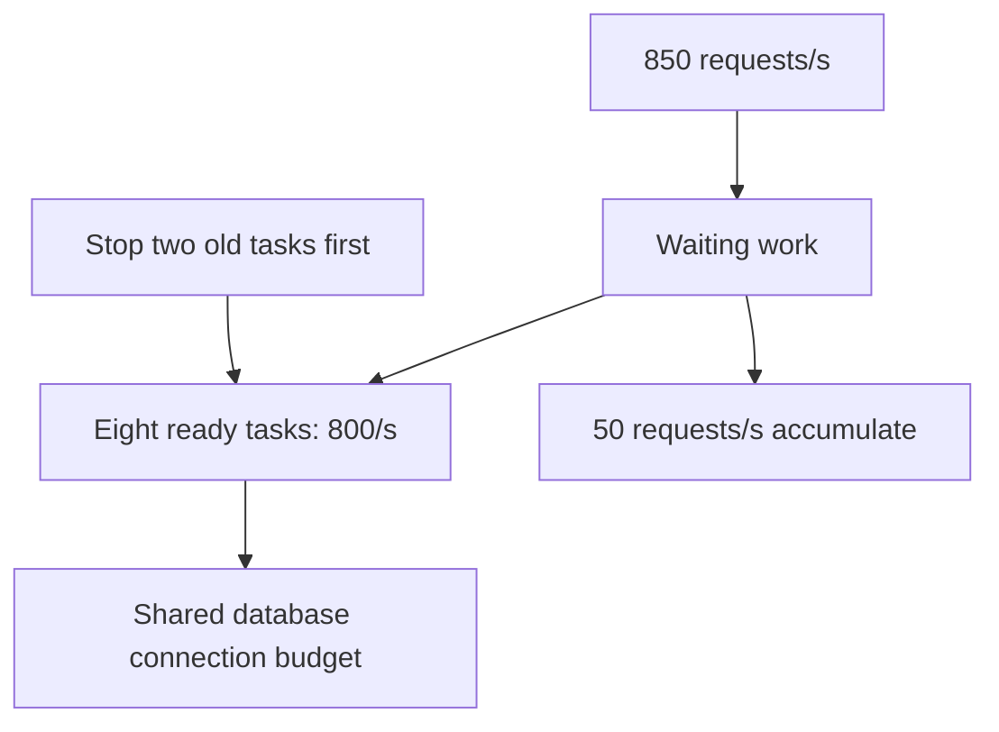
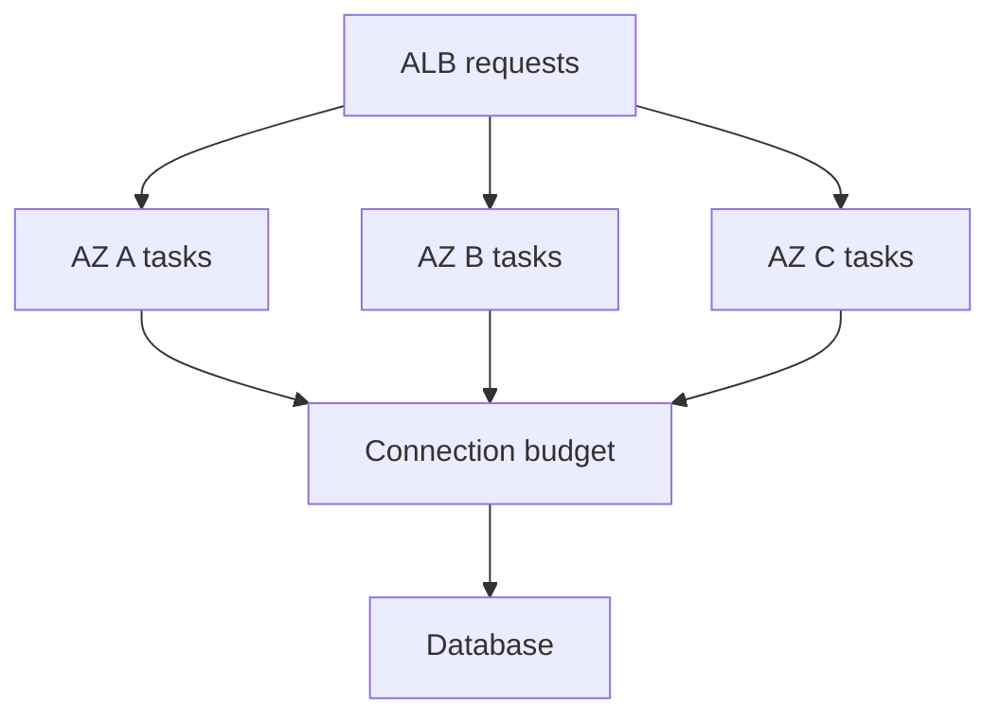
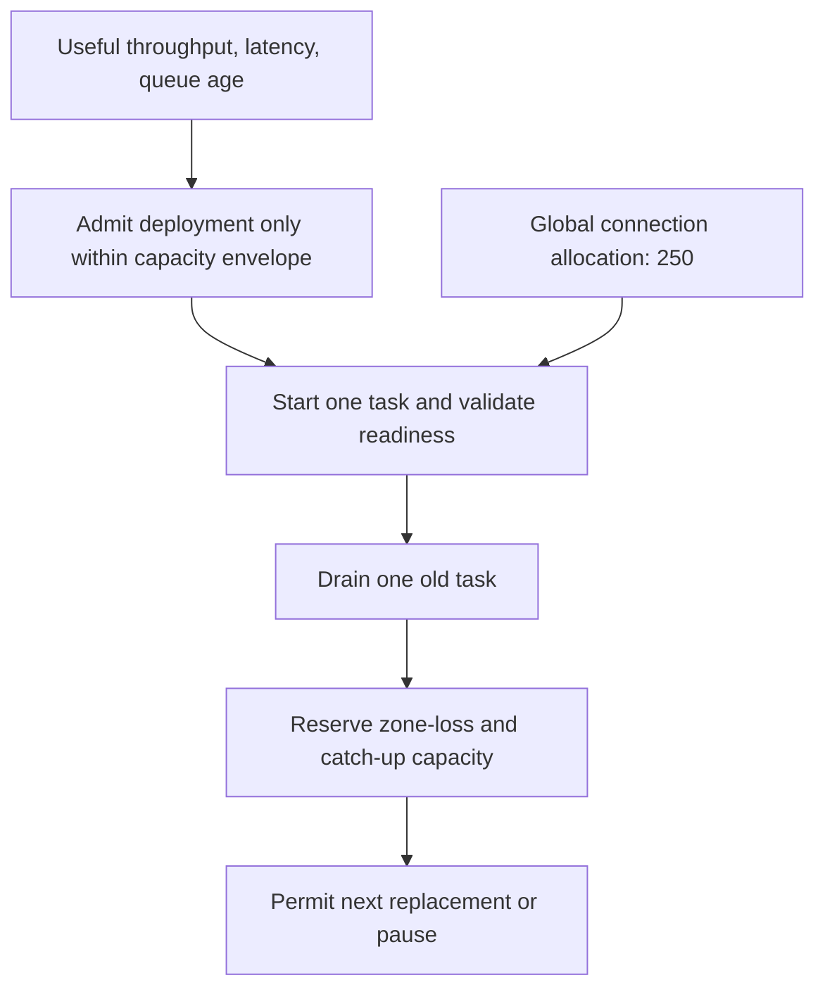

# Reserve capacity for rollout, zone loss and backlog recovery

[Curriculum](../../../README.md) · [Capacity, performance and cost](../README.md)

## Application and assignment

An API uses ten running tasks to serve traffic. Replacing two tasks before their replacements become ready removes capacity even if the new code is correct. Waiting requests accumulate, and rollback must leave spare throughput to drain them.

Calculate temporary capacity, waiting work, and downstream connection demand. Propose a rollout sequence, then extend it to zone loss and increased demand. This is a design/build exercise with hypothetical inputs. An ECS deployment and its measured task capacity are separate implementation work.

## Starting contract

> “Ten workers sustain 850 requests/s. A harmless deployment stops two before replacements are ready. Users see rising queue age even after rollback. Calculate a safe rollout, then survive a zone loss while demand grows thirty percent.”

Constructed interview brief. Prerequisites: [capacity and queue arithmetic](../../../03-production/05-reliability/labs/reliability/README.md); no AWS deployment is needed to reason through the numbers.

| Contract | Workload / expected outcome |
|---|---|
| Baseline | Ten tasks × 100 requests/s under the agreed latency target = 1,000/s |
| Failure | Two tasks removed → 800/s; 850/s arrival adds 3,000 queued requests in 60 seconds |
| Recovery | Restored 1,000/s leaves 150/s spare → ideal 20-second drain |
| Downstream | 20 connections/task, 250 application connections allowed; full ten-task surge requests 400 |
| Excluded | Constant-capacity arithmetic is not a measured AWS limit or a proof of p99 latency |

## Baseline to challenge

Start with useful completions at the latency objective, not desired replica count. Subtract removed/unready capacity, then calculate arrivals minus completions and catch-up spare throughput. Inspect every shared downstream budget before proposing a larger surge. Predict the first exhausted resource, then open the worked design.

**Real event:** GitHub Actions, August 6, 2026. Replacing pods during a routine deployment temporarily removed capacity. Remaining infrastructure saturated; rollback showed the code change itself was not the cause. GitHub added capacity, throttled incoming work, and repaired invalid-job retries that delayed recovery. [Primary report, published September 9](https://github.blog/news-insights/company-news/github-availability-report-august-2026/).

**Takeaway:** A deployment consumes capacity even when its code is correct. Budget for replacement and recovery.

[Static diagram](../../../../assets/learning/rollout-capacity-still.svg)

These diagrams use illustrative workloads. AWS mappings are our learning designs.

Work the example · AWS implementation · failure drill

## Work the numbers

Our simplified service has 10 tasks, each sustaining 100 requests/s under the agreed latency target. Incoming traffic is 850/s. Utilization is 85%. Removing two tasks leaves 800/s of capacity: a deficit of 50/s. With an unbounded queue and no expiry, one minute accumulates 3,000 requests. At the restored capacity of 1,000/s, only 150/s is available for catch-up, so ideal drain time is `3000 / 150 = 20 seconds` while fresh arrivals continue.

Those calculations assume constant independent service capacity and no retries, cold caches, database bottleneck, or queue overhead. Measure real saturation experimentally; capacity can fall under overload.

Three equal Availability Zones need a separate failure budget. Losing one removes a third of capacity. Even without a deployment, surviving one AZ requires load no greater than two-thirds of total capacity under these assumptions. Deployment surge capacity does not establish AZ-loss tolerance.

The shared database budget is intentional: three AZ boxes are not three independent copies of every dependency.

## AWS implementation exercise

For an **ECS rolling deployment**, `minimumHealthyPercent=100` and `maximumPercent=200` permit replacement tasks to start before old tasks stop, provided placement capacity and quotas allow. These are scheduling constraints, not proof that an application is ready or that the database can absorb twice as many connections. [ECS deployment rules](https://docs.aws.amazon.com/AmazonECS/latest/developerguide/deployment-type-ecs.html).

Example: 10 tasks each own a 20-connection pool. A full surge can demand 400 database connections, compared with 200 normally. If the database's application allocation is 250, the new deployment can fail despite abundant CPU. Bound total connection demand, choose a smaller surge, or introduce and validate a suitable pooling layer. Pooling does not create database query capacity.

In a disposable ECS service, measure readiness after initialization, keep liveness independent from transient downstream slowness, handle SIGTERM, and allow in-flight requests to drain. Run a fixed-rate load during replacement and during a slow dependency. Track task/sidecar memory and CPU, ALB target health, connection usage, p99 latency, and useful completions.

## Failure drill and expectations

**First predict:** which fails first: application CPU, proxy CPU, network flows, connection pool, or database? Then collect enough telemetry to distinguish them. Do not treat more replicas as a universal fix; more replicas may open more database connections.

| Level | Demonstrate | Above the baseline |
|---|---|---|
| Junior | Explain readiness versus liveness and graceful drain | Identify a request killed during shutdown |
| Senior | Calculate rollout and failure headroom | Include warm-up, downstream limits, and queue drain |
| Staff | Set a measurable availability envelope across teams | Price spare capacity against exposure and recovery time |

**Changed requirement:** demand grows 30% while an AZ is unavailable. Recompute the capacity envelope before adjusting autoscaling; show placement capacity, quotas, and startup delay, not only desired replica count.

## Follow-ups that change the design

**Senior: startup is slow.** A replacement takes 90 seconds to become ready. Keep the old task until its replacement passes a real readiness check; terminating two first would accumulate `50×90 = 4,500` requests under the toy assumptions. At restored capacity, ideal drain becomes `4500/150 = 30 seconds`. A closed-loop load test may reduce arrivals while waiting; preserve the fixed-rate 850/s workload to expose the deficit.

**Lead: demand grows while one zone is lost.** New arrivals are `850×1.3 = 1,105/s`. With three equal zones and 100/s tasks, at least twelve surviving tasks are needed; use eighteen evenly placed tasks (six per zone), leaving twelve and 1,200/s after loss. Spare recovery throughput is only 95/s. Eighteen 20-connection pools require 360 connections and violate the 250 allocation. Thirteen/task uses 234; a one-task surge uses 247, but the query workload still needs validation. A simultaneous zone loss and rollout needs another explicit budget.

This is a build brief. Submit an open-arrival-rate load harness, readiness/drain handler, resource-envelope calculation and recovery trace. Acceptance: repeat at 850/s with slow warm-up; measure actual queue growth against the model; exceed the connection budget deliberately and show the deployment gate pauses. The arithmetic does not certify real task capacity. Do not create AWS resources unless doing the separately described disposable implementation exercise.

[Production casebook](../../../../indexes/production-cases.md) · [AWS implementation](../../../03-production/03-infrastructure/aws/README.md)
