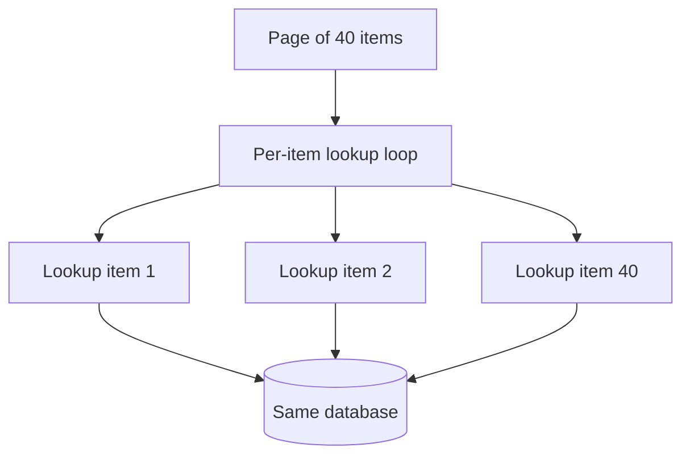
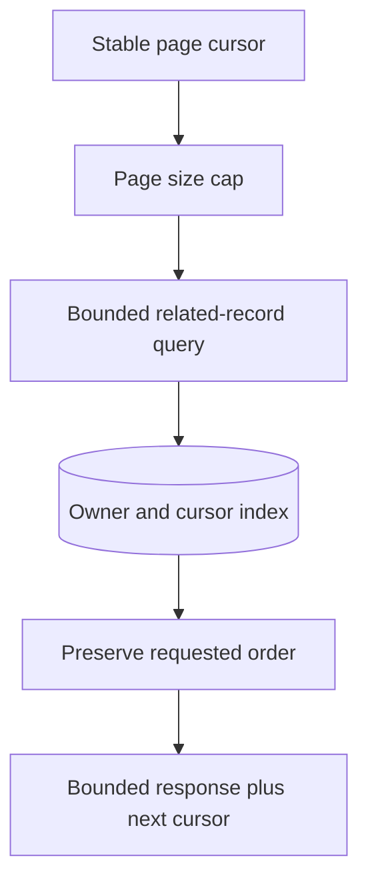
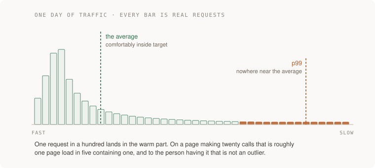
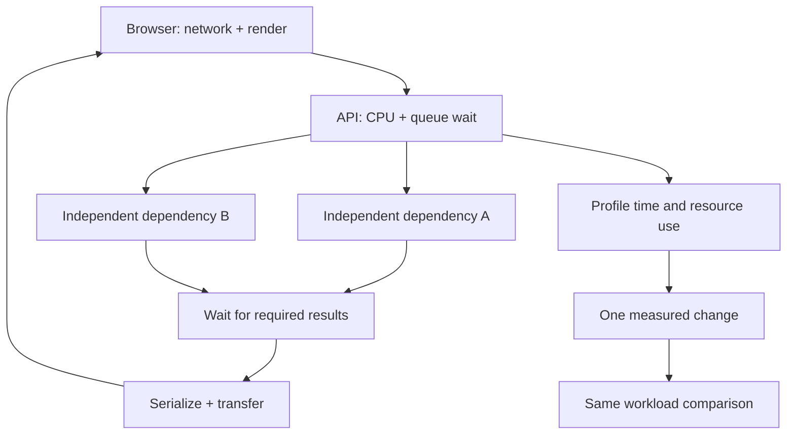
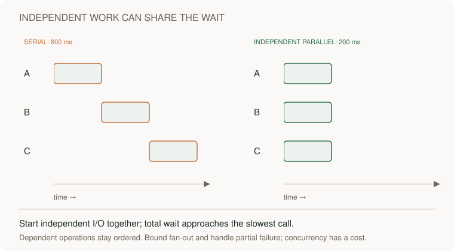

# Performance and cost

[Curriculum](../../README.md) · [Performance and cost](README.md)

> Project connection · feeds **P3 (it holds under load)**

## At the whiteboard

> “A list endpoint takes 900 ms. An engineer made one helper four times faster,
> but the endpoint barely improved. Show me the measurements you want before
> proposing the next optimization.”

Performance work starts with attribution: which operation accounts for elapsed
time, resource consumption, and user-visible delay under the actual workload?

| Sequential teaching request | Before | After helper optimization |
|---|---:|---:|
| Helper | 40 ms | 10 ms |
| Repeated database lookups | 800 ms | 800 ms |
| Remaining work | 60 ms | 60 ms |
| Total | 900 ms | 870 ms |

The endpoint improves by about 3.3%, not fourfold. **Ask first:** are these
operations sequential, and which percentile and workload produced the numbers?



## Choose an optimization you can evaluate

1. Capture a trace or profile and query count under representative data sizes.
2. Identify repeated work: fetch related records in a bounded batch rather than
   issuing one query per item, while preserving ownership and output order.
3. Compare before and after on the same workload. Report latency distribution,
   CPU, queries, transferred bytes, and errors, not only a microbenchmark.
4. Attribute cost per useful operation. Fewer CPU seconds may not reduce a bill
   dominated by idle capacity, storage, or data transfer.

**Follow-up:** “The page can now contain 100,000 items.” A single unbounded batch
is not the fix; add pagination and bounded batch size, then remeasure.



Senior depth explains the bottleneck and verifies the result. Lead depth includes
capacity forecasts, workload isolation, budgets, and the ongoing cost of the
optimization itself.

## The one-liner

Performance and cost are the same skill pointed at different units. Both are
found by measuring where the time or the money actually goes, and both are lost
by optimising what you assumed. The hard part is not making things faster. It is
finding out what is slow, which is almost never what you think.

## The failure it prevents

An engineer spends three days making a function four times faster. It was
already 0.4% of the request. Nothing measurable changes, and the change ships
with a paragraph about the improvement.

Meanwhile the actual cost is a query in a loop — the same lookup, once per item,
ninety times per page — and nobody found it because nobody profiled, because
everybody already knew where the slow part was.

The cost version is quieter and more expensive. A bill goes from four hundred
dollars a month to two thousand over a quarter and nobody can say which change
did it, because cost was never attributed to anything. By the time somebody
cares it is archaeology, and the usual response is to turn off the thing that
*looks* expensive rather than the thing that *is*.

## The mental model

Three things, and the first is the whole section.

**Averages lie, and they lie in the direction of comfort.**



An average latency of 180ms sounds fine. If the p99 is 4 seconds, then one
request in a hundred takes four seconds — and on a page making twenty calls,
roughly one page load in five contains one of them. The people having the worst
time are invisible in the average and they are the ones who leave.

So: **percentiles, always.** p50 to know what typical feels like, p99 to know
what bad feels like, and the gap between them to know how consistent you are.

**Most systems wait rather than compute.** The profile of a normal web
application is dominated by waiting: on the database, on a network call, on a
lock, on the disk. This is why intuition fails — engineers reason about
algorithms, and the answer is usually a query, a missing index, or a call that
should have been made once and is being made ninety times.

**Cost is a performance metric with a currency.** The same flame graph that shows
you where the time goes is showing you where the money goes, because the money
is compute time. Which means one instrument answers both questions, and the
second question only feels different because it arrives on an invoice instead of
in a dashboard.

### Continuous profiling, which changed what is possible

Profiling used to be something you did locally, on a synthetic workload, hoping
it resembled production. eBPF-based profilers changed that: they sample the
whole machine from the kernel in production. Overhead depends on the profiler,
sampling configuration, workload, and environment. Measure CPU, latency, dropped
samples, and storage before accepting an always-on budget.

What that buys you is the thing that was previously impossible: **a diff flame
graph between two versions.** Not "is this fast" but "what did this release
change about where time goes". Some teams fail a deploy on a regression in it.

*(Checked 2026-09-21; see [docs/research/senior-craft-2026.md](../../../docs/research/senior-craft-2026.md) for sources and what could not be verified.)*

### Attribution is the whole cost discipline

You cannot manage a number you cannot break apart. The engineering work is
tagging — by service, by environment, by team, by feature — so that "the bill
went up" becomes "the bill went up because of this". The FinOps community has a
standard data format for this (FOCUS) so that the same analysis works across
providers.

The question to be able to answer is the **unit cost**: what does one request,
one user, one job cost? Almost nobody can answer it, and the teams that can make
different decisions.


## What good looks like

- You quote percentiles, not averages, and you know your p50/p99 gap.
- You profiled before you optimised, and you can show the profile.
- After the change you measured the *same percentile* again and the number moved.
- Cost is attributed: you can say which service or feature owns a line on the bill.
- You know the unit cost of the main thing your system does.
- Some optimisation was rejected because the measurement said it did not matter.

Done badly:

- "It feels slow" as a diagnosis, followed by a rewrite.
- Optimising the thing that was easy to measure rather than the thing that hurt.
- A benchmark on your laptop, standing in for production.
- An average on the dashboard and no percentiles anywhere.
- Cost discovered monthly, by whoever opens the invoice.
- A performance fix with no before-and-after at the same percentile, which is indistinguishable from no fix at all.

## Ask Claude for this

**Request 1 — read the profile, do not theorise about the code**

```
Here is a profile (or a flame graph export). Tell me where the time
actually goes, ranked, as percentages of total.

Do not suggest optimisations yet, and do not reason from what the code
looks like — only from what the profile says. If the profile is
dominated by waiting rather than computing, say so and say what it is
waiting on.
```

*Why it is asked that way:* a model handed code will generate plausible
optimisations all day, and they will be about algorithms because that is what
code looks like. Forbidding it from reasoning about the source forces the answer
to come from the measurement, which is the only place it can honestly come from.

*What you should get back:* a ranked list, usually topped by something dull — a
database call, serialisation, a lock. If the top item is under 5% of total, you
do not have a hot spot, you have a distributed cost, and that is a different and
harder problem worth knowing about.

**Request 2 — make the before-and-after honest**

```
I am about to change <X> for performance.

Write the measurement I should take before: which percentile, over what
window, under what load, and what number I should record.

Then tell me what result would mean the change did nothing, and what
result would mean it made things worse in a way this measurement would
hide.
```

*Why:* the last clause is the one that matters. Optimisations frequently improve
p50 and worsen p99 — a cache does this routinely, because a miss now costs the
lookup plus the cache round trip. A measurement that only watches the average
will call that a win.

**Request 3 — the unit cost**

```
Here is my architecture and my bill. Work out the cost of one <request /
user / job>, showing the arithmetic, and tell me which component
dominates it.

Then tell me which parts of that number you had to guess, and what I
would have to measure to replace the guesses.
```

*Why:* the second half is the whole value. A unit-cost estimate with the guesses
marked is useful. One without them is a number that will be quoted in a meeting
for a year.

**What to keep for yourself:** whether it is worth doing. A measurable
improvement to something nobody notices is still a waste, and the cheapest
performance work remains deleting a feature — with not building one a close
second.

## How you would know it is wrong

1. **Measure the same percentile before and after.** A p50 improvement quoted against a p99 baseline is not a comparison. This is the commonest way a performance claim turns out to be empty.
2. **Check the optimisation applied at all.** Assert the new code path actually ran — a flag not set, a cache not warmed, a config not deployed all produce "no change", and so does a change that did nothing.
3. **Look at the p99, specifically, after a caching change.** If it got worse, you moved cost from the typical case to the unlucky one.
4. **Profile in production, not on your machine.** Different data volume, different cache state, different network. A laptop profile is a hypothesis.
5. **Compute the unit cost and ask somebody else on the team for theirs.** If nobody can produce one, cost is unattributed, whatever the tagging policy says.
6. **Turn the profiler on and measure its own overhead** on your workload. The published figure is somebody else's workload.
7. **Ask what you rejected.** If every optimisation you ever measured turned out to be worth doing, you are only measuring the ones you already believed in.

## Your slice of the project

On **P3**, after the load test:

- Profile the system *under load*, not idle, and record where the time goes as percentages.
- Write down your p50 and p99 before touching anything.
- Make exactly one change, chosen from the profile rather than from intuition.
- Re-measure both percentiles under the same load, and record both numbers.
- Compute the unit cost of one link-fetch: compute, storage, and the outbound request. Mark every figure you had to guess.
- Find one thing the profile says is expensive that you decided **not** to fix, and write down why.

**Acceptance criteria:**

- You have four numbers: p50 and p99, before and after, measured the same way.
- The change you made is the one the profile pointed at, and you can show the profile.
- The unit cost has its guesses marked.
- The rejected optimisation is written down with its reason. If there isn't one, you were choosing what to measure by what you wanted to fix.

## Words you now own

- **percentile** — the value below which that share of requests fall. p99 is the unlucky hundredth person.
- **tail latency** — the slow end of the distribution. Where the people who leave live.
- **flame graph** — a profile drawn so width is time spent. The standard way to see where it went.
- **diff flame graph** — two profiles compared, so you see what a release changed rather than what is slow.
- **continuous profiling** — always-on sampling in production, cheap enough to leave running.
- **N+1** — one query to get a list, then one per item. The commonest real cause of slow pages.
- **attribution** — knowing which service, team or feature owns a line on the bill.
- **unit cost** — what one request, user or job costs. The number that makes cost decidable.
- **coordinated omission** — a load generator that waits for slow responses and so never sends the requests that would have been slowest, quietly under-reporting your tail.

---

**Not covered here:** the measurement plumbing — metrics, traces, cardinality
and what telemetry itself costs — is [Observability](../../03-production/04-observability/logs-metrics-traces.md).
This section is what you do with the numbers once you can see them. Micro-
benchmarking individual functions is deliberately absent: it is a specialist
skill and, for this whole-system question, almost always the wrong instrument for the question.

[Learning sequence](../../README.md) · [Independent practice](../../../practice/interview-guide.md)

## Draw it from memory · Measure the whole critical path



**Redraw challenge:** Identify which calls can overlap. Which resource grows when you increase fan-out?



[Static view](../../../assets/learning/io-waterfall-still.svg)
