# Find the ceiling of one server, then move it without spending more

[Curriculum](../../README.md) · [Capacity, performance and cost](README.md)

> Project connection · feeds [Reading-list stage 3: measure the application under load](../../../projects/reading-list/stages/03-under-load/README.md)

## Application and assignment

Almost every capacity conversation starts in the wrong place: how many machines, which managed service, whether to shard. Those are answers. The question underneath them is one nobody runs, because running it takes an afternoon and arguing about it takes five minutes.

**How many people can one small server actually serve, and what runs out first?**

This case works a single experiment end to end on a $12-a-month virtual machine running everything — proxy, application and database on one shared core. You will fix pass/fail criteria before collecting a number, search for the ceiling, identify the saturated resource, and then double the ceiling with two changes that cost nothing. The point is not the final figure. It is the shape of the method, and the three places where the obvious guess is wrong.

## Starting contract

> “One $12 box. Nginx, a Node API and Postgres all on it, 50,000 users and 500,000 posts already seeded. Tell me how many concurrent users it serves, how you know, what runs out first, and what you would do about it before buying anything.”

Constructed brief over a measured public experiment. Prerequisites: [find the bottleneck and measure cost per useful operation](measurement-and-cost.md). No cloud account is needed to reason through the numbers.

| Contract | Workload / expected outcome |
|---|---:|
| Machine | 1 shared vCPU at 2.0 GHz, 2 GB RAM (1,967 MB usable), 50 GB SSD, single region |
| Stack | Nginx → Node (Express, TypeScript) → Postgres, one host, no containers |
| Data | 50,000 users · 500,000 posts · 2,016,005 likes · 349 MB on disk |
| Endpoints | feed, single post, like, create post |
| Pass criteria, fixed first | p95 < 500 ms · p99 < 1 s · errors < 1% |
| Excluded | This is one application shape on one provider. It is not a general "a server holds N users" constant |

## What is actually on the machine

Before any load arrives, three things decide what the rest of the experiment can possibly find: what the hardware is, what the data looks like, and what the traffic is made of. All three are cheap to establish and all three are routinely skipped.

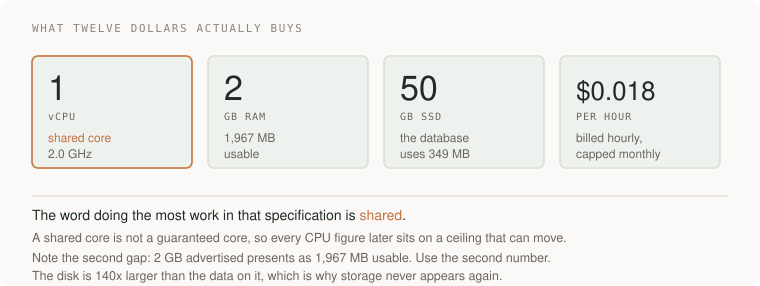

Read that specification like somebody who will later have to defend a number taken from it. **Shared** is the word that matters: it means the denominator of every CPU percentage in this lesson can move, which is a caveat worth carrying to the end. *Usable* is the second: capacity arithmetic done against the advertised 2 GB is quietly wrong by 33 MB before it starts.

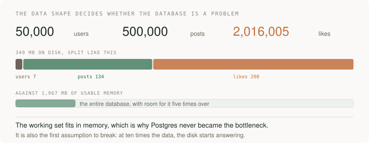

The shape matters more than the size. The join table is the largest object in the database, which is what you would expect of a social feed and is exactly the table a feed query has to touch. But the whole thing is 349 MB against 1,967 MB of memory, so the working set fits several times over and the disk is never asked a hard question. **That single fact is why the database does not appear in the bottleneck later**, and it is the first assumption that breaks on a real dataset.

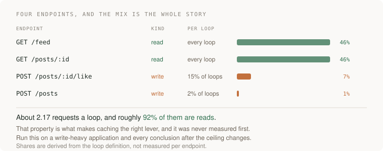

And the mix. Two reads happen on every loop, a write on 15% of loops and another on 2%, so roughly **92% of requests are reads**. Nobody measured that before designing the test, and it is the property that decides the entire second half of this lesson: a read-dominated workload is one where caching is the lever. Had the mix been the other way round, the same careful experiment would have ended somewhere else entirely.

## Baseline to challenge

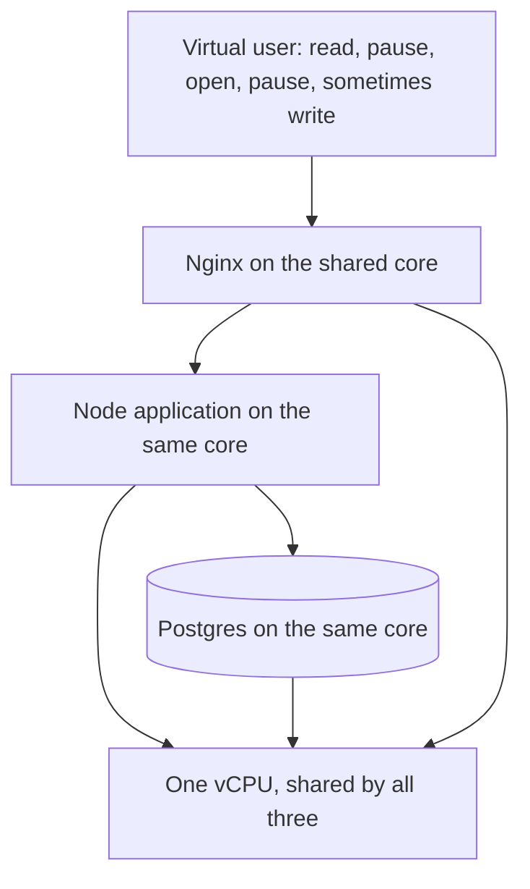

Predict before reading on. Write down three numbers: the concurrent users you expect this to hold, the resource you expect to exhaust first, and the error rate you expect at the failure point. Most people get all three wrong, and the third one wrong in a way that matters more than the first.

**Real experiment:** a published load test of a single $12/month DigitalOcean droplet running a small social feed, by the engineering channel `arjay_mccandless`, September 2026. The configuration, ladder results, saturation figures and both cache outcomes below are that experiment's measurements. The closed-loop critique, the shared-core caveat, the staleness framing and the per-user rate argument are this curriculum's additions and are marked where they appear.

**Takeaway:** the ceiling is a latency cliff, not an error rate, and you find it by binary search against criteria you wrote down first.

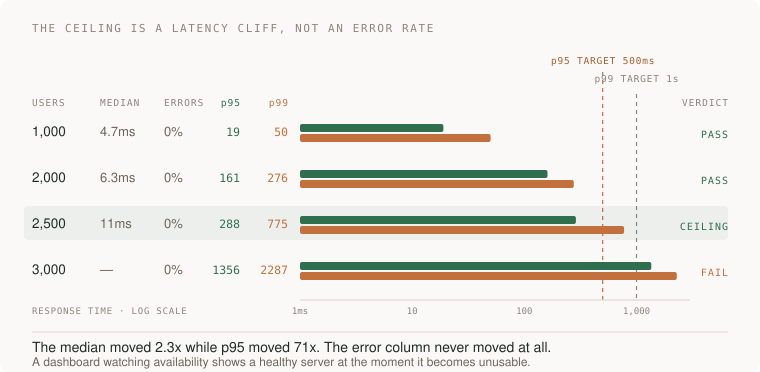

The figures are one application on one provider. Treat them as a worked method, not a capacity constant.

<details>
<summary>Work the example · the load model · what saturated · the fix · what the experiment does not establish</summary>

## Get the load model right, or nothing after it means anything

The most important decision happens before any request is sent, and it is the one most load tests get wrong: **what is a user?**

A user is not a request firehose, and the difference is not a detail.

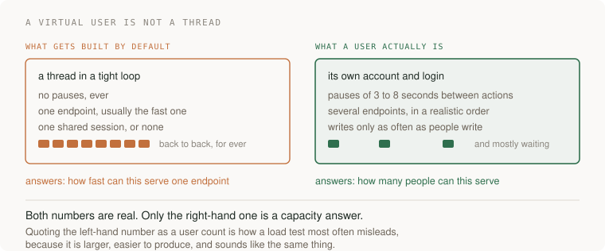

The left-hand model is what a load test becomes when nobody decides otherwise, and it does answer a real question — how fast can this serve one endpoint — but that is a throughput answer, not a capacity answer. It will also produce a much larger number, which is part of why it survives. Here each virtual user is a loop:

```
load the feed  ->  read for 3-7 s  ->  open a post  ->  read for 3-8 s
   ->  like it 15% of the time  ->  post 2% of the time  ->  repeat
```

That loop takes roughly 20 seconds, so **one concurrent user offers about 0.1 requests per second**. That single derived number is the anchor for everything else, and it is the number to carry out of this lesson. "5,250 concurrent users" is a *consequence* of the think-time model; change the pauses and the headline changes with it while the server is untouched.

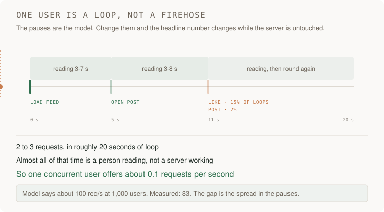

[Static diagram](../../../assets/learning/user-loop-still.svg)

Watch which part of that timeline is wide. Two or three requests are instants; the reading is everything else. The arithmetic falls straight out of the picture: 2 to 3 requests in about 20 seconds is roughly a tenth of a request per second. And it is worth noticing that the model and the measurement disagree slightly — the model predicts about 100 req/s at 1,000 users and the run produced 83. That gap is the spread in the pauses, and a model that lands within twenty per cent of the measurement is doing its job.

Two methodological details worth copying:

- **The load generator ran on its own machine**, a 4 vCPU / 8 GB box under a millisecond away, and its own CPU peaked at 37%. Reporting that number is what makes the result admissible. A generator running near its own limit measures itself, and the failure is invisible because it looks exactly like the target slowing down.
- **The generator cost $0.60** for the whole 4.5-hour session. The experiment is cheaper than the meeting about whether to run it.

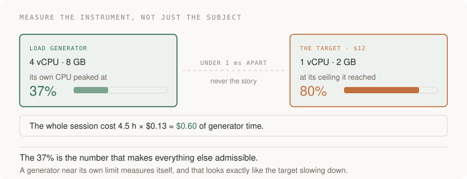

The 37% deserves more than a footnote. A load generator is an instrument, and an instrument running near its own limit stops measuring the thing in front of it and starts measuring itself — and the symptom is identical to the target slowing down, so nothing in the results will tell you it happened. Reporting the generator's own utilisation is the cheapest way to make a load test citable, and almost no published load test includes it.

## Search for the ceiling, do not creep up on it

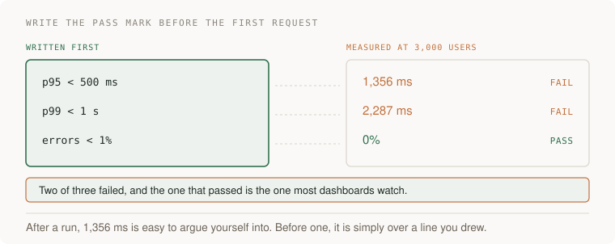

Fixing the criteria first is not ceremony. It is the only thing standing between you and a negotiation you will win against yourself, because after the run a p95 of 1,356 ms arrives attached to a server that did not crash, returned every answer correctly, and looks fine on every graph anybody has built.

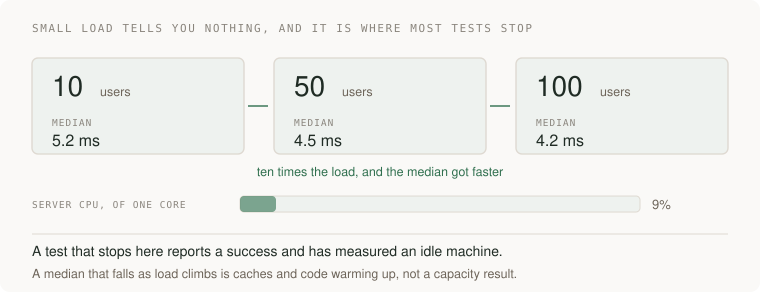

The first three rungs are where a great many load tests stop, and they teach nothing. The server is at 9% of one core and the median actually *improves* as load rises, because caches and runtime are warming up. A report written here says the system performs well under load, and the load has not started.

With criteria fixed in advance, the real search is a binary search, and it takes four runs:

| Concurrent users | Throughput | Median | p95 | p99 | Errors | Verdict |
|---|---:|---:|---:|---:|---:|---|
| 100 | — | 4.2 ms | — | — | 0% | CPU at 9%, no effect |
| 1,000 | 83 req/s | 4.7 ms | 19 ms | 50 ms | 0% | pass, CPU 39% |
| 2,000 | — | 6.3 ms | 161 ms | 276 ms | 0% | pass |
| 3,000 | — | — | 1,356 ms | 2,287 ms | 0% | **fail on latency** |
| 2,500 | 232 req/s | 11 ms | 288 ms | 775 ms | 0 of 92,799 | **ceiling** |

Three things in that table are worth more than the ceiling itself.

**It failed with zero errors.** Nothing crashed, nothing was refused, no connection was dropped. At 3,000 users the server returned a correct answer to every single request, far too late. A dashboard watching availability and error rate shows a perfectly healthy service at the exact moment it has become unusable. This is why the criteria have to include latency, and why they have to be written before the run: after the run, 1,356 ms is very easy to talk yourself into.

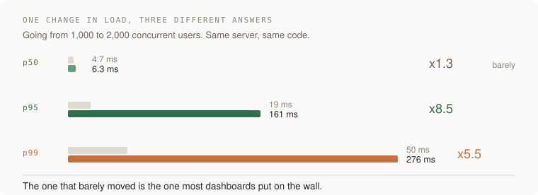

**The median barely moved while the tail exploded.** From 1,000 to 3,000 users the median went 4.7 ms to about 11 ms at the ceiling — a factor of two. Over the same span p95 went from 19 ms to 1,356 ms, a factor of seventy-one. The average is the last number to tell you anything and the first one people put on a dashboard. See [percentiles and what a profiler sampled](measurement-and-cost.md) for why.

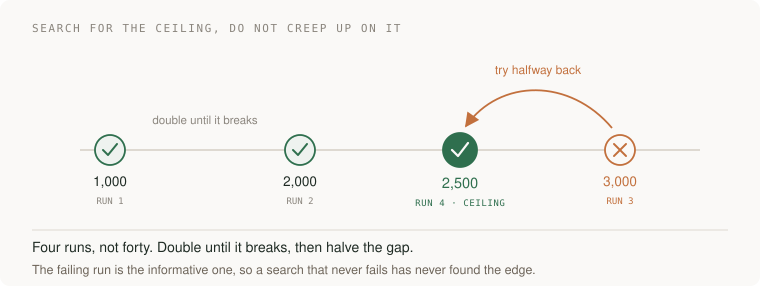

Four runs, not forty. Double until something breaks, then halve the gap — and notice that the run which *failed* is the one that made the search possible. A cautious ladder that never crosses the line never finds it, and will report the largest number it happened to try as though it were a limit.

**The failure is a cliff, not a slope.** Between 2,500 and 3,000 users — a 20% increase in offered load — p95 went from inside the target to nearly three times over it. Capacity planning that assumes a gentle degradation curve is planning for a shape this system does not have.

## Identify what actually saturated

Predict before reading: memory, the database, or CPU?

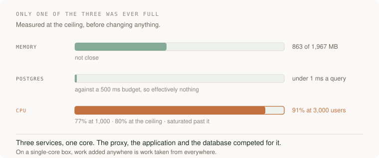

| Resource | At the ceiling | Verdict |
|---|---|---|
| Memory | 863 MB of 1,967 MB | not close |
| Postgres query time | about 1 ms | not the bottleneck |
| CPU | 39% at 1,000 → 80% at 2,500 → 91% at 3,000 | **saturated** |

Neither of the two resources people reach for first was the constraint. The database was fast throughout: 349 MB of data on a box with room to cache it, and queries that never became the problem. Memory never came near its limit.

It was CPU, and the reason is the architecture rather than the code. Three services share one core, so the proxy, the application and the database are **competing for the same resource**. At the ceiling the single core was divided like this:

| Process | Share of one core |
|---|---:|
| Node application | 38% |
| Postgres | 30% |
| Nginx | 6% |
| everything else | 6% |

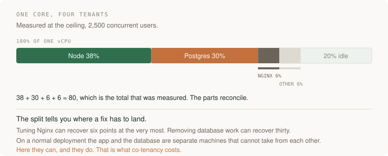

Those four shares sum to 80, which is the total that was measured — a small reconciliation worth doing every time, because a breakdown that does not add up to its own total is telling you something about the measurement rather than the system.

The two large shares are the application and the database, which on a normal deployment would be two machines that could not take capacity from each other. Here they can, and they do. Co-tenancy is the whole story: on a single-core box, work you add anywhere is work you take from everywhere. It also tells you where a fix has to land — trimming Nginx could recover at most six points, while removing database work recovers thirty.

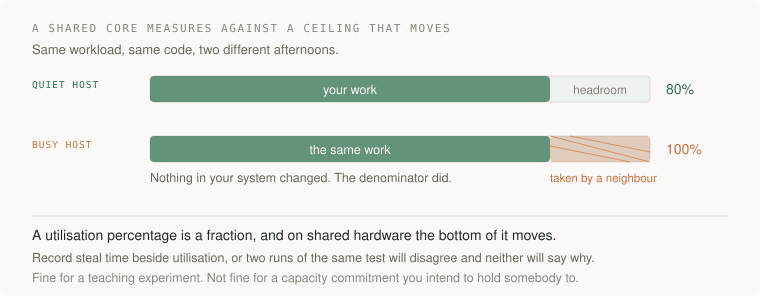

**Curriculum addition — the moving ceiling.** A "shared" vCPU on a basic droplet is not a guaranteed core. Time can be lost to other tenants on the same physical host, which means CPU percentage is measured against a denominator that moves. For a teaching experiment this is fine. For a capacity commitment, measure steal time alongside utilisation, or the same test on a quiet Tuesday and a busy one will disagree and neither run will explain why.

## Move the work, do not buy a bigger machine

The reflex at a CPU ceiling is the upgrade ladder: $12 for one vCPU, $24 for two, $48 for four, $96 for eight. That ladder is real and it is the wrong first move, because the workload has a property nobody measured yet: **the feed is the same answer for nearly everybody, recomputed per request.**

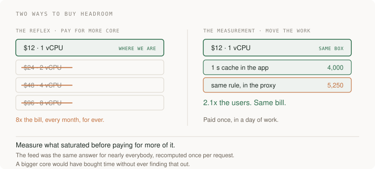

The two columns cost very different things over a year. The left one is a decision you keep paying for every month whether or not the traffic ever arrives. The right one is a day of work, paid once, and it leaves the bill where it was. That asymmetry is why the measurement comes first: until you know what saturated, the ladder is the only move you can see.

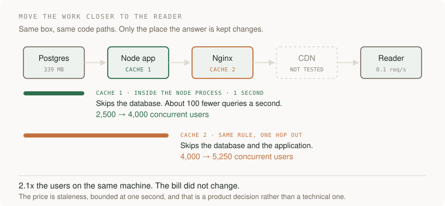

**Change one: a one-second in-memory cache on the feed, inside the Node process.** Not Redis — deliberately. Redis is another service, another network hop, and on a one-core box another competitor for the resource that is already the constraint. An in-process map costs one hop of nothing. Result: about 100 fewer queries per second to Postgres, and the ceiling moves 2,500 → 4,000 concurrent users, a 60% gain.

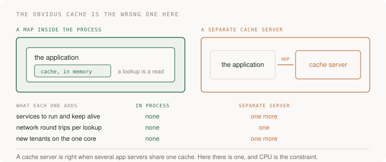

The instinct to reach for a dedicated cache server is a good one in most architectures and the wrong one here, and the reason is specific rather than stylistic: the constraint is CPU on a single shared core, and a cache server is one more process contending for exactly that. The right question is never "what is the standard cache", it is "what does this cost on the resource that is already scarce".

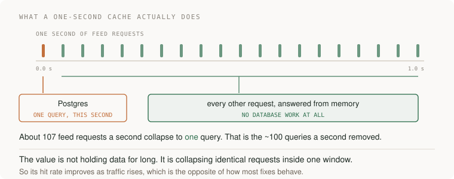

It is worth being precise about what a one-second cache is *for*, because "cache" suggests keeping data a long time and that is not the mechanism here. At the ceiling the feed is fetched roughly 107 times a second. A one-second window turns those 107 database queries into one. The window's length barely matters; the request *rate* is what produces the saving, which means a micro-cache gets better exactly as traffic gets worse — the opposite of most fixes, and the reason it is the right shape for a spike.

**Change two: the same one-second rule, moved into Nginx.** Identical policy, one hop closer to the reader, and now a cache hit never reaches the application at all. The feed endpoint's own ceiling goes from about 1,200 to more than 10,800 requests per second, and the system ceiling moves 4,000 → 5,250 users, at p95 160 ms and p99 454 ms.

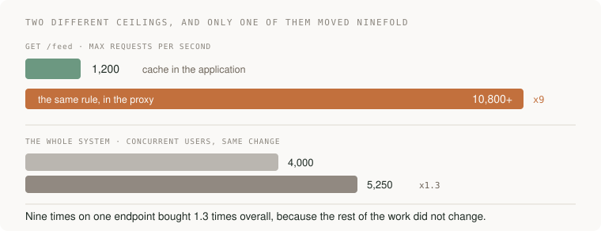

Those are two different ceilings and the gap between them is the lesson. The endpoint got **nine times** faster; the system got **1.3 times** more users. Nothing went wrong — the rest of the work simply did not change, so it now dominates. Any optimisation of one component runs into this, and quoting the component's improvement as though it were the system's is how performance work ends up unbelievable.

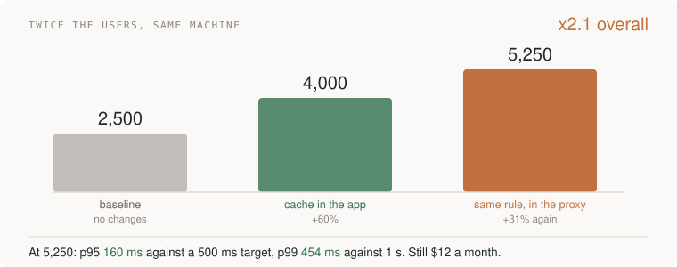

Together: **2.1x the users, the same $12 bill.** The rule generalises along the whole path — database, application, proxy, CDN, device — and the further out you put the answer, the more work a hit removes. Nothing about that is free, which is the next section.

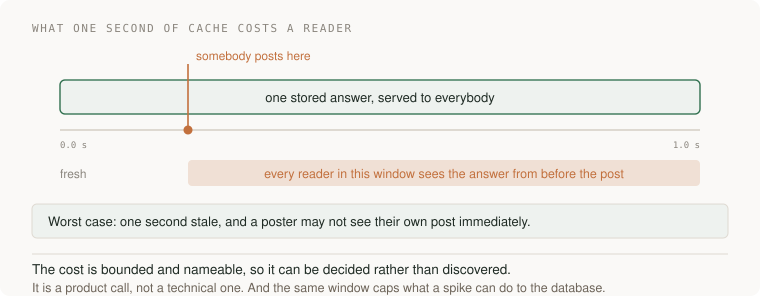

**Curriculum addition — staleness is a product decision.** A one-second cache means a reader can see a feed one second old, and somebody who just posted may not see their own post. Whether that is acceptable is a product question, not a technical one, and it should be answered by the person who owns the product rather than assumed by the person who owns the server. Note the second effect as well: a cache in front of the database also **caps the damage a traffic spike can do to Postgres**, so this is an availability change as much as a speed one.

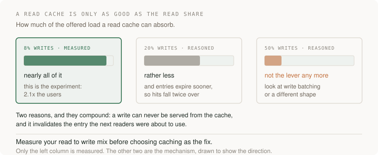

**Curriculum addition — the fix has a domain of validity.** Caching worked here because 92% of requests are reads. As the write share climbs the benefit falls twice over, because a write can never be served from a cache *and* it invalidates the entry the next readers were about to use. Only the left-hand column above is measured; the other two are the mechanism drawn to show its direction. The practical instruction is narrow and it comes before any of the engineering: measure your own read-to-write mix, because it decides whether caching is a lever for you at all.

## What the experiment does not establish

**Curriculum addition, and this is the most important paragraph in the lesson.**

The load generator is **closed-loop**: each virtual user waits for its response before it starts its next pause. So when the server slows down, every user's loop takes longer, and the offered load *falls*. The generator stops sending exactly the requests that would have been slowest.

Real users do not wait. Somebody opening the app during a slow period sends their request on their own schedule, and so does the next person.


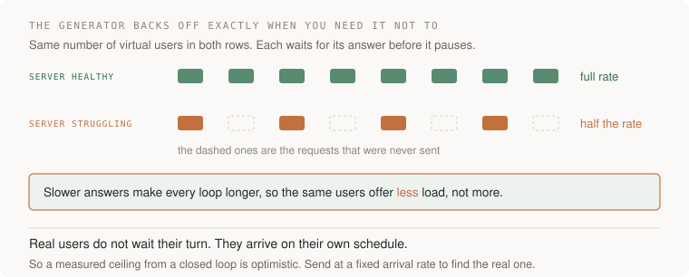

Follow the mechanism rather than the name. Each virtual user waits for its answer before it starts its next pause, so a slower server makes every loop longer, and a fixed pool of users therefore produces *fewer* requests per second. The generator reduces the pressure at precisely the moment the server is failing, and it does it silently, because from the outside a lower request rate looks like a quiet period rather than a broken instrument.

This is **coordinated omission**, and its direction is the thing to remember: it makes the tail look better than it is, which means **2,500 is optimistic rather than conservative**. It is not a small effect near a ceiling — near the cliff is precisely where the closed-loop generator throttles itself hardest.

The fix is to send at a **fixed arrival rate** and measure latency from when the request *should* have been sent, not from when the generator got around to sending it. Most load tools support both modes and default to the flattering one.

Two smaller limits, stated because a case that only lists its strengths is advertising:

- The per-process CPU shares are a single reading at the ceiling, not an average over the run. They are enough to say where the work lives; they are not a profile.
- The CDN hop in the diagram was not tested here. It is drawn because the rule continues along that path, not because a measurement supports that specific step.

## Reframe the number before anybody quotes it

5,250 **concurrent** users is not 5,250 users.

Concurrency is a measure of how many people are inside the app at the same instant. Plot one row per user over a day and only a small fraction are online at any moment.

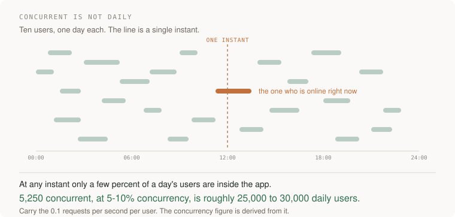

At a 5–10% concurrency ratio, a ceiling of 5,250 concurrent corresponds to roughly **25,000–30,000 daily users** — on one machine, at twelve dollars a month.

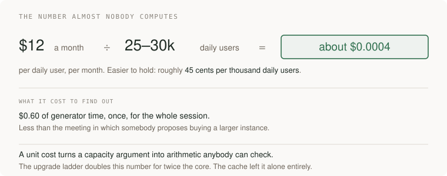

That division is the **unit cost**, which is the number [the chapter's first lesson](measurement-and-cost.md) keeps asking for and which almost nobody computes. It is worth holding in the friendlier form — about 45 cents per thousand daily users per month — because in that shape a capacity argument becomes arithmetic anybody in the room can check, and the upgrade ladder becomes visibly what it is: the same service at twice the unit cost.

Carry the 0.1 requests per second per user, not the 5,250. The per-user rate is the measured input; the concurrency figure is derived from it and from a think-time model that your application probably does not share. The safest way to use this lesson on your own system is to measure your own per-user rate and re-derive everything downstream of it.

## Failure drill and expectations

**First predict, then measure:** at your own ceiling, which saturates first — application CPU, proxy CPU, database CPU, connection pool, memory, or network? Then collect enough telemetry to tell them apart. On a single-host deployment they are not independent, and "add replicas" can make a shared-core bottleneck worse rather than better.

| Level | Demonstrate | Above the baseline |
|---|---|---|
| Junior | Run a load test with think time and report percentiles, not averages | Notice the run failed on latency with no errors |
| Senior | Fix criteria first, binary-search the ceiling, name the saturated resource | Identify closed-loop omission and re-run at a fixed arrival rate |
| Staff | Price the ceiling against the upgrade ladder and the cache options | Own the staleness decision explicitly and state who signs it off |

**Changed requirement:** the feed becomes personalised per user. Both caches lose most of their value at a stroke, because the answer is no longer shared. Recompute: what is cacheable now, at what granularity, and does the ceiling fall back to 2,500 or below it? A cache whose hit rate depends on an audience property is a capacity decision disguised as an implementation detail.

## Follow-ups that change the design

**Senior: the writes matter now.** The loop writes on 2% of iterations. Raise that to 20% and the cache stops absorbing the load, because writes cannot be served from it and they invalidate what can. Measure the read/write mix *before* choosing a caching strategy; the mix, not the traffic volume, decides whether caching is the lever at all.

**Senior: measure at a fixed arrival rate.** Re-run the ladder open-loop and compare the ceiling. Report both numbers and the gap between them. That gap is the size of the error you would have shipped.

**Lead: the box is also the database.** Everything here shares one failure domain and one backup story. Price the ceiling honestly: $12 buys the throughput, and it does not buy a replica, a failover, or a machine that survives the provider rebooting the host. Compare against the managed alternative on total exposure, not on instance price, and state which risks you are accepting on purpose.

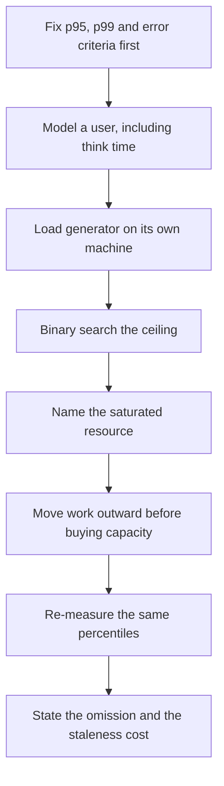

This is a build brief. Submit a load script with an explicit think-time model, a criteria file written before the first run, a ladder of results including the failing rung, a per-process saturation reading, and one change that moves the ceiling. Acceptance: the ceiling is found by search rather than by a single run; the failing rung is reported with its error rate; the same percentiles are quoted before and after the change; and the report names one thing the experiment does not establish.

</details>

## Terms used in this lesson

- **concurrent users** — how many people are inside the application at one instant. Derived from a think-time model, not a property of the server.
- **think time** — the pauses inside a user's loop. It is the difference between modelling people and modelling a benchmark.
- **closed-loop generator** — one that waits for each response before continuing, so offered load falls when the server slows.
- **open-loop generator** — one that sends at a fixed arrival rate regardless of how the server is doing. The honest instrument near a ceiling.
- **coordinated omission** — the under-reporting of tail latency caused by a closed-loop generator not sending the requests that would have been slowest.
- **micro-cache** — a very short cache, on the order of a second, whose value is absorbing many identical requests inside one window rather than holding data for long.
- **steal time** — CPU time your instance wanted and did not get because the physical host was busy with another tenant.

---

**Not covered here:** the measurement plumbing, which is the subject of [Use logs, metrics and traces to explain one slow request](../../03-production/04-observability/logs-metrics-traces.md). Rollout and zone-loss headroom belong to [Reserve capacity for rollout, zone loss and backlog recovery](cases/deployment-headroom.md). This lesson is deliberately about one machine, so multi-host capacity, autoscaling policy and load shedding are left to [Reject excess API work before queues grow without bound](problems/overload-shedding.md) and to [Data systems at scale](../01-data-at-scale/README.md).

[Learning sequence](../../README.md) · [AWS implementation](../../03-production/03-infrastructure/aws/README.md)
