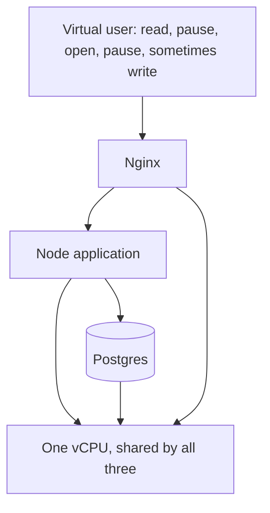

# One small server: the stack, what broke, and what fixed it

[Curriculum](../../README.md) · [Capacity, performance and cost](README.md)

> Project connection · feeds [Reading-list stage 3: measure the application under load](../../../projects/reading-list/stages/03-under-load/README.md)

Somebody put a whole social feed on one $12-a-month virtual machine, loaded it until it fell over, and then doubled what it could hold without spending another penny. This lesson is the stack they used, the problems that came up in order, and the fix for each one.

**Source:** a published load test of a single DigitalOcean droplet, by the engineering channel `arjay_mccandless`, September 2026. The configuration, results and both cache outcomes are that experiment's measurements. Three additions are this curriculum's and are marked where they appear.

## The stack

Everything runs on one machine. No containers, no managed services, no second box.

| Technology | Its job here | Why it is worth noticing |
|---|---|---|
| **Nginx** | reverse proxy in front of the app | it later becomes the fix, without becoming a new service |
| **Node.js** (Express 5, TypeScript) | the API: feed, single post, like, create post | one process, one core, so its CPU share is the app's whole budget |
| **Postgres** | 50,000 users, 500,000 posts, 2,016,005 likes, 349 MB | 349 MB against 1,967 MB of RAM means the data fits in memory, which is why the database never becomes the problem |
| **k6** | the load generator, on its own separate machine | a generator sharing the target's hardware measures itself |
| **the droplet** | 1 *shared* vCPU at 2.0 GHz, 2 GB RAM | "shared" means every CPU percentage below sits on a ceiling that can move |

That last arrow is the whole architecture. On a normal deployment the app and the database are separate machines that cannot take capacity from each other. Here they can, and they do.

## Problem 1 · Nobody knows what "it held up fine" means

**The fix: write the pass mark before sending a single request.** p95 under 500 ms, p99 under 1 s, errors under 1%.

This is cheap and it is the step people skip. After a run, a p95 of 1,356 ms arrives attached to a server that did not crash and returned every answer correctly, and it is remarkably easy to talk yourself into. Before the run it is simply over a line you already drew.

## Problem 2 · A load test measures throughput, not people

The default load script is a thread firing requests back to back at one endpoint. That answers *how fast can this serve one endpoint*, which is a real question and not a capacity answer.

**The fix: model a user, pauses included.**

Each virtual user gets its own account and runs a loop: load the feed, read for 3 to 7 seconds, open a post, read for 3 to 8 seconds, like it 15% of the time, post 2% of the time, repeat.

[Static diagram](../../../assets/learning/user-loop-still.svg)

The loop takes about 20 seconds, so **one concurrent user offers roughly 0.1 requests per second**. That is the number to carry out of this lesson. Every headline further down is derived from it.

Two smaller things from the same setup, both worth copying: the generator ran on its own 4 vCPU box under a millisecond away and **peaked at 37% of its own CPU** — reporting that is what makes the rest admissible, because a generator near its own limit looks exactly like a target slowing down. And the whole 4.5-hour session cost **60 cents**.

## Problem 3 · Creeping up in small steps wastes a day and finds nothing

At 10, 50 and 100 users the server sat at 9% CPU and the median got *faster* as load rose, because caches and runtime were warming up. A test that stops there reports a success and has measured an idle machine.

**The fix: binary search. Double until it breaks, then halve the gap.**

Four runs, not forty. And note which run made the search possible: the one that **failed**. A cautious ladder that never crosses the line never finds it.

## Problem 4 · It failed with a zero per cent error rate

| Users | Throughput | Median | p95 | p99 | Errors | Verdict |
|---|---:|---:|---:|---:|---:|---|
| 1,000 | 83 req/s | 4.7 ms | 19 ms | 50 ms | 0% | pass |
| 2,000 | — | 6.3 ms | 161 ms | 276 ms | 0% | pass |
| 3,000 | — | — | 1,356 ms | 2,287 ms | 0% | **fail on latency** |
| 2,500 | 232 req/s | 11 ms | 288 ms | 775 ms | 0 of 92,799 | **ceiling** |

Nothing crashed. Nothing was refused. Every request got a correct answer, far too late. **A dashboard watching availability and error rate shows a perfectly healthy service at the moment it has become unusable.**

The second thing in that table: from 1,000 to 3,000 users the median went 4.7 ms to about 11 ms, while p95 went 19 ms to 1,356 ms. The number that barely moved is the one most dashboards display.

**The fix: judge on the tail, and put latency in the pass criteria.** Watching error rate alone would have missed this entirely.

## Problem 5 · Nobody can say which resource ran out

The two usual guesses are memory and the database. Both were wrong.

| Resource | At the ceiling | Verdict |
|---|---|---|
| Memory | 863 MB of 1,967 MB | not close |
| Postgres query time | about 1 ms | not the bottleneck |
| CPU | 39% at 1,000 → 80% at 2,500 → 91% at 3,000 | **saturated** |

**The fix: measure per process rather than guessing.**

Those four shares sum to 80, which is the total that was measured — worth checking every time, because a breakdown that does not add up to its own total is telling you something about the measurement. And the split says where a fix has to land: trimming Nginx could recover six points at the very most, while removing database work could recover thirty.

**Curriculum addition.** A *shared* vCPU is not a guaranteed core. Time can be lost to other tenants on the same physical host, so the percentage is measured against a denominator that moves. Fine for a teaching experiment; for a capacity commitment, record steal time alongside utilisation, or two runs of the same test will disagree and neither will explain why.

## Problem 6 · The reflex at a CPU ceiling is to buy a bigger machine

$12 for one vCPU, $24 for two, $48 for four, $96 for eight. That ladder is real, and it is the wrong first move, because the workload has a property nobody had measured: **the feed is the same answer for nearly everybody, recomputed on every single request.**

**Fix one: a one-second cache inside the Node process.**

At the ceiling the feed is fetched roughly 107 times a second. A one-second window turns those into **one** database query. The window length barely matters; the request rate is what produces the saving, which means this kind of cache works better exactly as traffic gets worse.

Result: about 100 fewer queries a second, and the ceiling moves **2,500 → 4,000** users.

## Problem 7 · So why not Redis?

**Because the constraint is CPU on a single shared core, and a cache server is one more process competing for it.**

A dedicated cache server is the right answer when several application servers must share one cache. Here there is one application server, and the thing Redis would consume is the thing that already ran out. The general question is never "what is the standard cache" but "what does this cost on the resource that is already scarce".

## Problem 8 · A cache hit still wakes the application up

**Fix two: move the same one-second rule into Nginx**, so a hit never reaches Node at all.

Identical policy, one hop closer to the reader, and each hop outward removes strictly more work per request. Ceiling moves **4,000 → 5,250** users, at p95 160 ms and p99 454 ms.

**2.1x the users on the same machine, and the bill did not change.** The price is staleness bounded at one second, which is a product decision rather than a technical one, and it should be made by whoever owns the product.

## Problem 9 · The endpoint got nine times faster and the system did not

The feed endpoint went from about 1,200 to more than 10,800 requests a second. The system went from 4,000 to 5,250 users. Both numbers are correct. Nothing went wrong — the rest of the work simply did not change, so it now dominates.

**The fix is in how you report it:** quote the system number. Any optimisation of one component runs into this, and quoting the component's gain as though it were the system's is how performance work ends up unbelievable.

## Problem 10 · The headline number gets misquoted the moment it leaves the room

5,250 **concurrent** users is not 5,250 users.

At a 5–10% concurrency ratio that ceiling is roughly **25,000 to 30,000 daily users**, on one machine at twelve dollars a month. Divide it out and the unit cost is about 45 cents per thousand daily users per month, which is the number that turns a capacity argument into arithmetic anybody can check.

**The fix: carry the 0.1 requests per second per user.** That is the measured input; everything else is derived from it and from a think-time model your application probably does not share.

## What this experiment does not establish

**Curriculum addition, and the most important caveat here.**

The generator is **closed-loop**: each virtual user waits for its response before starting its next pause. So when the server slows down, every loop takes longer and the same pool of users sends *fewer* requests. The generator quietly reduces pressure at exactly the moment the server is failing.

This is **coordinated omission**, and the direction is what matters: it makes the tail look better than it is, so **2,500 is optimistic rather than conservative**. The fix is to send at a fixed arrival rate and measure latency from when a request *should* have been sent. Most load tools support both and default to the flattering one.

One more boundary: caching worked here because about 92% of requests are reads. As the write share climbs the benefit falls twice over, because a write can never be served from a cache and it invalidates the entry the next readers were about to use. Measure your own read-to-write mix before deciding caching is your lever.

## Try it on your own system

- Write your pass criteria down before the first run, and keep the file.
- Model one user, pauses included, and derive your own requests-per-second-per-user.
- Put the generator on its own machine and report its CPU alongside the results.
- Binary search to a rung that **fails**, and report that rung.
- Name the saturated resource per process, and check the shares sum to the total.
- Re-run open-loop at a fixed arrival rate and report the gap between the two ceilings.

## Terms

- **concurrent users** — how many people are inside the application at one instant. Derived from a think-time model, not a property of the server.
- **think time** — the pauses inside a user's loop. The difference between modelling people and modelling a benchmark.
- **closed-loop / open-loop generator** — one waits for each response before continuing; the other sends at a fixed rate regardless. Only the second is honest near a ceiling.
- **coordinated omission** — tail latency under-reported because a closed-loop generator never sent the requests that would have been slowest.
- **micro-cache** — a very short cache whose value is collapsing many identical requests inside one window, not holding data for long.
- **steal time** — CPU your instance wanted and did not get because the physical host was busy with another tenant.

---

[Learning sequence](../../README.md) · [AWS implementation](../../03-production/03-infrastructure/aws/README.md)
