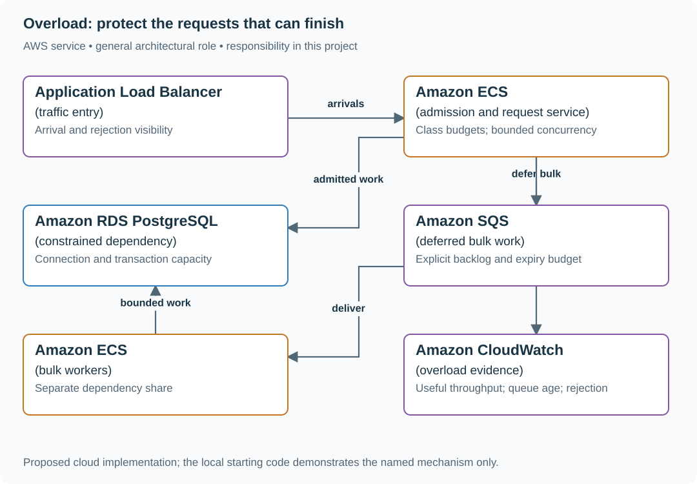
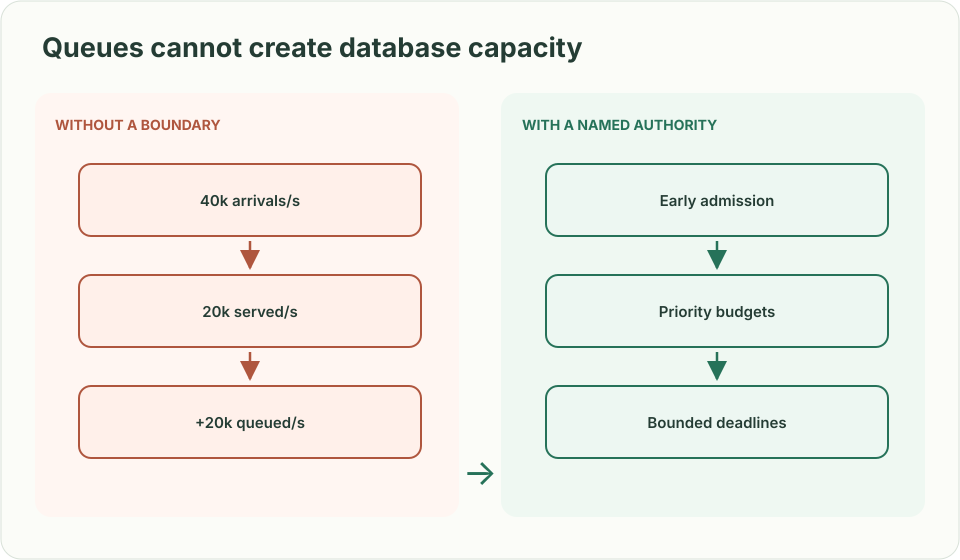
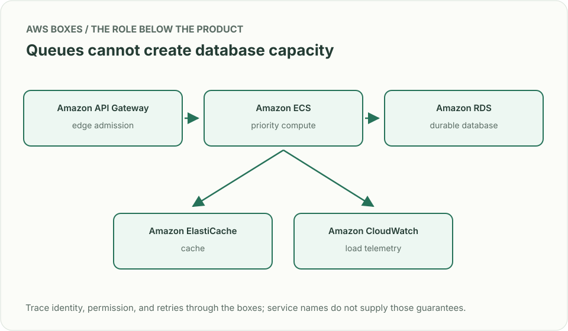
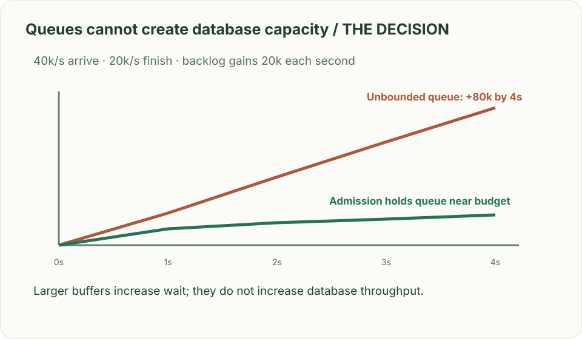

# Overload: protect the requests that can finish

## What you are building

> Protect a subscription API during a traffic surge. Forty thousand requests/s arrive but the healthy service can finish only twenty thousand. Paid writes, interactive reads and bulk exports have different consequences when rejected; the queue must not consume all memory.

**Working contract:** Admission is bounded by class and dependency capacity. Accepted work has a finite deadline. Rejected work returns a clear retryable or non-retryable outcome before expensive side effects begin.

## Workload and the decisions it changes

These are constructed exercise assumptions. The large workload is a design target; the local demonstration does not establish that throughput. Use the [estimation constants](../../../01-code/01-problem-solving/estimation-constants.md) to check units before choosing capacity.

| Input or objective | Calculation / consequence |
|---|---|
| 40,000 arrivals/s; 20,000 completions/s | Backlog grows 20,000/s; a 100,000-request queue fills in five seconds. |
| 12,000 paid writes/s plus 8,000 reads/s desired allocation | At full healthy capacity those consume the entire budget; bulk work needs a separate or deferred share. |
| Database capacity halves to 10,000/s | The original paid-write promise no longer fits; define explicit priority and rejection within that class. |

## Start with one working boundary

Run from the repository root with Python 3.12+:

```bash
python3 examples/architecture-starts/overload_shedding.py
```

[Open the starting code](../../../../examples/architecture-starts/overload_shedding.py). This is a runnable demonstration of the critical state boundary. The API, UI, cloud adapters and operating behavior below are the application you build around it.

| Record / module | Key or interface | Responsibility |
|---|---|---|
| admission_policy | request_class,rate,concurrency,deadline | Product priority and resource budget. |
| queue_state | class,depth,oldest_age | Bounded waiting and expiry. |
| outcomes | admitted,completed,rejected,expired | Honest accounting of work under pressure. |

## AWS implementation



Admission protects the scarce dependency. SQS is suitable for explicitly deferred work, but it cannot turn an unbounded interactive wait into a successful user experience.

## Build it in this order

### 1. Locate the constrained dependency

Measure completed throughput, active work and queue age as arrivals rise. Identify whether CPU, database connections or a downstream quota saturates. Adding API instances cannot create more capacity in a fixed database dependency.

### 2. Classify and admit early

Derive class from trusted route/account context. Reserve explicit budgets for critical work and reject excess before allocating expensive connections or starting external effects. Keep fairness within a paid class so one tenant cannot spend the entire reserve.

### 3. Bound waiting and retries

Cap queue length and maximum age, expire work that cannot finish before its deadline, and propagate cancellation. Return bounded Retry-After and document client retry budgets with jitter. Retrying rejected traffic at every service layer multiplies the original overload.

### 4. Recover without a second surge

Reduce concurrency when the dependency degrades and ramp it back gradually after recovery. Keep hysteresis between shedding and reopening. Report completed useful work and class-specific rejection, not merely a lower response latency caused by rejecting everything.

## Infrastructure configuration

| Resource or boundary | Initial configuration and reason |
|---|---|
| Application limits | Set per-class concurrency, queue size and deadline independently of autoscaling. |
| Database pools | Sum all API and worker pools against one dependency budget; reserve emergency operating headroom. |
| Scaling | Scale only while useful throughput improves; bounded admission remains active during scale-up and dependency failure. |

Use one disposable AWS environment for the cloud exercise. Put the named resources in `infra/template.yaml` or your existing IaC tool, pass resource IDs through configuration, and scope each runtime role to its own tables, buckets and queues. The diagram is a design to implement; it is not a claim that these resources have been deployed. Record the commands you used to deploy and remove the exercise resources.

## Observe the result

| Action | Expected visible result |
|---|---|
| Run the starting program | The queue reaches 100,000 at five seconds, then rejects excess arrivals. |
| Halve database capacity | Admission shrinks and exposes the chosen within-class priorities. |
| Restore the database | Traffic ramps up without replaying the whole backlog at once. |

## The next design decision

Product labels every route critical. Use dependency consumption and user consequences to produce an allocation that fits actual capacity; a label cannot reserve resources that do not exist.

<details>
<summary>Additional design cases, alternatives and original source notes</summary>

> **Interviewer:** “An API receives 40,000 requests/s after a partner retry storm. At 20,000/s its database already saturates. Paid writes, free reads, and internal health checks share one worker pool. What happens in the next minute?”

**Your contract.** Keep paid writes available where capacity permits; shed work early with a stable policy; reserve enough capacity for health and recovery. Define an admission signal that does not wait for every caller to time out. Constructed scenario and workload.

| Load and failure | Expected behavior |
|---|---|
| 12k/s paid writes, 8k/s free reads | Accept within measured safe capacity; report tail latency by class |
| Free reads spike to 30k/s | Shed or cache free reads before they starve paid writes |
| Database slows to half capacity | Reduce admission, expose 429/503 with bounded retry guidance |
| Every client retries after 1 second | Jitter/backoff and budgets prevent retry traffic from multiplying overload |



## Calculate the queue before choosing an autoscaler

At 40k/s arriving and 20k/s service capacity, backlog grows by **20k requests per second** if admission does nothing. A 100k-request buffer fills in five seconds; a bigger queue raises latency rather than increasing throughput. Reserve per-class concurrency and cap queue waiting against each deadline. Shed low-priority work at the gateway, set a retry budget with randomized backoff, and measure accepted work, dropped work, p99, and recovery time. Autoscaling cannot instantly repair a constrained database or hot key.



| AWS box | Job here | Alternative and deciding factor |
|---|---|---|
| Amazon API Gateway (edge admission) | Reject coarse excess early and authenticate clients | Application Load Balancer plus app-owned prioritization for finer classes |
| Amazon ElastiCache (cache) | Serve safe repeatable reads without hitting the database | CloudFront (CDN) for public cacheable content nearer users |
| Amazon ECS (application compute) | Implement per-class concurrency limits, deadlines, and shedding | AWS Lambda with reserved concurrency if request shape and saturation permit |
| Amazon RDS (database) | Own durable writes; monitor its real service capacity | Amazon DynamoDB for key-value access patterns and a compatible model |
| Amazon CloudWatch (telemetry) | Observe queue age, p99 by class, and rejected work | Existing tracing/metrics system with same per-class evidence |

A cache is only a substitute for database reads that may legally be stale. API Gateway throttling alone does not encode the business priorities; the service still needs admission budgets. State what you shed and what you never drop.



**Senior follow-up:** Health checks succeed while users time out. Build an overload signal from useful work and queue delay; show a 60-second incident trace.

**Staff follow-up:** Three products share a data tier. Set per-tenant and per-product budgets, equitable borrowing, and a governance process for changing priority without silently starving a smaller customer.

**Practice artifact:** Compute backlog under three loads, draw priority lanes and degradation response, then describe how to test shedding safely under a load ramp.

**Source boundary:** Original scenario. [Meta's September 2026 shared proxy account](https://engineering.fb.com/2026/09/03/core-infra/zgateway-proxy-zippydb-meta/) discusses overload protection; the [AWS Builders' Library on retries](https://aws.amazon.com/builders-library/timeouts-retries-and-backoff-with-jitter/) describes retry amplification. Neither is an interview-question report.

</details>
