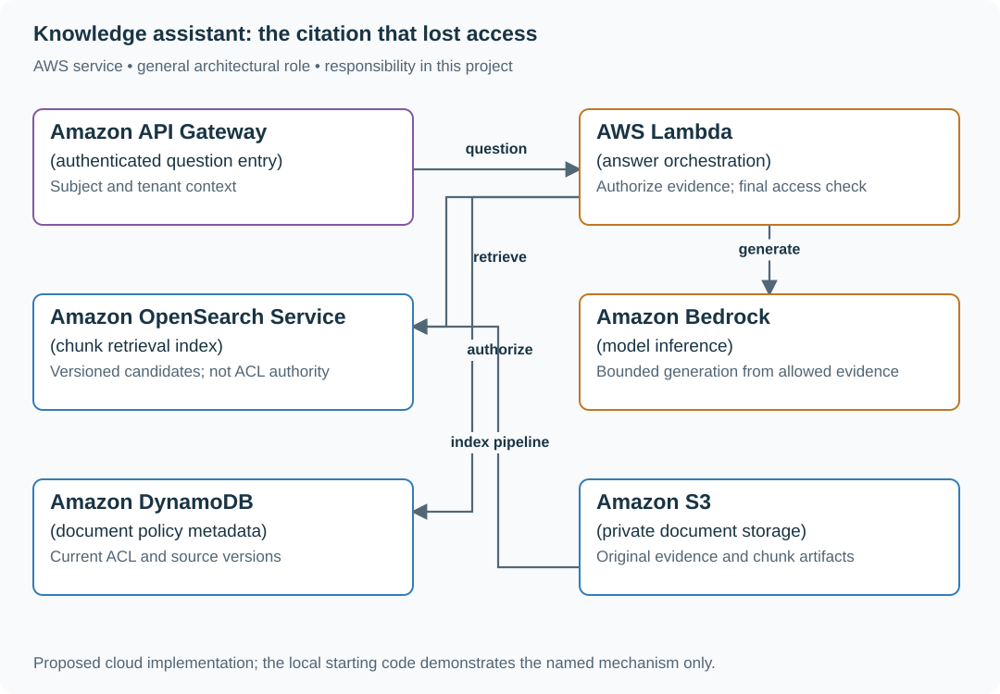

# Build a document assistant with current permissions

## Application background

An employee asks, “How many days can I carry over?” in an internal handbook assistant. The application searches documents the employee may read, selects relevant passages and asks a model to draft an answer with references to those passages.

The model must not fill missing policy information with a plausible invention. Access can change while the answer is being prepared, and a document might contain text telling the assistant to ignore its rules.

### Example walkthrough

| Action | Expected behavior |
|---|---|
| Ana asks about leave and can read the leave policy | Return an answer supported by the allowed passage. |
| The only matching source is private to another team | Say there is not enough usable evidence. |
| A source loses permission before the answer is sent | Do not expose its text or a derived answer that depends on it. |

Retrieval means finding source material for the answer. Abstention means explicitly declining to answer when the application cannot provide permitted supporting evidence.

## Your assignment

**Deliver:** Build a question-to-answer flow with permitted source retrieval, usable references and a clear refusal to answer when supporting evidence is missing or revoked.

**Required behavior:** Answer only from currently authorized source material, cite exact document/version evidence, and abstain when evidence is insufficient. Retrieved text is data, not permission to call tools or alter system behavior.

The required first milestone is a working local implementation of the behavior above. The numbered implementation steps define the scope. The cloud architecture is a later extension, not something the starter has already provisioned.

## Get the code and run the supplied example

The code is in the public [junior-to-staff repository](https://github.com/Soulful-Iris/junior-to-staff). Install Git and Python 3.12+. No AWS account or Python packages are required for this first run. If you already have a checkout, use it and skip cloning.

```bash
git clone https://github.com/Soulful-Iris/junior-to-staff.git
cd junior-to-staff
python3 examples/architecture-starts/knowledge_assistant.py
```

**Supplied file:** [`examples/architecture-starts/knowledge_assistant.py`](https://github.com/Soulful-Iris/junior-to-staff/blob/main/examples/architecture-starts/knowledge_assistant.py). You can also [read or download the source here](../../../../examples/architecture-starts/knowledge_assistant.py).

This program is a **mechanism demonstration**: it runs the small scenario in one process and prints the result. It is not an HTTP service, a complete application, or an AWS deployment. A successful run demonstrates this mechanism only. It does not establish the workload or failure guarantees of the application you will build.

**Example output from the supplied run:**

Generated IDs and timestamps may differ. Compare the state transitions and outcomes.

```text
Authorized evidence: [('d1', 'Expenses require a receipt.')]
Final response: withheld: access changed
```

### Set up your implementation workspace

Create `work/knowledge-assistant/` in your checkout (or use a separate repository). Copy the supplied mechanism into that directory as `mechanism.py`, then extract its state transitions into functions you can call from your implementation. The record and module names below describe what you must implement. They are not a promise that files with those names already exist. Keep a `README.md` beside your implementation with its exact run commands and observed results.

## Local components and state to implement

This table names the records, interfaces or decision inputs for your deliverable. Unless a name is explicitly linked to supplied source above, it is something you create. Implement the local state transitions first, then connect the HTTP, storage or worker boundaries required by the steps.

| Record / module | Key or interface | Responsibility |
|---|---|---|
| source_chunks | tenant,document,version,chunk_id | Evidence with current ACL and source provenance. |
| answer_run | subject,query,source_versions,model,prompt | Reproducible answer context without unrestricted sensitive logging. |
| citations | answer_span,document_version,quoted_range | Support references that can be opened by the current caller. |

## Implement the assignment

### 1. Ship authorized search first

Implement document/chunk ingestion with source versions and deletion handling. Search by tenant, then verify current access before loading chunk text. Provide a useful source-search UI before adding generation so the baseline can be compared directly.

### 2. Generate from a bounded evidence set

Pass only authorized chunks and a clear answer/abstain contract. Keep source instructions inside the data boundary. Record model/prompt/index versions and token/latency budgets. An answer containing a citation still requires checking whether that source supports the specific claim.

### 3. Recheck before returning

Track the policy revision used during retrieval and revalidate access to cited sources at finalization. If access changed, discard the affected answer and return a safe retry/abstention. Cache keys include authorization context. A warm generated-answer cache cannot bypass revocation.

### 4. Review concrete cases

Use supported, unsupported, conflicting-source and revoked-source questions. Compare useful answers and justified abstentions against the search-only baseline. Retain redacted failure examples and identify whether the fault was retrieval, authorization, generation or citation mapping.

## Demonstrate the completed local result

| Action | Expected visible result |
|---|---|
| Run the starting program | The private document is excluded. Revocation during preparation withholds the answer. |
| Ask a question absent from sources | The assistant abstains and offers authorized source search. |
| Put tool instructions in a document | No tool action is authorized by the retrieved text. |

**Handoff:** In your implementation README, include the start command, one successful operation, the failure case above and the resulting stored state or decision. State which dependencies are simulated. Someone with a fresh checkout should be able to reproduce this without your chat history.

## Workload assumptions and capacity decisions

These are constructed exercise assumptions. The stated workload is a design target. The local demonstration does not establish that throughput. Use the [estimation constants](../../../01-code/01-problem-solving/estimation-constants.md) to check units before choosing capacity.

| Input or objective | Calculation / consequence |
|---|---|
| Four-second response target | Example budget: 700 ms retrieval, 2,500 ms generation, 200 ms final checks, 300 ms transport and 300 ms reserve. |
| 100,000 documents × eight chunks assumption | 800,000 chunk records before embeddings and index overhead. |
| 20 requests/s peak | At three seconds mean active time, about 60 concurrent requests. Bound model and retrieval concurrency separately. |

## Map the local implementation to AWS

**Deployment status: local only.** Running the supplied command creates no AWS resources and configures no cloud connections. The diagram is a proposed deployment of the completed application. Each box needs either a deployed runtime, a provisioned service or an explicitly external dependency.

Read the diagram by following the arrows from the entry point: application code accepts the request or event, the state owner commits it, and any worker produces the later result. The table ties those roles to code and adapter work. Multiple boxes do not imply multiple Python files already exist.



Bedrock generates language. The application decides which documents the caller may use. OpenSearch provides candidates, while current policy and source version checks enforce the evidence boundary.

| Local responsibility | Cloud destination and role | Implementation still required |
|---|---|---|
| Local HTTP boundary or the endpoint you will add | Amazon API Gateway: authenticated question entry | Create routes and an integration. Translate requests and responses and configure identity validation. |
| Python operation or worker function | AWS Lambda: answer orchestration | Write a Lambda event adapter, package its dependencies and give its role only the required resource actions. |
| Local derived search records | Amazon OpenSearch Service: chunk retrieval index | Implement indexing, updates/deletions and queries. Recheck current authorization before returning sensitive results. |
| Deterministic model response fixture | Amazon Bedrock: model inference | Implement model invocation with deadlines, input boundaries and validated output. Preserve the same permission and action rules. |
| Local dictionary, SQLite records or state model | Amazon DynamoDB: document policy metadata | Design partition/sort keys and write a storage adapter with conditional updates or transactions. Python state and SQL are not uploaded as a database. |
| Local file, object fixture or exported payload | Amazon S3: private document storage | Implement upload/download and metadata adapters, scoped access, object naming, retention and incomplete-upload cleanup. |

### Provision resources, then connect the application

| Resource or boundary | Initial configuration and reason |
|---|---|
| Bedrock invocation | Explicit model configuration, request deadline and least-privilege invocation role. Model output never grants tool permission. |
| Retrieval | Tenant filters plus current ACL checks. Source deletions invalidate retrieval and answer-cache eligibility. |
| Telemetry | Record aggregate latency/token use and redacted evidence identities. Keep sensitive document text out of general logs. |

Use one disposable AWS environment for the cloud exercise. Put the named resources in `infra/template.yaml` or your existing IaC tool, pass resource IDs through configuration, and scope each runtime role to its own tables, buckets and queues. The diagram is a design to implement. It is not a claim that these resources have been deployed. Record the commands you used to deploy and remove the exercise resources.

For concrete provisioning commands, configuration wiring and cleanup, use the [AWS foundation guide](../../../../examples/architecture-starts/infra/README.md). It includes a deployable table/queue/object-storage foundation and explains which application and service adapters you still implement.

A provisioned queue or table does not make the local program use it. Configure resource IDs in the deployed runtime, replace the local adapter, and replay the same successful and failing operation against that runtime. Record the deployed commit and observable result, then remove the disposable resources using your infrastructure tool.

## Extend the design after the baseline works


Allow answers using multiple document versions during an ongoing policy update. Decide whether mixed-version evidence is acceptable and how conflicts are surfaced rather than silently resolved by the model.

<details>
<summary>Additional design cases, alternatives and original source notes</summary>


**Your contract.** Answers require verifiable citations, a 4-second response target, and no content from a document the caller cannot currently open. Retrieval quality is valuable but never grants access. This is a constructed exercise with invented numbers.

| Request | Expected answer |
|---|---|
| Authorized user asks about current policy | Grounded answer cites retrievable current document version |
| User loses document access after embedding | Neither snippets nor paraphrases derived from that document appear |
| Index sync lags for 20 minutes | Show a freshness limitation or refuse to answer where current truth is required |
| Model produces a plausible citation that does not support claim | Reject that citation/claim or mark answer uncertain. Never invent evidence |

## Design the permission boundary first

Keep a versioned document catalog with current ACL and deletion state. Retrieve **candidates** from an index, then authorize every candidate and citation against the live catalog before showing titles, snippets, or generated content. Cache by caller's authorization scope and document versions, with revocation-driven invalidation or a fresh authorization gate. Do not cache a final answer across users. A generation call receives only authorized excerpts. Validate claims against citations, measure unsupported answers and denial leakage in an evaluation set, and return a cautious response when retrieval or policy service is unavailable.

| AWS box | Job here | Alternative and deciding factor |
|---|---|---|
| Amazon S3 (document store) | Hold source bytes and version IDs | Existing document system as authoritative source if access changes originate there |
| Amazon Bedrock Knowledge Bases (retrieval index) | Parse, embed and retrieve candidate passages | Amazon OpenSearch Service (search index) for direct control of lexical/vector retrieval |
| Amazon DynamoDB (authorization catalog) | Hold current ACL and document state for final checks | Amazon RDS if ACL relationships and transactions fit relational queries |
| Amazon Bedrock (model inference) | Generate from authorized excerpts with citations | Existing model serving stack with comparable isolation, observability, and budget |
| Amazon CloudWatch (telemetry) | Monitor retrieval freshness, denial leaks, cost and latency | Existing platform monitoring with measurable per-stage budgets |

Bedrock Knowledge Bases synchronization after an update or deletion is an **index maintenance step**, not an instantaneous authorization revocation. Filter before model context. If uncertain about access, omit the passage. Distinguish document ingestion version, retrieval version, and ACL version in logs.

**Senior follow-up:** Retrieval runs out of time with two sources missing. Return a bounded partial answer or explicitly decline. Prove that fallback never relaxes permissions.

**Staff follow-up:** The source corpus spans business units with different retention and legal policies. Define ownership of metadata, deletion propagation, offline quality evaluation, and incident response when a citation leaked.

**Practice artifact:** Draw retrieval and authorization as separate boxes, trace one revoked paragraph through cache/index/model, and define five evaluation cases with expected citations or abstentions.

**Source boundary:** Original prompt. A [June 2026 Spotify engineering article](https://engineering.atspotify.com/2026/6/encoding-your-domain-expert-the-context-layer-behind-spotifys-data-assistant) describes expert-owned data context. [Bedrock sync documentation](https://docs.aws.amazon.com/bedrock/latest/userguide/kb-data-source-sync-ingest.html) describes index refresh. Neither says this was a Spotify interview question.

</details>
