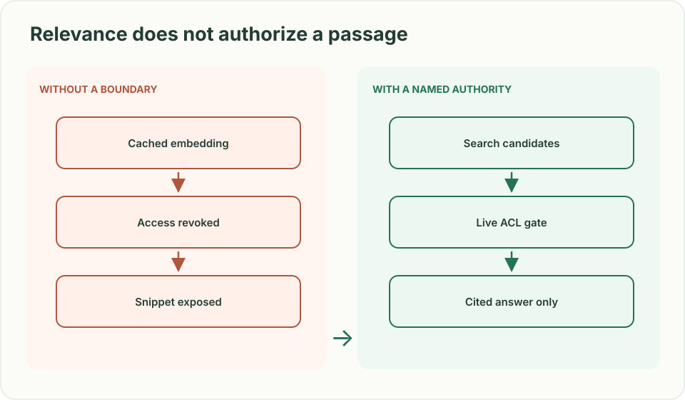
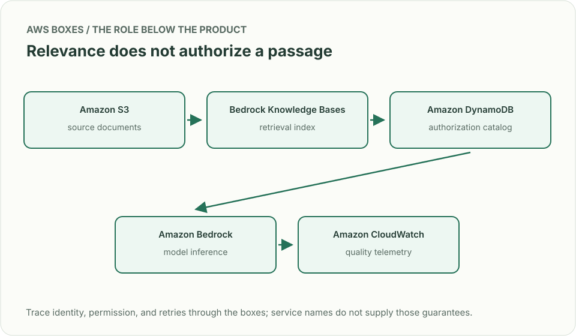
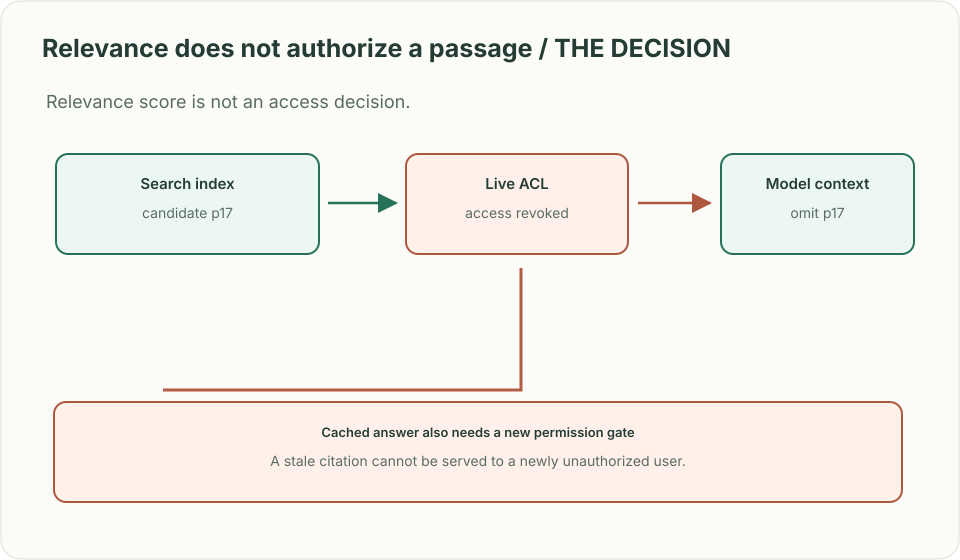

# Knowledge assistant: the citation that lost access

> **Interviewer:** “Build an internal assistant that answers questions from company documents. A user's access to a payroll document is revoked. The document is already indexed and its text appears in yesterday's cached answer. What can the assistant safely return today?”

**Your contract.** Answers require verifiable citations, a 4-second response target, and no content from a document the caller cannot currently open. Retrieval quality is valuable but never grants access. This is a constructed exercise with invented numbers.

| Request | Expected answer |
|---|---|
| Authorized user asks about current policy | Grounded answer cites retrievable current document version |
| User loses document access after embedding | Neither snippets nor paraphrases derived from that document appear |
| Index sync lags for 20 minutes | Show a freshness limitation or refuse to answer where current truth is required |
| Model produces a plausible citation that does not support claim | Reject that citation/claim or mark answer uncertain; never invent evidence |

## Design the permission boundary first

Keep a versioned document catalog with current ACL and deletion state. Retrieve **candidates** from an index, then authorize every candidate and citation against the live catalog before showing titles, snippets, or generated content. Cache by caller's authorization scope and document versions, with revocation-driven invalidation or a fresh authorization gate; do not cache a final answer across users. A generation call receives only authorized excerpts. Validate claims against citations, measure unsupported answers and denial leakage in an evaluation set, and return a cautious response when retrieval or policy service is unavailable.

| AWS box | Job here | Alternative and deciding factor |
|---|---|---|
| Amazon S3 (document store) | Hold source bytes and version IDs | Existing document system as authoritative source if access changes originate there |
| Amazon Bedrock Knowledge Bases (retrieval index) | Parse, embed and retrieve candidate passages | Amazon OpenSearch Service (search index) for direct control of lexical/vector retrieval |
| Amazon DynamoDB (authorization catalog) | Hold current ACL and document state for final checks | Amazon RDS if ACL relationships and transactions fit relational queries |
| Amazon Bedrock (model inference) | Generate from authorized excerpts with citations | Existing model serving stack with comparable isolation, observability, and budget |
| Amazon CloudWatch (telemetry) | Monitor retrieval freshness, denial leaks, cost and latency | Existing platform monitoring with measurable per-stage budgets |

Bedrock Knowledge Bases synchronization after an update or deletion is an **index maintenance step**, not an instantaneous authorization revocation. Filter before model context; if uncertain about access, omit the passage. Distinguish document ingestion version, retrieval version, and ACL version in logs.

**Senior follow-up:** Retrieval runs out of time with two sources missing. Return a bounded partial answer or explicitly decline; prove that fallback never relaxes permissions.

**Staff follow-up:** The source corpus spans business units with different retention and legal policies. Define ownership of metadata, deletion propagation, offline quality evaluation, and incident response when a citation leaked.

**Practice artifact:** Draw retrieval and authorization as separate boxes, trace one revoked paragraph through cache/index/model, and define five evaluation cases with expected citations or abstentions.

**Source boundary:** Original prompt. A [June 2026 Spotify engineering article](https://engineering.atspotify.com/2026/6/encoding-your-domain-expert-the-context-layer-behind-spotifys-data-assistant) describes expert-owned data context; [Bedrock sync documentation](https://docs.aws.amazon.com/bedrock/latest/userguide/kb-data-source-sync-ingest.html) describes index refresh. Neither says this was a Spotify interview question.
