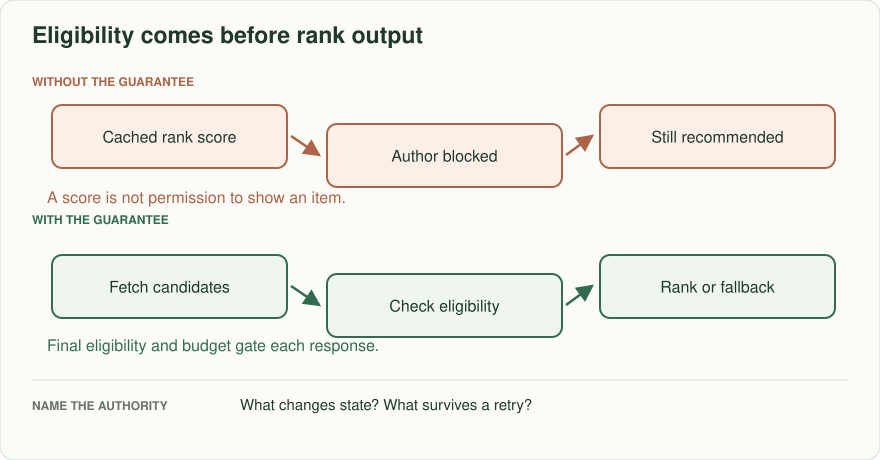
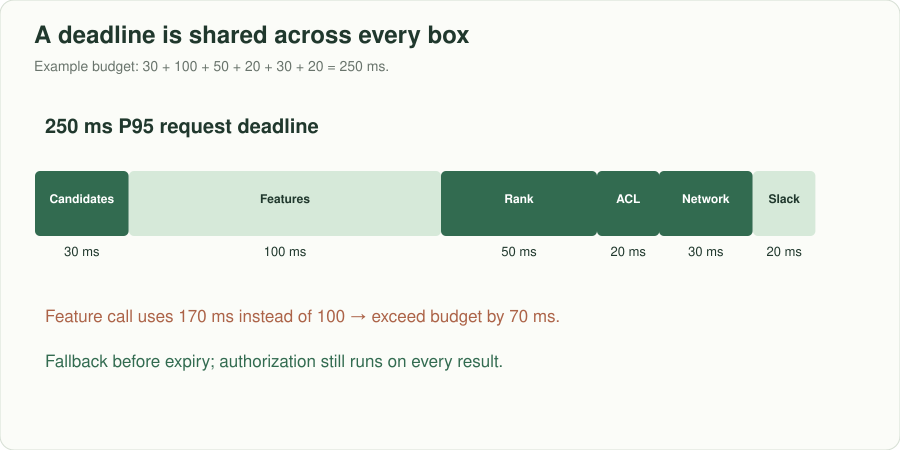
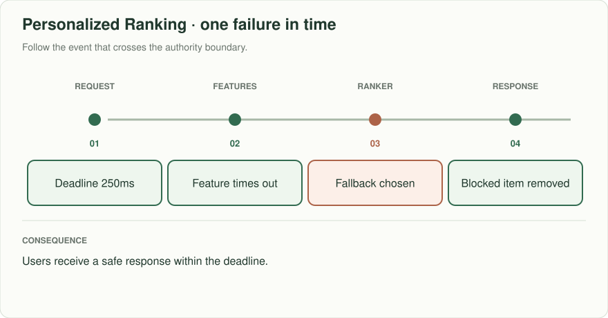

# Personalized ranking: low latency and evidence of quality

> **Interviewer:** “A reading app ranks 200 eligible articles for each visitor. The response must finish within 250 ms at P95. Yesterday's engagement model does not know about a newly blocked author. Design a candidate, feature, rank, and experiment path that never recommends a forbidden item.”

Assume 40,000 peak recommendation requests/s, two-second fresh interaction signals, and 10,000 simultaneous experiment variants/segments as an intentionally extreme follow-up. A plausible rank score is not evidence that the system is safe or helpful.

| Case | Required result |
|---|---|
| Blocked author appears among candidates | Filter before response; cached scores do not grant permission |
| Feature store times out at 170 ms | Fall back to an eligible non-personalized list within deadline |
| Model scores differ offline and online | Detect feature/version skew; canary gate stops wider release |
| Variant improves clicks but raises complaints | Do not use click-through alone as release criterion |

## Decide what can fail independently

Candidate retrieval, current eligibility/ownership, feature lookup, ranking, and final filters have separate responsibilities. Allocate an end-to-end latency budget including network, P95 feature fetch, inference, and serialization, with room for variance; 250 ms is a request deadline, not five separate 250-ms allowances. Version both model and features, propagate experiment assignment deterministically, log exposure only after an item was actually shown. Preserve a safe default path when ranking is unavailable.

The allocation adds to 250 ms. If the feature call needs 170 instead of its allotted 100 ms, the whole path overruns unless a timeout triggers fallback early. The chart's 20 ms slack is a teaching budget, not a guarantee that independent P95 stages combine into a P95 request.

**Senior follow-up:** A rollout raises average CTR 3% while a small language cohort experiences a 20% complaint rise. Define evaluation slices, minimum sample size, rollback signals, and an owner for the trade-off. Explain why the offline metric cannot substitute for an online guardrail.

**Staff follow-up:** A privacy deletion crosses online features, training sets, caches, exposure logs, and models. Set retention and retraining policy, ownership, an audit trail, and a response contract while deletion propagates. Separate serving reliability from experimentation governance.

**Practice artifact:** Separate online serving and offline evaluation diagrams, latency budget, stale-block test, and go/no-go release memo.

**AWS translation:** S3 + batch/stream processing for training data, an explicitly versioned low-latency feature store, ECS/SageMaker endpoint as suits workload, CloudWatch for p95 and fallback rates. IAM boundaries and product eligibility checks address different risks. [Spotify's January 2026 engineering article](https://engineering.atspotify.com/2026/1/why-we-use-separate-tech-stacks-for-personalization-and-experimentation) discusses keeping personalization serving and experimentation distinct; exercise numbers are original.
