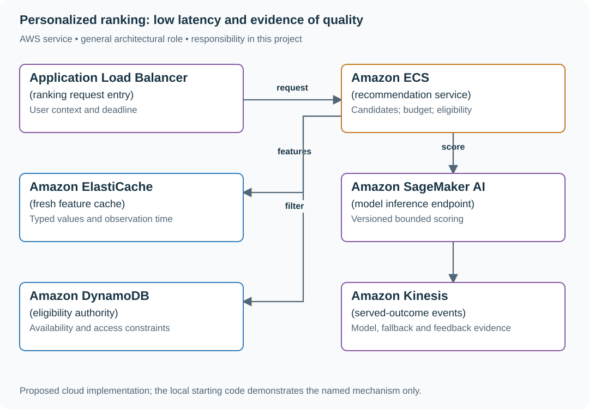

# Serve recommendations with safe fallback ranking

## Application background

A shopper opens a page of recommended products. The application first gathers possible products, then uses a model to choose an order suited to that shopper. It also checks which products are allowed and in stock.

The model may need recent customer features from another service. If those data arrive too late, the page still needs a useful response. A fallback list of popular products can help, but it must follow the same stock and permission rules.

### Example walkthrough

| Action | Expected behavior |
|---|---|
| The feature data arrive within the time budget | Rank the allowed candidate products. |
| The feature service takes too long | Use the declared popular-products fallback. |
| A fallback product is restricted or out of stock | Exclude it just as the model path would. |

A deadline is the latest time the operation may finish. A fallback is a simpler alternative result used when the preferred calculation cannot finish safely within that time.

### Sizing that affects this decision

The 250 ms response target has to include the whole user-visible operation. One candidate budget is 30 ms for candidate retrieval, 50 ms for features, 80 ms for inference, 20 ms for eligibility checks, 30 ms for transport and 40 ms of reserve. These allocations add to 250 ms, but adding separately measured p95 values does not establish an end-to-end p95. A 170 ms feature wait already exceeds its allocation.

These are exercise assumptions. The [estimation reference](../../../01-code/01-problem-solving/estimation-constants.md) explains the units and approximations. They do not establish the local demo's measured capacity.

## Your assignment

**Deliver:** Build product ranking within a response deadline. Provide a simpler fallback when the model or features are too slow, and apply stock and permission checks to both paths.

**Required behavior:** Return eligible ranked items within a 250 ms p95 budget. Personalized scoring is optional under deadline pressure. Authorization and availability filtering are mandatory for every path, including cached fallback.

The required first milestone is a working local implementation of the behavior above. The numbered implementation steps define the scope. The cloud architecture is a later extension, not something the starter has already provisioned.

## Get the code and run the supplied example

The code is in the public [junior-to-staff repository](https://github.com/Soulful-Iris/junior-to-staff). Install Git and Python 3.12+. No AWS account or Python packages are required for this first run. If you already have a checkout, use it and skip cloning.

```bash
git clone https://github.com/Soulful-Iris/junior-to-staff.git
cd junior-to-staff
python3 examples/architecture-starts/personalized_ranking.py
```

**Supplied file:** [`examples/architecture-starts/personalized_ranking.py`](https://github.com/Soulful-Iris/junior-to-staff/blob/main/examples/architecture-starts/personalized_ranking.py). You can also [read or download the source here](../../../../examples/architecture-starts/personalized_ranking.py).

This program is a **mechanism demonstration**: it runs the small scenario in one process and prints the result. It is not an HTTP service, a complete application, or an AWS deployment. A successful run demonstrates this mechanism only. It does not establish the workload or failure guarantees of the application you will build.

**Example output from the supplied run:**

Generated IDs and timestamps may differ. Compare the state transitions and outcomes.

```text
Mode: fallback remaining budget: 80
Returned: ['b', 'c']
```

### Set up your implementation workspace

Create `work/personalized-ranking/` in your checkout (or use a separate repository). Copy the supplied mechanism into that directory as `mechanism.py`, then extract its state transitions into functions you can call from your implementation. The record and module names below describe what you must implement. They are not a promise that files with those names already exist. Keep a `README.md` beside your implementation with its exact run commands and observed results.

## Local components and state to implement

This table names the records, interfaces or decision inputs for your deliverable. Unless a name is explicitly linked to supplied source above, it is something you create. Implement the local state transitions first, then connect the HTTP, storage or worker boundaries required by the steps.

| Record / module | Key or interface | Responsibility |
|---|---|---|
| candidate_set | request_id,item_ids,source_version | Bounded retrieval output before ranking. |
| feature_vector | entity,feature_version,observed_at | Typed features with freshness evidence. |
| ranking_run | model_version,feature_version,fallback_reason | Reproducible scoring mode and deadline outcome. |

## Implement the assignment

### 1. Build an eligible baseline

Retrieve a bounded candidate list and return a deterministic popular/recent ordering after current eligibility checks. Measure that baseline’s latency and usefulness. Keep the same eligibility module for personalized and fallback paths.

### 2. Version feature and model contracts

Define feature names, types, defaults, observation times and training/serving transformations. Record model and feature schema versions together. Missing data is not automatically zero. Choose a documented default or omit personalization.

### 3. Spend one shared deadline

Pass remaining time to feature retrieval and inference. If the feature path consumes 170 ms, skip expensive scoring when the response reserve is insufficient. Cancel work that no longer contributes to a response and record the fallback reason without making the user wait for a doomed model call.

### 4. Evaluate the served system

Compare engagement or task success with guardrails for eligibility, latency and cohort effects. Record actual served model/feature versions and fallback frequency. Offline ranking quality alone cannot reveal how often production users receive the fallback.

## Demonstrate the completed local result

| Action | Expected visible result |
|---|---|
| Run the starting program | A 170 ms feature delay triggers fallback, and ineligible item a is still excluded. |
| Serve stale features | The chosen feature policy is applied and recorded. |
| Roll back the model | The feature schema remains compatible with the restored model. |

**Handoff:** In your implementation README, include the start command, one successful operation, the failure case above and the resulting stored state or decision. State which dependencies are simulated. Someone with a fresh checkout should be able to reproduce this without your chat history.

## Workload assumptions and capacity decisions

These are constructed exercise assumptions. The stated workload is a design target. The local demonstration does not establish that throughput. Use the [estimation constants](../../../01-code/01-problem-solving/estimation-constants.md) to check units before choosing capacity.

| Input or objective | Calculation / consequence |
|---|---|
| 40,000 requests/s × 200 candidates | Eight million candidate scores/s before feature retrieval and batching. |
| 250 ms p95 response budget | Example: 30 ms candidates, 50 ms features, 80 ms inference, 20 ms eligibility, 30 ms transport, 40 ms reserve. |
| Feature freshness target: two seconds | Store observation time and define which stale features may be omitted versus which require rejection. |

## Map the local implementation to AWS

**Deployment status: local only.** Running the supplied command creates no AWS resources and configures no cloud connections. The diagram is a proposed deployment of the completed application. Each box needs either a deployed runtime, a provisioned service or an explicitly external dependency.

Read the diagram by following the arrows from the entry point: application code accepts the request or event, the state owner commits it, and any worker produces the later result. The table ties those roles to code and adapter work. Multiple boxes do not imply multiple Python files already exist.



The inference endpoint ranks candidates. The application owns deadlines and eligibility. Keeping a useful baseline makes feature/inference outages an explicit product behavior instead of a hidden timeout.

| Local responsibility | Cloud destination and role | Implementation still required |
|---|---|---|
| Local HTTP listener | Application Load Balancer: ranking request entry | Deploy a service behind a target group, configure health checks and bounded connection/request behavior. |
| Application or worker process | Amazon ECS: recommendation service | Build a container and task definition. Supply configuration, task roles and graceful shutdown behavior. |
| Local cache, counter or coordination state | Amazon ElastiCache: fresh feature cache | Implement a Redis/Valkey adapter and atomic operations, expiry and unavailable-cache behavior. Keep the durable authority separate. |
| Local ranking/model fixture | Amazon SageMaker AI: model inference endpoint | Deploy a versioned inference endpoint and implement bounded calls, eligibility filtering and fallback behavior. |
| Local dictionary, SQLite records or state model | Amazon DynamoDB: eligibility authority | Design partition/sort keys and write a storage adapter with conditional updates or transactions. Python state and SQL are not uploaded as a database. |
| Local event sequence or input stream | Amazon Kinesis: served-outcome events | Implement producer/consumer adapters, partition keys, durable acceptance and checkpoint/replay behavior. |

### Provision resources, then connect the application

| Resource or boundary | Initial configuration and reason |
|---|---|
| Inference | Pin model artifact/version and bound endpoint concurrency. Retain a measured non-model fallback. |
| Feature cache | Timestamp every value, cap staleness per feature and include schema version in keys. |
| Feedback | Join impressions to outcomes with stable IDs. Record actual exposure rather than intended assignment. |

Use one disposable AWS environment for the cloud exercise. Put the named resources in `infra/template.yaml` or your existing IaC tool, pass resource IDs through configuration, and scope each runtime role to its own tables, buckets and queues. The diagram is a design to implement. It is not a claim that these resources have been deployed. Record the commands you used to deploy and remove the exercise resources.

For concrete provisioning commands, configuration wiring and cleanup, use the [AWS foundation guide](../../../../examples/architecture-starts/infra/README.md). It includes a deployable table/queue/object-storage foundation and explains which application and service adapters you still implement.

A provisioned queue or table does not make the local program use it. Configure resource IDs in the deployed runtime, replace the local adapter, and replay the same successful and failing operation against that runtime. Record the deployed commit and observable result, then remove the disposable resources using your infrastructure tool.

## Extend the design after the baseline works


Run 10,000 model variants. Estimate artifact, feature and observation cardinality, then choose whether all variants deserve live infrastructure or whether most can be evaluated offline first.

<details>
<summary>Additional design cases, alternatives and original source notes</summary>


Assume 40,000 peak recommendation requests/s, two-second fresh interaction signals, and 10,000 simultaneous experiment variants/segments as an intentionally extreme follow-up. A plausible rank score is not evidence that the system is safe or helpful.

| Case | Required result |
|---|---|
| Blocked author appears among candidates | Filter before response. Cached scores do not grant permission |
| Feature store times out at 170 ms | Fall back to an eligible non-personalized list within deadline |
| Model scores differ offline and online | Detect feature/version skew. Canary gate stops wider release |
| Variant improves clicks but raises complaints | Do not use click-through alone as release criterion |

## Decide what can fail independently

Candidate retrieval, current eligibility/ownership, feature lookup, ranking, and final filters have separate responsibilities. Allocate an end-to-end latency budget including network, P95 feature fetch, inference, and serialization, with room for variance. 250 ms is a request deadline, not five separate 250-ms allowances. Version both model and features, propagate experiment assignment deterministically, log exposure only after an item was actually shown. Preserve a safe default path when ranking is unavailable.

The allocation adds to 250 ms. If the feature call needs 170 instead of its allotted 100 ms, the whole path overruns unless a timeout triggers fallback early. The chart's 20 ms slack is a teaching budget, not a guarantee that independent P95 stages combine into a P95 request.

## Put the AWS names on the boxes

**Why these boxes, and what changes the choice:** SageMaker endpoints serve a managed ranker. ECS inference fits a lighter model with existing deployment tooling. DynamoDB serves versioned online features. ECS enforces final eligibility and fallback. CloudWatch observes latency and denial outcomes, not model quality by itself.


**Senior follow-up:** A rollout raises average CTR 3% while a small language cohort experiences a 20% complaint rise. Define evaluation slices, minimum sample size, rollback signals, and an owner for the trade-off. Explain why the offline metric cannot substitute for an online guardrail.

**Staff follow-up:** A privacy deletion crosses online features, training sets, caches, exposure logs, and models. Set retention and retraining policy, ownership, an audit trail, and a response contract while deletion propagates. Separate serving reliability from experimentation governance.

**Practice artifact:** Separate online serving and offline evaluation diagrams, latency budget, stale-block test, and go/no-go release memo.

**AWS translation:** S3 + batch/stream processing for training data, an explicitly versioned low-latency feature store, ECS/SageMaker endpoint as suits workload, CloudWatch for p95 and fallback rates. IAM boundaries and product eligibility checks address different risks. [Spotify's January 2026 engineering article](https://engineering.atspotify.com/2026/1/why-we-use-separate-tech-stacks-for-personalization-and-experimentation) discusses keeping personalization serving and experimentation distinct. Exercise numbers are original.

</details>
