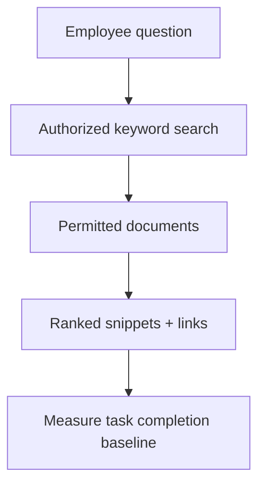
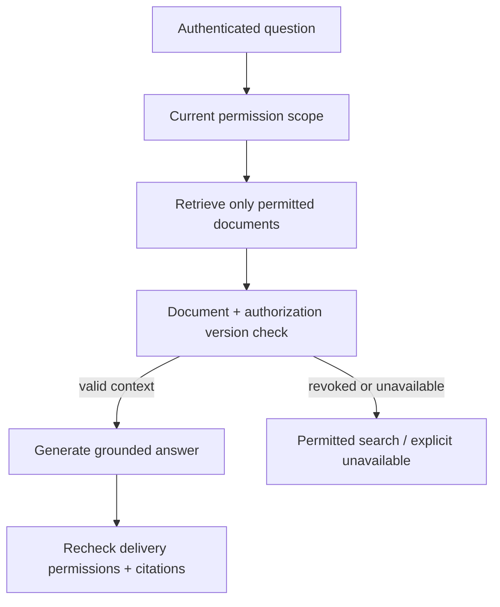

# Support assistant

[Curriculum](../../../README.md) · [AI systems](../README.md)

All prompts here are constructed practice, without company attribution.

> **Candidate opening:** “Employees ask questions about internal documents.
Keyword search already returns sources, but users want concise answers. Add a
model only if it improves a measured task while preserving document permissions
and a usable fallback during model outage.”

| Input | Expected behavior | Scope |
|---|---|---|
| Question answered by an authorized source | Grounded answer with source, or search baseline | Evaluate task success against baseline |
| Relevant document belongs to another team | Never enters returned context | Permissions constrain retrieval and delivery |
| Contradictory sources or model unavailable | Explain uncertainty or return permitted search | Read-only; no autonomous tool effects |

Prerequisites: [AI system concepts](../../../03-production/01-system-design/mechanism-reference.md) and [security boundaries](../../01-data-at-scale/labs/cache-consistency/revocation.md).
This is an explicit build brief, not supplied model code. Deliver fixed authorized
fixtures and search baseline, then fake-model failure handling, then separately
measured retrieval/generation quality before a real provider integration.

State the user task and permission invariant first. Compare the baseline on fixed
examples, label retrieval misses separately from bad generation, then decide
whether added latency/cost earns a measurable benefit.

Worked approach and AWS mapping — open after your attempt

**Prompt:** answer questions from a company's authorized documents and escalate uncertainty. Start with read-only answers. Model ingestion version, document permissions, retrieval results, citations, and evaluation outcomes. Keep tool execution separate from text generation.

Compare keyword search with retrieval+generation on a fixed test set. Add a model only when it improves a measured user task. Cache carefully: permissions and document version belong in the validity policy. Plan for empty retrieval, contradictory documents, model outage, prompt injection, and cost spikes.

**AWS mapping:** S3 for documents, a retrieval store suited to the workload, Bedrock or another model endpoint, Lambda/ECS orchestration, and application-layer authorization. No service choice guarantees correct or permitted output.

**Implement:** use local fake retrieval/model functions first; record accuracy, refusal/escalation, latency, and cost estimates. **Junior:** connect inputs/outputs and error states. **Senior:** isolate retrieval from generation failures and implement fallback. **Staff:** governance of evaluation changes, ownership of tools, data boundaries, and rollout criteria.

## Follow-up: source permissions change after caching

**Senior:** inject irrelevant/conflicting sources, permission revocation, and
model outage; report retrieval failures separately from generation failures.
**Lead follow-up:** a judge agrees on 99 of 100 examples by always saying pass;
require failure recall and human-labeled class balance before adopting it as a
release gate. A fixed regression suite may validly pass 100%; challenge and
holdout sets answer different questions. Assessor evidence includes source
permission tests, cost/latency bounds, baseline comparison, and an honest failure
analysis, not a chosen model name.

[Design route](../../../../indexes/system-designs.md) · [Practice rubric](../../../../practice/README.md)
