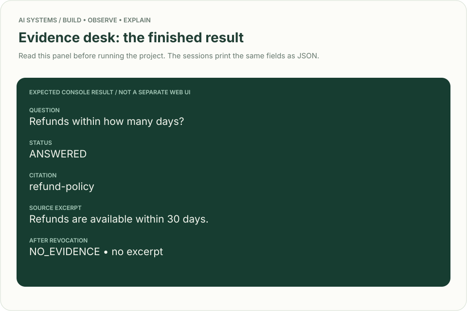
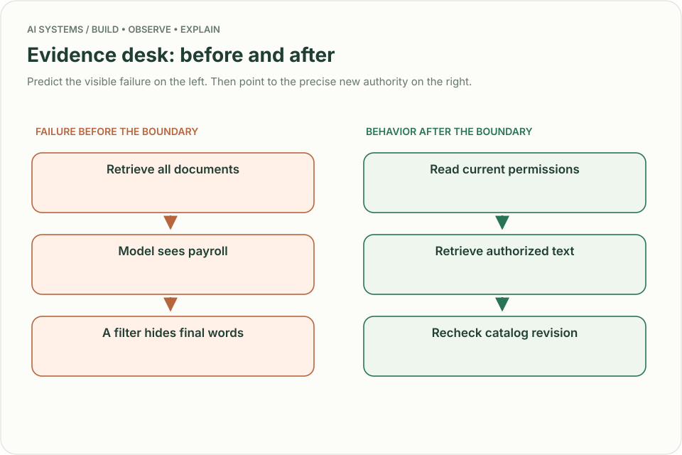
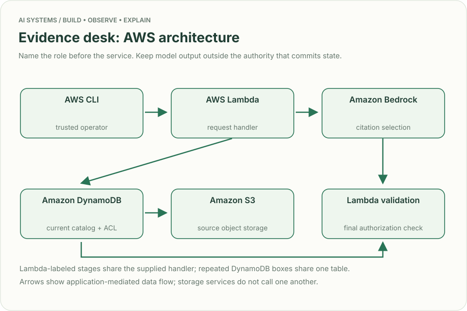
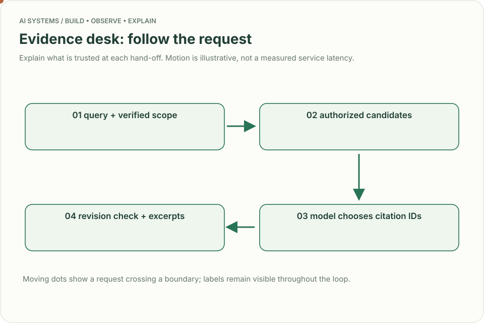
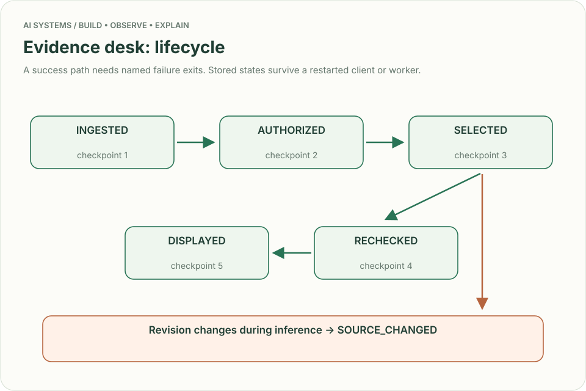
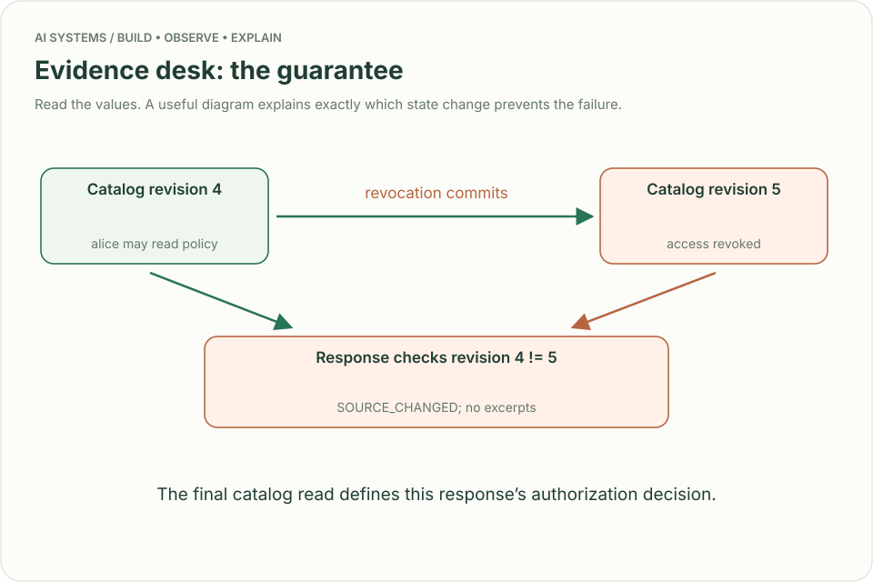

# Evidence desk: a document assistant with citations and revocation

## The reviewer's brief

> “Our support team searches policy documents before answering customers. Build an assistant that finds the relevant passage, shows where it came from, and stops showing it when access is removed. Payroll documents live in the same repository. What prevents a good search match from becoming a data leak?”

**End product:** a working, citation-first document assistant with ingestion, durable document versions, per-subject read permissions, a model selection step, explicit abstention, and a revocation check. Its first version returns exact source excerpts; generated paraphrases are a later design extension. Run it locally or through the AWS workbench introduced immediately before these projects.



## Settle the contract before choosing a vector database

The bounded implementation supports 20 documents per tenant, 8,000 characters per document, a 500-character question, and at most three 3,000-character excerpts sent to the model. These are deliberate lab limits. The subject is a trusted operator-configured identity, `alice`; callers cannot select another tenant in the JSON request.

| Case | Exact input or workload | Expected outcome |
|---|---|---|
| Useful answer | Policy text `Refunds are available within 30 days.`; Alice asks `Refunds within how many days?` | `ANSWERED`, citation `refund-policy`, exact policy excerpt |
| Hidden document | Payroll text is readable only by Bob; Alice asks `Payroll secret?` | `NO_EVIDENCE`; no payroll bytes sent to the model |
| Revoked source | Remove policy readers, then repeat Alice's question | `NO_EVIDENCE`; empty citations and excerpts |
| Mid-request revocation | Catalog changes while model inference is in flight | `SOURCE_CHANGED`; discard the pending answer |
| Fabricated citation | Model returns `payroll`, which was not in its authorized candidate set | `INVALID_MODEL_OUTPUT`; empty answer |
| Model outage | Bedrock fails after retrieval | `MODEL_UNAVAILABLE`; no generated answer |
| No match | Ask `Where is the office?` with only a refund document | `NO_EVIDENCE`; do not invent an office address |

## Understand the mechanism

**Retrieval** selects possible evidence. **Authorization** decides whether this subject may read it. **Grounding** ties output to that evidence. These are separate decisions with different failure modes.

The lexical baseline counts shared words between the query and authorized documents. It is intentionally inspectable: no embedding index, synchronization job, or score threshold hides the first lesson. Bedrock sees only selected authorized excerpts and returns document IDs. The application validates those IDs and constructs the response from stored text. A model choosing a citation does not prove the excerpt answers the question; measure relevance separately.



## Draw the AWS architecture



| AWS service / general role | What the supplied implementation does | Alternative and decision |
|---|---|---|
| AWS Lambda / request handler | Runs ingestion, lexical retrieval, model call, and response checks | ECS/Fargate for streaming responses or persistent connections |
| Amazon DynamoDB / document catalog and permissions | Stores object pointers, readers, versions, and a revision with conditional writes | Aurora PostgreSQL when joins and an existing authorization model dominate |
| Amazon S3 / object storage | Stores document text under a content-derived object key | Existing content service when it already controls document lifecycle |
| Amazon Bedrock / model inference | Uses Converse to choose citation IDs from supplied evidence | A directly hosted model when isolation, operating effort, and cost justify it |
| Bedrock Knowledge Bases / retrieval index | **Follow-up option**, not deployed in this baseline | OpenSearch for explicit lexical/vector ranking control; pgvector when your existing PostgreSQL workload fits |

## Build it end to end

1. **Ingest:** validate document ID, text size, and readers. Write the content object, then conditionally publish its pointer in the catalog. If the catalog write conflicts, an unreferenced object may remain; it never becomes a visible document by itself.
2. **Scope:** read the current catalog. Skip documents the configured subject cannot read before fetching their S3 bodies. Enforce a bounded catalog so retrieval work has a declared ceiling.
3. **Rank:** tokenize the query and documents, count overlap, select at most three candidates. Record the catalog revision used for this decision.
4. **Infer:** send the candidates and question to the model. Accept JSON only; reject citation IDs outside the candidate set.
5. **Recheck:** consistently reread the catalog revision. If anything changed, return `SOURCE_CHANGED`. A later product can reread only the relevant document and permission versions to avoid rejecting unrelated updates.
6. **Display:** return exact excerpts and citation IDs. No model-authored link is followed and no model-chosen S3 path is fetched.



The central boundary is short enough to inspect:

```python
if subject not in document["readers"]:
    continue
# Only after authorization do we fetch and consider the source body.
```

In `app.py`, follow `document_put`, `assistant_ask`, and `document_revoke`. The actual final response check reads the stored revision, not a model's claim that access is still valid.

## Run and inspect the result

```bash
python3.12 examples/ai-systems/demo.py assistant
```

The six-step session ingests the policy and private payroll document, asks both questions, revokes the policy, then asks again. In the payroll and revoked cases, inspect the empty `citations` and `excerpts` arrays. To try your own requests, use `app.py` and the durable request files shown in the workbench. On AWS, run `cloud_smoke.py assistant --function "$AI_FUNCTION"` from `examples/ai-systems` after deployment.



## Follow-up: revocation happens during inference

A model call began using catalog revision 4. An administrator revokes the policy, creating revision 5. The call finishes successfully. The answer is still discarded because it was built under an old authorization snapshot.



**Exact guarantee:** the final consistent catalog read defines the response's authorization decision. Bytes already delivered cannot be recalled. Revocation after that read may race with delivery; define this boundary explicitly rather than promising instantaneous deletion from a user's screen.

**Senior follow-up:** increase to one million documents. Add versioned ingestion and a retrieval index. Keep application authentication, trusted identity propagation, and current permission checks. A stale index can supply candidates, but it must not grant access. Measure retrieval recall independently from answer usefulness.

**Staff follow-up:** deploy in two regions with residency requirements. Decide where permission truth lives, how revocations reach each region, what happens during partitions, and whether unavailable authorization means abstaining. Bound the revocation window in a user-visible contract.

## Engineer FAQs

**Why not call RetrieveAndGenerate immediately?** This implementation needs a visible application gate between retrieval and inference. Combined retrieval/generation can fit another contract; verify that its filtering, identity, freshness, and citation handling enforce your required boundary.

**Does an embedding provide authorization?** No. Embeddings encode similarity. A useful match can belong to a different user or a revoked document.

**Do citation IDs prove the answer is true?** They prove which supplied documents were selected. The baseline returns verbatim text and avoids fabricated paraphrases. Relevance, contradictory policies, and completeness still require evaluation and perhaps human escalation.

**Can we cache answers?** Only with a validity policy covering tenant, subject/permission scope, source versions, and model/prompt version. Revalidate authorization before delivery. This implementation deliberately has no answer cache.

**What about prompt injection inside a document?** The model receives source text as data and has no tools. Application checks reject invented citations. A malicious source can still influence relevance selection; test that separately and inspect provenance before treating text as policy.

**What if the source is a PDF?** This baseline accepts text. Add a parser/OCR stage with page references, validation and parser-version tracking before publication. Do not pretend text fixtures test layout extraction.

**How do we estimate load?** The baseline scans at most 20 authorized documents per question. At 10 questions/s that can mean 200 object reads/s before caching. Indexing, document caching, and ingestion become separate design work well before large-scale traffic.

## What you are expected to hand over

Bring the six-step transcript, an AWS service-role diagram, the mid-request revocation test, and a measured retrieval relevance set. Include the chosen authorization decision point, cost/latency observations from actual model calls, and a runbook for model or catalog failure.

### How the review conversation gets harder

| Review gate | Changed requirement | Evidence to bring |
|---|---|---|
| Baseline | Answer the refund question | Exact excerpt and its citation |
| Failure | Payroll is the best lexical match | No unauthorized context reaches the model |
| Senior | Permissions change during inference | Race test returns `SOURCE_CHANGED` |
| Staff | Regional permission service is unavailable | Explicit consistency and abstention decision |
| Evidence | Search relevance is poor | Labeled queries, recall, failure categories and a justified index choice |
| Handoff | Another engineer starts from a fresh checkout | Local transcript, deploy instructions, monitoring and cleanup |

## Research behind the design

Reviewed September 23, 2026. AWS documents [separate retrieval and returned source metadata](https://docs.aws.amazon.com/bedrock/latest/userguide/kb-test-retrieve.html). Its [ACL-aware retrieval documentation](https://docs.aws.amazon.com/bedrock/latest/userguide/kb-managed-acl.html) assigns authentication and trusted identity propagation to the application. [RAG evaluation metrics](https://docs.aws.amazon.com/bedrock/latest/userguide/knowledge-base-evaluation-metrics.html) distinguish evidence retrieval from response quality. The exact revision-check implementation and project limits are original teaching decisions, not AWS guarantees.
