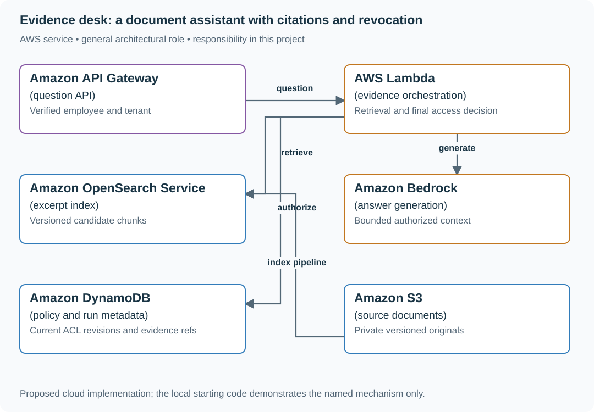

# Build evidence-backed answers with permission rechecks

## Application background

Ana works in operations and asks an internal assistant what the expense policy allows. The application looks up relevant passages, drafts an answer and shows the passages supporting it. Ana should be able to follow the references and judge whether the answer matches them.

Not every document is available to every employee. Ana may read expenses but not acquisition planning. A source can also become unavailable after lookup but before the response is sent. The system must handle that change without exposing protected text.

### A proposed answer response

The interface you add around the supplied assistant workflow should make an unsupported answer distinguishable from a supported one. These are illustrative response shapes:

```json
{"status":"answered","answer":"…","sources":[{"document_id":"expense-policy","version":3,"passage_id":"meals"}]}
```

```json
{"status":"insufficient_evidence","answer":null,"sources":[]}
```

A source reference must resolve to a real permitted passage. A plausible-looking document ID does not count as evidence.

An evidence-backed answer is one whose claims can be tied to permitted source material. An abstention is an explicit response that the application cannot answer from such evidence.

## Your assignment

**Deliver:** Extend the supplied assistant workflow with a usable evidence view. Handle permission removal between retrieving a passage and returning an answer that uses it.

**Required behavior:** Current authorization applies before reading source text and again before returning an answer. Citations identify real document versions and ranges. Retrieved instructions cannot expand tool or document access.

The required first milestone is a working local implementation of the behavior above. The numbered implementation steps define the scope. The cloud architecture is a later extension, not something the starter has already provisioned.

## Get the code and run the supplied example

The code is in the public [junior-to-staff repository](https://github.com/Soulful-Iris/junior-to-staff). Install Git and Python 3.12+. No AWS account or Python packages are required for this first run. If you already have a checkout, use it and skip cloning.

```bash
git clone https://github.com/Soulful-Iris/junior-to-staff.git
cd junior-to-staff
python3 examples/ai-systems/demo.py assistant
```

**Supplied code:** [AI workflow implementation](https://github.com/Soulful-Iris/junior-to-staff/tree/main/examples/ai-systems), starting at [demo.py](https://github.com/Soulful-Iris/junior-to-staff/blob/main/examples/ai-systems/demo.py). These are local workflows with fixture providers and temporary storage. They do not include the user interface or connect to the AWS services in the diagram.

**Example output from the supplied run:**

Generated IDs and timestamps may differ. Compare the state transitions and outcomes.

```text
[
  {
    "request": {
      "action": "document.put",
… (more output follows)
```

### Set up your implementation workspace

Create `work/01-evidence-desk/` in your checkout (or use a separate repository). Copy `examples/ai-systems/` there so you can change the workflow and its storage/provider boundaries together. The record and module names below describe what you must implement. They are not a promise that files with those names already exist. Keep a `README.md` beside your implementation with its exact run commands and observed results.

## Local components and state to implement

This table names the records, interfaces or decision inputs for your deliverable. Unless a name is explicitly linked to supplied source above, it is something you create. Implement the local state transitions first, then connect the HTTP, storage or worker boundaries required by the steps.

| Record / module | Key or interface | Responsibility |
|---|---|---|
| document_version | document_id,version,ACL_revision | Evidence and current access basis. |
| answer_run | run_id,subject,query,source_refs | Traceable retrieval and response decision. |
| citation | source_version,range,claim | A support reference that can be inspected. |

## Implement the assignment

### 1. Run the reference and inspect evidence

Execute the assistant demo and identify the authorized sources, citations and revocation result. Read the existing implementation walkthrough below alongside the source. Keep this working local boundary before substituting an embedding index or hosted model.

### 2. Build a search-only baseline

Add an authenticated query route that returns authorized excerpts without generation. Ingest versioned documents and deletion events. Measure whether the right evidence is found before changing prompts to compensate for missing retrieval.

### 3. Add bounded generation and final authorization

Generate only from the selected evidence set, keep prompt/model/index versions, and map claims to source ranges. Recheck current source permissions at response finalization. Discard content whose authorization changed during inference.

### 4. Expose useful uncertainty

Show citations and source dates, abstain when evidence is absent or contradictory, and retain redacted diagnostic evidence. Compare the generated workflow with the search-only baseline on the same supported/unsupported questions.

## Demonstrate the completed local result

| Action | Expected visible result |
|---|---|
| Run the existing assistant demo | Inspect source references and the explicit revocation/abstention behavior in its output. |
| Remove all supporting evidence | Return abstention or authorized search results rather than an invented citation. |
| Change ACL during generation | Restricted evidence does not appear in the returned answer. |

**Handoff:** In your implementation README, include the start command, one successful operation, the failure case above and the resulting stored state or decision. State which dependencies are simulated. Someone with a fresh checkout should be able to reproduce this without your chat history.

## Workload assumptions and capacity decisions

These are constructed exercise assumptions. The stated workload is a design target. The local demonstration does not establish that throughput. Use the [estimation constants](../../../01-code/01-problem-solving/estimation-constants.md) to check units before choosing capacity.

| Input or objective | Calculation / consequence |
|---|---|
| 2,000 employees. 100,000 documents assumption | Start with a small fixture corpus, then estimate index size from actual chunk count and embedding representation. |
| 20 questions/s peak. Four-second response target | Bound retrieval and inference concurrency. Report which stage consumes the budget. |
| Three evidence chunks per answer initial bound | Small context makes citation mapping and contradictory-source review tractable. |

## Map the local implementation to AWS

**Deployment status: local only.** Running the supplied command creates no AWS resources and configures no cloud connections. The diagram is a proposed deployment of the completed application. Each box needs either a deployed runtime, a provisioned service or an explicitly external dependency.

Read the diagram by following the arrows from the entry point: application code accepts the request or event, the state owner commits it, and any worker produces the later result. The table ties those roles to code and adapter work. Multiple boxes do not imply multiple Python files already exist.



This cloud mapping preserves the local reference’s evidence and authorization boundaries. The model is one adapter inside the workflow, not the component that decides what Ana may read.

| Local responsibility | Cloud destination and role | Implementation still required |
|---|---|---|
| Local HTTP boundary or the endpoint you will add | Amazon API Gateway: question API | Create routes and an integration. Translate requests and responses and configure identity validation. |
| Python operation or worker function | AWS Lambda: evidence orchestration | Write a Lambda event adapter, package its dependencies and give its role only the required resource actions. |
| Local derived search records | Amazon OpenSearch Service: excerpt index | Implement indexing, updates/deletions and queries. Recheck current authorization before returning sensitive results. |
| Deterministic model response fixture | Amazon Bedrock: answer generation | Implement model invocation with deadlines, input boundaries and validated output. Preserve the same permission and action rules. |
| Local dictionary, SQLite records or state model | Amazon DynamoDB: policy and run metadata | Design partition/sort keys and write a storage adapter with conditional updates or transactions. Python state and SQL are not uploaded as a database. |
| Local file, object fixture or exported payload | Amazon S3: source documents | Implement upload/download and metadata adapters, scoped access, object naming, retention and incomplete-upload cleanup. |

### Provision resources, then connect the application

| Resource or boundary | Initial configuration and reason |
|---|---|
| Access | Separate source-read and model-invocation permissions. The model has no independent document authority. |
| Index | Version chunks and handle deletions. Current policy checks remain outside stale index metadata. |
| Response cache | Scope by authorization context and source versions. Revocation invalidates eligibility to reuse an answer. |

Use one disposable AWS environment for the cloud exercise. Put the named resources in `infra/template.yaml` or your existing IaC tool, pass resource IDs through configuration, and scope each runtime role to its own tables, buckets and queues. The diagram is a design to implement. It is not a claim that these resources have been deployed. Record the commands you used to deploy and remove the exercise resources.

For concrete provisioning commands, configuration wiring and cleanup, use the [AWS foundation guide](../../../../examples/architecture-starts/infra/README.md). It includes a deployable table/queue/object-storage foundation and explains which application and service adapters you still implement.

A provisioned queue or table does not make the local program use it. Configure resource IDs in the deployed runtime, replace the local adapter, and replay the same successful and failing operation against that runtime. Record the deployed commit and observable result, then remove the disposable resources using your infrastructure tool.

## Extend the design after the baseline works


Add a document revision that contradicts an older policy. Decide which version is authoritative and show the conflict explicitly instead of asking the model to choose without a policy.

<details>
<summary>Additional design cases, alternatives and original source notes</summary>

## The reviewer's brief

> “Our support team searches policy documents before answering customers. Build an assistant that finds the relevant passage, shows where it came from, and stops showing it when access is removed. Payroll documents live in the same repository. What prevents a good search match from becoming a data leak?”

**End product:** a working, citation-first document assistant with ingestion, durable document versions, per-subject read permissions, a model selection step, explicit abstention, and a revocation check. Its first version returns exact source excerpts. Generated paraphrases are a later design extension. Run it locally or through the AWS workbench introduced immediately before these projects.

## Settle the contract before choosing a vector database

The bounded implementation supports 20 documents per tenant, 8,000 characters per document, a 500-character question, and at most three 3,000-character excerpts sent to the model. These are deliberate lab limits. The subject is a trusted operator-configured identity, `alice`. Callers cannot select another tenant in the JSON request.

| Case | Exact input or workload | Expected outcome |
|---|---|---|
| Useful answer | Policy text `Refunds are available within 30 days.`. Alice asks `Refunds within how many days?` | `ANSWERED`, citation `refund-policy`, exact policy excerpt |
| Hidden document | Payroll text is readable only by Bob. Alice asks `Payroll secret?` | `NO_EVIDENCE`. No payroll bytes sent to the model |
| Revoked source | Remove policy readers, then repeat Alice's question | `NO_EVIDENCE`. Empty citations and excerpts |
| Mid-request revocation | Catalog changes while model inference is in flight | `SOURCE_CHANGED`. Discard the pending answer |
| Fabricated citation | Model returns `payroll`, which was not in its authorized candidate set | `INVALID_MODEL_OUTPUT`. Empty answer |
| Model outage | Bedrock fails after retrieval | `MODEL_UNAVAILABLE`. No generated answer |
| No match | Ask `Where is the office?` with only a refund document | `NO_EVIDENCE`. Do not invent an office address |

## Understand the mechanism

**Retrieval** selects possible evidence. **Authorization** decides whether this subject may read it. **Grounding** ties output to that evidence. These are separate decisions with different failure modes.

The lexical baseline counts shared words between the query and authorized documents. It is intentionally inspectable: no embedding index, synchronization job, or score threshold hides the first lesson. Bedrock sees only selected authorized excerpts and returns document IDs. The application validates those IDs and constructs the response from stored text. A model choosing a citation does not prove the excerpt answers the question. Measure relevance separately.

## Draw the AWS architecture

| AWS service / general role | What the supplied implementation does | Alternative and decision |
|---|---|---|
| AWS Lambda / request handler | Runs ingestion, lexical retrieval, model call, and response checks | ECS/Fargate for streaming responses or persistent connections |
| Amazon DynamoDB / document catalog and permissions | Stores object pointers, readers, versions, and a revision with conditional writes | Aurora PostgreSQL when joins and an existing authorization model dominate |
| Amazon S3 / object storage | Stores document text under a content-derived object key | Existing content service when it already controls document lifecycle |
| Amazon Bedrock / model inference | Uses Converse to choose citation IDs from supplied evidence | A directly hosted model when isolation, operating effort, and cost justify it |
| Bedrock Knowledge Bases / retrieval index | **Follow-up option**, not deployed in this baseline | OpenSearch for explicit lexical/vector ranking control. Pgvector when your existing PostgreSQL workload fits |

## Build it end to end

1. **Ingest:** validate document ID, text size, and readers. Write the content object, then conditionally publish its pointer in the catalog. If the catalog write conflicts, an unreferenced object may remain. It never becomes a visible document by itself.
2. **Scope:** read the current catalog. Skip documents the configured subject cannot read before fetching their S3 bodies. Enforce a bounded catalog so retrieval work has a declared ceiling.
3. **Rank:** tokenize the query and documents, count overlap, select at most three candidates. Record the catalog revision used for this decision.
4. **Infer:** send the candidates and question to the model. Accept JSON only. Reject citation IDs outside the candidate set.
5. **Recheck:** consistently reread the catalog revision. If anything changed, return `SOURCE_CHANGED`. A later product can reread only the relevant document and permission versions to avoid rejecting unrelated updates.
6. **Display:** return exact excerpts and citation IDs. No model-authored link is followed and no model-chosen S3 path is fetched.

The central boundary is short enough to inspect:

```python
if subject not in document["readers"]:
    continue
# Only after authorization do we fetch and consider the source body.
```

In `app.py`, follow `document_put`, `assistant_ask`, and `document_revoke`. The actual final response check reads the stored revision, not a model's claim that access is still valid.

## Run and inspect the result

```bash
python3.12 examples/ai-systems/demo.py assistant
```

The six-step session ingests the policy and private payroll document, asks both questions, revokes the policy, then asks again. In the payroll and revoked cases, inspect the empty `citations` and `excerpts` arrays. To try your own requests, use `app.py` and the durable request files shown in the workbench. On AWS, run `cloud_smoke.py assistant --function "$AI_FUNCTION"` from `examples/ai-systems` after deployment.

## Follow-up: revocation happens during inference

A model call began using catalog revision 4. An administrator revokes the policy, creating revision 5. The call finishes successfully. The answer is still discarded because it was built under an old authorization snapshot.

**Exact guarantee:** the final consistent catalog read defines the response's authorization decision. Bytes already delivered cannot be recalled. Revocation after that read may race with delivery. Define this boundary explicitly rather than promising instantaneous deletion from a user's screen.

**Senior follow-up:** increase to one million documents. Add versioned ingestion and a retrieval index. Keep application authentication, trusted identity propagation, and current permission checks. A stale index can supply candidates, but it must not grant access. Measure retrieval recall independently from answer usefulness.

**Staff follow-up:** deploy in two regions with residency requirements. Decide where permission truth lives, how revocations reach each region, what happens during partitions, and whether unavailable authorization means abstaining. Bound the revocation window in a user-visible contract.

## Engineer FAQs

**Why not call RetrieveAndGenerate immediately?** This implementation needs a visible application gate between retrieval and inference. Combined retrieval/generation can fit another contract. Verify that its filtering, identity, freshness, and citation handling enforce your required boundary.

**Does an embedding provide authorization?** No. Embeddings encode similarity. A useful match can belong to a different user or a revoked document.

**Do citation IDs prove the answer is true?** They prove which supplied documents were selected. The baseline returns verbatim text and avoids fabricated paraphrases. Relevance, contradictory policies, and completeness still require evaluation and perhaps human escalation.

**Can we cache answers?** Only with a validity policy covering tenant, subject/permission scope, source versions, and model/prompt version. Revalidate authorization before delivery. This implementation deliberately has no answer cache.

**What about prompt injection inside a document?** The model receives source text as data and has no tools. Application checks reject invented citations. A malicious source can still influence relevance selection. Test that separately and inspect provenance before treating text as policy.

**What if the source is a PDF?** This baseline accepts text. Add a parser/OCR stage with page references, validation and parser-version tracking before publication. Do not pretend text fixtures test layout extraction.

**How do we estimate load?** The baseline scans at most 20 authorized documents per question. At 10 questions/s that can mean 200 object reads/s before caching. Indexing, document caching, and ingestion become separate design work well before large-scale traffic.

## What you are expected to hand over

Bring the six-step transcript, an AWS service-role diagram, the mid-request revocation test, and a measured retrieval relevance set. Include the chosen authorization decision point, cost/latency observations from actual model calls, and a runbook for model or catalog failure.

### How the review conversation gets harder

| Review gate | Changed requirement | Evidence to bring |
|---|---|---|
| Baseline | Answer the refund question | Exact excerpt and its citation |
| Failure | Payroll is the best lexical match | No unauthorized context reaches the model |
| Senior | Permissions change during inference | Race test returns `SOURCE_CHANGED` |
| Staff | Regional permission service is unavailable | Explicit consistency and abstention decision |
| Evidence | Search relevance is poor | Labeled queries, recall, failure categories and a justified index choice |
| Handoff | Another engineer starts from a fresh checkout | Local transcript, deploy instructions, monitoring and cleanup |

## Research behind the design

Reviewed September 23, 2026. AWS documents [separate retrieval and returned source metadata](https://docs.aws.amazon.com/bedrock/latest/userguide/kb-test-retrieve.html). Its [ACL-aware retrieval documentation](https://docs.aws.amazon.com/bedrock/latest/userguide/kb-managed-acl.html) assigns authentication and trusted identity propagation to the application. [RAG evaluation metrics](https://docs.aws.amazon.com/bedrock/latest/userguide/knowledge-base-evaluation-metrics.html) distinguish evidence retrieval from response quality. The exact revision-check implementation and project limits are original teaching decisions, not AWS guarantees.

</details>
