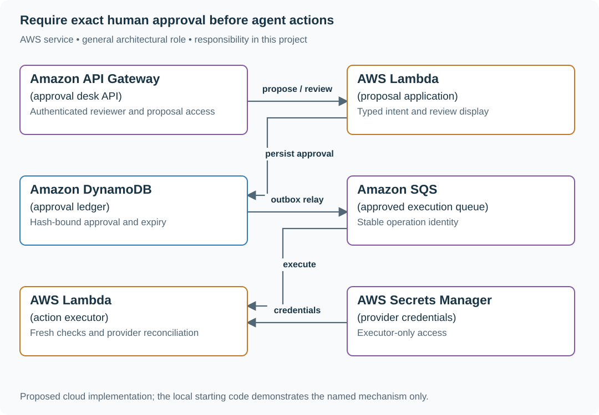

# Approval desk: a support agent that proposes before it acts

## What you are building

> Build an approval desk for support credits. The assistant may propose a $5 credit for ticket T7, but only an authorized reviewer can approve it. If the amount changes to $50 or the approval expires, the old approval cannot authorize execution.

**Working contract:** Proposal, approval and execution are separate durable states. Approval binds the exact target and canonical parameters. The executor rechecks permission, expiry and operation identity before performing an external effect.

## Workload and the decisions it changes

These are constructed exercise assumptions. The stated workload is a design target; the local demonstration does not establish that throughput. Use the [estimation constants](../../../01-code/01-problem-solving/estimation-constants.md) to check units before choosing capacity.

| Input or objective | Calculation / consequence |
|---|---|
| 500 proposed actions/day assumption | A small ledger can provide complete proposal/approval history; scale is not a reason to omit it. |
| Ten-minute approval lifetime | Expiry is checked at execution, even if the queued action was approved earlier. |
| 1% ambiguous provider responses | Five cases/day require reconciliation at the stated volume; unknown is a first-class outcome. |

## Start with one working boundary

Run the existing complete local reference workflow from the repository root:

```bash
python3 examples/ai-systems/demo.py agent
```

The reference uses local fixtures to make the workflow inspectable. The implementation walkthrough and source notes are retained below. Add real model/provider adapters only after the local state transitions and evidence are clear.

| Record / module | Key or interface | Responsibility |
|---|---|---|
| proposal | id,type,target,parameters_hash,version | Exact action awaiting human review. |
| approval | proposal_version,approver,expires_at | Bounded authorization, not general tool access. |
| execution | operation_id,provider_key,outcome | One logical effect with retry/reconciliation evidence. |

## AWS implementation



The durable approval ledger and restricted executor enforce authority. A queue moves approved work but does not make stale or changed proposals valid.

## Build it in this order

### 1. Run the proposal-to-execution reference

Execute the agent demo, inspect the immutable proposal and approval receipt, and identify the executor boundary in the retained implementation. The supplied demo shows approval and duplicate execution handling; add changed-parameter and expired-approval cases as explicit next implementation steps before connecting a real provider.

### 2. Build the reviewer interface

Show target, amount, currency and effect in plain language. Keep approval attached to a proposal version/hash. Editing any effectful parameter creates a new proposal; the UI cannot silently reuse a previous click.

### 3. Add a restricted executor

Give it only the approved action types and provider credentials. Revalidate current reviewer/subject authority, expiry and source facts. Persist a stable provider key before the call and classify timeout as unknown rather than definitely not executed.

### 4. Reconcile external outcomes

Query or safely retry under the provider’s actual idempotency contract. Preserve attempt history and show pending repair to the operator. A model-generated explanation is not evidence that a credit happened.

## Infrastructure configuration

| Resource or boundary | Initial configuration and reason |
|---|---|
| Roles | Proposal generation cannot call effectful providers; execution credentials are isolated. |
| Ledger | Conditional state transitions and durable operation identity; queue duplication cannot create fresh authority. |
| Provider adapter | Document idempotency retention, lookup support and unknown-outcome repair before using real effects. |

Use one disposable AWS environment for the cloud exercise. Put the named resources in `infra/template.yaml` or your existing IaC tool, pass resource IDs through configuration, and scope each runtime role to its own tables, buckets and queues. The diagram is a design to implement; it is not a claim that these resources have been deployed. Record the commands you used to deploy and remove the exercise resources.

For concrete provisioning commands, configuration wiring and cleanup, use the [AWS foundation guide](../../../../examples/architecture-starts/infra/README.md). It includes a deployable table/queue/object-storage foundation and explains which application and service adapters you still implement.

## Observe the result

| Action | Expected visible result |
|---|---|
| Run the existing agent demo | Follow proposal, approval and execution evidence through the local workflow. |
| Change amount after approval | Execution refuses the stale approval. |
| Lose the provider response | The operation remains unknown until reconciled using the original identity. |

## The next design decision

Approve a batch of credits. Bind approval to the complete item set and per-item limits, then report partial execution and repair without turning one approval into an unlimited batch capability.

<details>
<summary>Additional design cases, alternatives and original source notes</summary>

## The reviewer's brief

> “Support staff spend time turning customer messages into refund requests. Build an AI assistant that proposes the refund amount, shows the operator exactly what would happen, and records one approved result even if the operator retries. Customers sometimes ask for more than they paid. The model sometimes invents a tool.”

**End product:** a working proposal/approval workflow backed by a durable sandbox refund ledger. It parses customer messages with a model, validates the action in code, persists a proposal, binds approval to its digest, and atomically updates the order and receipt. It does not move real money; adding a payment provider is an explicit follow-up with different failure behavior.

## Define the actual problem

The model is allowed to propose one operation: `refund`. A proposal must contain an integer amount in cents, within 1..100,000, and no more than the remaining paid balance. It expires after 15 minutes. Orders support up to 20 proposal records in this bounded implementation. Separate invocations create and approve a proposal; the model has no path to call the approval handler.

| Case | Exact input or workload | Expected outcome |
|---|---|---|
| Normal proposal | Order paid 5,000 cents; message `Please refund USD 12.50` | `PENDING_APPROVAL`, amount 1,250 cents; balance still unchanged |
| First approval | Operator submits the stored proposal digest before expiry | `COMMITTED`, one receipt, refunded balance becomes 1,250 |
| Retry | Repeat the exact approval request | Same receipt; refunded balance remains 1,250 |
| Changed request | Reuse `ticket-1` with message `Please refund USD 1.00` | Conflict; do not reinterpret an existing request ID |
| Wrong digest | Approve a digest other than the stored proposal's | Reject; no balance change |
| Expiry | Approve at or after the proposal's expiry timestamp | Reject; create a fresh request after review |
| Competing refunds | Two pending 1,250-cent proposals against a 2,000-cent order | First may commit; second fails the fresh balance check |
| Invented capability | Model returns tool `shell` or amount `true` | Reject; only the recognized tool and integer money contract pass |

## Why proposal and execution are separate

A **tool proposal** is untrusted structured data. An **approval** is an operator decision bound to exact data. A **receipt** is evidence of a committed state transition. An attractive explanation from a model is none of these authorities.

The proposal digest covers order ID, request ID, amount, policy version, and expiry. Showing “approve refund” without these values would let the operator approve an ambiguous action. A changed amount requires a new digest and a new review.

## Draw the AWS architecture

| AWS service / general role | Responsibility | Alternative and why |
|---|---|---|
| Amazon Bedrock / proposal inference | Translate a customer message to candidate tool and amount | Deterministic form entry is better when the message already has structured fields |
| AWS Lambda / application policy and action handler | Validate tool, money, proposal expiry, digest, and balance | ECS when integrating long-lived agent sessions or streaming tools |
| Amazon DynamoDB / order and approval state | One conditional write commits sandbox balance and receipt together | Aurora transaction if real order state already lives in SQL |
| AWS IAM / operator invocation boundary | Only authorized sandbox operators invoke the Lambda | Cognito/OIDC plus application roles for a real user-facing product |
| AWS Step Functions Standard / durable workflow | **Extension** for timers, multi-stage human approval, and reconciliation | Keep direct state transitions for this bounded two-stage flow |

## Implement the whole workflow

1. **Create the sandbox order.** Store `paid_cents`, zero refunded balance, and an empty proposal collection. An existing order ID cannot be overwritten by another create.
2. **Handle request identity.** A repeat request ID with the same message returns the saved proposal. The same ID with a changed message conflicts.
3. **Ask the model.** Request JSON with tool and amount. It receives the customer message but no AWS credential, arbitrary tool registry, or approval capability.
4. **Apply policy.** Reject unknown tools, floats, booleans masquerading as integers, nonpositive amounts, and amounts beyond the order balance.
5. **Save for review.** Persist the exact action, policy version, expiry and digest. No ledger effect happens yet.
6. **Approve separately.** The operator submits order ID, request ID and digest. The handler rereads state, verifies expiry and current balance, then conditionally writes the new balance and receipt.
7. **Recover a lost response.** Retry the same approval. If it already committed, return its existing receipt. If a competing write caused a conflict, reload and re-evaluate.

```python
if proposal["status"] == "COMMITTED":
    return proposal  # The prior receipt is the retry result.
if now >= proposal["expires_at"]:
    raise Invalid("proposal expired")
```

The actual handler checks the digest before this branch and current balance before committing. Read `agent_propose` and `agent_approve` in the supplied application to follow the complete order of checks.

## Run it

```bash
python3.12 examples/ai-systems/demo.py agent
```

The session creates a USD 50.00 order, proposes USD 12.50, approves, and repeats approval. Compare the two `receipt` fields: they must match. Inspect the tests for expiry, stale writes, changed message IDs, competing proposals, and invented tools. On AWS run `cloud_smoke.py agent --function "$AI_FUNCTION"` from the workbench directory.

## Follow-up: connect a real payment provider

The sandbox's balance and receipt fit in one database update. A remote payment call cannot join that transaction. If the provider charges/refunds and the response is lost, a local timeout does not mean the payment failed.

**Senior follow-up:** add `APPROVED → SUBMITTED → CONFIRMED / UNKNOWN` states. Persist a stable provider idempotency key before submission. On timeout, query/reconcile that key; do not generate a fresh refund ID. Record the provider receipt separately from the model proposal.

**Staff follow-up:** add independent approver roles, limits by region, policy version migrations, and emergency revocation. The same person may not be allowed to propose and approve. Split handlers and IAM permissions or add a verified application authorization service; the current sandbox operator has both capabilities by design.

## Engineer FAQs

**Is the digest a password?** No. It identifies the reviewed action. An attacker with approval authority and the digest could still approve; authentication and authorization remain separate requirements.

**Why store expiry instead of just a DynamoDB TTL?** TTL deletion is asynchronous. The application must compare the deadline when approving. A retained expired record also explains why an old request was rejected.

**Can the model approve its own proposal?** The supplied model adapter only returns JSON. It has no tool execution loop, network credentials, or route to invoke `agent.approve`.

**Why integer cents?** Decimal currency should not depend on binary floating-point arithmetic. Currency scale and supported currencies must be part of the contract; this project supports USD only.

**What does “once” actually mean?** At most one committed sandbox ledger effect for this request, because the receipt and amount are one conditional record update. Model inference may repeat after an interrupted proposal attempt. A real provider needs its own idempotency contract.

**Would Step Functions remove the need for request IDs?** No. Workflow durability and remote side-effect idempotency solve different problems. Human callbacks also need expiry and a secure mechanism for resolving the correct pending action.

**What happens if two operators approve together?** One conditional write succeeds. The other gets a conflict, reloads state, and can retrieve the same receipt. Blindly retrying the stale write is incorrect.

## What you are expected to hand over

Bring a pending proposal with the exact amount, a committed receipt, a duplicate approval trace, and the competing-refund test. Include the difference between sandbox atomicity and external-provider reconciliation, plus the IAM/application role split for a product deployment.

### How the review conversation gets harder

| Review gate | Changed requirement | Evidence to bring |
|---|---|---|
| Baseline | USD 12.50 refund on a USD 50 order | Proposal, approval, one receipt |
| Failure | Reply to approval is lost | Retry returns the saved receipt |
| Senior | Payment provider accepts then times out | `UNKNOWN` state, stable key and reconciliation |
| Staff | Requester cannot also approve | Separate verified capabilities and auditable decision |
| Evidence | Model proposes a shell command | Recognized-tool validation rejects it before effects |
| Handoff | Original operator is unavailable | Durable pending action, expiry rules and recovery instructions |

## Research behind the design

Reviewed September 23, 2026. The [AWS human approval tutorial](https://docs.aws.amazon.com/step-functions/latest/dg/tutorial-human-approval.html) demonstrates a paused workflow and an external approval. [Conditional writes](https://docs.aws.amazon.com/amazondynamodb/latest/developerguide/Expressions.ConditionExpressions.html) supply the version guard used here. Amazon's [February 2026 agent evaluation report](https://aws.amazon.com/blogs/machine-learning/evaluating-ai-agents-real-world-lessons-from-building-agentic-systems-at-amazon/) discusses evaluating tool choice and recovery as well as final answers. The sandbox ledger and its exact policy limits are original reference code.

</details>
