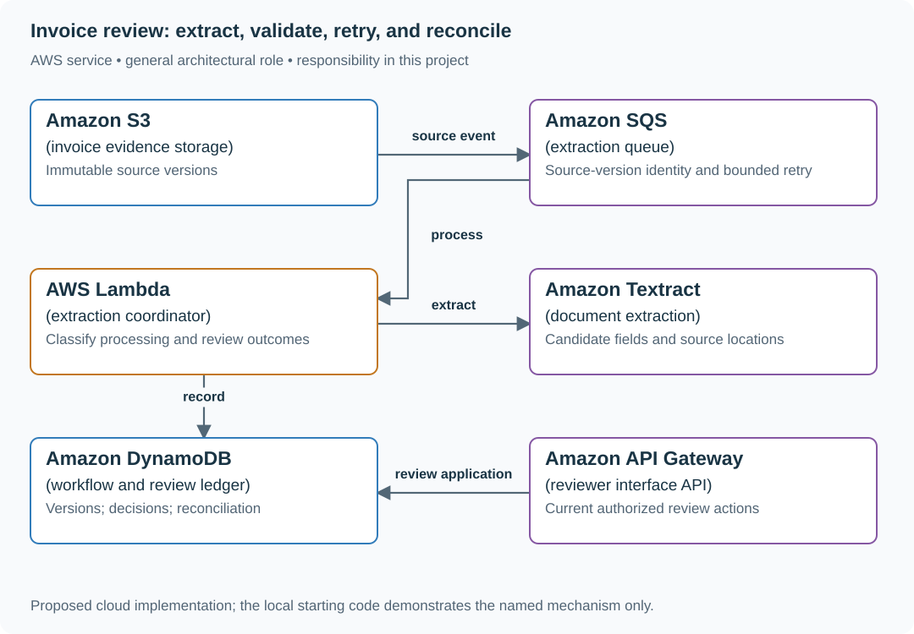

# Invoice review: extract, validate, retry, and reconcile

## What you are building

> Build invoice intake for a finance operations team. An uploaded invoice is extracted into structured fields, but totals can be inconsistent and a corrected source document may arrive under the same business invoice number. Route uncertain content to review without confusing it with a transient provider outage.

**Working contract:** Preserve source identity/version, extractor version and validated candidate fields. Review-required is a content outcome; retryable failure is a transport/processing outcome. A corrected source gets a new version and cannot silently reuse an old accepted result.

## Workload and the decisions it changes

These are constructed exercise assumptions. The stated workload is a design target; the local demonstration does not establish that throughput. Use the [estimation constants](../../../01-code/01-problem-solving/estimation-constants.md) to check units before choosing capacity.

| Input or objective | Calculation / consequence |
|---|---|
| 1,000 invoices/day; 2 MB mean source assumption | About 2 GB/day of originals before versions and retention. |
| 5% content review rate | Fifty human reviews/day; measure that queue separately from infrastructure retries. |
| Three bounded processing attempts | Exhaustion becomes visible repair work; repeated extraction cannot make invalid arithmetic valid. |

## Start with one working boundary

Run the existing complete local reference workflow from the repository root:

```bash
python3 examples/ai-systems/demo.py extraction
```

The reference uses local fixtures to make the workflow inspectable. The implementation walkthrough and source notes are retained below. Add real model/provider adapters only after the local state transitions and evidence are clear.

| Record / module | Key or interface | Responsibility |
|---|---|---|
| source_document | invoice_id,source_version,hash,object_key | Immutable evidence and corrected-source identity. |
| extraction_run | source_version,extractor_version,attempt | Candidate fields and processing outcome. |
| review_decision | revision,actor,confirmed_fields,reason | Human-approved data with provenance. |

## AWS implementation



The extractor proposes fields; deterministic validation and human review decide whether those fields are usable. Separate source versions prevent a retry from hiding a corrected invoice.

## Build it in this order

### 1. Inspect the complete local workflow

Run the extraction demo and follow submission, extraction, validation, retry and review states. Use the retained code walkthrough to identify the source fingerprint and idempotency boundary before adding an OCR/model service.

### 2. Validate domain meaning

Check required fields, currency, dates and line-total arithmetic using explicit decimal/minor-unit rules. Keep raw suggestions and evidence locations. A schema-valid object can still contain the wrong total or vendor identity.

### 3. Separate retry from review

Retry transient timeouts under a bounded budget. Route ambiguous content, missing evidence and inconsistent totals to human review. Preserve the previous confirmed decision when a machine retry produces another suggestion.

### 4. Handle corrected source versions

A new source hash/version creates a new processing intent. Link it to the business invoice and prior review history, then require an explicit decision about superseding confirmed data. Reconciliation records explain which source version reached downstream accounting.

## Infrastructure configuration

| Resource or boundary | Initial configuration and reason |
|---|---|
| Source storage | Private versioned originals, bounded file/page sizes and controlled retention. |
| Processing | Stable source-version key across retries; explicit DLQ/repair state for exhausted infrastructure failures. |
| Review | Conditional revisions and actor evidence; downstream publication uses confirmed version identity. |

Use one disposable AWS environment for the cloud exercise. Put the named resources in `infra/template.yaml` or your existing IaC tool, pass resource IDs through configuration, and scope each runtime role to its own tables, buckets and queues. The diagram is a design to implement; it is not a claim that these resources have been deployed. Record the commands you used to deploy and remove the exercise resources.

For concrete provisioning commands, configuration wiring and cleanup, use the [AWS foundation guide](../../../../examples/architecture-starts/infra/README.md). It includes a deployable table/queue/object-storage foundation and explains which application and service adapters you still implement.

## Observe the result

| Action | Expected visible result |
|---|---|
| Run the existing extraction demo | Inspect distinct review, retry and reconciliation outcomes. |
| Return valid JSON with inconsistent totals | The document goes to review rather than automatic acceptance. |
| Upload corrected source bytes | A new source version is processed and linked to prior evidence. |

## The next design decision

One invoice is split across several files. Define the complete source bundle identity and completion rule before extracting; a partial bundle must not be published as a final invoice.

<details>
<summary>Additional design cases, alternatives and original source notes</summary>

## The reviewer's brief

> “Operations receives invoices as text from an existing document parser. Extract the USD total and the evidence supporting it. Some invoices are ambiguous, some model calls fail, and our queue delivers the same message twice. Build a result the operator can inspect without silently accepting the wrong amount.”

**End product:** a working text-to-structured-data pipeline with model inference, independent field validation, source evidence, durable outcomes, duplicate detection, and an asynchronous AWS queue worker. It accepts text, not PDF images. Parsing and OCR are clearly identified extensions; the delivered pipeline starts with extracted text and ends with a saved, queryable result.

## Establish the contract

The reference supports one standalone `TOTAL` marker per record, source text up
to 8,000 characters, and integer cents between 1 and 100,000. Its complete field
runs from `TOTAL` to a semicolon, line ending, or end of input. After trimming
trailing spaces/tabs, it must be `TOTAL USD digits.two_digits`: spaces/tabs
between words, one to six ASCII digits before the decimal, exactly two after.
An unsupported suffix is reviewed, not silently truncated. The model's claimed
confidence is not an acceptance criterion.

| Case | Exact input or workload | Expected outcome |
|---|---|---|
| Valid invoice | ID `invoice-17`, text `ACME invoice 17. TOTAL USD 12.50` | `ACCEPTED`, `currency: USD`, `total_cents: 1250`, exact evidence |
| Numeric suffix | `TOTAL USD 12.345`, `12.34e2`, or `12.34.99` | `REVIEW_REQUIRED`; never accept the `12.34` prefix |
| Invalid second total | `TOTAL USD 12.50; TOTAL unreadable` | `REVIEW_REQUIRED`; a malformed second marker is still ambiguous |
| Redelivery | Same ID and same source text | Same saved result; no second model call after the result is committed |
| Changed payload | Same ID, text changed to `TOTAL USD 13.00` | Conflict; do not overwrite the original record |
| Missing currency | Text `TOTAL 12.50` | `REVIEW_REQUIRED`, `data: null` |
| Two totals | Text `TOTAL USD 12.50; TOTAL USD 14.00` | `REVIEW_REQUIRED`; choose neither automatically |
| Fabricated evidence | Model says `TOTAL USD 12.50`, source contains only `TOTAL USD 99.99` | `REVIEW_REQUIRED` |
| Subtotal confusion | Source has `SUBTOTAL USD 12.50; TOTAL USD 14.00`; model selects the subtotal | `REVIEW_REQUIRED` |
| Provider failure | Model request times out | Do not save a terminal invoice result; retry through SQS |
| Mixed queue batch | One valid JSON message and one malformed JSON message | Return only the malformed message ID in `batchItemFailures` |

## Learn the distinction between review and retry

**Review** means the pipeline ran and could not establish a safe data result. Repeating the same ambiguous input with the same model is not a recovery plan. **Retry** means a dependency failed before a useful terminal result was established. **A dead-letter queue** contains messages that repeatedly failed processing; it is not the same collection as invoices requiring business review.

## Draw the AWS architecture

| AWS service / general role | Implemented responsibility | Alternative and deciding factor |
|---|---|---|
| Amazon SQS / work queue | Hold extraction requests and redeliver failed work | EventBridge for event routing; it does not replace record-level processing state |
| AWS Lambda / worker | Validate request, invoke model, validate result, and report failed message IDs | ECS/Fargate for larger parser dependencies or longer work |
| Amazon Bedrock / field extraction | Suggest currency, cents, and exact evidence through Converse | A deterministic parser is better for reliably structured invoices |
| Amazon DynamoDB / result and duplicate registry | Associate record ID with source hash and terminal outcome | Aurora for relational review workflows and reporting |
| Amazon S3 / result artifact storage | Preserve inspectable result content under a content-derived key | Existing document platform if it already owns artifacts and retention |
| Amazon SQS DLQ / failed-message inbox | Retain work that fails after three receives | A managed workflow when each processing stage needs separate recovery |
| Amazon Textract / OCR and document extraction | **Extension**, not part of the supplied text-input baseline | Existing parser if it already preserves reliable text and page references |

## Implement the path from submission to result

1. **Assign a stable record ID.** A producer retries with the same ID and unchanged source. Hash the source so an ID reused for different data becomes a conflict.
2. **Check the result registry first.** If the record already has a terminal outcome with the same hash, return it. This avoids a new inference call on ordinary redelivery.
3. **Extract once per attempt.** Request a JSON object. The model cannot write directly to DynamoDB or acknowledge the queue.
4. **Validate the complete source field.** `invoice_fields.source_total` checks the original text independently of the model-selected span. Require USD, bounded integer cents, one standalone total marker, and exact agreement with the complete validated evidence. A substring that stops before an extra decimal digit or exponent is not valid evidence.
5. **Publish complete bytes before the pointer.** On AWS, write the content-derived S3 object, then conditionally publish its pointer and status in DynamoDB. Locally, sync a same-filesystem temporary file, publish it without replacing an existing object, sync the directory, then commit the SQLite pointer. Existing bytes are verified, never reopened for truncation. Filesystem durability support is a local prerequisite.
6. **Acknowledge terminal outcomes.** Both `ACCEPTED` and `REVIEW_REQUIRED` are successfully processed messages. Model/network failures propagate to the worker's partial-batch failure response.
7. **Read by record ID.** Operators query the result endpoint; they do not infer completion from the producer's successful `SendMessage` call.

The core retry decision is independent of model wording:

```python
if existing:
    if existing["source_hash"] != source_hash:
        raise Conflict("record ID reused with different source")
    return existing
```

The complete `invoice_extract` implementation adds validation, artifact storage, and a conditional create. Two simultaneous first attempts can both call the model; only one result wins publication. This provides one committed result, not a guarantee of one billed inference call.

| Interrupted step | What a reader can observe |
|---|---|
| Before object publication | No new result; existing committed results remain intact |
| After object publication, before registry commit | Complete unreferenced object; not a published result |
| Duplicate write after a result is committed | The same intact object and saved result; no truncating reopen |

Worker logs contain a hashed message reference, a bounded category and retry
decision, not invoice text, exception text or model output. `ACCEPTED` and
`REVIEW_REQUIRED` are acknowledged. Provider/storage failure, malformed messages
and changed-ID conflicts are reported for retry/redrive; a permanent producer
error needs correction before redrive, not an infinite retry loop.

## Run the complete local session

```bash
python3.12 examples/ai-systems/demo.py extraction
```

The session extracts invoice 17, repeats it, quarantines invoice 18's unreadable total, and reads the saved result. Compare the repeated result's artifact key and source hash. The test suite injects ambiguous totals, missing currency, fabricated evidence, duplicate IDs, and provider failure.

For AWS, first use `cloud_smoke.py extraction --function "$AI_FUNCTION"` to exercise the synchronous handler. Then follow the workbench's SQS submission instructions to exercise the actual asynchronous worker. An immediate lookup may return `NOT_FOUND`; successful queue submission means accepted work, not completed extraction.

## Follow-up: a replay contains corrected source data

The business corrects invoice 17 after its first result was accepted. Reusing its ID with different text must conflict. Otherwise a duplicate-delivery mechanism becomes an accidental edit API.

**Senior follow-up:** introduce explicit document version and extraction version in the operation identity. A corrected document creates a new result and preserves the prior artifact. Add a review action that records who accepted a correction, which source version it uses, and why.

**Staff follow-up:** process millions of documents. Compare managed Bedrock batch inference against per-message inference. Batch output must be reconciled by record ID, with per-record errors and missing records accounted for; do not assume output order equals input order. Partition tenants, control spend and queue age, and design a backfill that cannot replace newer accepted data.

## Engineer FAQs

**Why use an LLM for such a regular sample?** The fixture deliberately has a deterministic oracle. For this exact format, a parser is cheaper and sufficient. The AI integration becomes useful only when a real corpus contains enough variation to justify it; compare against that parser before adopting it.

**Does valid JSON mean the invoice is correct?** No. A perfectly shaped result can select a subtotal, invent currency, or attach unrelated evidence. Field validation and semantic evidence checks are separate from JSON parsing.

**Can the model's confidence decide automatic acceptance?** Treat it as a feature to calibrate against human labels, not an authority. The reference accepts only its narrow independently checked contract.

**Why not retry review cases forever?** More attempts may increase cost without adding evidence. Change the source, parser, model version, or reviewer input under an explicit new operation identity.

**Can a queue guarantee exactly one extraction?** No. Delivery and processing can repeat. The registry prevents multiple committed outcomes; inference can still repeat if a worker fails before publishing its result.

**Why is the visibility timeout much longer than Lambda's timeout?** A message must remain hidden while work and invocation retries occur. The template uses 1,080 seconds against 180 seconds of function time. Tune queue age, retry delay, and timeout together from observed duration.

**How do we recover DLQ messages?** Inspect the failure, fix its cause, and redrive with unchanged record identity. A permanently malformed message needs producer correction, not an endless redrive loop. Inspect the stored result first because a prior attempt may already have committed.

**Where is the PDF interface?** Outside this project's declared boundary. An OCR extension must preserve page coordinates and source versions, handle password-protected or corrupt files, and validate parser output before it reaches the model.

## What you are expected to hand over

Bring a saved accepted result, a review result, a duplicate-delivery trace, a partial-batch failure response, and an asynchronous AWS run when you have deployed the stack. Explain the source of truth, orphan artifact behavior, inference retry cost, and DLQ recovery.

### How the review conversation gets harder

| Review gate | Changed requirement | Evidence to bring |
|---|---|---|
| Baseline | Extract USD 12.50 | 1,250 cents and exact source evidence |
| Failure | Currency is missing | Review status with no invented value |
| Senior | A worker dies after inference | Safe replay and one committed result |
| Staff | Reprocess millions of corrected documents | Versioned identities, reconciliation, tenant and spend controls |
| Evidence | One message in a batch is malformed | Only that message is marked failed |
| Handoff | Queue stops draining | Queue-age diagnosis, DLQ inspection and safe redrive procedure |

## Research behind the design

Reviewed September 23, 2026. AWS documents [Lambda/SQS retries and partial-batch responses](https://docs.aws.amazon.com/lambda/latest/dg/with-sqs.html), [Bedrock structured outputs](https://docs.aws.amazon.com/bedrock/latest/userguide/structured-output.html), [batch input identities](https://docs.aws.amazon.com/bedrock/latest/userguide/batch-inference-data.html), and [per-record batch outputs and errors](https://docs.aws.amazon.com/bedrock/latest/userguide/batch-inference-results.html). Managed batch inference is an extension; the AWS reference is configured for SQS plus Converse calls; no live deployment is implied by the local tests. Its narrow invoice validator is original teaching code.

</details>
