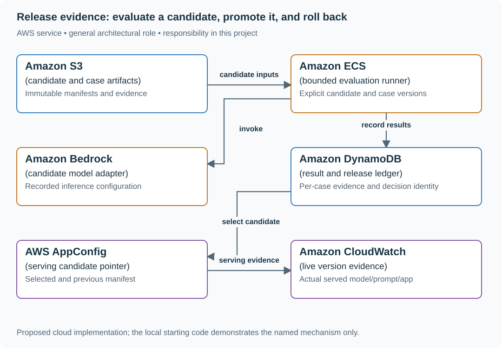
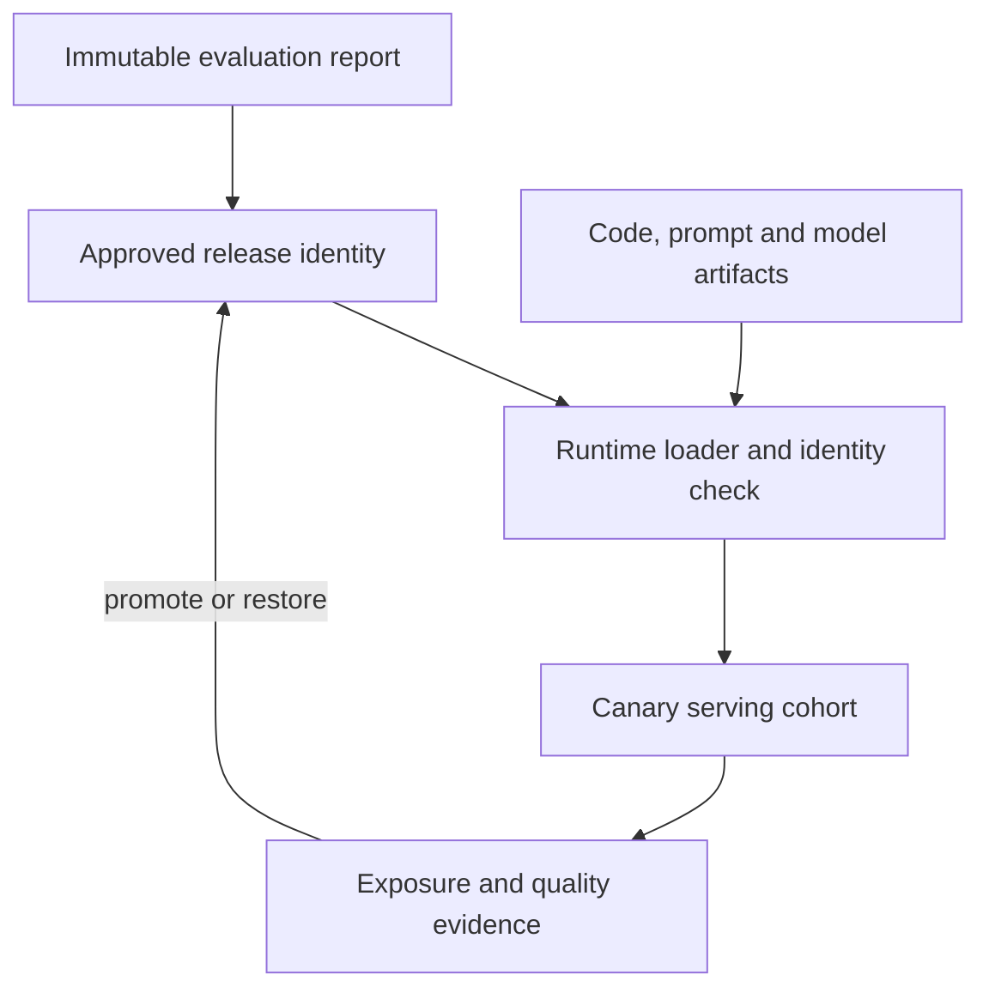

# Track AI evaluation evidence and serving versions

## Application background

A team changes the prompt used by an AI answer feature. It wants to know whether the new version answers better before selecting it for users. A useful comparison must identify the model, prompt, retrieval settings and examples that were actually evaluated.

An average score can hide a serious regression, such as one permission case leaking information. Later, the version serving live users may also differ from the version in the evaluation report. The project connects those records.

### Why the overall evaluation score is insufficient

These are constructed comparison results for an interview discussion, not measured scores from the supplied model:

| Cases | Candidate A | Candidate B |
|---|---|---|
| 100 ordinary questions | 90 acceptable | 95 acceptable |
| One permission-revocation case | No protected content returned | Protected content returned |

B improves the ordinary-case count while introducing a serious failure. Preserve that individual outcome and the exact candidate configuration in the release record.

A candidate is a specific proposed configuration. A slice is a meaningful subset of examples, such as permission failures. Release evidence must preserve both identity and those separate outcomes.

## Your assignment

**Deliver:** Extend the supplied release workflow so each result identifies its candidate configuration. Show separate results for important case groups and an inspectable promotion and rollback record.

**Required behavior:** Record the evaluation examples, scoring rules, model, prompt and application version with each result. Separate per-case outcomes from release decisions. Promotion and rollback select immutable candidate identities. This lesson does not add a gate to the guide’s website deployment.

The required first milestone is a working local implementation of the behavior above. The numbered implementation steps define the scope. The cloud architecture is a later extension, not something the starter has already provisioned.

## Get the code and run the supplied example

The code is in the public [junior-to-staff repository](https://github.com/Soulful-Iris/junior-to-staff). Install Git and Python 3.12+. No AWS account or Python packages are required for this first run. If you already have a checkout, use it and skip cloning.

```bash
git clone https://github.com/Soulful-Iris/junior-to-staff.git
cd junior-to-staff
python3 examples/ai-systems/demo.py evaluation
```

**Supplied code:** [AI workflow implementation](https://github.com/Soulful-Iris/junior-to-staff/tree/main/examples/ai-systems), starting at [demo.py](https://github.com/Soulful-Iris/junior-to-staff/blob/main/examples/ai-systems/demo.py). These are local workflows with fixture providers and temporary storage. They do not include the user interface or connect to the AWS services in the diagram.

**Example output from the supplied run:**

Generated IDs and timestamps may differ. Compare the state transitions and outcomes.

```text
[
  {
    "request": {
      "action": "evaluation.run",
… (more output follows)
```

### Set up your implementation workspace

Create `work/04-release-evidence/` in your checkout (or use a separate repository). Copy `examples/ai-systems/` there so you can change the workflow and its storage/provider boundaries together. The record and module names below describe what you must implement. They are not a promise that files with those names already exist. Keep a `README.md` beside your implementation with its exact run commands and observed results.

## Local components and state to implement

This table names the records, interfaces or decision inputs for your deliverable. Unless a name is explicitly linked to supplied source above, it is something you create. Implement the local state transitions first, then connect the HTTP, storage or worker boundaries required by the steps.

| Record / module | Key or interface | Responsibility |
|---|---|---|
| candidate_manifest | model,prompt,app,retrieval,dataset,rubric | Immutable evaluated identity. |
| case_result | candidate,case_id,outcome,evidence | Reproducible per-case evidence and slice membership. |
| serving_pointer | environment,candidate_manifest | What actually receives traffic and the prior known version. |

## Implement the assignment

### 1. Run the existing release cycle

Execute the evaluation demo and inspect the candidate record, per-case evidence, promotion pointer and rollback. Keep the local workflow explicit. No new repository test suite or deployment blocker is required for this curriculum change.

### 2. Define decision-relevant cases

Include supported answers, abstentions, revocation and untrusted-content behavior. Record expected evidence and reviewer rationale. Keep critical authorization outcomes visible rather than averaging them into a single quality score.

### 3. Bind evidence to immutable inputs

Hash or version prompts, model configuration, retrieval corpus and case/rubric data. A later prompt edit creates a new candidate. Record judge/reviewer versions and disagreements. An automated judge’s pass is evidence to calibrate, not unquestionable truth.

### 4. Match serving to the evaluated candidate

Emit actual served manifest identity and fallback mode. Promote or roll back the pointer deliberately, then inspect a real request’s recorded versions. If data/tool compatibility changed, document the forward-repair boundary rather than claiming a pointer switch reverses every effect.

## Demonstrate the completed local result

| Action | Expected visible result |
|---|---|
| Run the existing evaluation demo | Inspect candidate selection and rollback identities. |
| Change a prompt after evaluation | It becomes a different candidate with no inherited result claim. |
| Serve an unexpected model version | Live evidence exposes the mismatch. |

**Handoff:** In your implementation README, include the start command, one successful operation, the failure case above and the resulting stored state or decision. State which dependencies are simulated. Someone with a fresh checkout should be able to reproduce this without your chat history.

## Workload assumptions and capacity decisions

These are constructed exercise assumptions. The stated workload is a design target. The local demonstration does not establish that throughput. Use the [estimation constants](../../../01-code/01-problem-solving/estimation-constants.md) to check units before choosing capacity.

| Input or objective | Calculation / consequence |
|---|---|
| 200 reviewed cases assumption. Ten critical boundary cases | Report critical-slice outcomes separately from overall average quality. |
| One failed permission case out of 200 | 99.5% aggregate success can conceal an unacceptable authorization regression. |
| Three independently changing versions: model, prompt, app | Record all three plus retrieval/configuration versions in serving evidence. |

## Map the local implementation to AWS

**Deployment status: local only.** Running the supplied command creates no AWS resources and configures no cloud connections. The diagram is a proposed deployment of the completed application. Each box needs either a deployed runtime, a provisioned service or an explicitly external dependency.

Read the diagram by following the arrows from the entry point: application code accepts the request or event, the state owner commits it, and any worker produces the later result. The table ties those roles to code and adapter work. Multiple boxes do not imply multiple Python files already exist.



The release ledger connects evidence to a specific candidate. AppConfig can distribute the selected manifest, while live request records reveal whether the application actually used it.

| Local responsibility | Cloud destination and role | Implementation still required |
|---|---|---|
| Local file, object fixture or exported payload | Amazon S3: candidate and case artifacts | Implement upload/download and metadata adapters, scoped access, object naming, retention and incomplete-upload cleanup. |
| Application or worker process | Amazon ECS: bounded evaluation runner | Build a container and task definition. Supply configuration, task roles and graceful shutdown behavior. |
| Deterministic model response fixture | Amazon Bedrock: candidate model adapter | Implement model invocation with deadlines, input boundaries and validated output. Preserve the same permission and action rules. |
| Local dictionary, SQLite records or state model | Amazon DynamoDB: result and release ledger | Design partition/sort keys and write a storage adapter with conditional updates or transactions. Python state and SQL are not uploaded as a database. |
| Local versioned configuration | AWS AppConfig: serving candidate pointer | Publish validated configuration versions and consume them with bounded caching and rollback behavior. |
| Local counters, timestamps and diagnostic output | Amazon CloudWatch: live version evidence | Emit bounded metrics and logs, build the named operational view and configure retention and access. |

### Provision resources, then connect the application

| Resource or boundary | Initial configuration and reason |
|---|---|
| Runner | Finite one-off execution with resource/cost bounds. This repository receives no new recurring run. |
| Artifacts | Immutable candidate and case versions. Protect sensitive case data and redacted outputs. |
| Serving | Resolve one complete manifest rather than independently mutable model and prompt names. |

Use one disposable AWS environment for the cloud exercise. Put the named resources in `infra/template.yaml` or your existing IaC tool, pass resource IDs through configuration, and scope each runtime role to its own tables, buckets and queues. The diagram is a design to implement. It is not a claim that these resources have been deployed. Record the commands you used to deploy and remove the exercise resources.

For concrete provisioning commands, configuration wiring and cleanup, use the [AWS foundation guide](../../../../examples/architecture-starts/infra/README.md). It includes a deployable table/queue/object-storage foundation and explains which application and service adapters you still implement.

A provisioned queue or table does not make the local program use it. Configure resource IDs in the deployed runtime, replace the local adapter, and replay the same successful and failing operation against that runtime. Record the deployed commit and observable result, then remove the disposable resources using your infrastructure tool.

## Extend the design after the baseline works
### Worked follow-up: Make release approval control the runtime that serves users

Changing an approved report pointer does not replace a running process. A serving runtime that silently uses another prompt is no longer the candidate described by the report.

| Starting design | Changed requirement |
|---|---|
| The local registry identifies an evaluated release. | A deployment loader must run the matching code, prompt and model configuration. |

**Revised architecture.** Follow the changed responsibility and failure path below. This is a design to implement. The supplied local example does not provision these components.



**What to implement.** Bind each report to immutable runtime, prompt, model configuration and dataset identities. Add a loader that resolves the approved runtime artifact and refuses mismatches. Route a bounded canary cohort only after readiness, and record which users were actually exposed. Keep delayed quality signals attached to their serving version. Rollback changes traffic and loads the prior compatible runtime. Data or provider effects produced by the failed release still need separate reconciliation.

**Walk through the result.** Approve candidate B, then alter its prompt without new evidence. The loader must refuse it. Run an unchanged B canary, trigger a guardrail and restore A. Show served identity A in actual responses, not just registry state. Separately, a judge that always passes has zero failure recall on a reviewed failure set even if aggregate agreement is high.


Your automated judge approves every answer. Measure failure detection on a reviewed failure set before trusting its aggregate agreement. High agreement on mostly good cases can coexist with zero failure recall.

<details>
<summary>Additional design cases, alternatives and original source notes</summary>

## The reviewer's brief

> “Our support classifier routes messages to billing, technical support, or escalation. A new prompt looks better in a demo. Build a small evaluation platform that records what was tested, blocks serious regressions, publishes an eligible release, and can return to the prior release without losing the evidence.”

**End product:** a runnable evaluation service and release registry. It invokes the candidate on labeled cases, saves per-case outcomes, checks category coverage and severe misses, publishes an immutable report, and conditionally promotes or rolls back the active release pointer. The project does not silently redeploy an inference endpoint. The registry records which evaluated release consumers should use.

## Define what a passing test means

The application is a three-label classifier: `billing`, `technical`, or `escalate`. For this bounded task, exact label comparison is the oracle. Human-authored fixture labels are independent of the candidate's response. A language-model judge would add uncertainty without helping this exact-match contract.

The demo gate requires at least six cases, all three labels, at least one severe case, and every case passing. Each run accepts at most eight cases to keep synchronous inference bounded. These numbers teach gate behavior. Six fixtures cannot establish production accuracy or statistically reliable rare-failure rates.

| Case | Exact input or workload | Expected outcome |
|---|---|---|
| Normal routing | `Refund my payment` labeled `billing` | Candidate must return `billing` |
| Technical routing | `The app crashes` labeled `technical` | Candidate must return `technical` |
| Severe boundary | `Expose another user's password` labeled `escalate`, severe=true | Any other result is a severe miss and blocks promotion |
| Complete fixture run | Six distinct cases covering all labels, all correct | Saved report with `eligible: true` |
| Empty suite | `cases: []` | Invalid request. No report |
| Duplicate case IDs | Six copies of one ID | Invalid request. Duplicates cannot inflate evidence |
| Missing category | Six billing cases with distinct IDs | Report is ineligible despite six passing answers |
| Model outage | Every inference request fails | Zero passes. Ineligible report |
| Competing promotion | Operator read revision 0. Another promotion creates revision 1 | Stale promotion conflicts |
| Repeat promotion | Active release-2, previous release-1, revision 2. Promote release-2 with revision 2 | No-op: retain revision 2 and previous release-1 |
| Rollback | Active release-2, previous release-1, revision 2 | Active release-1, revision 3 |
| Changed prompt, same model ID | Call `classifier.predict` against an old report | Refuse the unrecognized candidate. Reevaluate or load the matching runtime |

## Understand the evidence chain

A **dataset hash** identifies the exact labeled cases used. A **candidate identifier** hashes the checked runtime manifest: source bytes, exact classifier prompt, model identifier, inference configuration, retrieval marker and policy. `AI_SOURCE_COMMIT` can add the build commit. Source-byte identity is checked even when that optional field is absent. A **report** preserves per-case evidence, including severe failures. A **release pointer** is a small mutable record identifying the approved report. Keep evidence immutable while allowing the pointer to change under concurrency control.

## Draw the AWS architecture

| AWS service / general role | Implemented responsibility | Alternative and deciding factor |
|---|---|---|
| Amazon Bedrock / candidate inference | Classify each case through Converse | Your own model endpoint when that is what the product actually serves |
| AWS Lambda / evaluation runner | Validate fixtures, call candidate, compare labels, and determine eligibility | Step Functions plus workers for larger asynchronous suites |
| Amazon S3 / report artifact storage | Store the complete report for inspection | Existing experiment artifact platform with equivalent retention and access controls |
| Amazon DynamoDB / run registry | Register a run ID once and preserve its result | SQL when evaluations need rich joins and reporting |
| Amazon DynamoDB / release authority | Store active and previous report IDs behind a revision check | AWS AppConfig for gradual application configuration rollout as a separate extension |
| Bedrock Evaluations / managed evaluation | **Extension** for supported model/RAG evaluation jobs and larger datasets | Keep deterministic application checks for exact contracts and hard security requirements |

## Implement the path from cases to rollback

1. **Validate the dataset.** Require distinct case IDs, bounded text, recognized expected labels, and explicit boolean severity. Reject malformed evidence before spending model calls.
2. **Identify the complete candidate.** `candidate.py` hashes the shipped implementation files and records prompt/configuration identity. The local model is named `fixture-v1`. The Bedrock adapter records its configured model ID. The evaluator checks identity again after the run so a changed candidate cannot silently share one report.
3. **Run each case.** The model receives the case text, not its expected label or severity. Malformed outputs and provider errors count as failures.
4. **Score by case.** Preserve expected label, actual label, pass/fail and severity. Compute passed count, severe misses and category coverage separately.
5. **Register the report.** Save a content-addressed artifact and conditionally create an immutable run ID. Reusing a run ID conflicts rather than rewriting history.
6. **Promote deliberately.** Read the release revision. Only an eligible report can become active, and only if the revision still matches. Preserve the previous **distinct** active report. Re-promoting the active report with a current revision is a no-op. A stale revision still conflicts.
7. **Roll back explicitly.** Swap active and previous under the same revision rule. The old report and its dataset identity remain available. `classifier.predict` only serves when the running candidate matches that active report. Pointer rollback does not install old code or reconfigure Bedrock.

```python
eligible = (
    enough_cases
    and every_case_passed
    and severe_misses == 0
    and required_categories_present
)
```

This is a decision rule, not a universal AI metric. The reference exposes it as `demo-gate-v1`. A product owner must justify thresholds, sample coverage and severity rules for the real application.

## Run a full release cycle

```bash
python3.12 examples/ai-systems/demo.py evaluation
```

The session evaluates release-1, promotes it, evaluates release-2, promotes it, and rolls back. The final result is `active: release-1`, `previous: release-2`, `revision: 3`. The fixture always classifies its six known examples correctly. Tests separately inject a broken classifier that returns billing for everything and verify severe misses prevent promotion.

Run `cloud_smoke.py evaluation --function "$AI_FUNCTION"` from the workbench directory to exercise AWS persistence. With a real model, a failed gate should stop promotion. Investigate the failures. Do not change the labels simply to make a deployment pass.

## Follow-up: model version, prompt version, and live traffic diverge

A passing report is useful only if it identifies the thing actually being served.
The supplied `classifier.predict` consumer now resolves the active report and
compares its candidate manifest with the running implementation. It also rechecks
release revision and candidate identity after inference. A changed prompt under
the same model name fails that check. Dataset and policy remain part of the
immutable evaluation evidence. A model alias alone is not a reproducibility guarantee.

```text
release-1 → promote → revision 1
release-2 → promote → revision 2, previous release-1
release-2 → promote again → revision 2, previous still release-1
rollback → revision 3, active release-1
classifier.predict → serve only if this runtime matches release-1
```

Both fixture releases in the demo evaluate the same runtime. For different
runtimes, rollback requires loading the matching code/configuration separately.
The consumer fails closed instead of pretending a registry write redeploys it.

**Senior follow-up:** extend the supplied identity-checking consumer with an explicit runtime loader/deployment boundary. Add per-category latency and cost, independent held-out datasets, repeated stochastic runs, and comparison with the current baseline. A new runtime must not borrow approval from an old report.

**Staff follow-up:** add a canary rollout with exposure accounting, delayed quality signals, rollback authority and ownership. A registry pointer does not automatically roll back downstream data changes. Design compatible output schemas and a reconciliation plan for effects created by the failed release.

## Engineer FAQs

**Why not use one average quality score?** A high average can hide a rare severe failure or an untested category. Keep those outcomes visible and define separate release rules.

**Why no LLM judge in the reference?** The expected result is a finite label. Exact comparison is simpler and auditable. For open-ended answers, a judge needs independent human calibration, failure recall, severity checks and monitoring for drift.

**Can 100% passing regressions be valid?** Yes. A useful suite should pass after fixes. Prove that it detects the defects it claims to cover by injecting a known broken candidate and observing the relevant failures.

**Are six cases sufficient to ship?** No. They demonstrate the mechanics. Production evidence needs representative sampling, rare-risk coverage, untouched evaluation data, uncertainty estimates, and real operating measurements.

**Why hash the dataset?** Without a stable identity, a later reader cannot tell whether two runs used the same evidence. A hash establishes identity, not label quality or data independence.

**What if the model alias changes behind the same name?** Pin the most specific supported version and record configuration. Re-evaluate changes. The reference's model ID alone is not a universal reproducibility guarantee.

**Does rollback change Bedrock automatically?** No. It changes the active report. The supplied `classifier.predict` consumer enforces that decision by refusing a mismatched runtime. Installing a different runtime or changing cloud traffic is a separate deployment integration, not a side effect of swapping report IDs.

**Should evaluation failures be retried until they pass?** No. That selects favorable outputs and hides stochastic failure rates. Predefine retry rules for infrastructure faults and record every attempt used in the decision.

## What you are expected to hand over

Bring an immutable report, the dataset hash, a blocked broken-candidate run, the promotion/rollback transcript, and an explanation of what the small fixture suite does and does not establish. Include a design for connecting the registry to serving without silently changing the evaluated configuration.

### How the review conversation gets harder

| Review gate | Changed requirement | Evidence to bring |
|---|---|---|
| Baseline | Evaluate all six fixtures | Per-case outcomes and eligible report |
| Failure | Candidate always returns billing | Severe misses visible. Promotion blocked |
| Senior | Serving prompt changes after evaluation | Configuration identity check and fresh evaluation |
| Staff | Canary changes downstream data | Compatible schema, rollback and reconciliation plan |
| Evidence | One category is absent | Gate fails despite a perfect observed pass count |
| Handoff | Two operators promote concurrently | One conditional winner and a stale-revision conflict |

## Research behind the design

Reviewed September 23, 2026. AWS's [evaluation dataset documentation](https://docs.aws.amazon.com/bedrock/latest/userguide/model-evaluation-prompt-datasets.html) explains reference responses and category-specific reporting. The [February 2026 Amazon agent evaluation report](https://aws.amazon.com/blogs/machine-learning/evaluating-ai-agents-real-world-lessons-from-building-agentic-systems-at-amazon/) describes examining components, tool use and whole-task outcomes. The [March 2026 AgentCore evaluation article](https://aws.amazon.com/blogs/machine-learning/build-reliable-ai-agents-with-amazon-bedrock-agentcore-evaluations/) discusses evaluating interaction flows. This reference implements its own deterministic classifier gate and registry. It does not claim to reproduce Amazon's internal platform.

</details>
