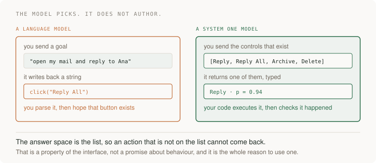
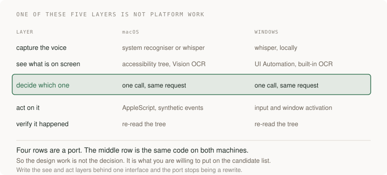
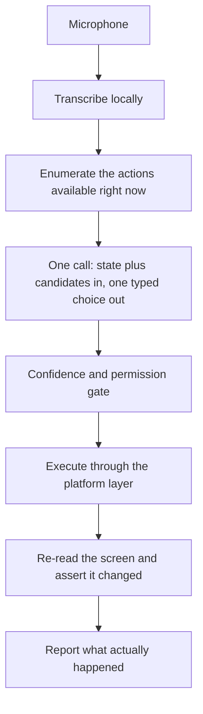
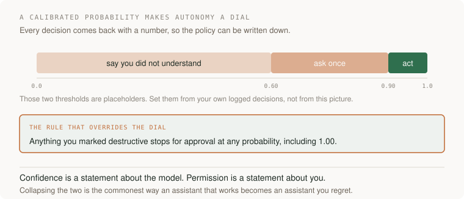

# Drive your own desktop by voice, with a model that cannot invent an action

## Application background

You say "open my mail and reply to Ana" out loud and the machine does it, while you are still talking. The interesting part is not that it works. It is *how* it is allowed to work: the model in the middle never writes an instruction. Your code lists the buttons that exist, the model picks one of them, and your code carries it out and then checks that it happened.

That inversion is the whole project, and it is why this belongs in an AI chapter rather than a scripting one. Everything else here is plumbing you can port.

This is a personal project. There is no user but you, which means you can give it real authority over a real machine, and that is exactly why the authority questions have to be answered properly rather than deferred.

### Why a language model is the wrong shape for this

A language model is a very good way to turn a goal into a *sentence about* an action. It is a poor way to get the action itself, because what comes back is a string, and a string can name a button, a file path or a URL that does not exist. You then parse it and find out.

A **System One model** inverts that. TypeSafe describe Jev, their first one, as "unstructured state in, typed probabilistic decisions out": you define the possible answers in advance, send it the state, and it returns one of those answers with a calibrated probability attached. It does not generate strings at all.

Read the right-hand side carefully, because the guarantee is structural rather than behavioural. The model cannot return `Reply All` when `Reply All` is not on the list, in the same way a function cannot return a type it does not have. You are not trusting it to behave. You have removed the opportunity.

This is the same principle as [requiring exact human approval before agent actions](02-approval-desk.md) and [drafting support replies without granting tool authority](../problems/support-assistant.md), pushed one layer further down: there, the model proposes and a person disposes; here, the set of things it is able to propose is itself constructed by your code, every time.

## Your assignment

**Deliver:** a voice-driven desktop assistant that you run on your own machine, in two builds that share one decision layer: one for macOS and one for Windows.

**Required behavior:** speech is transcribed locally. Before every decision, your code enumerates the actions that are currently possible and sends that list as the answer space. The model returns one choice and a probability. Your code executes it, then independently verifies the result by re-reading the screen rather than by trusting the model's own report. Actions you have marked destructive always stop for confirmation, whatever the probability says.

The first milestone is one working command end to end on one platform. The second platform is a port, not a rewrite, and the structure below is what makes that true.

## The five layers, and the one that is not platform work

Four of those rows are a port and one is not. Write the *see* and *act* layers behind a single interface with two implementations, and the whole Windows version becomes an afternoon rather than a second project.

The design work, then, is not in the model call. It is in what you are willing to put on the candidate list, which is a question about authority rather than about machine learning.

## Build it in six steps

**Step 1 · Get a decision back before you build anything around it.** Sign up for API access, then use the playground to send a state and a fixed set of options and watch a typed answer come back with a probability. Do this before writing a line of application code, so that when something is broken later you know this end already worked.

**Step 2 · Capture speech locally.** On macOS you can start with the system recogniser and move to a local Whisper build; on Windows, a local Whisper build from the start. Keep this on-device: the transcript is the only thing that should leave the machine, and being able to say that plainly is worth more than the latency it saves.

**Step 3 · Enumerate what is possible right now.** This is the step people skip and it is the one that makes the project work. On macOS read the accessibility tree of the focused window; on Windows read the UI Automation tree. Produce a flat list of candidate actions with stable identifiers. Where a control has no accessible name, fall back to on-device OCR rather than to guessing coordinates.

**Step 4 · Ask for one decision.** Send the transcript and the candidate list. Get back one choice and its probability. Resist the urge to let the model return free text here: if a command needs text typed, select it from spans of what the user actually said, or send it to a separate text model and treat that as a different, weaker kind of step.

**Step 5 · Execute, then verify separately.** Perform the action through the platform layer, then re-read the tree and assert the state changed the way the action claimed it would. The model saying it succeeded is not evidence that it did, and on a machine with your files on it that distinction is the difference between a tool and an incident.

**Step 6 · Port the other platform.** Only the *see* and *act* implementations change. If more than that changes, the interface in step 3 was drawn in the wrong place, and it is cheaper to go back than to maintain two assistants.

## Decide when it acts without asking

Because every decision arrives with a calibrated probability, your autonomy policy can be a number you wrote down rather than a feeling.

Log every decision with its probability and its outcome for a week of real use, then set the thresholds from that log. A threshold chosen before you have any data is a guess wearing a number.

And keep the second rule strictly above the first. A high probability means the model is confident it understood you. It says nothing about whether you wanted that thing done to your machine. Community projects in this space state the same rule in their own words: model confidence never grants permission.

## What else becomes possible when a decision costs a tenth of a second

Voice control is the demo. The reason to learn this shape is that a typed decision at that latency and price is cheap enough to put in places a language model could never sit. TypeSafe quote 70 to 500 ms end to end and charge for input only. That changes what is worth trying:

- **Guardrail every LLM output instead of sampling them.** A second model checking each answer used to double your latency and bill. At this speed it is a pre-flight check you leave on permanently.
- **Route work the moment it arrives.** Support tickets, uploads, alerts: classify and dispatch per item in real time rather than batching overnight because the classifier was too slow to run inline.
- **Decide per row over a large table.** A judgement on every record in a dataset stops being a research project and becomes a map step.
- **Make the interface react while somebody is still typing or talking.** Highlight the control they are about to need. This is only possible below about 100 ms; above it the suggestion arrives after the decision.
- **Put a second opinion on your own automation.** Before a scheduled job does something irreversible, have it ask whether the current state actually looks like the state the job was written for.
- **Turn "we would need a human to check" into a measurable threshold.** Not because the model is always right, but because a calibrated probability lets you say which share of cases you are sending to a person and hold that number steady.

Pick one of those and build it as a second, much smaller project. The voice assistant teaches the shape; the second one tells you whether you understood it.

## How you would know it is wrong

1. **Ask for something that is not on screen.** A correct system refuses or asks. If it does something adjacent and plausible instead, your candidate list is being built too loosely.
2. **Rename a button and run the same command.** If the assistant still claims success, your verify step is reading the model's report rather than the screen.
3. **Check what left the machine.** Put a proxy in front of it and confirm that audio never does.
4. **Point it at a window with no accessible names** — a canvas, a game, a remote desktop. It should degrade to saying it cannot see the controls, not to clicking coordinates.
5. **Say something ambiguous on purpose** and look at the probability rather than the outcome. If ambiguous input comes back at 0.99, the confidence is not doing any work and your thresholds are decoration.
6. **Try a destructive command at high confidence.** It must still stop. If it does not, you have wired confidence to permission.

## What this brief does not establish

Written from public documentation and from open-source community projects, not from a run on my own machine: this box has no macOS, no Windows and no microphone, so **nothing below the research has been executed here.** Treat the step list as a design, and expect the specifics of any one library to have moved.

Jev is in early access and is one vendor's model. The architectural idea — enumerate, choose from the enumeration, verify independently — is the durable part and would survive swapping the model for any other constrained-output decision service.

The community projects referenced are independent ports rather than official releases, their demonstration results are not independently verified, and accessibility automation can drive your whole desktop. Supervise early runs.

## Terms

- **System One model** — a model built to return typed decisions software can act on, rather than text for a person to read.
- **calibrated probability** — a confidence number that means what it says across many cases, so a 0.9 threshold really does let through about one error in ten.
- **candidate list** — the set of actions your code says are possible right now. It is the answer space, and therefore the security boundary.
- **accessibility tree / UI Automation tree** — the operating system's structured description of the controls on screen, and the reason this can work without screenshots.
- **verification step** — re-reading the world after acting. The model reporting success is a claim, not evidence.

## Sources

- [TypeSafe AI](https://typesafe.ai/) and [Introducing System One Models and Jev](https://typesafe.ai/blog/introducing-system-one-models-and-jev)
- [Building a harness with Jev](https://www.langchain.com/blog/building-a-harness-with-jev)
- macOS community projects: [jev-voice](https://github.com/kevinbadi/jev-voice), [jev-voice-control](https://github.com/chris-wozniczek/jev-voice-control)
- Windows community projects: [jev-windows](https://github.com/Yzywil/jev-windows), [typesafe-computer-use-windows](https://github.com/kofanlabs/typesafe-computer-use-windows), [WindowsJev](https://github.com/Teylersf/WindowsJev)

[Learning sequence](../../../README.md) · [AI systems](../README.md)
