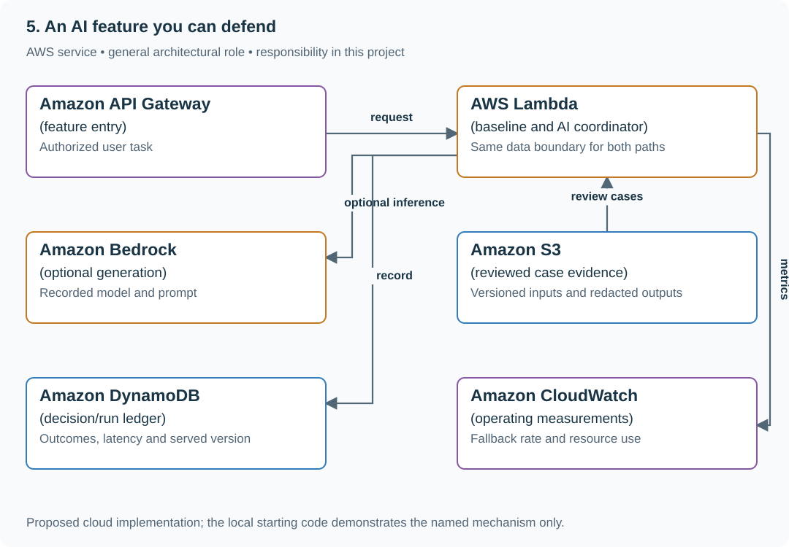

# Decide whether an AI feature improves a reading list

## Application background

A reading-list product can offer machine-generated summaries beside manually saved notes. Product owners need evidence that the extra feature helps users enough to justify errors, cost and latency.

This is a fictional engineering scenario. The workload figures later in the page are exercise assumptions, not measured production traffic.

## Your assignment

**Deliver:** A comparison against a useful non-AI baseline, a human-reviewed failure analysis and a keep/change/remove decision with explicit limits.

Assess whether an AI summary feature improves a reading-list product enough to keep. A judge agrees with humans on 99 of 100 examples, but the only human-identified failure is also marked pass. Build an evidence-based decision against a useful non-AI baseline.

**Required behavior:** Compare user-relevant quality, abstention, latency and cost on a stated case mix. Calibrate failure detection separately from overall agreement. Model output and retrieved content never authorize tools or bypass current data permissions.

The primary deliverable is the report or operational procedure named above, backed by a reproducible local demonstration. Build the smallest supporting code needed to make that evidence visible.

## Get the code and run the supplied example

The code is in the public [junior-to-staff repository](https://github.com/Soulful-Iris/junior-to-staff). Install Git and Python 3.12+. No AWS account or Python packages are required for this first run. If you already have a checkout, use it and skip cloning.

```bash
git clone https://github.com/Soulful-Iris/junior-to-staff.git
cd junior-to-staff
python3 examples/architecture-starts/an_ai_feature_you_can_defend.py
```

**Supplied file:** [`examples/architecture-starts/an_ai_feature_you_can_defend.py`](https://github.com/Soulful-Iris/junior-to-staff/blob/main/examples/architecture-starts/an_ai_feature_you_can_defend.py). You can also [read or download the source here](../../../../examples/architecture-starts/an_ai_feature_you_can_defend.py).

This program is a **mechanism demonstration**: it runs the small scenario in one process and prints the result. It is not an HTTP service, a complete application, or an AWS deployment. A successful run demonstrates this mechanism only; it does not establish the workload or failure guarantees of the application you will build.

**Example output from the supplied run:**

Generated IDs and timestamps may differ; compare the state transitions and outcomes.

```text
{'agreement': 0.99, 'failure_recall': 0.0}
```

### Set up your implementation workspace

Create `work/an-ai-feature-you-can-defend/` in your checkout (or use a separate repository). Copy the supplied mechanism into that directory as `mechanism.py`, then extract its state transitions into functions you can call from your implementation. The record and module names below describe what you must implement; they are not a promise that files with those names already exist. Keep a `README.md` beside your implementation with its exact run commands and observed results.

## Local components and state to implement

This table names the records, interfaces or decision inputs for your deliverable. Unless a name is explicitly linked to supplied source above, it is something you create. Implement the local state transitions first, then connect the HTTP, storage or worker boundaries required by the steps.

| Record / module | Key or interface | Responsibility |
|---|---|---|
| case | id,input,expected_evidence,human_outcome | Task-specific reviewed meaning of success. |
| run_manifest | baseline_or_model,versions,latency,tokens | Comparable execution evidence. |
| decision_record | useful_gain,failures,operating_cost,next_action | Keep, change, narrow or remove the feature. |

## Implement the assignment

### 1. Build the non-AI baseline

Offer authorized source search or a deterministic extractive summary. Record the task users need to complete and the output that helps them. Compare on the same cases; do not compare a polished AI interface with an intentionally unusable baseline.

### 2. Collect decision-relevant evidence

Include ordinary, unsupported, conflicting, private and adversarial-source cases. Record source/model/prompt versions, latency and token usage. Review false confidence and justified abstention separately from stylistic preference.

### 3. Calibrate the judge

Produce a confusion table against reviewed outcomes and inspect failure recall. Add known failure examples only to measure a concrete blind spot, not to manufacture a favorable score. Keep human disagreement and uncertain cases visible.

### 4. Make a bounded product decision

State where the feature is useful, where it abstains or falls back, and the operating budget. Keep permission and tool boundaries in deterministic application code. If the baseline is better for the actual task, narrow or remove generation rather than hiding the comparison.

## Demonstrate the completed local result

| Action | Expected visible result |
|---|---|
| Run the starting program | 99% agreement coexists with zero failure recall. |
| Ask for unsupported information | The feature abstains or returns source search. |
| Place a tool instruction in source content | No action authority is granted by that text. |

**Handoff:** In your implementation README, include the start command, one successful operation, the failure case above and the resulting stored state or decision. State which dependencies are simulated. Someone with a fresh checkout should be able to reproduce this without your chat history.

## Workload assumptions and capacity decisions

These are constructed exercise assumptions. The stated workload is a design target; the local demonstration does not establish that throughput. Use the [estimation constants](../../../01-code/01-problem-solving/estimation-constants.md) to check units before choosing capacity.

| Input or objective | Calculation / consequence |
|---|---|
| 99 human passes and one human failure; judge always passes | Agreement is 99%, but failure recall is 0/1 = 0%. |
| Two-second baseline; five-second AI target assumption | Measure whether added latency buys useful outcomes for the intended task. |
| 100 reviewed cases | A small constructed sample supports scoped conclusions, not a universal reliability claim. |

## Map the local implementation to AWS

**Deployment status: local only.** Running the supplied command creates no AWS resources and configures no cloud connections. The diagram is a proposed deployment of the completed application. Each box needs either a deployed runtime, a provisioned service or an explicitly external dependency.

Read the diagram by following the arrows from the entry point: application code accepts the request or event, the state owner commits it, and any worker produces the later result. The table ties those roles to code and adapter work. Multiple boxes do not imply multiple Python files already exist.



The cloud services run and observe the feature. The engineering decision comes from comparable task evidence and calibrated failure detection, not the presence of a model endpoint.

| Local responsibility | Cloud destination and role | Implementation still required |
|---|---|---|
| Local HTTP boundary or the endpoint you will add | Amazon API Gateway: feature entry | Create routes and an integration; translate requests and responses and configure identity validation. |
| Python operation or worker function | AWS Lambda: baseline and AI coordinator | Write a Lambda event adapter, package its dependencies and give its role only the required resource actions. |
| Deterministic model response fixture | Amazon Bedrock: optional generation | Implement model invocation with deadlines, input boundaries and validated output; preserve the same permission and action rules. |
| Local file, object fixture or exported payload | Amazon S3: reviewed case evidence | Implement upload/download and metadata adapters, scoped access, object naming, retention and incomplete-upload cleanup. |
| Local dictionary, SQLite records or state model | Amazon DynamoDB: decision/run ledger | Design partition/sort keys and write a storage adapter with conditional updates or transactions; Python state and SQL are not uploaded as a database. |
| Local counters, timestamps and diagnostic output | Amazon CloudWatch: operating measurements | Emit bounded metrics and logs, build the named operational view and configure retention and access. |

### Provision resources, then connect the application

| Resource or boundary | Initial configuration and reason |
|---|---|
| Model use | Explicit invocation budget and deadline; preserve a useful fallback. |
| Evidence | Restrict private case data and record versions; do not log all user content indiscriminately. |
| Decision | Document actual assumptions for usage and token volume; verify current provider pricing before making a financial choice. |

Use one disposable AWS environment for the cloud exercise. Put the named resources in `infra/template.yaml` or your existing IaC tool, pass resource IDs through configuration, and scope each runtime role to its own tables, buckets and queues. The diagram is a design to implement; it is not a claim that these resources have been deployed. Record the commands you used to deploy and remove the exercise resources.

For concrete provisioning commands, configuration wiring and cleanup, use the [AWS foundation guide](../../../../examples/architecture-starts/infra/README.md). It includes a deployable table/queue/object-storage foundation and explains which application and service adapters you still implement.

A provisioned queue or table does not make the local program use it. Configure resource IDs in the deployed runtime, replace the local adapter, and replay the same successful and failing operation against that runtime. Record the deployed commit and observable result, then remove the disposable resources using your infrastructure tool.

## Extend the design after the baseline works


Usage shifts to a new language or customer group. Revisit the case mix and outcome slices before reusing the original quality claim unchanged.

<details>
<summary>Additional design reasoning and requirement changes</summary>

## Follow-up 1 · A regression is fixed

**Changed requirement:** All required cases now pass. Should you loosen the feature or force a failure to keep the eval meaningful? Predict which boundary must change before opening the design.

<details>
<summary>Expected reasoning and changed diagram</summary>

No. Keep the fixed case and demonstrate sensitivity with a seeded defect. Challenge-set failures remain separately documented; protect held-out examples from prompt tuning.

</details>

## Follow-up 2 · Untrusted content asks for a tool

**Changed requirement:** A fetched page says to send another user’s saved links to a remote endpoint. What constrains the model? State what evidence would make you reject your first design.

<details>
<summary>Expected reasoning and changed diagram</summary>

Remove unnecessary outbound tool authority and scope retrieval to the authorized user. Treat model output as untrusted and validate it before effects; prompts alone cannot enforce this trust boundary.

</details>

## Supplied mechanism practice

- [Runnable evaluation and judge fixtures](../labs/evaluations/README.md) — includes its own run command, fixtures and validation limits.

These exercises verify specific boundaries; completing their reference tests does not implement or assess the full project.

</details>
