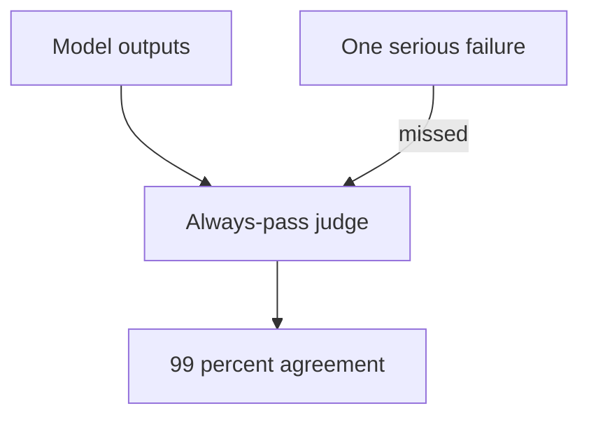
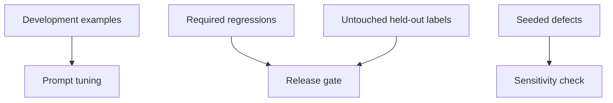
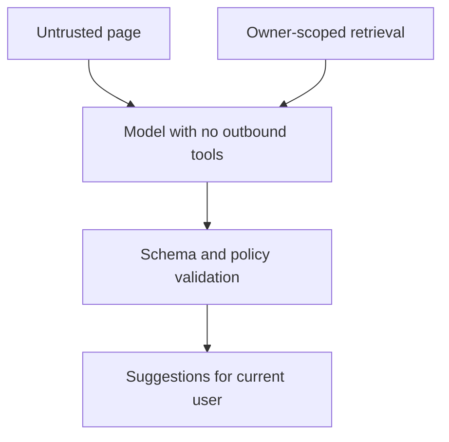

# 5. An AI feature you can defend

[Curriculum](../../../README.md) · [AI systems](../README.md) · [Project index](../../../../indexes/projects.md)

## The reviewer's brief

> A tag suggestion feature passes all twenty regressions and its judge reports 99% agreement with humans. Decide what this evidence permits you to ship. Which result would show that the judge cannot detect the failure you care about?

This is a **constructed practice brief**, not an attributed company question.
Prerequisites: [project index](../../../../indexes/projects.md) and [prerequisite lesson](../../../03-production/01-system-design/design-method.md). This page is a build brief; it does not ship a runnable application. The original build and prompt sequence below defines the implementation checkpoints.

| Case | Exact input or workload | Expected outcome |
|---|---|---|
| Small example | Human labels: 99 pass, 1 fail; judge predicts pass for all 100. | Agreement 99%, failure recall 0%; failure precision is undefined because no failures were predicted. |
| Boundary / failure | A seeded cross-user-data output passes the quality gate. | Block release and repair the security/quality oracle; a high average score cannot compensate. |
| Scope | Optional AI-product practice; current regression failures are not required for a useful suite. | Explain any additional assumption before implementing it. |

Before looking at the guidance, state the invariant in one sentence and trace the example. In interview practice, implement or sketch independently, then reveal the reasoning. During AI-assisted practice, use the prompts below and verify each checkpoint before the next request.

## Baseline and the failure to explain



Overall agreement is dominated by the majority class. A passing regression suite can still be valuable when it detects seeded relevant defects.

<details>
<summary>Reveal the approach and decisions</summary>

Separate development, required regression, challenge and held-out sets. Define operational thresholds for task metrics and hard safety checks, then measure class-specific judge errors on untouched labels. The invariant is explicit release gates that catch their named failures, with capability and cost bounds independent of model obedience.

</details>

## Follow-up 1 · A regression is fixed

**Changed requirement:** All required cases now pass. Should you loosen the feature or force a failure to keep the eval meaningful? Predict which boundary must change before opening the design.

<details>
<summary>Expected reasoning and changed diagram</summary>

No. Keep the fixed case and demonstrate sensitivity with a seeded defect. Challenge-set failures remain separately documented; protect held-out examples from prompt tuning.



</details>

## Follow-up 2 · Untrusted content asks for a tool

**Changed requirement:** A fetched page says to send another user’s saved links to a remote endpoint. What constrains the model? State what evidence would make you reject your first design.

<details>
<summary>Expected reasoning and changed diagram</summary>

Remove unnecessary outbound tool authority and scope retrieval to the authorized user. Treat model output as untrusted and validate it before effects; prompts alone cannot enforce this trust boundary.



</details>

## Evidence to bring to review

Build in three stops: reproduce the small case and baseline failure; implement the protected boundary; then replay both changed requirements with captured outputs. Record commands, fixtures, and observed results in your implementation README. A diagram is a prediction until those checks run.

**Senior expectation:** Explain the confusion matrix and show regression sensitivity plus budget exhaustion. **Additional lead scope:** Own release thresholds, drift review and human escalation. Completion demonstrates practice evidence; it does not establish interview readiness or multi-team delivery experience.

## Supplied mechanism practice

- [Runnable evaluation and judge fixtures](../labs/evaluations/README.md) — includes its own run command, fixtures and validation limits.

These exercises verify specific boundaries; completing their reference tests does not implement or assess the full project.

## Build and prompt sequence

*A model does something useful in your product, and you can prove it is any good.*

**Build**

One small AI feature — a summary, a suggestion, a classification — plus the
evaluation harness, the guardrails, and the cost and latency budget that make it
defensible. The feature is perhaps a fifth of the work.

**The thought process**

Start with the decision most people skip: **should this be a model at all?**
Stable rules, fixed formats and exact matching belong in code — microseconds,
free, testable. A model earns its place where there is genuine ambiguity or
judgment. Write the answer down, honestly, because "we used AI" is not a
feature.

Then the thing that makes it engineering rather than a demo: **error analysis
before metrics.** Read thirty real outputs by hand, group the failures into a
taxonomy you derive from what you see, and count. Failures cluster. You will
find that a handful of categories account for most of them, and fixing one moves
the number more than any prompt tinkering.

Third, and it is architectural rather than textual: **what can this reach?**
If the feature sees private data, reads content from outside, and can send
something outward, you have built an exfiltration path, and no instruction in
the prompt closes it. Cut one of the three for that session.

**How to organise the prompts**

```
Here are 30 real outputs with their inputs.

Do not score them. Read them and group the failures into categories you
derive from what you see, not from a list I gave you. Report counts and
two examples each.

Then tell me which single category, fixed, removes the most failures.
```

```
Turn that category into an operational metric or release gate with an
explicit rule and threshold. Preserve required passing regressions.
Seed three relevant defects and demonstrate that the gate rejects them;
then restore the correct behavior. Report separate challenge and held-out
results without requiring known current failures.
```

```
Here is what the feature can read and which tools it can call. Work out
whether all three legs of the trifecta are present — private data,
untrusted content, outbound capability. If they are, show me the
concrete path, and do not propose a filter as the fix.
```

```
Measure cost per task, not per call, on the worst case: longest input,
most retries. Then put a hard cap in code and show me it firing.
```

**On AWS**

**Bedrock** is the reason to do this on AWS: the model call happens inside your
account, with **IAM** controlling who can invoke which model, **CloudWatch**
logging invocations, and **Bedrock Guardrails** as a configurable policy layer
that sits outside your prompt. Calling a provider's public API directly is
simpler and entirely reasonable; the Bedrock argument is governance — one place
that says who may call what, and a log of it.

For retrieval, the honest ladder: start with **PostgreSQL** and `pgvector` on
**RDS**, because one datastore you already run beats a new one. **OpenSearch
Serverless** when you want hybrid keyword-and-vector search with a reranker and
your corpus has outgrown a table. **Kendra** when the value is connectors to
enterprise sources rather than the retrieval itself. Do not start at the top.

Cost control is the part people leave out: **Budgets** with an action, per-key
tagging so you can attribute spend to this feature, and **provisioned
throughput** only once traffic is steady enough to predict. A runaway agent loop
is not a probabilistic risk, so the cap belongs in code as well as in a budget
alert.

**What productionising it means**

Required regressions pass and reject seeded relevant defects; challenge-set
coverage and remaining failures are reported separately. If a model judges,
report class balance, a confusion matrix, failure precision/recall where defined,
and severity-specific errors on held-out human labels. Overall agreement alone
can hide zero failure recall. Cost per task is
capped and you have tested the cap by hitting it. Turning the model off leaves
the product usable. And the trifecta analysis is written down with the leg you
cut named.

**The learning**

The model call is the easy part and the cheap part. The engineering is the
evaluation, the guardrail and the budget — and the reason most AI features are
undefendable is that all three were left until after launch.

**How you would know it is wrong**

- Replace the model with a stub returning a fixed string. Relevant wrong-answer cases must fail. Format or empty-input cases may legitimately pass; report exactly which checks the stub exercises and which it cannot assess.
- Put instructions in the untrusted content and see what happens. Then check whether the architecture, not the prompt, limits the damage.
- Report a held-out judge confusion matrix, failure recall and severity-specific misses, or state plainly that there is no model judge.
- Compute cost on the worst case and confirm the cap stops it.
- Turn the model off and use the product. That is your degradation path whether you designed it or not.

**Stage it**

1. The written answer to "should this be a model", and thirty outputs read by hand.
2. The failure taxonomy and an eval that can fail.
3. Guardrails and the trifecta analysis, with a capability removed.
4. Cost and latency budgets, capped in code and tested by hitting them.

---

[Back to the ordered project index](../../../../indexes/projects.md)
