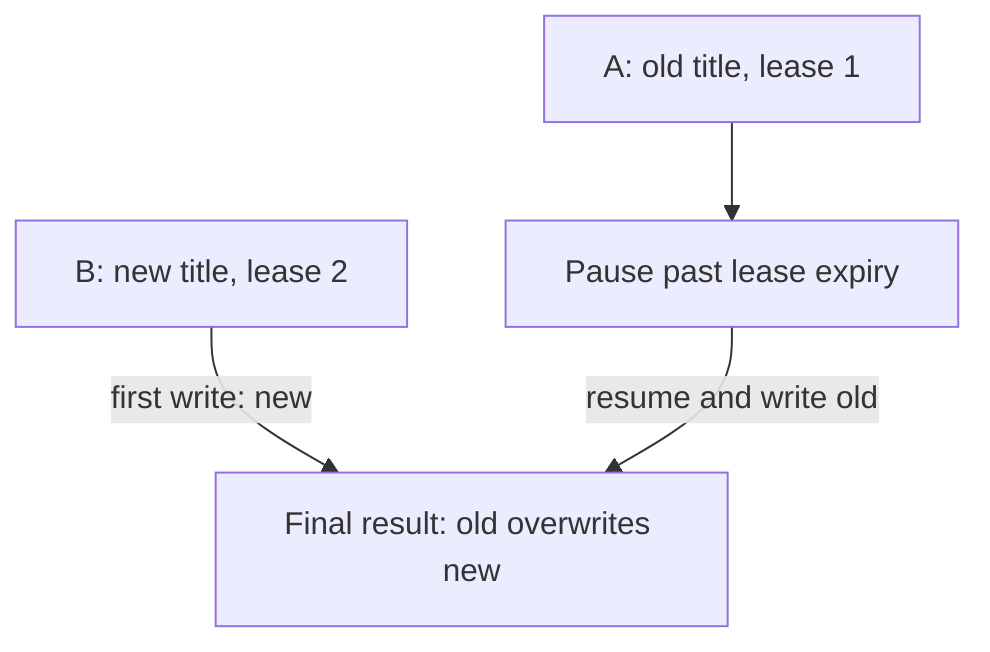
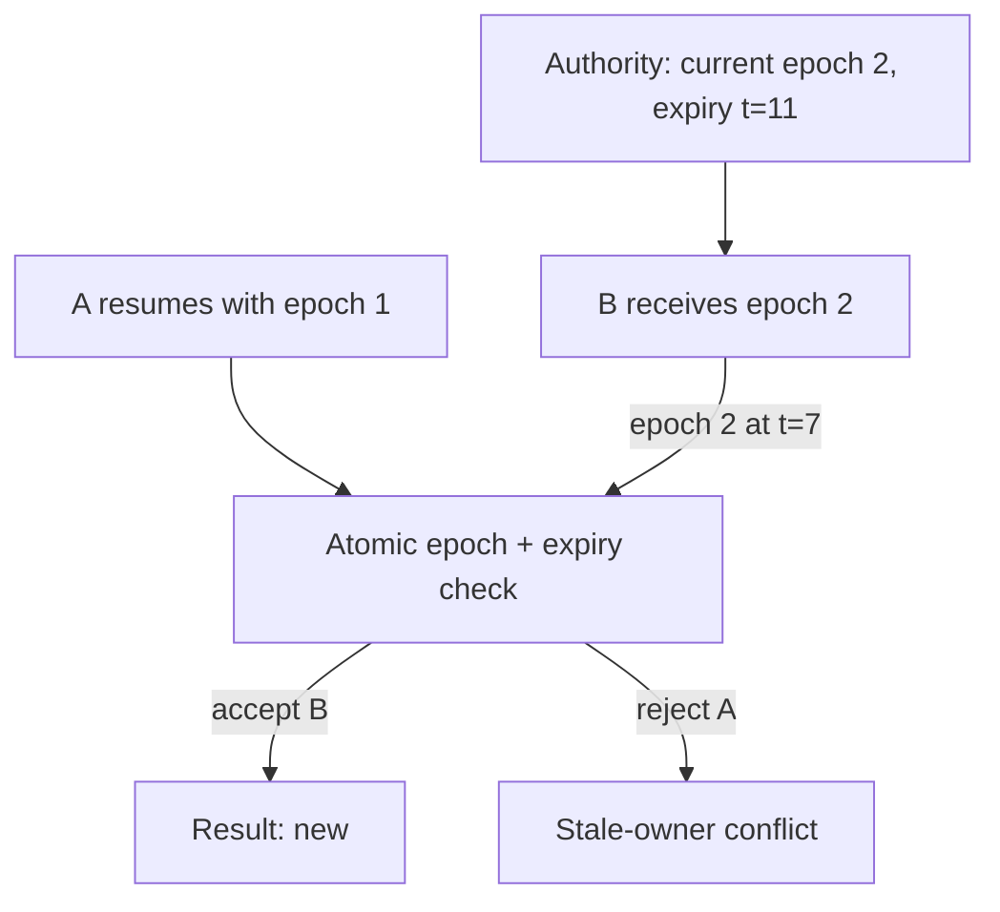
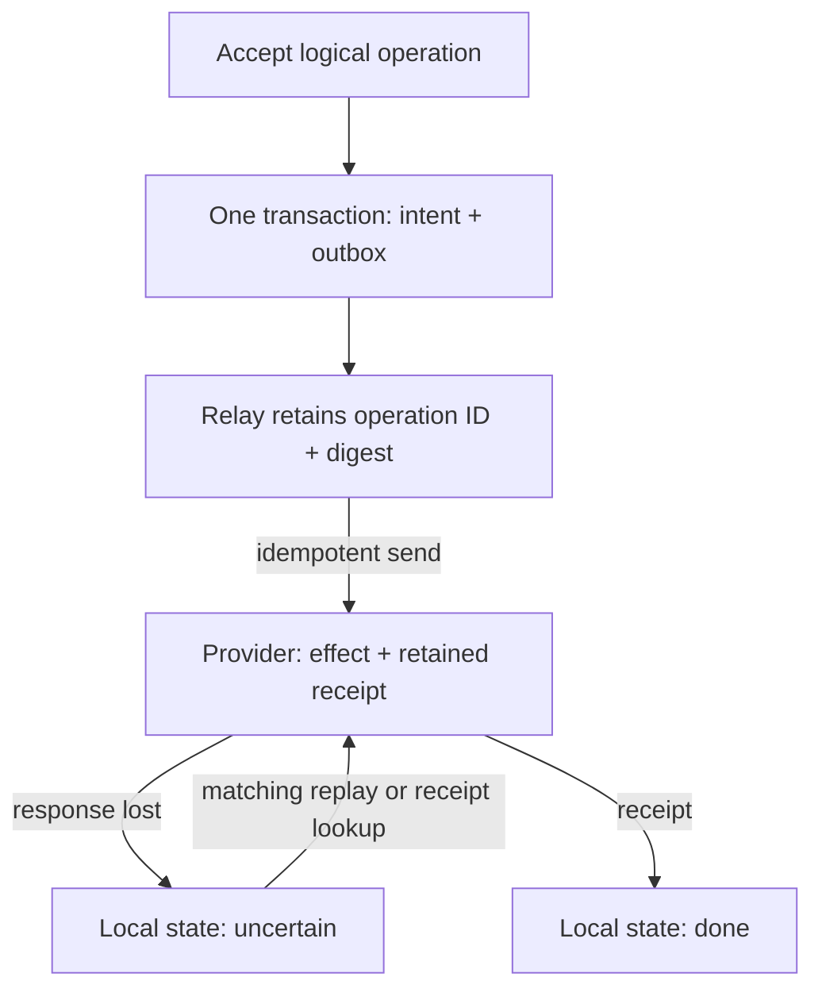

# Reject stale workers and recover uncertain external effects

[Curriculum](../../../../README.md) · [Live migrations](../../README.md)

## Application and assignment

A background worker fetches a bookmark’s display title. Worker A pauses long enough for its claim on the job to expire. Worker B takes over and saves a newer result. A resumes and tries to overwrite it. The expired claim did not stop A’s code from running.

Use the local reference to identify the authority checked at the final write. Then extend the reasoning to a provider that may complete a billable operation before its response is lost. A local result constraint and a provider’s idempotency record protect different effects.

## Contract and starting evidence

**Constructed candidate brief:** “Worker A fetches an old page title and pauses.
Its five-second lease expires; B takes the job and stores the new title. A
resumes. Keep B's result. Next, replace the fetch with a billable provider call
whose successful response can disappear. What can the service honestly promise?”

Prerequisites: the [atomic-result queue lab](../../../../03-production/03-infrastructure/aws/labs/job-pipeline/README.md)
and [transaction concepts](../../../../03-production/01-system-design/mechanism-reference.md). This is a **separate extension**:
the existing worker's entire effect remains one conditional result item. Do not
insert the provider into that worker and claim its guarantee automatically grew.
Attempt first; [reference.py](reference.py) and [assessor.md](assessor.md) contain
the proposed boundaries and review criteria.

| Input/schedule | Expected value | Scope |
|---|---|---|
| A epoch 1 at t=0; B epoch 2 at t=6; B finishes t=7; A finishes t=8 | Result `new`; A rejected | Epoch and lease checked at protected write |
| Store business intent then crash before transaction commit | 0 intent rows and 0 outbox rows | Real local SQLite transaction |
| Provider commits; response lost; replay same ID/body | 1 effect, eventually `done` | Provider retains and enforces idempotency key |
| Replay same ID with changed body | Conflict; original effect unchanged | Changed intent is quarantined |
| Provider forgets key before a replay | 2 effects possible | Dedup retention is part of the guarantee |

## Baseline and counterexample



A lease grants temporary authority; it cannot stop a suspended process from
running later. “Writing twice is safe” assumes both writes contain the same
intent and the same result. A fetched title can change between attempts. A crash
after a fetch but before recording completion may force another fetch even when
the database ultimately contains one result.

## Add an authority check at the write

1. Define safety: a stale owner never changes the current result. Define
   liveness: after lease expiry, a healthy worker may acquire a new epoch.
2. Have the authoritative store issue a monotonically increasing fencing epoch
   when it grants ownership. A client-generated timestamp is not this authority.
3. Require the result store to compare the submitted epoch with the **current**
   epoch atomically at the write. The sample also rejects an expired current
   lease. A separate lock service and result store need a real protocol ensuring
   the protected destination knows which epoch is valid.
4. Preserve logical operation ID and payload digest. A matching replay is safe;
   a conflicting payload needs investigation, not overwriting the earlier intent.



## Follow-up: the effect lives at a provider

Draw the crash on each side of the remote call before opening the diagram. If
you write “done” first, a crash can omit the effect. If you call first, a crash
can repeat it. No local marker removes both gaps for an uncooperative provider.



The fake provider commits one effect plus receipt and enforces matching identity.
The real SQLite transaction verifies rollback of business intent without a
matching outbox. Relay delivery can repeat. If the real provider offers neither
idempotency nor a reliable receipt query, keep `uncertain`, stop automatic replay
at a bounded attempt/deadline, and route reconciliation to an owner. The business
must choose duplicate risk, omission risk, or manual resolution. Never turn
“unknown” into “failed” merely because a socket timed out.

Run from the repository root (Python 3.11+, standard library only):

```bash
python -m unittest discover -s curriculum/04-scale-and-evolution/04-migrations/labs/recovery-migration -p 'test_*.py' -v
```

Tests inject stale-owner completion, pre-commit rollback, success with lost
response, crash after receipt, changed intent, and expired provider dedup history.
This model has no real distributed clock, lease service, or AWS account. Failures
are deterministic call boundaries, not operating-system kill or network tests.

**Senior follow-ups:** what if provider key retention is one day but the DLQ is
replayed a week later? What if all workers pause and lease time is measured on
different machines? Expected reasoning names replay retention and authoritative
time, respectively. **Lead:** specify the reconciliation owner, deadline, volume
budget, and customer-facing uncertain state. Continue to
[live migration and rollback](migration.md) and [rebalancing and region loss](regions.md).
