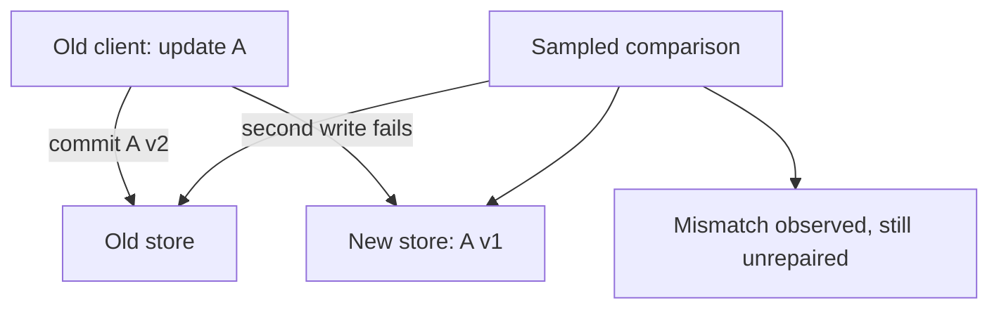
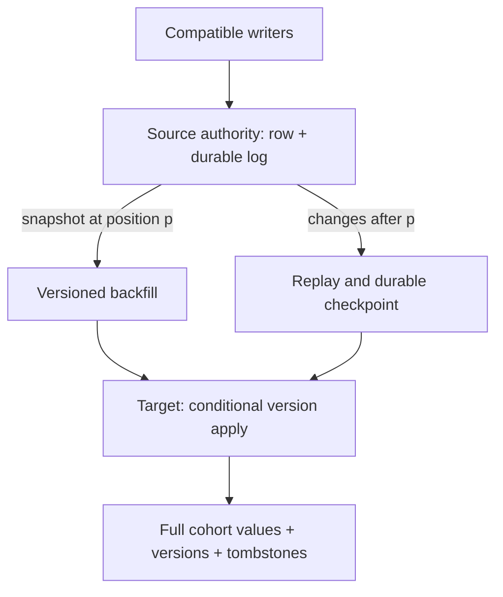
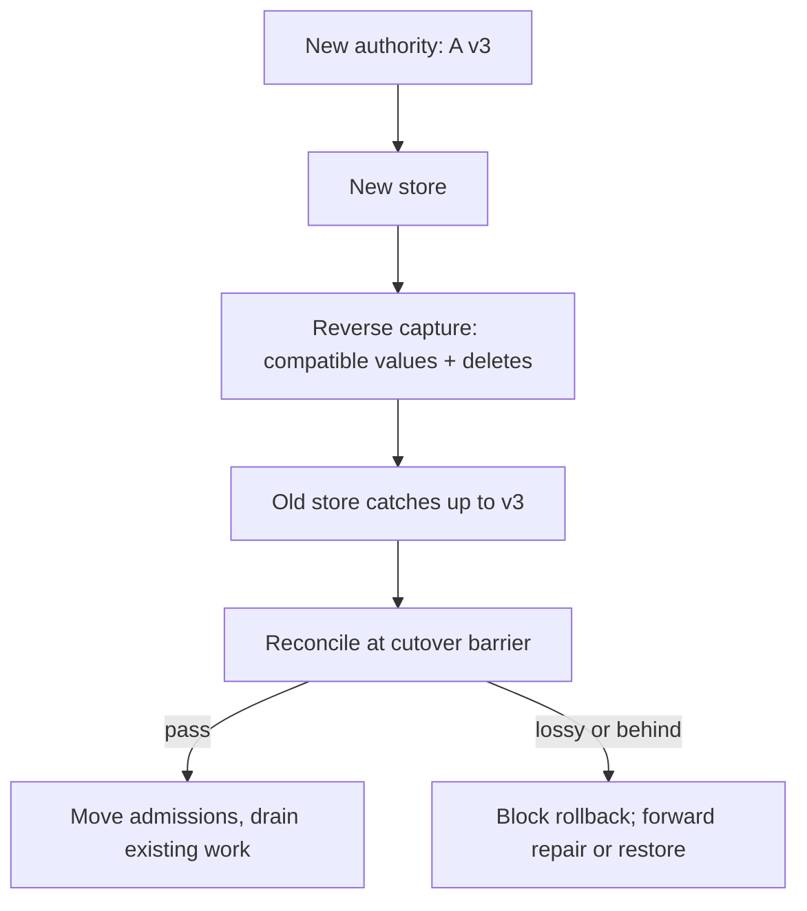

# Move live rows without losing the writes between copies

[Curriculum](../../../../README.md) · [Migrate live systems and verify recovery](../../README.md)

**Constructed candidate brief:** “Ana edits bookmark A while you move her tenant
to a new store. A slow backfill still carries yesterday's title. Ben deletes a
bookmark while the new-store write is failing. Preserve acknowledged updates
and deletes, then show how reader cutover can safely roll back.”

Prerequisites: [intent/outbox recovery](README.md), row versions, and the
[PostgreSQL lab](../../../../02-applications/02-databases/labs/postgresql/README.md). This is a runnable **protocol model**,
not a production CDC connector. Attempt the schedule before reading
[the reference](reference.py) and [assessor guide](assessor.md).

| Tiny schedule | Expected after repair | Counterexample |
|---|---|---|
| Snapshot A v1; live A v2; v2 copied before v1 | A remains v2 | Unconditional backfill overwrites new data |
| Delete D v2; then old snapshot D v1 arrives | D retains v2 tombstone | Physical absence alone permits resurrection |
| Source write succeeds; target unavailable | Source authoritative; durable change pending | Comparing rows cannot itself repair |
| Crash after target apply before checkpoint | Replay same version; unchanged result | Checkpoint-before-apply can skip data |
| New-store-only A v3; route readers back | Block until old store has v3 | Routing cannot undo missing data |

## Baseline: two independent writes

Start with authority. During this phase, accepted writes commit to the old store
and a durable change record together (transactional outbox or supported CDC).
Readers may move independently; writers must not accidentally create two
uncoordinated authorities.

## Order the copy and the changes

1. Expand the schema and document reader/writer compatibility before rollout.
2. Capture a consistent baseline **and its log position**. Begin retaining live
   changes early enough that snapshot work cannot create a gap.
3. Apply each row conditionally by version. For this fixture, versions increase
   per key under one writer; equal version/different contents is corruption.
   Preserve tombstones until all replay/backfill windows are closed.
4. Advance the replay checkpoint only after the destination apply is durable.
   A crash in between repeats an idempotent apply. Checkpoint-before-apply risks
   silent omission. The local fixture explicitly injects this gap.
5. Reconcile versions, values, ownership, and deletion state across the full
   cohort. Samples can monitor ongoing health; they do not prove zero mismatches.

The in-memory source/log mutation models one atomic boundary; the companion
outbox test uses SQLite to execute an actual transaction. The migration model
does not establish durability of a production CDC service. If a paused consumer's
checkpoint predates retained history, refuse to continue from an incomplete log.
Take a fresh consistent snapshot with a new position, then resume live replay.

## Follow-up: a rollback after new-only writes

| Phase | Old reader | New reader | Accepted writer | Rollback requirement |
|---|---|---|---|---|
| Expand/copy | Supported | Shadow only | Old authority | None beyond compatible schema |
| Read cutover | Supported | Supported | Old authority + capture | Route reads back, drain caches/connections |
| Writer cutover | Needs current data | Supported | New authority after fencing old writers | Reverse capture and compatible transformation |
| Contract/retire | Unsupported | Supported | New only | Restore/forward repair; simple route rollback ended |

Run the command in [the recovery lab](README.md). Supplied tests cover live
updates/deletes, simulated partial failure, stale backfill rejection, replay
after an apply/checkpoint crash, expired-history resnapshot, and reverse repair
before rollback. Equality checks include tombstones and versions, not just counts.

**DNS constraint:** a load-balancer rule changes new admissions at that balancer;
it still needs propagation and connection draining. DNS answers can remain in
resolver caches for their TTL, and established connections may survive longer.
Route 53 weighted routing is not a promise that all requests can reverse in
seconds. See [Route 53 TTL](https://docs.aws.amazon.com/Route53/latest/DeveloperGuide/resource-record-sets-values-basic.html),
undated technical documentation accessed 2026-09-22. The fixture independently
asserts the cached old answer and an existing old connection after registry change.

## Lead decision exercise: three teams, two dates

This is a build-and-review brief beyond the model. Security needs tenant isolation
in four weeks. Mobile cannot remove an old writer for twelve weeks. Data platform
can fund double storage for six weeks. Backfill uses 20% of spare I/O; normal peak
already uses 85% of capacity. Produce a one-page decision memo with owners,
critical path, a bounded cohort, data authority, stop criteria, and alternatives.

**Senior acceptance:** no stale overwrite or deleted-row resurrection; zero full
cohort mismatches after repair; rollback exercised after a new-only update.
**Lead acceptance:** resolve the 85% + 20% capacity conflict, retain or adapt old
writers explicitly, set a budget extension/scope reduction decision, and name who
can block cutover. Migrated cohorts may already gain isolation or capacity;
retiring the old stack captures additional cost/complexity benefits. A credible
memo distinguishes both and discusses blind spots: unused old clients, offline
jobs, unobserved deletion paths, and compatibility outside the sampled traffic.
