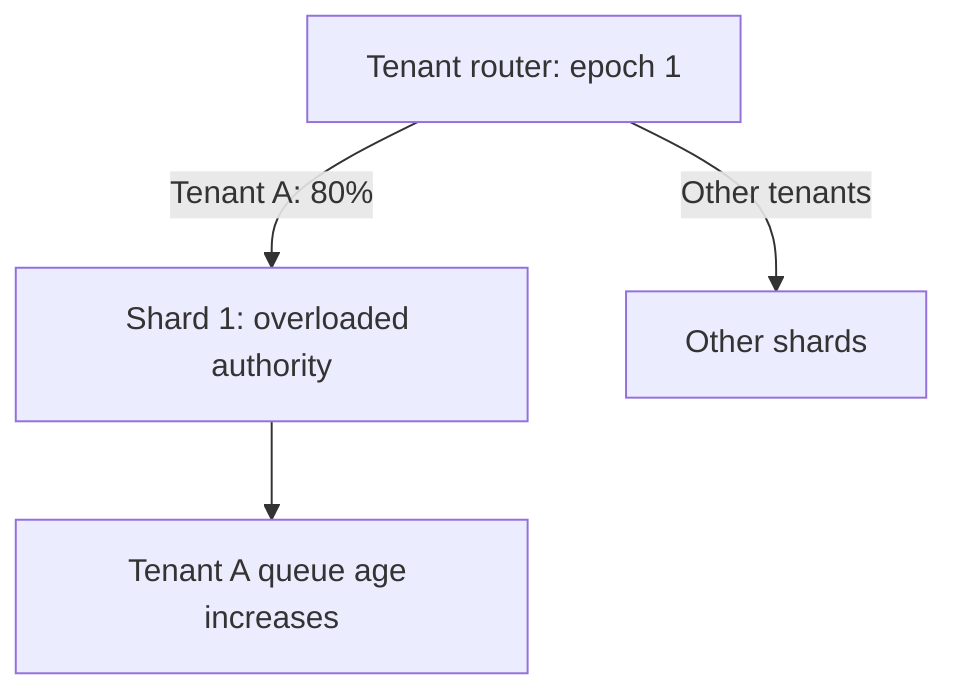
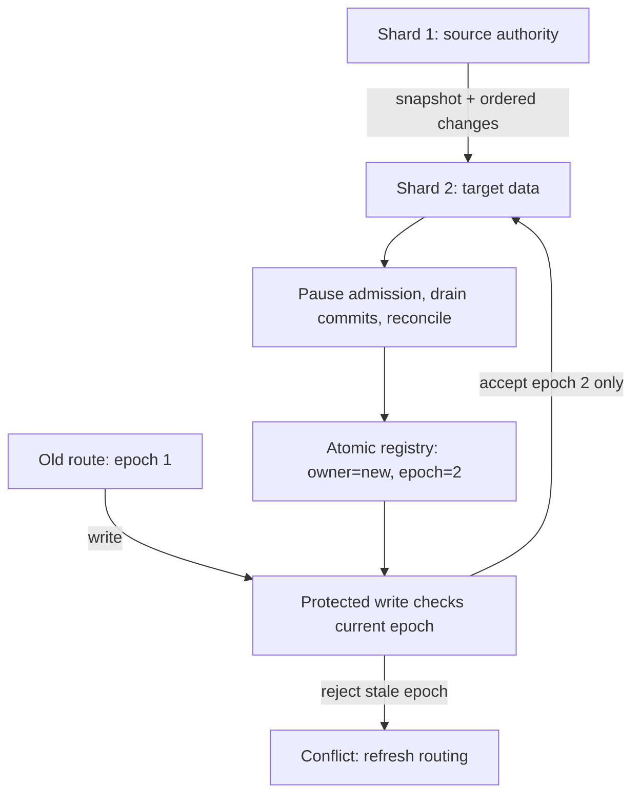
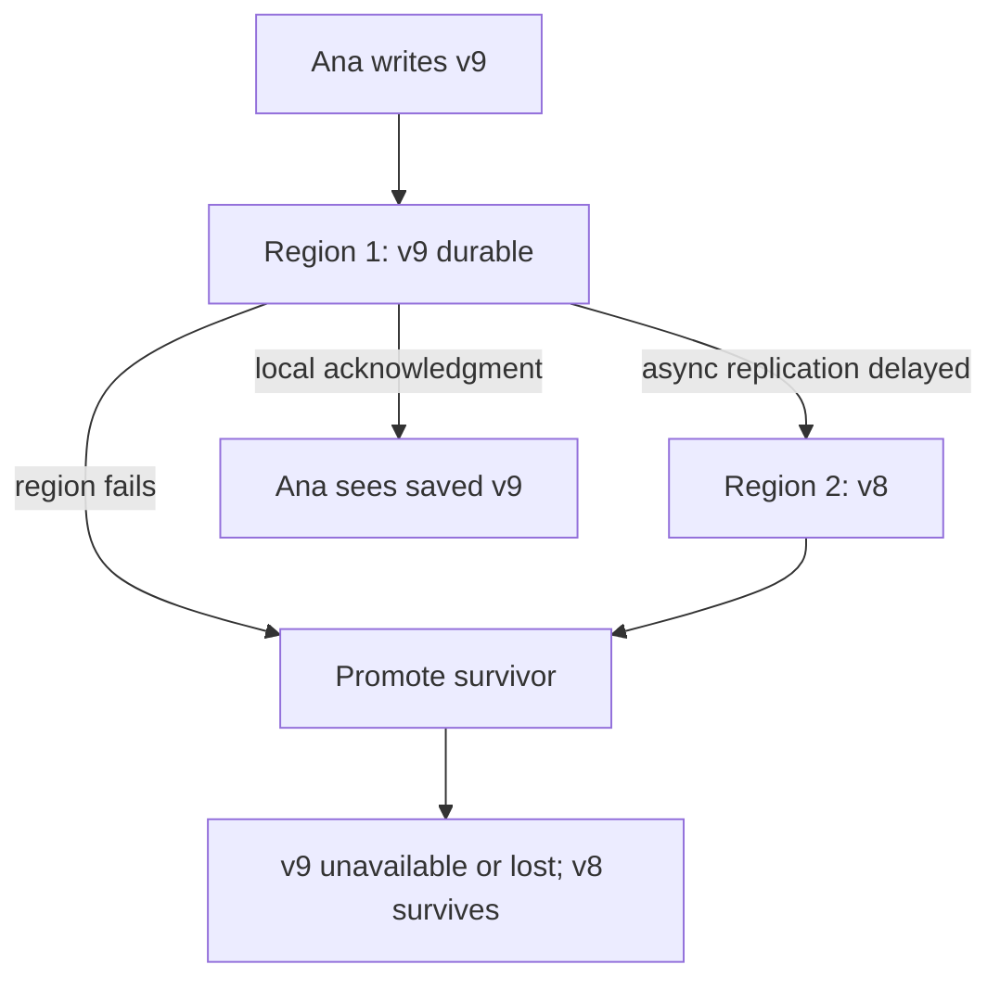
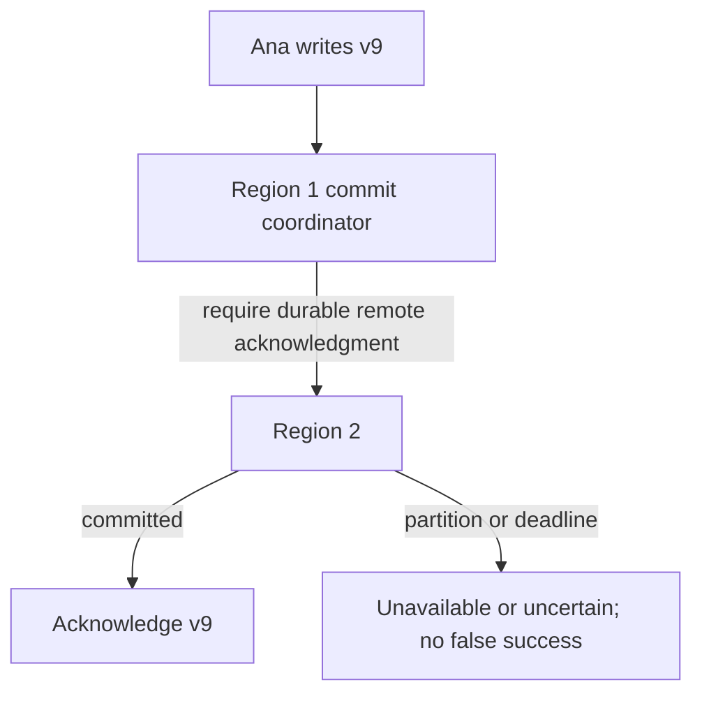

# Move a hot tenant, then lose a region

[Curriculum](../../../../README.md) · [Migrations and recovery](../../README.md)

**Constructed candidate brief:** “Tenant A causes 80% of load on shard 1.
Move it to shard 2 while stale clients keep old routes. Then region 1 fails
after acknowledging version 9, while region 2 has only version 8. Preserve one
write authority and tell Ana what happened to her acknowledged edit.”

Prerequisites: [migration authority and checkpoints](migration.md). This exercise
uses the same local reference/test command; deployment and actual failover are
excluded. Write the transition plan before opening [assessor notes](assessor.md).

| Teaching input | Expected outcome | Boundary |
|---|---|---|
| Route epoch 1 points to old shard; new shard behind | Cutover refused | Catch-up plus full reconciliation at write barrier |
| New shard caught up; registry advances to epoch 2 | New writes accepted only at new/epoch 2 | Every protected write must check authority |
| Old client submits to old/epoch 1 after switch | Rejected, then routing refreshed | A DNS change alone cannot fence a writer |
| Async region fails at v9; survivor has v8 | Acknowledged v9 may be lost | RPO cannot honestly be zero |
| Remote region unavailable; acknowledgment requires remote commit | Write unavailable | Stronger durability trades availability/latency |

## Baseline: hash distribution hides the hot tenant

One tenant is still one key even when the hash is uniform. Decide whether an
isolated shard is enough before splitting a tenant's data; splitting increases
read fan-out and makes cross-partition invariants harder. Some storage systems
support cross-shard transactions, with coordination costs; their absence is not
a universal law.

## Move ownership after moving data

1. Copy a consistent tenant snapshot and retain/replay live changes.
2. Bound write admission briefly at the cutover barrier. Wait for old in-flight
   commits, reconcile to the final position, and atomically change the route and
   fencing epoch. The sample models this atomicity; a real system must implement
   it at the protected boundary, not rely on a cached client route.
3. Keep stale clients from writing to the old authority. Return a retryable
   routing conflict within a bounded deadline and preserve operation identity.
4. Drain/retire old copies only after reader compatibility and rollback windows.

The test refuses two premature switches and rejects a stale write after the
successful switch. It does not implement data-plane routing or distributed
registry consensus. An assessor should ask the learner which service enforces
the atomic barrier in their proposed deployment.

## Follow-up: choose a regional acknowledgment policy

**Predict the changed diagram:** require remote durable commit before saying
“saved.” Which arrow becomes part of the synchronous request budget?

**Senior:** name v9 as the potentially lost acknowledged write and define what a
read-your-writes request does after failover. **Lead:** choose RPO/RTO, quorum and
failure assumptions, fencing of the old region on return, and a measured restore
drill. Record detection, promotion, replay, and client recovery separately. The
local test demonstrates the policy counterexample; it does not measure a real
RTO or prove a cross-region commit protocol.
